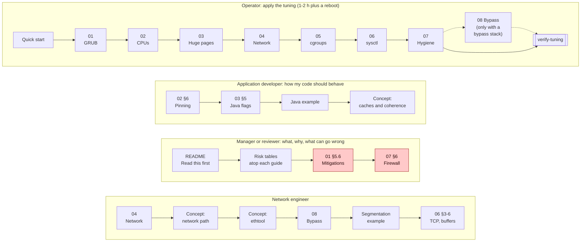

# Index

## Reading paths

Pick the lane that matches your role. Each box is one page, read left to right, and the links for every step are listed under the diagram.

*Four lanes: the operator walks guides 01 to 07 (08 only with kernel bypass) and ends at verify-tuning; the developer reads the pinning and Java sections and the Java example; the reviewer reads the risks, with mitigations and firewall highlighted; the network engineer goes from Guide 04 through the network concepts to bypass and segmentation.*

**Operator applying the tuning (1–2 h plus a reboot)**
[QUICK_START](QUICK_START.md) → [00](guides/00-bios-firmware.md) → [01](guides/01-grub-bootloader-tuning.md) → [02](guides/02-cpu-core-isolation.md) → [03](guides/03-huge-pages-configuration.md) → [04](guides/04-network-optimization.md) → [05](guides/05-cgroup-isolation.md) → [06](guides/06-kernel-sysctl-tuning.md) → [07](guides/07-os-hygiene.md) → ([08](guides/08-kernel-bypass.md), only with a bypass stack) → `scripts/verify-tuning`

**Application developer (how my code should behave on a tuned host)**
[Guide 02 §6 — pinning the application](guides/02-cpu-core-isolation.md#6-pinning-the-application) → [Guide 03 §5 — Java flags](guides/03-huge-pages-configuration.md#5-java-applications) → [Java example](examples/hugepages-java-example.md) → [concepts/cpu-isolation §5 — caches and coherence](concepts/cpu-isolation.md#5-caches-and-coherence-the-mechanical-sympathy-part)

**Engineering manager / reviewer (what, why, and what can go wrong)**
[README — Read this first](README.md#read-this-first) → risk and applicability tables at the top of each guide → [Guide 01 §5.6 — mitigations](guides/01-grub-bootloader-tuning.md#56-iommu-and-cpu-vulnerability-mitigations-security-sensitive) → [Guide 07 §6 — firewall](guides/07-os-hygiene.md#6-opt-in-removing-host-packet-filtering)

**Network engineer**
[Guide 04](guides/04-network-optimization.md) → [concepts/network-tuning](concepts/network-tuning.md) → [concepts/ethtool](concepts/ethtool.md) → [Guide 08 — kernel bypass](guides/08-kernel-bypass.md) → [segmentation example](examples/network-segmentation-example.md) → [Guide 06 §3–6](guides/06-kernel-sysctl-tuning.md#3-tcp-behavior) → [Guide 10 — time sync](guides/10-time-sync.md)

## Guides

| Guide | Read | Covers | Key functions |
|---|---|---|---|
| [00 BIOS and firmware](guides/00-bios-firmware.md) | ~14 min | power profile, C-states, P-states and turbo, EPB, uncore, Hyper-Threading, NUMA/SNC, SMI sources, PCIe ASPM, cooling | `set_pcie_aspm_policy`, `verify_bios_firmware`, `show_firmware_facts` |
| [01 Kernel command line](guides/01-grub-bootloader-tuning.md) | ~17 min | isolcpus, nohz_full, rcu_nocbs, idle/C-states, THP, huge page size, watchdogs, IOMMU, mitigations | `apply_grub_kernel_parameters`, `rollback_grub_kernel_parameters` |
| [02 CPU isolation](guides/02-cpu-core-isolation.md) | ~15 min | CPU layout, systemd CPUAffinity, workqueues, irqbalance, RT throttling, thread pinning, idle strategies | `configure_systemd_cpu_affinity`, `set_workqueue_affinity`, `pin_process`, `show_affinity` |
| [03 Huge pages](guides/03-huge-pages-configuration.md) | ~15 min | THP vs explicit, sizing, per-NUMA early-boot reservation, Java flags, C/C++ mmap, 1 GiB pages | `install_hugepage_reservation`, `set_hugepage_sysctls`, `show_hugepages` |
| [04 Network](guides/04-network-optimization.md) | ~22 min | NIC roles, channels (one queue per IRQ CPU), ntuple steering, coalescing, pause, offloads, rings, txqueuelen, IRQ affinity, RPS/XPS, persistence | `tune_nic_low_latency`, `set_nic_irq_affinity`, `show_nic_state` |
| [05 cgroups](guides/05-cgroup-isolation.md) | ~10 min | v1/v2, housekeeping slice, agent pinning, cpuset trap, app unit template, cpuset partitions | `create_housekeeping_slice`, `move_service_to_slice`, `pin_housekeeping_processes` |
| [06 sysctl](guides/06-kernel-sysctl-tuning.md) | ~11 min | logging, TCP, buffers, queues, IPv6/ARP, BPF, VM | `write_sysctl_profile`, `apply_sysctl_profile` |
| [07 OS hygiene](guides/07-os-hygiene.md) | ~9 min | services, limits, noatime, tuned, opt-in firewall/netfilter | `disable_unnecessary_services`, `set_security_limits`, `install_tuned_profile` |
| [08 Kernel bypass](guides/08-kernel-bypass.md) | ~18 min | choosing a stack per card and application, what happens to the kernel queues, Onload on Solarflare/AMD, DPDK on Intel (VFIO, IOMMU), XLIO, AF_XDP, busy polling | `apply_onload`, `bind_dpdk_ports`, `unbind_dpdk_ports`, `show_bypass_state` |
| [09 Measuring latency](guides/09-measuring-latency.md) | ~14 min | baselines, percentiles, coordinated omission, rtla osnoise/timerlat/hwnoise, turbostat SMIs, a measurement protocol, reading histogram shapes | `install_measurement_tools`, `capture_bundle`, `verify_measurement` |
| [10 Time synchronization](guides/10-time-sync.md) | ~11 min | chrony vs PTP, hardware timestamping, the timing NIC, pinning the time daemons, ptp4l + phc2sys, VMs (`ptp_kvm`) | `pin_time_daemons`, `configure_chrony`, `configure_ptp`, `verify_time_sync` |

## Concepts

| Concept | Read | Questions it answers |
|---|---|---|
| [Boot path](concepts/bootloader.md) | ~7 min | How do arguments reach the kernel? What is the housekeeping mask? Why can't these be changed at runtime? |
| [CPU isolation](concepts/cpu-isolation.md) | ~7 min | What interrupts a CPU? What does a context switch really cost? Spin or block? |
| [Network path](concepts/network-tuning.md) | ~8 min | Where does a packet wait between the wire and `recv()`? What do coalescing, NAPI, RSS, and bypass change? |
| [`ethtool` reference](concepts/ethtool.md) | ~16 min | What is a channel, and what does `combined` mean? Which options reset the link? How do I steer one flow to one queue? How do I persist each setting? |
| [Huge pages & NUMA](concepts/huge-pages.md) | ~7 min | What is TLB reach? Why pre-touch? Why is THP unpredictable? Why reserve per node? |
| [cgroups](concepts/cgroups.md) | ~5 min | Affinity vs cpuset? What do quota, memory.max, io.weight do? How does systemd map onto cgroups? |

## Examples

| Example | Read | Shows |
|---|---|---|
| [Java on a tuned host](examples/hugepages-java-example.md) + [code](examples/java-latency-probe/) | ~9 min | Launcher by host class, large pages + NUMA + pre-touch when pinned, thread roles → CPUs, padded single-writer sequences, RTT and TLB-walk histograms |
| [Multi-NIC segmentation](examples/network-segmentation-example.md) | ~9 min | Six NIC roles, routing with one default route, IRQ/CPU map, qdisc per role, `tc` prioritization on a shared NIC, PTP, persistence matrix |

## Scripts

| Script | Use |
|---|---|
| [`lowlat.conf.example`](scripts/lowlat.conf.example) | Describe the host. Copy to `/etc/lowlat/lowlat.conf`. |
| `NN-* --dry-run / --apply / --verify / --rollback` | One guide at a time (00–10). `09-measure-latency --run` captures a measurement bundle. |
| [`apply-all`](scripts/apply-all) `--plan / --dry-run / --apply / --runtime` | All guides in order, with step timing |
| [`verify-tuning`](scripts/verify-tuning) `[--report FILE]` | Read-only PASS/WARN/FAIL for everything |
| [`systemd/lowlat-runtime.service`](scripts/systemd/lowlat-runtime.service) | Re-applies runtime state at boot |

## Glossary

| Term | Meaning |
|---|---|
| Isolated CPU | Removed from scheduler load balancing (`isolcpus`), tickless (`nohz_full`), and RCU-offloaded (`rcu_nocbs`). Runs only explicitly pinned threads. |
| Housekeeping CPU | Non-isolated CPU that runs the OS, kernel threads, and interrupts |
| OS CPUs | All non-isolated CPUs. systemd's `CPUAffinity`. |
| Tick | Periodic scheduler timer interrupt (`CONFIG_HZ`) |
| Coalescing | NIC delaying interrupts to batch packets |
| NAPI | Linux's interrupt-then-poll receive mechanism |
| THP | Transparent Huge Pages (kernel-managed, disabled here) |
| hugetlbfs | Explicit, pre-reserved huge pages |
| TLB reach | Memory covered by the TLB: entries × page size |
| First touch | Default NUMA policy: a page is allocated on the node of the CPU that first writes it |
| Slice | systemd unit that is a node in the cgroup tree |
| Kernel bypass | User-space NIC access that avoids interrupts, syscalls, and the kernel stack |
| Channel | A NIC queue (RX, TX, or a combined RX+TX pair) together with its interrupt vector (`ethtool -l`) |
| RSS | Receive-side scaling: the NIC hashes each packet's headers to pick an RX queue |
| ntuple rule | A NIC filter that sends matching packets to a chosen queue, overriding RSS (`ethtool -N`) |
| VFIO | Kernel framework that hands a PCI device to user space safely, through the IOMMU (used by DPDK) |
| Baseline | Latency percentiles and a `verify-tuning` report captured **before** any change, the reference every result is compared against |
| Percentile (p50, p99, p99.9) | The latency below which that share of samples falls. p99.9 is the 1-in-1000 slow case, which is where tuning shows |
| Tail latency | The slow end of the distribution (p99 and above, and max), usually caused by interruptions rather than by slow code |
| Jitter | Variation in latency from one operation to the next. Low jitter means a narrow histogram |
| Host class | What the scripts detect the host to be: `bare_metal`, `virtual_machine` or `container`. It decides which steps apply |
| NUMA node | A socket (or part of one) with its own memory controller. Memory on another node costs an interconnect hop |
| IRQ affinity | The set of CPUs allowed to handle one interrupt (`/proc/irq/<n>/smp_affinity_list`) |
| Softirq | Deferred interrupt work (network receive, timers, RCU) that runs right after a hard interrupt, on the same CPU |
| Workqueue | Kernel mechanism that runs deferred work in `kworker` threads. Unbound workqueues honor a cpumask |
| C-state | CPU idle state. Deeper states save power but take microseconds to wake from |
| PM QoS | Kernel interface (`/dev/cpu_dma_latency`) that caps how deep a CPU may sleep while a process holds it open |
| RT throttling | Kernel limit (`sched_rt_runtime_us`) that takes a CPU away from real-time tasks for part of every second |
| Busy polling | The application (or the kernel on its behalf) spins on a queue instead of sleeping until an interrupt |
| Pre-touch | Writing every page of a memory region at startup, so that no page fault happens later on the hot path |
| SMI | System Management Interrupt: firmware work that stops every CPU, invisible to the OS |
| `lowlat-runtime.service` | The oneshot unit that re-applies all runtime (non-persistent) settings at every boot |
