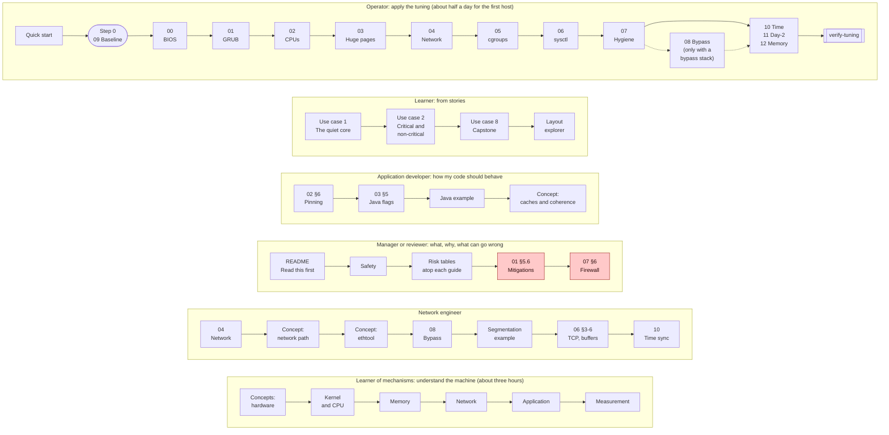
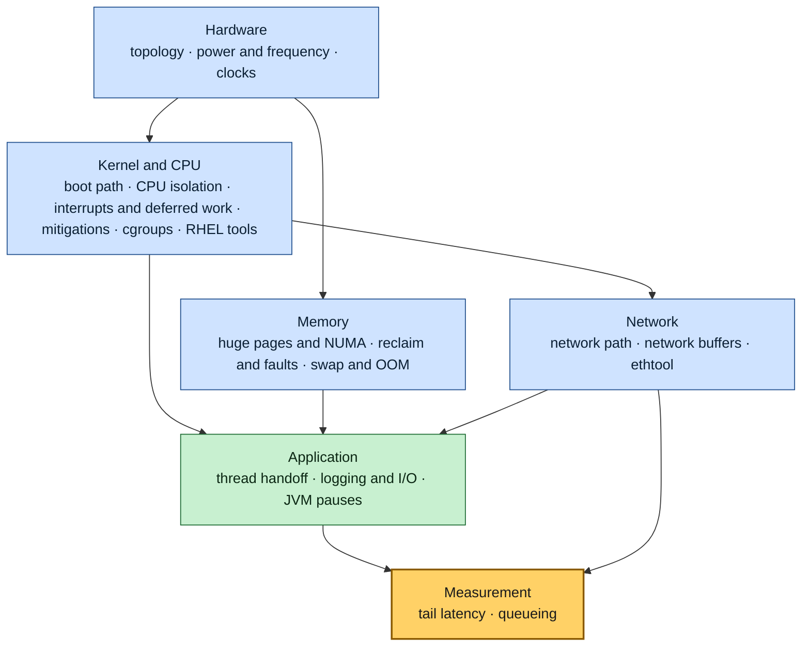

# Index

## Reading paths

Pick the lane that matches your role. Each box is one page, read left to right, and the links for every step are listed under the diagram.

*Six lanes: the operator takes a baseline with Guide 09, walks guides 00 to 07, then 10, 11 and 12 (08 only with kernel bypass), and ends at verify-tuning; the learner follows three use cases and the layout explorer; the developer reads the pinning and Java sections and the Java example; the reviewer reads the safety page and the risks, with mitigations and firewall highlighted; the network engineer goes from Guide 04 through the network concepts to bypass, segmentation and time sync; the learner of mechanisms reads every concept, from the hardware up to measurement.*

**Operator applying the tuning (about half a day for the first host, minutes for the next).** This is the reading order. `apply-all` runs the guides in a slightly different order, explained in [QUICK_START](QUICK_START.md#reading-order-and-run-order).
[QUICK_START](QUICK_START.md) → step 0: a baseline with [09](guides/09-measuring-latency.md) → [00](guides/00-bios-firmware.md) → [01](guides/01-grub-bootloader-tuning.md) → [02](guides/02-cpu-core-isolation.md) → [03](guides/03-huge-pages-configuration.md) → [04](guides/04-network-optimization.md) → [05](guides/05-cgroup-isolation.md) → [06](guides/06-kernel-sysctl-tuning.md) → [07](guides/07-os-hygiene.md) → ([08](guides/08-kernel-bypass.md), only with a bypass stack) → [10](guides/10-time-sync.md) → [11](guides/11-day2-operations.md) → [12](guides/12-memory-pressure.md) → `scripts/verify-tuning`

**Learner (from stories)**
[Use case 1 — the quiet core](examples/use-cases/01-the-quiet-core.md) → [Use case 2 — critical and non-critical threads](examples/use-cases/02-critical-and-non-critical.md) → [Use case 8 — the capstone](examples/use-cases/08-stock-to-tuned-in-one-afternoon.md) → the [layout explorer](https://vitor-tadashi.github.io/mechanical-sympathy/explorer.html)

**Application developer (how my code should behave on a tuned host)**
[Guide 02 §6 — pinning the application](guides/02-cpu-core-isolation.md#6-pinning-the-application) → [Guide 03 §5 — Java flags](guides/03-huge-pages-configuration.md#5-java-applications) → [Java example](examples/hugepages-java-example.md) → [concepts/cpu-isolation §5 — caches and coherence](concepts/cpu-isolation.md#5-caches-and-coherence-the-mechanical-sympathy-part)

**Engineering manager / reviewer (what, why, and what can go wrong)**
[README — Read this first](README.md#read-this-first) → [Safety](SAFETY.md) → risk and applicability tables at the top of each guide → [Guide 01 §5.6 — mitigations](guides/01-grub-bootloader-tuning.md#56-iommu-and-cpu-vulnerability-mitigations-security-sensitive) → [Guide 07 §6 — firewall](guides/07-os-hygiene.md#6-opt-in-removing-host-packet-filtering)

**Network engineer**
[Guide 04](guides/04-network-optimization.md) → [concepts/network-tuning](concepts/network-tuning.md) → [concepts/ethtool](concepts/ethtool.md) → [Guide 08 — kernel bypass](guides/08-kernel-bypass.md) → [segmentation example](examples/network-segmentation-example.md) → [Guide 06 §3–6](guides/06-kernel-sysctl-tuning.md#3-tcp-behavior) → [Guide 10 — time sync](guides/10-time-sync.md)

**Learner of mechanisms: understand the machine (about three hours)**
[Hardware topology](concepts/hardware-topology.md) → [power and frequency](concepts/power-and-frequency.md) → [clocks and time](concepts/clocks-and-time.md) → [boot path](concepts/bootloader.md) → [CPU isolation](concepts/cpu-isolation.md) → [interrupts and deferred work](concepts/interrupts-and-deferred-work.md) → [security mitigations](concepts/security-mitigations.md) → [cgroups](concepts/cgroups.md) → [RHEL's own tuning tools](concepts/rhel-tuning-tools.md) → [huge pages and NUMA](concepts/huge-pages.md) → [memory reclaim](concepts/memory-reclaim.md) → [swap and the OOM killer](concepts/swap-and-oom.md) → [network path](concepts/network-tuning.md) → [network buffers](concepts/network-buffers.md) → [ethtool](concepts/ethtool.md) → [thread handoff](concepts/thread-handoff.md) → [logging and I/O](concepts/logging-and-io.md) → [JVM pauses](concepts/jvm-pauses.md) → [tail latency](concepts/tail-latency.md) → [queueing](concepts/queueing.md). The [concept map](#concepts) shows how they build on each other.

## Guides

| Guide | Read | Covers | Key functions |
|---|---|---|---|
| [00 BIOS and firmware](guides/00-bios-firmware.md) | ~14 min | power profile, C-states, P-states and turbo, EPB, uncore, Hyper-Threading, NUMA/SNC, SMI sources, PCIe ASPM, cooling | `set_pcie_aspm_policy`, `verify_bios_firmware`, `show_firmware_facts` |
| [01 Kernel command line](guides/01-grub-bootloader-tuning.md) | ~17 min | isolcpus, nohz_full, rcu_nocbs, idle/C-states, THP, huge page size, watchdogs, IOMMU, mitigations | `apply_grub_kernel_parameters`, `rollback_grub_kernel_parameters` |
| [02 CPU isolation](guides/02-cpu-core-isolation.md) | ~15 min | CPU layout, systemd CPUAffinity, workqueues, irqbalance, RT throttling, thread pinning, idle strategies | `configure_systemd_cpu_affinity`, `set_workqueue_affinity`, `pin_process`, `show_affinity` |
| [03 Huge pages](guides/03-huge-pages-configuration.md) | ~15 min | THP vs explicit, sizing, per-NUMA early-boot reservation, Java flags, C/C++ mmap, 1 GiB pages | `install_hugepage_reservation`, `set_hugepage_sysctls`, `show_hugepages` |
| [04 Network](guides/04-network-optimization.md) | ~22 min | NIC roles, channels (one queue per IRQ CPU), ntuple steering, coalescing, pause, offloads, rings, txqueuelen, IRQ affinity, RPS/XPS, persistence | `tune_nic_low_latency`, `set_nic_irq_affinity`, `show_nic_state` |
| [05 cgroups](guides/05-cgroup-isolation.md) | ~10 min | v1/v2, housekeeping slice, agent pinning, cpuset trap, app unit template, cpuset partitions | `create_housekeeping_slice`, `move_service_to_slice`, `pin_housekeeping_processes` |
| [06 sysctl](guides/06-kernel-sysctl-tuning.md) | ~11 min | logging, TCP, buffers, queues, IPv6/ARP, BPF, VM | `write_sysctl_profile`, `apply_sysctl_profile` |
| [07 OS hygiene](guides/07-os-hygiene.md) | ~9 min | services, limits, noatime, tuned, opt-in firewall/netfilter | `disable_unnecessary_services`, `set_security_limits`, `install_tuned_profile` |
| [08 Kernel bypass](guides/08-kernel-bypass.md) | ~18 min | choosing a stack per card and application, what happens to the kernel queues, Onload on Solarflare/AMD, DPDK on Intel (VFIO, IOMMU), XLIO, AF_XDP, busy polling | `apply_onload`, `bind_dpdk_ports`, `unbind_dpdk_ports`, `show_bypass_state` |
| [09 Measuring latency](guides/09-measuring-latency.md), step 0 | ~14 min | baselines, percentiles, coordinated omission, rtla osnoise/timerlat/hwnoise, turbostat SMIs, a measurement protocol, reading histogram shapes | `install_measurement_tools`, `capture_bundle`, `verify_measurement` |
| [10 Time synchronization](guides/10-time-sync.md) | ~11 min | chrony vs PTP, hardware timestamping, the timing NIC, pinning the time daemons, ptp4l + phc2sys, VMs (`ptp_kvm`) | `pin_time_daemons`, `configure_chrony`, `configure_ptp`, `verify_time_sync` |
| [11 Day-2 operations](guides/11-day2-operations.md) | ~10 min | the verification timer, kernel updates and the boot loader entries, what to alert on, adding a thread, an update routine | `install_verify_timer`, `all_kernel_entries_isolated`, `verify_day2_operations` |
| [12 Memory pressure](guides/12-memory-pressure.md) | ~11 min | swap off or protected, the swapoff precheck, zswap and zram, the OOM order (`OOMScoreAdjust=-900`), `LimitMEMLOCK` for services, PSI and `pswpin` checks | `disable_swap`, `protect_latency_units`, `verify_memory_pressure` |

## Concepts

The concepts explain why the guides work. They build on each other from the hardware up:

*Hardware sets the costs, the kernel and memory decide who pays them, the network and the application are where a message spends its time, and measurement tells you whether any of it worked.*

| Layer | Concept | Read | Questions it answers |
|---|---|---|---|
| Hardware | [Hardware topology](concepts/hardware-topology.md) | ~9 min | Which CPUs share a core, an L3, a node? How far is the NIC from my thread? How do I read the topology before writing a layout? |
| Hardware | [Power, frequency & firmware](concepts/power-and-frequency.md) | ~10 min | Why is the first message after a pause slow? Who chooses the clock? Is turbo worth it? Why does an SMI leave no trace? |
| Hardware | [Clocks and time](concepts/clocks-and-time.md) | ~9 min | Which clock do I read for a duration? Why can a latency be negative? What does the clocksource cost? How good is a one-way latency across hosts? |
| Kernel and CPU | [Boot path](concepts/bootloader.md) | ~7 min | How do arguments reach the kernel? What is the housekeeping mask? Why can't these be changed at runtime? |
| Kernel and CPU | [CPU isolation](concepts/cpu-isolation.md) | ~7 min | What interrupts a CPU? What does a context switch really cost? Spin or block? |
| Kernel and CPU | [Interrupts & deferred work](concepts/interrupts-and-deferred-work.md) | ~10 min | What runs after an interrupt, and where? When does ksoftirqd take over? Which IPIs reach an isolated CPU, and why? Where do RCU callbacks and kworkers run? |
| Kernel and CPU | [Security mitigations](concepts/security-mitigations.md) | ~8 min | What do Spectre and Meltdown fixes cost, and where? Who pays: a spinning thread or a blocking one? How do I measure it before opting out? |
| Kernel and CPU | [cgroups](concepts/cgroups.md) | ~5 min | Affinity vs cpuset? What do quota, memory.max, io.weight do? How does systemd map onto cgroups? |
| Kernel and CPU | [RHEL's own tuning tools](concepts/rhel-tuning-tools.md) | ~9 min | Why not just use the cpu-partitioning tuned profile? What does it set, and what does it leave out? When does the real-time kernel help? What is the fair server? |
| Memory | [Huge pages & NUMA](concepts/huge-pages.md) | ~7 min | What is TLB reach? Why pre-touch? Why is THP unpredictable? Why reserve per node? |
| Memory | [Memory reclaim & faults](concepts/memory-reclaim.md) | ~10 min | Where does the memory go? Who reclaims it, kswapd or my thread? What does a minor or major fault cost? Why do stalls appear only after days of uptime? |
| Memory | [Swap & the OOM killer](concepts/swap-and-oom.md) | ~9 min | What can be swapped, and what does a swap-in cost? What does swappiness really do? How does the OOM killer choose? Why prefer a loud failure? |
| Network | [Network path](concepts/network-tuning.md) | ~8 min | Where does a packet wait between the wire and `recv()`? What do coalescing, NAPI, RSS, and bypass change? |
| Network | [Network buffers](concepts/network-buffers.md) | ~10 min | How big is each queue on the way to `recv()`? How long does a ring hold a burst? Where did the packet die, and which counter shows it? What do DPDK and Onload change? |
| Network | [`ethtool` reference](concepts/ethtool.md) | ~16 min | What is a channel, and what does `combined` mean? Which options reset the link? How do I steer one flow to one queue? How do I persist each setting? |
| Application | [Thread handoff](concepts/thread-handoff.md) | ~10 min | What does passing a message between two cores cost? What is false sharing, and how do I pad? Acquire, release or volatile? Spin, back off or block? |
| Application | [Logging & I/O](concepts/logging-and-io.md) | ~9 min | Where can a log line block? What do dirty throttling, fsync and the kernel console cost? How do I log without doing I/O on the hot path? |
| Application | [JVM pauses](concepts/jvm-pauses.md) | ~10 min | Why does a pinned Java thread still stop? What is time to safepoint? What does ZGC still pause for? Which JVM stalls are not pauses, and how do I log them? |
| Measurement | [Tail latency](concepts/tail-latency.md) | ~9 min | Why does p99 matter to every user? How many samples does a percentile need? Why can percentiles not be averaged? What does the histogram shape say? |
| Measurement | [Queueing](concepts/queueing.md) | ~9 min | Why does p99 explode as load rises? What does Little's law tell me? Why does jitter cost as much as capacity? How long does one stall echo? |

## Examples

| Example | Read | Shows |
|---|---|---|
| [Use cases](examples/use-cases/README.md) | ~6 min each | Nineteen stories from symptom to result, from the quiet core to the benchmark that lied. Each has the diagnosis commands, the exact config lines, and the rollback |
| [Java on a tuned host](examples/hugepages-java-example.md) + [code](examples/java-latency-probe/) | ~9 min | Launcher by host class, large pages + NUMA + pre-touch when pinned, thread roles → CPUs, padded single-writer sequences, RTT and TLB-walk histograms |
| [Multi-NIC segmentation](examples/network-segmentation-example.md) | ~9 min | Six NICs in four roles, routing with one default route, IRQ/CPU map, qdisc per role, `tc` prioritization on a shared NIC, PTP, persistence matrix |

## Scripts

| Script | Use |
|---|---|
| [`lowlat.conf.example`](scripts/lowlat.conf.example) | Describe the host. Copy to `/etc/lowlat/lowlat.conf`. |
| [`plan-layout`](scripts/plan-layout) `--threads N --nic-node N` | Propose the CPU layout of `lowlat.conf` from `lscpu`, or `--check` one you wrote by hand. The [explorer](https://vitor-tadashi.github.io/mechanical-sympathy/explorer.html) does the same in a browser |
| `NN-* --dry-run / --apply / --verify / --rollback` | One guide at a time (00–12). `09-measure-latency --run` captures a measurement bundle. |
| [`apply-all`](scripts/apply-all) `--plan / --dry-run / --apply / --runtime / --rollback` | All guides in order, with step timing, and the whole-host rollback |
| [`size-buffers`](scripts/size-buffers) `--burst-mpps R --ring N` | How long a burst lasts and how big the ring and the socket buffer must be to lose nothing. The [simulator](https://vitor-tadashi.github.io/mechanical-sympathy/buffers.html) does the same in a browser |
| [`verify-tuning`](scripts/verify-tuning) `[--report FILE]` | Read-only PASS/WARN/FAIL for everything |
| [`systemd/lowlat-runtime.service`](scripts/systemd/lowlat-runtime.service) | Re-applies runtime state at boot |

## Glossary

Every abbreviation, product and unusual word has an entry in the [Glossary](GLOSSARY.md), written in plain English for readers whose first language is not English. Start there when a term such as [SMI](GLOSSARY.md#smi), [NAPI](GLOSSARY.md#napi) or [housekeeping CPU](GLOSSARY.md#housekeeping-cpu) is new.
