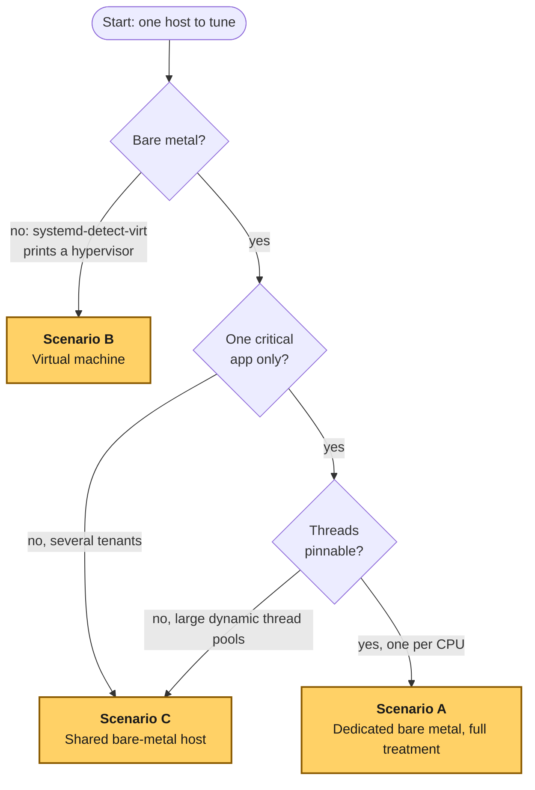
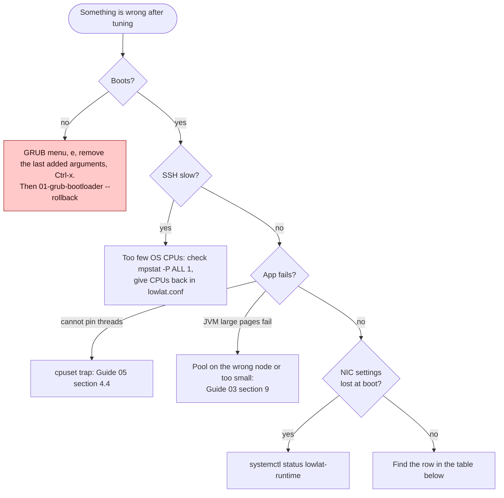

# Quick Start — Pick Your Scenario

> [!IMPORTANT]
> Before anything else, capture a **baseline**: latency percentiles (p50/p99/p99.9/max) of your real workload, or of the [probe](examples/hugepages-java-example.md), plus a host bundle with `sudo scripts/09-measure-latency --apply && sudo scripts/09-measure-latency --run` ([Guide 09](guides/09-measuring-latency.md)). Without a baseline you cannot tell whether tuning helped.

New to a term such as SMI, NAPI or ring buffer? The [glossary](GLOSSARY.md) explains every abbreviation in plain English.

Prefer to learn from a worked problem? The [use cases](examples/use-cases/README.md) walk from symptom to diagnosis to change to result, one topic at a time.

## Which scenario am I?



*A VM goes to Scenario B. A physical host shared by several tenants, or one whose application cannot pin its threads, goes to Scenario C. A dedicated physical host with pinnable threads gets the full treatment, Scenario A.*

| Scenario | Jump to |
|---|---|
| A: dedicated bare metal | [Scenario A](#scenario-a-dedicated-bare-metal-host-the-full-treatment) |
| B: virtual machine | [Scenario B](#scenario-b-virtual-machine) |
| C: shared bare metal | [Scenario C](#scenario-c-shared-bare-metal-host-several-applications) |

---

## Scenario A: Dedicated bare-metal host (the full treatment)

**For:** one latency-critical application (plus its sidecars) on its own physical server, with threads that can be pinned.

| Step | Guide | What you do | Reboot |
|---|---|---|---|
| 0 | [09](guides/09-measuring-latency.md) | Baseline: latency percentiles of your workload, plus a host bundle (`sudo scripts/09-measure-latency --apply && sudo scripts/09-measure-latency --run`). Compare against it after step 10. | |
| 1 | — | Design the CPU layout: NIC NUMA node, isolated CPUs, housekeeping CPUs ([Guide 02 §3](guides/02-cpu-core-isolation.md#3-designing-the-cpu-layout), or let `scripts/plan-layout` propose it) and write `/etc/lowlat/lowlat.conf` | |
| 2 | [00](guides/00-bios-firmware.md) | BIOS: maximum-performance profile, C1E and deep C-states off, OS-controlled P-states, Hyper-Threading off, NUMA per socket, SMI sources off | ✔ (BIOS) |
| 3 | [01](guides/01-grub-bootloader-tuning.md) | Kernel command line: isolation + latency set. Decide on mitigations with security. | ✔ |
| 4 | [02](guides/02-cpu-core-isolation.md) | systemd CPUAffinity, workqueues, irqbalance off, RT throttling | ✔ (same reboot) |
| 5 | [03](guides/03-huge-pages-configuration.md) | Per-NUMA huge page reservation, sized for heap + code cache + bypass buffers | ✔ (same reboot) |
| 6 | [06](guides/06-kernel-sysctl-tuning.md) | sysctl profile | |
| 7 | [07](guides/07-os-hygiene.md) | Services, limits, noatime, tuned. Firewall section only with sign-off. | |
| 8 | [05](guides/05-cgroup-isolation.md) | housekeeping.slice for agents, pin EDR/AV | |
| 9 | [04](guides/04-network-optimization.md) | NIC roles, coalescing, IRQ affinity. Runtime-only: `lowlat-runtime.service` re-applies it at every boot, and `apply-all` installs that unit. | |
| 10 | [Example](examples/hugepages-java-example.md) | Launcher: options by host class, large-page flags when pinned, threads pinned by role | |
| 11 | [08](guides/08-kernel-bypass.md) | *Optional.* Kernel bypass: Onload on Solarflare/AMD NICs, or DPDK on Intel NICs (enables the IOMMU in step 3) | DPDK: ✔ (same reboot) |

```bash
scripts/apply-all --dry-run | less
sudo scripts/apply-all --apply && sudo systemctl reboot
scripts/verify-tuning
```

`apply-all` runs the guides in a different order than the table: 00, 01, 02, 03, 06, 07, 10, 05, 08 (only with a bypass stack), 04, 11. It puts 08 before 04 because a driver reload resets the NICs, and it never runs Guide 09. If you apply the guides one by one, follow the table.

**Also, on every host:** time synchronization with chrony, or PTP on the timing NIC, with the daemons pinned to a housekeeping CPU ([Guide 10](guides/10-time-sync.md)). `apply-all` runs it after Guide 07. It also installs the [verification timer of Guide 11](guides/11-day2-operations.md), so the host reports its own drift.

**Time:** about half a day for the first host, including the reboot and verification. The next hosts with the same hardware take minutes (same `lowlat.conf`).

```mermaid
gantt
  title Scenario A, first host (about half a day)
  dateFormat HH:mm
  axisFormat %H:%M
  section Prepare
    Baseline and verify-tuning report     :p1, 09:00, 45m
    CPU layout and lowlat.conf            :p2, after p1, 60m
    Security sign-off check               :p3, after p2, 15m
  section Apply
    apply-all --dry-run and review        :a1, after p3, 30m
    apply-all --apply                     :a2, after a1, 15m
    Reboot (one reboot for 01, 02, 03)    :crit, a3, after a2, 15m
  section Check
    verify-tuning and rtla osnoise        :c1, after a3, 30m
    Application launch and latency run    :c2, after c1, 60m
```



*About an hour to measure and design, under an hour to apply with a single reboot, then about 90 minutes to verify and compare against the baseline. The times are indicative.*
**What to expect:** the biggest change is in the tail. p99.9 and max typically drop several-fold, while p50 improves modestly. The exact gain depends on how noisy the host was before, so measure against your baseline.

---

## Scenario B: Virtual machine

**For:** latency-sensitive services on KVM/VMware/Hyper-V/cloud instances. The hypervisor schedules your vCPUs, so the guest cannot truly isolate CPUs.

| Step | Guide | What applies |
|---|---|---|
| 0 | [09](guides/09-measuring-latency.md) | **Baseline:** latency percentiles and a host bundle, before any change |
| 1 | [01](guides/01-grub-bootloader-tuning.md) | **Latency subset only:** `idle=poll`, C-state caps, `transparent_hugepage=never` (agree `idle=poll` with the hypervisor owner) |
| 2 | [06](guides/06-kernel-sysctl-tuning.md) | sysctl profile (scale `vm.min_free_kbytes` down) |
| 3 | [07](guides/07-os-hygiene.md) | Services, limits, noatime, tuned profile (its PM QoS is the main C-state control in a VM) |
| 4 | [05](guides/05-cgroup-isolation.md) | Agent slice with limits |
| 5 | [04](guides/04-network-optimization.md) | Coalescing/offloads where the virtual NIC supports them; IRQ affinity for virtio/SR-IOV queues |
| 6 | App | Low-resource JVM options, **back-off** idle strategy, no large-page flags (`affinity.enable=false`) |

The scripts skip isolation, huge-page reservation, irqbalance and RT throttling automatically on `virtual_machine`. Time synchronization still applies: chrony, ideally from the hypervisor's clock ([Guide 10 §12](guides/10-time-sync.md#12-bare-metal-vs-vm)). So does the [verification timer of Guide 11](guides/11-day2-operations.md#11-bare-metal-vs-vm).

**Biggest lever outside the guest:** ask for dedicated physical CPUs with vCPU pinning, huge-page-backed guest memory, SR-IOV passthrough of the critical NIC, and the host BIOS settings from [Guide 00](guides/00-bios-firmware.md). With those, the guest behaves much more like Scenario A.

---

## Scenario C: Shared bare-metal host (several applications)

**For:** a physical server running several services, where one or two need predictable latency.

| Step | Guide | What applies |
|---|---|---|
| 0 | [09](guides/09-measuring-latency.md) | **Baseline** of the critical tenant, and of the neighbors while it runs, before any change |
| 1 | [01](guides/01-grub-bootloader-tuning.md) | Latency subset. Isolation only for the CPUs of the one application that pins its threads (small `ISOLATED_CPUS`). |
| 2 | [05](guides/05-cgroup-isolation.md) | **One slice per tenant**: `AllowedCPUs`, `MemoryMax`, `IOWeight`. This is the main tool here. |
| 3 | [03](guides/03-huge-pages-configuration.md) | Per-node pool sized only for the latency-critical tenant |
| 4 | [04](guides/04-network-optimization.md) | Dedicated NIC (or VLAN + `tc` prioritization, see the [segmentation example §6.3](examples/network-segmentation-example.md#63-when-traffic-classes-must-share-a-nic)) for the critical tenant |
| 5 | [06](guides/06-kernel-sysctl-tuning.md), [07](guides/07-os-hygiene.md) | As usual, without disabling services other tenants need |

---

## Pre-flight checklist

New to this? Read [Safety](SAFETY.md) first: what each change can break, and how you undo it.

- [ ] Baseline latency captured, plus a host bundle (`09-measure-latency --run`, [Guide 09](guides/09-measuring-latency.md))
- [ ] Out-of-band console (iLO/iDRAC/IPMI) tested
- [ ] BIOS profile set, checked with `00-bios-firmware --verify`, and exported through the BMC ([Guide 00](guides/00-bios-firmware.md))
- [ ] CPU layout written down and reviewed (NUMA node of the NICs checked, and `scripts/plan-layout --nic-node N --check /etc/lowlat/lowlat.conf` shows no FAIL)
- [ ] Huge page sizing = heap + code cache + off-heap/bypass buffers + 10–20 %
- [ ] Security sign-off for mitigations and firewall changes (or leave them at `no`)
- [ ] Monitoring in place for the host (CPU per core, softirq, drops, OOM)
- [ ] Rollback steps read ([each guide](INDEX.md), final section)

## After applying

```bash
scripts/verify-tuning --report after.txt          # configuration
sudo scripts/09-measure-latency --run             # host bundle: interrupts, SMIs, OS noise (before the app starts)
systemctl list-timers lowlat-verify.timer         # the verification timer of Guide 11 is scheduled
# + your latency histograms vs the baseline (Guide 09 §7 explains how to read them)
```

## When something goes wrong



*Check in this order: does it boot, is the OS starved, does the application start and pin, did runtime settings survive the reboot. Each branch ends at the first action from the table.*

| Problem | First action |
|---|---|
| Host does not boot | GRUB menu → `e` → remove the last added arguments → `Ctrl-x`; then `scripts/01-grub-bootloader --rollback` |
| SSH slow / host sluggish | Too few OS CPUs: check `mpstat -P ALL 1`; give CPUs back in `lowlat.conf` |
| Application cannot pin threads | cpuset trap: [Guide 05 §4.4](guides/05-cgroup-isolation.md#44-the-cpuset-trap) |
| JVM fails with large pages | Pool on the wrong node or too small: [Guide 03 §9](guides/03-huge-pages-configuration.md#9-troubleshooting) |
| Network settings gone after reboot | `systemctl status lowlat-runtime` |
| Kernel-bypass application falls back to the kernel stack | [Guide 08 §11](guides/08-kernel-bypass.md#11-troubleshooting) |
| Undo everything | `sudo scripts/apply-all --rollback`; read [whole-host rollback](#whole-host-rollback) for verification and manual limits |


## Whole-host rollback

```bash
sudo scripts/apply-all --rollback
sudo systemctl reboot
```

Use the same `--config` file and path overrides used for apply. The wrapper
stops and disables `lowlat-runtime.service` first, then rolls guides back in
this order: **11, 08, 04, 05, 10, 07, 06, 03, 02, 01, 00**. Guide 08 runs before
04 because its driver reload can reset restored NIC settings. NIC state is
saved before the first guide runs. The wrapper removes the runtime unit it
created, or restores a preexisting unit and its original service state, then
reloads systemd. A preexisting enabled unit resumes its original behavior.

Original files and first-apply state remain under
`/var/lib/lowlat/factory-settings/`. Repeated apply and boot reapplication do
not replace those originals. Rollback without an earlier wrapper apply is a
no-op. An interrupted apply records which guides it reached; rollback invokes
those guides. A guide that the host class skips is recorded as skipped and is
not rolled back: on a virtual machine that is Guides 00, 02 and 03, so a huge
page pool that apply never managed stays as it is. Each guide's rollback limits
still apply, including manual BIOS settings, application launch settings, and
the time-sync service choice ([Guide 10](guides/10-time-sync.md#11-rollback)).

If the rollback of one guide fails, the wrapper goes on with the other guides, restores the runtime unit, and then stops with an error that names the failed guide. Fix the cause and run it again. A unit that systemd starts only as a dependency, such as `rpcbind.target`, is not started by hand: it comes back when something needs it, or at the next boot.

A host that an older `apply-all` tuned has the runtime unit but no record, and
its guides have no saved baseline. The wrapper then stops with an error and
changes nothing. Run `systemctl disable --now lowlat-runtime.service`, and roll
the guides back one by one as each guide's rollback section says. Do not apply
again first: that would record the tuned state as the baseline.

Check `systemctl is-enabled lowlat-runtime.service` and
`systemctl is-active lowlat-runtime.service`. If no unit existed before apply,
both should report it disabled, inactive, or absent, and its generated file
should be gone. If it existed, compare `systemctl cat` and service state with
the saved baseline. Verify NIC settings and IRQ placement using
[Guide 04](guides/04-network-optimization.md#12-rollback), and restored files,
mounts, and services using [Guide 07](guides/07-os-hygiene.md#11-rollback).
After reboot, check `/proc/cmdline` and PID 1's `Cpus_allowed_list` against the
baseline. `verify-tuning` validates the tuned configuration and is expected
to report failures after tuning has been removed.

A missing backup, invalid recorded state, or failed restoration command stops
the wrapper with an error. Boot reapplication stays disabled while you correct
the problem and retry; keep the backups. Some effects require the reboot:
GRUB arguments, PID 1 and inherited service affinity, and pages still held by
applications. Lost connections and interrupted work cannot be recreated.
This rollback path is covered by the harnesses and is not yet proven in
production across all drivers and tuned profiles. To tune the host again,
run `sudo scripts/apply-all --apply`, reboot, and verify as above.
