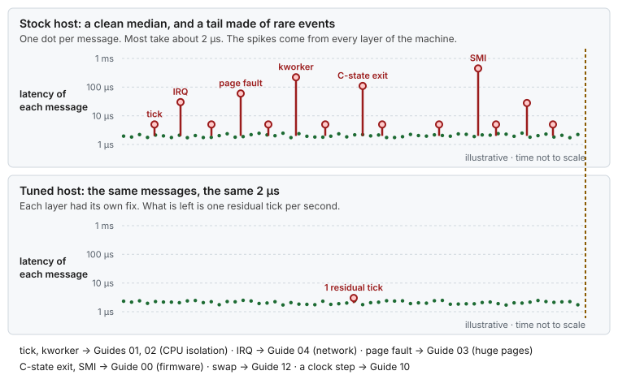
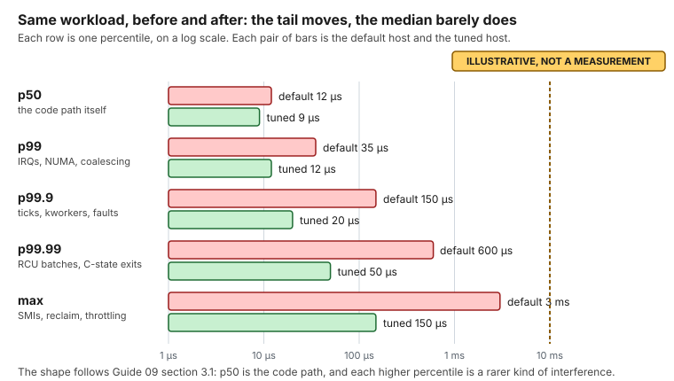
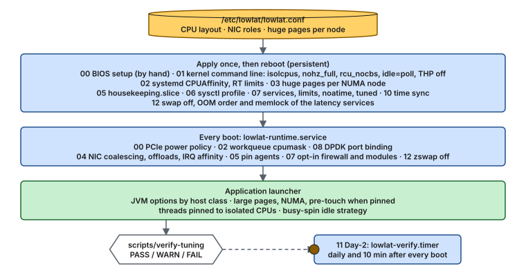

# Mechanical Sympathy — Low-Latency Tuning for RHEL

[](https://github.com/vitor-tadashi/mechanical-sympathy/actions/workflows/lint.yml) [](LICENSE-docs) [](LICENSE)

> *"You don't have to be an engineer to be a racing driver, but you do have to have mechanical sympathy."* — Jackie Stewart

I wrote this for the engineer I was when I started: a fast application, a slow tail, and no idea where the missing microseconds went. The answer was never in one place. It was in the firmware, the kernel, the network card, the memory and, in the end, in my own code, and it only made sense when I saw them together.

A field guide, with working scripts, for turning a Red Hat Enterprise Linux 8, 9 or 10 server into a **deterministic, low-jitter host** for applications that must answer within microseconds, every time: request/response and RPC services, messaging and IPC layers, stream and event processors, real-time analytics, telemetry and control loops, and packet-processing pipelines. If your problem is the tail (p99.9 and beyond) rather than the average, and a stray interrupt or page fault costs more than it saves, these guides apply.

Every guide explains **what the kernel does**, **why each value is chosen**, **how to verify it**, and **how to undo it**. Every guide ships with a shell script whose functions implement exactly what the guide describes, with a `--dry-run` mode that shows every command and file before anything changes.



*Where the tail comes from. The median is the same on both hosts. The spikes are rare events from every layer of the machine, and each layer has a guide that removes them. The numbers are illustrative.*

## Start here (5 minutes)

- **What it is:** thirteen guides, and one script per guide, that make a RHEL 8, 9 or 10 host quiet and predictable for a few latency-critical threads.
- **What you get:** a much shorter tail. p99.9 and max typically drop several-fold, and p50 improves modestly. You measure it on your own workload.
- **What it costs:** power, throughput, flexibility, and in places security. Read [Read this first](#read-this-first) before applying anything.

| I want to… | Go to |
|---|---|
| Take a baseline before changing anything (step 0) | [Guide 09](guides/09-measuring-latency.md) |
| Know whether this is safe to run, and how to undo it | [Safety](SAFETY.md) |
| Tune a dedicated physical server | [Quick start, Scenario A](QUICK_START.md#scenario-a-dedicated-bare-metal-host-the-full-treatment) |
| Tune a virtual machine | [Quick start, Scenario B](QUICK_START.md#scenario-b-virtual-machine) |
| Understand why it works before touching a host | [Reading paths](INDEX.md#reading-paths), then the [concepts](INDEX.md#concepts) |
| Decide which CPUs to isolate | [Layout explorer](https://vitor-tadashi.github.io/mechanical-sympathy/explorer.html) or `scripts/plan-layout`, then [Guide 02 §3](guides/02-cpu-core-isolation.md#3-designing-the-cpu-layout) |
| See a problem solved from symptom to result | [Use cases](examples/use-cases/README.md) |
| Keep a host tuned after updates | [Guide 11](guides/11-day2-operations.md) |
| Decide what happens when memory runs out (swap, OOM order) | [Guide 12](guides/12-memory-pressure.md) |
| Make my application behave on a tuned host | [Java on a tuned host](examples/hugepages-java-example.md) |
| Check a host that is already tuned | `scripts/verify-tuning`, see [the scripts](INDEX.md#scripts) |

## See it in 60 seconds

| | |
|---|---|
| **Design a CPU layout** | The [layout explorer](https://vitor-tadashi.github.io/mechanical-sympathy/explorer.html) takes your sockets, cores and critical threads, and prints the isolated CPUs, the OS CPUs and the kernel arguments. It runs in the browser, and `scripts/plan-layout` gives the same answer on a host. |
| **Follow a whole afternoon** | [Capstone: stock RHEL to tuned in one afternoon](examples/use-cases/08-stock-to-tuned-in-one-afternoon.md), from the baseline to an honest before and after. |
| **Learn one mechanism** | The [use cases](examples/use-cases/README.md), each from symptom to diagnosis, change, result and rollback. |
| **Browse everything** | The [site](https://vitor-tadashi.github.io/mechanical-sympathy/), with the same guides and use cases. |

## Use cases

Nineteen stories, each from symptom to diagnosis, change, result and rollback. Four to start with:

| | |
|---|---|
| <a href="examples/use-cases/01-the-quiet-core.md"></a><br>**1. The quiet core**<br>Stop the tick. | <a href="examples/use-cases/08-stock-to-tuned-in-one-afternoon.md"></a><br>**8. Capstone**<br>Stock to tuned in one afternoon. |
| <a href="examples/use-cases/11-the-first-message-after-a-quiet-spell.md"></a><br>**11. The first message after a quiet spell**<br>Keep the CPUs awake. | <a href="examples/use-cases/19-the-benchmark-that-lied.md"></a><br>**19. The benchmark that lied**<br>Time from the intended send. |

[All nineteen use cases, with a picture of each fix](examples/use-cases/README.md).

*All numbers in the use cases are illustrative and labeled as such. They come from the mechanism costs in the guides, not from benchmarks.*

---

## Read this first

Every change is previewed with `--dry-run`, recorded before it is written, and can be undone with `--rollback`. [Safety](SAFETY.md) explains what can go wrong, what stops it and how you get back.

> [!WARNING]
> These settings are for **dedicated hosts running a small number of well-understood, latency-critical processes that pin their threads**. They trade power, throughput, flexibility, and in places **security** for predictable latency.

- Several settings **lower throughput** or **raise CPU/power usage** (interrupt per packet, polling idle loop).
- CPU isolation **hurts** applications with large, dynamic thread pools that do not pin threads.
- Some options (**CPU vulnerability mitigations off**, **host firewall removed**) are acceptable only on single-tenant hosts in controlled networks, with written approval from your security team. They are opt-in and clearly marked.
- Kernel command-line changes require a reboot, and a mistake can prevent the host from booting. Have out-of-band console access.
- Measure before and after. A configuration that is verified correct is not the same as a latency improvement you have measured.

**Do not apply** when: the application has not been profiled; several unrelated applications share the host; nobody owns the CPU layout; the application runs hundreds of threads it does not control; or the host is a VM and you expect bare-metal isolation.

## What tuning cannot do for you

Everything here removes noise that comes from outside your application. None of it fixes noise your application makes itself.

- **You need to know your own threads.** Isolation, pinning and busy-spinning assume you can say which threads are critical, what each one waits for and who writes to what. If you cannot, start there.
- **Your data structures set the ceiling.** Cache lines, false sharing, single-writer designs and queues that never block matter more than any setting. A quiet host still loses to a lock, an allocation or a cache miss on the hot path.
- **Hundreds of threads cannot be tuned.** A pool that grows and shrinks on its own has no one-thread-per-CPU layout to protect, and isolation only leaves CPUs idle. Bring the count down to a few threads whose roles you control, and tune after that.
- **Measure to learn which case you are in.** A histogram with a comb on it is the host. A slow, wide body is usually the design ([Guide 09 §7](guides/09-measuring-latency.md#7-reading-the-results)).

If that sounds like your application, fix the application first. These guides will still be here, and they will work far better for it. Start with [caches and coherence](concepts/cpu-isolation.md#5-caches-and-coherence-the-mechanical-sympathy-part), [pinning the application](guides/02-cpu-core-isolation.md#6-pinning-the-application) and the [Java example](examples/hugepages-java-example.md).

## What is included

| # | Guide | Script | Risk | Reboot | Bare metal | VM |
|---|---|---|---|---|---|---|
| 00 | [BIOS and firmware](guides/00-bios-firmware.md) | [`00-bios-firmware`](scripts/00-bios-firmware) | 3 | yes (BIOS) | ✅ | ask the hypervisor owner |
| 01 | [Kernel command line (GRUB)](guides/01-grub-bootloader-tuning.md) | [`01-grub-bootloader`](scripts/01-grub-bootloader) | 4 | yes | full | latency subset |
| 02 | [CPU core isolation](guides/02-cpu-core-isolation.md) | [`02-cpu-isolation`](scripts/02-cpu-isolation) | 4 | yes | ✅ | app-side pinning only |
| 03 | [Huge pages](guides/03-huge-pages-configuration.md) | [`03-huge-pages`](scripts/03-huge-pages) | 3 | recommended | ✅ | THP off only |
| 04 | [Network: NIC, IRQs, segmentation](guides/04-network-optimization.md) | [`04-network`](scripts/04-network) | 3 | no | ✅ | partial |
| 05 | [Process isolation with cgroups](guides/05-cgroup-isolation.md) | [`05-cgroup-isolation`](scripts/05-cgroup-isolation) | 3 | no | ✅ | ✅ |
| 06 | [Kernel sysctl](guides/06-kernel-sysctl-tuning.md) | [`06-kernel-sysctl`](scripts/06-kernel-sysctl) | 2 | no | ✅ | ✅ |
| 07 | [OS hygiene](guides/07-os-hygiene.md) | [`07-os-hygiene`](scripts/07-os-hygiene) | 2 (5 opt-in) | no | ✅ | ✅ |
| 08 | [Kernel bypass (Onload, DPDK)](guides/08-kernel-bypass.md) | [`08-kernel-bypass`](scripts/08-kernel-bypass) | 4 (optional) | DPDK: yes (IOMMU) | ✅ | SR-IOV VF only |
| 09 | **Step 0.** [Measuring latency](guides/09-measuring-latency.md): before Guide 00, and after every guide | [`09-measure-latency`](scripts/09-measure-latency) | 1 | no | ✅ | ✅ (no SMI count) |
| 10 | [Time synchronization (chrony, PTP)](guides/10-time-sync.md) | [`10-time-sync`](scripts/10-time-sync) | 2 | no | ✅ | chrony / `ptp_kvm` |
| 11 | [Day-2 operations: keeping a host tuned](guides/11-day2-operations.md) | [`11-day2-operations`](scripts/11-day2-operations) | 1 | no | ✅ | ✅ |
| 12 | [Memory pressure: swap, mlock and the OOM killer](guides/12-memory-pressure.md) | [`12-memory-pressure`](scripts/12-memory-pressure) | 3 | no | ✅ | ✅ |

Plus:

- **Concepts**: why it works, from the hardware up ([concept map](INDEX.md#concepts)).
  - Hardware: [topology](concepts/hardware-topology.md) · [power & frequency](concepts/power-and-frequency.md) · [clocks & time](concepts/clocks-and-time.md)
  - Kernel and CPU: [boot path](concepts/bootloader.md) · [CPU isolation](concepts/cpu-isolation.md) · [interrupts & deferred work](concepts/interrupts-and-deferred-work.md) · [security mitigations](concepts/security-mitigations.md) · [cgroups](concepts/cgroups.md) · [RHEL's tuning tools](concepts/rhel-tuning-tools.md)
  - Memory: [huge pages & NUMA](concepts/huge-pages.md) · [reclaim & faults](concepts/memory-reclaim.md) · [swap & OOM](concepts/swap-and-oom.md)
  - Network: [network path](concepts/network-tuning.md) · [network buffers](concepts/network-buffers.md) · [`ethtool` reference](concepts/ethtool.md)
  - Application: [thread handoff](concepts/thread-handoff.md) · [logging & I/O](concepts/logging-and-io.md) · [JVM pauses](concepts/jvm-pauses.md)
  - Measurement: [tail latency](concepts/tail-latency.md) · [queueing](concepts/queueing.md)
- **Use cases**: [nineteen stories](examples/use-cases/README.md) from symptom to result, from the quiet core to the benchmark that lied.
- **Examples**: [Java on a tuned host](examples/hugepages-java-example.md), with a [runnable probe](examples/java-latency-probe/) · [Multi-NIC segmentation](examples/network-segmentation-example.md)
- **Quick help**: [Cheat sheet](CHEATSHEET.md) (every check on one page) · [FAQ](FAQ.md) · [Glossary](GLOSSARY.md) (every abbreviation and unusual word, in plain English)
- **See it move**: the [diagram gallery](https://vitor-tadashi.github.io/mechanical-sympathy/gallery.html) (every animation, by topic, full size) · the [latency labs](https://vitor-tadashi.github.io/mechanical-sympathy/labs.html) (quiet a CPU one setting at a time, follow a packet to `recv()`, watch a benchmark miss a stall)
- **Tools**: [`plan-layout`](scripts/plan-layout) (propose or check the CPU layout, also as a [browser explorer](https://vitor-tadashi.github.io/mechanical-sympathy/explorer.html)) · [`size-buffers`](scripts/size-buffers) (how long a burst lasts, and how big the queues must be, also as a [browser simulator](https://vitor-tadashi.github.io/mechanical-sympathy/buffers.html)) · [`apply-all`](scripts/apply-all) (plan / dry-run / apply / runtime / rollback) · [`verify-tuning`](scripts/verify-tuning) (PASS/WARN/FAIL report) · [`lowlat-runtime.service`](scripts/systemd/lowlat-runtime.service) (re-applies runtime state at boot)

## How it fits together



*One config file drives everything. Persistent settings are applied once and take effect at the next boot. Runtime settings are re-applied at every boot by `lowlat-runtime.service`. The application pins its threads last, and `verify-tuning` checks the result. A timer then repeats that check daily and after every boot, so drift shows up as a failed unit.*

All scripts read one file, **`/etc/lowlat/lowlat.conf`** ([example](scripts/lowlat.conf.example)), which describes *your* hardware: isolated CPUs, OS CPUs, workqueue CPUs, NIC roles and their IRQ CPUs, and huge pages per NUMA node. Nothing is hard-coded. The scripts detect the host class (`bare_metal`, `virtual_machine`, `container`) and apply only what makes sense there: bare metal and VMs are supported, and containers and unknown hosts are refused.

## Quick start

```bash
sudo mkdir -p /etc/lowlat && sudo cp scripts/lowlat.conf.example /etc/lowlat/lowlat.conf
sudo vi /etc/lowlat/lowlat.conf              # describe your CPUs, NICs and memory

scripts/apply-all --plan                     # what applies on this host class
scripts/apply-all --dry-run | less           # every command and file, nothing changed
sudo scripts/apply-all --apply               # apply 00-08, 10, 11 and 12 + install lowlat-runtime.service
sudo systemctl reboot
scripts/verify-tuning                        # PASS/WARN/FAIL for every guide
```

Choose your scenario in [QUICK_START.md](QUICK_START.md), and use [INDEX.md](INDEX.md) for reading paths.

## Principles

1. **Explain the why.** A setting nobody understands gets reverted during the first incident.
2. **One source of truth.** One config file describes the host; scripts derive everything from it.
3. **Persist the right way.** Kernel args via `grubby`, services via systemd, sysctls via `sysctl.d`, and runtime state via a oneshot unit. No wiping of system files, no `rc.local`.
4. **Dry-run everything.** Every function prints what it would do before it does it.
5. **Verify, then measure.** `verify-tuning` proves the configuration. Your latency histograms prove the benefit.
6. **Bare metal first.** VMs get the subset that helps without pretending to isolate what the hypervisor controls.
7. **Reversible.** Each guide has a rollback section, and every file touched is backed up under `/var/lib/lowlat/`.

## Compatibility

| | Design target |
|---|---|
| OS | RHEL 8.x, 9.x and 10.x, and rebuilds (Rocky, Alma, Oracle Linux). RHEL 10 is checked in CI only, not on real hardware (see the note below). |
| Kernel | Stock RHEL kernels (4.18 / 5.14 / 6.12). Notes where newer kernels differ. |
| CPUs | Intel Xeon (most examples). AMD EPYC notes where parameters differ. |
| Shell | bash ≥ 4.4. Scripts are `shellcheck`-clean. |
| Java | JDK 25 (ZGC, FFM API for thread affinity). Example built with Gradle; no third-party affinity library. |

> [!NOTE]
> **What CI covers.** Every guide script runs end to end (apply, reboot, verify, rollback) on fake hosts for RHEL 8, 9 and 10, and in systemd containers of UBI 8, 9 and 10, Rocky Linux 8 and 9, and AlmaLinux 10. CentOS Stream 9 and 10 run as advisory jobs. This proves the logic of the scripts. It does **not** prove the latency effect on real RHEL 10 hardware: so measure on your own host ([Guide 09](guides/09-measuring-latency.md)).

## Repository layout

```
.
├── README.md  QUICK_START.md  INDEX.md  CHEATSHEET.md  FAQ.md  STYLE.md
├── SAFETY.md  CONTRIBUTING.md  SECURITY.md  CITATION.cff  AGENTS.md
├── guides/          00..12 step-by-step guides
├── concepts/        20 deep dives
├── examples/        use-cases/ (19 stories), Java on a tuned host (+ runnable probe), multi-NIC segmentation
├── assets/          diagrams/ (hand-written SVGs), social-preview.svg (source of the repository card)
├── site/            the GitHub Pages site, the CPU layout explorer and the buffer simulator (no dependencies)
├── tools/           lint, the four checkers (fake hosts, regressions, containers, VMs), site build
├── .github/         CI workflows (lint, integration, vm, doc-health, pages), issue forms, Dependabot
└── scripts/
    ├── lib/common            logging, dry-run, host class, backups, CPU list helpers
    ├── lowlat.conf.example    the host description
    ├── 00..12-*               one script per guide (--apply / --dry-run / --verify / --rollback)
    ├── apply-all              sequencing + step timing, and the whole-host --rollback
    ├── verify-tuning          read-only report
    ├── plan-layout            propose or check the CPU layout of lowlat.conf
    ├── size-buffers           how long a burst lasts and how big the queues must be
    ├── fixtures/              lscpu goldens, buffer cases, fake hosts, and the known issues of the container and VM checks
    └── systemd/lowlat-runtime.service
```

## A note from the author

Nobody hands you this knowledge. You earn it one spike at a time: a histogram with a comb on it, a CPU that should be silent and is not, a host that behaves in the lab and misbehaves the day it matters. Most of it was patient, unglamorous work, and a lot of it was wrong before it was right.

Then, slowly, the layers line up. The firmware stops being a menu and becomes the floor everything else stands on. The kernel stops being a black box and becomes clocks, queues and interrupts you can name. The network card, the memory, the scheduler and your own threads become one machine, and you begin to hear it.

That is the feeling I wanted to hand over. Once you can follow one packet from the wire to your code and say why it waited, you stop applying settings and start understanding systems. You can walk up to almost any application and know where to look first.

It only works because you understand your side too. Threads, memory, data structures: the host can be made quiet, but it cannot make a design fast. If you can control your application, this repository will take you the rest of the way. If you cannot yet, learning to control it is the best tuning there is.

Use what helps, question what does not, and measure everything. If it saves you one night of chasing microseconds, it was worth writing down.

Vitor Tadashi

## License

Copyright (c) 2026 Vitor Tadashi. Use it freely, with credit.

| What | License |
|---|---|
| Prose and diagrams: `guides/`, `concepts/`, the Markdown in `examples/`, `assets/`, `README.md`, `INDEX.md`, `QUICK_START.md`, `CHEATSHEET.md`, `FAQ.md` | [CC BY 4.0](LICENSE-docs) |
| Code: `scripts/`, `tools/`, `site/`, `.githooks/`, the Java probe, `Makefile`, CI config | [MIT](LICENSE) |

To reuse the docs, credit them, for example: *"Based on mechanical-sympathy by Vitor Tadashi, CC BY 4.0"*, with a link to this repository and a note of what you changed.

Material that the guides quote or link to, such as kernel and vendor documentation, stays under its authors' terms.
