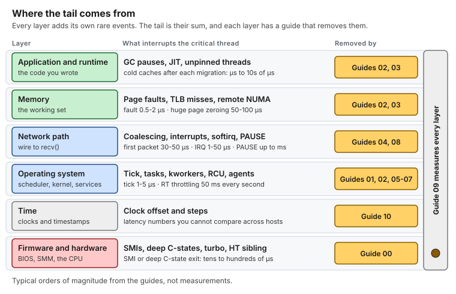
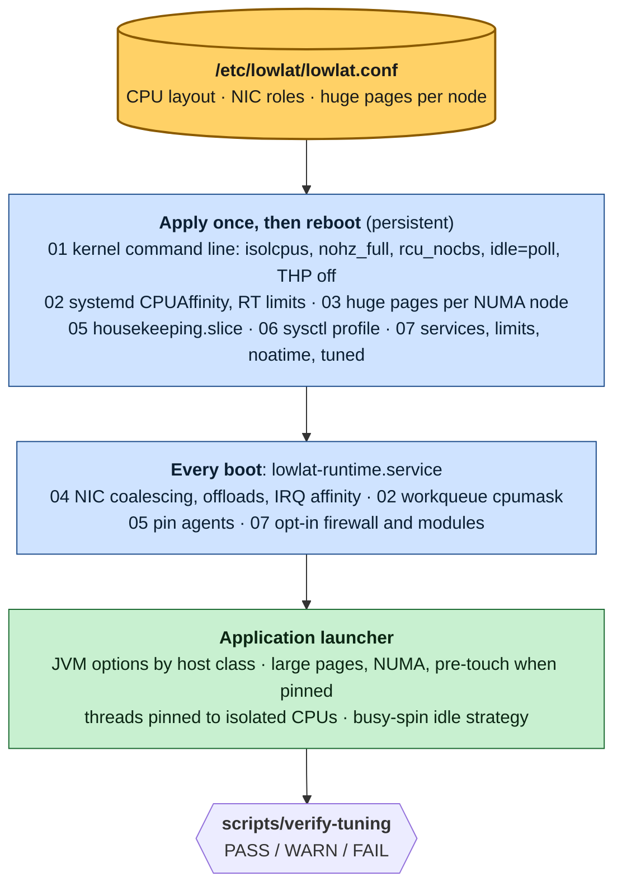

# Mechanical Sympathy — Low-Latency Tuning for RHEL

[](https://github.com/vitor-tadashi/mechanical-sympathy/actions/workflows/lint.yml) [](LICENSE-docs) [](LICENSE)

> *"You don't have to be an engineer to be a racing driver, but you do have to have mechanical sympathy."* — Jackie Stewart

A field guide, with working scripts, for turning a Red Hat Enterprise Linux 8/9 server into a **deterministic, low-jitter host** for applications that must answer within microseconds, every time: request/response and RPC services, messaging and IPC layers, stream and event processors, real-time analytics, telemetry and control loops, and packet-processing pipelines. If your problem is the tail (p99.9 and beyond) rather than the average, and a stray interrupt or page fault costs more than it saves, these guides apply.

Every guide explains **what the kernel does**, **why each value is chosen**, **how to verify it**, and **how to undo it**. Every guide ships with a shell script whose functions implement exactly what the guide describes, with a `--dry-run` mode that shows every command and file before anything changes.



*Where the tail comes from. Every layer adds its own rare events, and each has a guide that removes them. Typical orders of magnitude, not measurements.*

## Start here (5 minutes)

- **What it is:** eleven guides, and one script per guide, that make a RHEL 8/9 host quiet and predictable for a few latency-critical threads.
- **What you get:** a much shorter tail. p99.9 and max typically drop several-fold, and p50 improves modestly. You measure it on your own workload.
- **What it costs:** power, throughput, flexibility, and in places security. Read [Read this first](#read-this-first) before applying anything.

| I want to… | Go to |
|---|---|
| Tune a dedicated physical server | [Quick start, Scenario A](QUICK_START.md#scenario-a-dedicated-bare-metal-host-the-full-treatment) |
| Tune a virtual machine | [Quick start, Scenario B](QUICK_START.md#scenario-b-virtual-machine) |
| Understand why it works before touching a host | [Reading paths](INDEX.md#reading-paths), then the [concepts](INDEX.md#concepts) |
| See a problem solved from symptom to result | [Use cases](examples/use-cases/README.md) |
| Make my application behave on a tuned host | [Java on a tuned host](examples/hugepages-java-example.md) |
| Check a host that is already tuned | `scripts/verify-tuning`, see [the scripts](INDEX.md#scripts) |

## See it in 60 seconds

| | |
|---|---|
| **Design a CPU layout** | The [layout explorer](https://vitor-tadashi.github.io/mechanical-sympathy/explorer.html) takes your sockets, cores and critical threads, and prints the isolated CPUs, the OS CPUs and the kernel arguments. It runs in the browser, and `scripts/plan-layout` gives the same answer on a host. |
| **Follow a whole afternoon** | [Capstone: stock RHEL to tuned in one afternoon](examples/use-cases/08-stock-to-tuned-in-one-afternoon.md), from the baseline to an honest before and after. |
| **Learn one mechanism** | The [use cases](examples/use-cases/README.md), each from symptom to diagnosis, change, result and rollback. |
| **Browse everything** | The [site](https://vitor-tadashi.github.io/mechanical-sympathy/), with the same guides and use cases. |

## Use cases

| | | | |
|---|---|---|---|
| <a href="examples/use-cases/01-the-quiet-core.md"></a><br>**1. The quiet core**<br>Stop the tick. | <a href="examples/use-cases/02-critical-and-non-critical.md"></a><br>**2. Critical and non-critical**<br>Give every thread a home. | <a href="examples/use-cases/03-the-noisy-neighbor.md"></a><br>**3. The noisy neighbor**<br>Fence the agents. | <a href="examples/use-cases/04-one-nic-one-queue-one-cpu.md"></a><br>**4. One NIC, one queue, one CPU**<br>Move the interrupt. |
| <a href="examples/use-cases/05-page-faults-on-the-hot-path.md"></a><br>**5. Page faults on the hot path**<br>Pre-touch huge pages. | <a href="examples/use-cases/06-two-sockets-one-mistake.md"></a><br>**6. Two sockets, one mistake**<br>Keep thread, memory and NIC together. | <a href="examples/use-cases/07-the-freeze-nobody-logs.md"></a><br>**7. The freeze nobody logs**<br>Count the SMIs. | <a href="examples/use-cases/08-stock-to-tuned-in-one-afternoon.md"></a><br>**8. Capstone**<br>Stock to tuned in one afternoon. |

*All numbers in the use cases are illustrative and labeled as such. They come from the mechanism costs in the guides, not from benchmarks.*

---

## Read this first

> [!WARNING]
> These settings are for **dedicated hosts running a small number of well-understood, latency-critical processes that pin their threads**. They trade power, throughput, flexibility, and in places **security** for predictable latency.

- Several settings **lower throughput** or **raise CPU/power usage** (interrupt per packet, polling idle loop).
- CPU isolation **hurts** applications with large, dynamic thread pools that do not pin threads.
- Some options (**CPU vulnerability mitigations off**, **host firewall removed**) are acceptable only on single-tenant hosts in controlled networks, with written approval from your security team. They are opt-in and clearly marked.
- Kernel command-line changes require a reboot, and a mistake can prevent the host from booting. Have out-of-band console access.
- Measure before and after. A configuration that is verified correct is not the same as a latency improvement you have measured.

**Do not apply** when: the application has not been profiled; several unrelated applications share the host; nobody owns the CPU layout; or the host is a VM and you expect bare-metal isolation.

## What is included

| # | Guide | Script | Risk | Reboot | Bare metal | VM |
|---|---|---|---|---|---|---|
| 00 | [BIOS and firmware](guides/00-bios-firmware.md) | [`00-bios-firmware`](scripts/00-bios-firmware) | 3 | yes (BIOS) | ✅ | ask the hypervisor owner |
| 01 | [Kernel command line (GRUB)](guides/01-grub-bootloader-tuning.md) | [`01-grub-bootloader`](scripts/01-grub-bootloader) | 4 | yes | full | latency subset |
| 02 | [CPU core isolation](guides/02-cpu-core-isolation.md) | [`02-cpu-isolation`](scripts/02-cpu-isolation) | 4 | yes | ✅ | app-side pinning only |
| 03 | [Huge pages](guides/03-huge-pages-configuration.md) | [`03-huge-pages`](scripts/03-huge-pages) | 3 | recommended | ✅ | THP off only |
| 04 | [Network: NIC, IRQs, segmentation](guides/04-network-optimization.md) | [`04-network`](scripts/04-network) | 3 | no | ✅ | partial |
| 05 | [Process isolation with cgroups](guides/05-cgroup-isolation.md) | [`05-cgroup-isolation`](scripts/05-cgroup-isolation) | 3 | no | ✅ | ✅ |
| 06 | [Kernel sysctl](guides/06-kernel-sysctl-tuning.md) | [`06-kernel-sysctl`](scripts/06-kernel-sysctl) | 2 | no | ✅ | ✅ |
| 07 | [OS hygiene](guides/07-os-hygiene.md) | [`07-os-hygiene`](scripts/07-os-hygiene) | 2 (5 opt-in) | no | ✅ | ✅ |
| 08 | [Kernel bypass (Onload, DPDK)](guides/08-kernel-bypass.md) | [`08-kernel-bypass`](scripts/08-kernel-bypass) | 4 (optional) | DPDK: yes (IOMMU) | ✅ | SR-IOV VF only |
| 09 | [Measuring latency](guides/09-measuring-latency.md) (first, and after every guide) | [`09-measure-latency`](scripts/09-measure-latency) | 1 | no | ✅ | ✅ (no SMI count) |
| 10 | [Time synchronization (chrony, PTP)](guides/10-time-sync.md) | [`10-time-sync`](scripts/10-time-sync) | 2 | no | ✅ | chrony / `ptp_kvm` |

Plus:

- **Concepts**: why it works. [Boot path](concepts/bootloader.md) · [CPU isolation](concepts/cpu-isolation.md) · [Network path](concepts/network-tuning.md) · [`ethtool` reference](concepts/ethtool.md) · [Huge pages & NUMA](concepts/huge-pages.md) · [cgroups](concepts/cgroups.md)
- **Use cases**: stories from symptom to result. [The quiet core](examples/use-cases/01-the-quiet-core.md) · [Critical and non-critical threads](examples/use-cases/02-critical-and-non-critical.md) · [The noisy neighbor](examples/use-cases/03-the-noisy-neighbor.md) · [One NIC, one queue, one CPU](examples/use-cases/04-one-nic-one-queue-one-cpu.md) · [Page faults](examples/use-cases/05-page-faults-on-the-hot-path.md) · [Two sockets, one mistake](examples/use-cases/06-two-sockets-one-mistake.md) · [The freeze nobody logs](examples/use-cases/07-the-freeze-nobody-logs.md) · [Capstone: stock to tuned in one afternoon](examples/use-cases/08-stock-to-tuned-in-one-afternoon.md) ([all eight](examples/use-cases/README.md))
- **Examples**: [Java on a tuned host](examples/hugepages-java-example.md), with a [runnable probe](examples/java-latency-probe/) · [Multi-NIC segmentation](examples/network-segmentation-example.md)
- **Quick help**: [Cheat sheet](CHEATSHEET.md) (every check on one page) · [FAQ](FAQ.md)
- **Tools**: [`plan-layout`](scripts/plan-layout) (propose or check the CPU layout, also as a [browser explorer](site/explorer.html)) · [`apply-all`](scripts/apply-all) (plan / dry-run / apply / runtime) · [`verify-tuning`](scripts/verify-tuning) (PASS/WARN/FAIL report) · [`lowlat-runtime.service`](scripts/systemd/lowlat-runtime.service) (re-applies runtime state at boot)

## How it fits together



*One config file drives everything. Persistent settings are applied once and take effect at the next boot. Runtime settings are re-applied at every boot by `lowlat-runtime.service`. The application pins its threads last, and `verify-tuning` checks the result.*

All scripts read one file, **`/etc/lowlat/lowlat.conf`** ([example](scripts/lowlat.conf.example)), which describes *your* hardware: isolated CPUs, OS CPUs, workqueue CPUs, NIC roles and their IRQ CPUs, and huge pages per NUMA node. Nothing is hard-coded. The scripts detect the host class (`bare_metal`, `virtual_machine`, `container`) and apply only what makes sense there.

## Quick start

```bash
sudo mkdir -p /etc/lowlat && sudo cp scripts/lowlat.conf.example /etc/lowlat/lowlat.conf
sudo vi /etc/lowlat/lowlat.conf              # describe your CPUs, NICs and memory

scripts/apply-all --plan                     # what applies on this host class
scripts/apply-all --dry-run | less           # every command and file, nothing changed
sudo scripts/apply-all --apply               # apply 00-08 and 10 + install lowlat-runtime.service
sudo systemctl reboot
scripts/verify-tuning                        # PASS/WARN/FAIL for every guide
```

Choose your scenario in [QUICK_START.md](QUICK_START.md), and use [INDEX.md](INDEX.md) for reading paths.

## Principles

1. **Explain the why.** A setting nobody understands gets reverted during the first incident.
2. **One source of truth.** One config file describes the host; scripts derive everything from it.
3. **Persist the right way.** Kernel args via `grubby`, services via systemd, sysctls via `sysctl.d`, and runtime state via a oneshot unit. No wiping of system files, no `rc.local`.
4. **Dry-run everything.** Every function prints what it would do before it does it.
5. **Verify, then measure.** `verify-tuning` proves the configuration. Your latency histograms prove the benefit.
6. **Bare metal first.** VMs get the subset that helps without pretending to isolate what the hypervisor controls.
7. **Reversible.** Each guide has a rollback section, and every file touched is backed up under `/var/lib/lowlat/`.

## Compatibility

| | Design target |
|---|---|
| OS | RHEL 8.x, RHEL 9.x and rebuilds (Rocky, Alma, Oracle Linux) |
| Kernel | Stock RHEL kernels (4.18 / 5.14). Notes where newer kernels differ. |
| CPUs | Intel Xeon (most examples). AMD EPYC notes where parameters differ. |
| Shell | bash ≥ 4.4. Scripts are `shellcheck`-clean. |
| Java | JDK 25 (ZGC, FFM API for thread affinity). Example built with Gradle; no third-party affinity library. |

## Repository layout

```
.
├── README.md  QUICK_START.md  INDEX.md  CHEATSHEET.md  FAQ.md  STYLE.md
├── CONTRIBUTING.md  SECURITY.md  CITATION.cff  AGENTS.md
├── guides/          00..10 step-by-step guides
├── concepts/        6 deep dives
├── examples/        use-cases/ (8 stories), Java on a tuned host (+ runnable probe), multi-NIC segmentation
├── assets/          diagrams/ (20 hand-written SVGs), social-preview.svg (source of the repository card)
├── site/            the GitHub Pages site and the CPU layout explorer (no dependencies)
├── tools/           lint, fixture tests, site build
└── scripts/
    ├── lib/common            logging, dry-run, host class, backups, CPU list helpers
    ├── lowlat.conf.example    the host description
    ├── 00..10-*               one script per guide (--apply / --dry-run / --verify / --rollback)
    ├── apply-all              sequencing + step timing
    ├── verify-tuning          read-only report
    ├── plan-layout            propose or check the CPU layout of lowlat.conf
    ├── fixtures/              lscpu fixtures and golden proposals for plan-layout
    └── systemd/lowlat-runtime.service
```

## License

Copyright (c) 2026 Vitor Tadashi. Use it freely, with credit.

| What | License |
|---|---|
| Prose and diagrams: `guides/`, `concepts/`, the Markdown in `examples/`, `assets/`, `README.md`, `INDEX.md`, `QUICK_START.md`, `CHEATSHEET.md`, `FAQ.md` | [CC BY 4.0](LICENSE-docs) |
| Code: `scripts/`, `tools/`, `site/`, `.githooks/`, the Java probe, `Makefile`, CI config | [MIT](LICENSE) |

To reuse the docs, credit them, for example: *"Based on mechanical-sympathy by Vitor Tadashi, CC BY 4.0"*, with a link to this repository and a note of what you changed.

Material that the guides quote or link to, such as kernel and vendor documentation, stays under its authors' terms.
