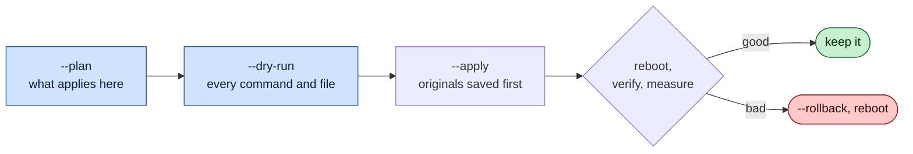
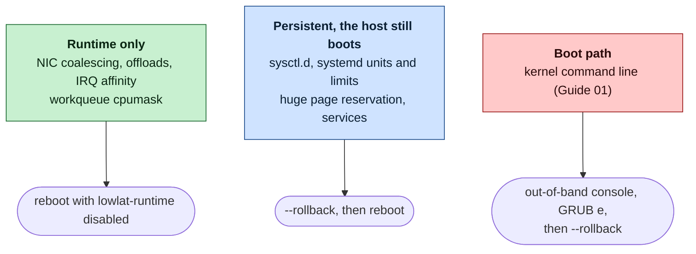

# Safety — How the Scripts Protect Your Host, and How You Get Back

> Related: [Quick start](QUICK_START.md) · [Security policy](SECURITY.md) · [Day-2 operations](guides/11-day2-operations.md)

Tuning a kernel feels risky when you have never done it. This page explains what can go wrong, what the scripts do to prevent it, how we test that, and how you undo every change. Read it before your first apply.

## At a glance

- **Nothing changes until you say so.** `--plan` and `--dry-run` show every command and file first. Only `--apply`, run as root, changes the host.
- **Every change is recorded and can be undone.** The first time a script touches a file, it keeps the original. `sudo scripts/apply-all --rollback` restores the host, with the few exceptions listed in [§6](#6-what-this-project-does-not-do-yet).
- **Only one kind of change can stop a boot:** the kernel command line (Guide 01). It has a documented way back through the out-of-band console, so test that console before you start.

*The first two steps change nothing. Apply saves the originals before it writes. After the reboot you keep the result or roll it back.*

## 1. The safety contract

Every guide script makes these promises. Each one is implemented once, in [`scripts/lib/common`](scripts/lib/common), and every script uses it.

| Promise | How the code keeps it |
|---|---|
| **A dry run changes nothing.** | Every command goes through `run`, and every file goes through `write_file`, `sysfs_write` or `set_key_value_line`. With `--dry-run` they only print. A dry run needs no root, and without a config file it uses the example. |
| **The original is kept before the first write.** | `backup_file` copies each file to `/var/lib/lowlat/factory-settings/` the first time it is touched. A later apply never replaces that copy. Each run also keeps its own copy under `/var/lib/lowlat/backup/<date>/`. |
| **Absence is recorded too.** | If a file or a service did not exist before, rollback removes it instead of leaving it behind. |
| **The script stops when something is wrong.** | Not root, or no config file, stops it before it changes anything (exit code 3). Other checks run inside a guide, just before the step that needs them. Example: Guide 10 checks for PTP hardware timestamping after it has written its systemd drop-ins. Under `apply-all`, the earlier guides are already applied by then. `apply-all` records how far it got, and `--rollback` undoes those guides. A missing backup or saved state it cannot read stops a rollback with an error, instead of guessing. |
| **It changes only what its guide describes.** | It uses the standard RHEL tools: `grubby` for kernel arguments, `sysctl.d` files, systemd units and drop-ins. It does not wipe system files or use `rc.local`. Anything else is a bug: see [SECURITY.md](SECURITY.md#what-to-report-privately). |
| **It respects the host class.** | `capability_decision` decides what runs on bare metal and what runs on a VM. On a VM it skips CPU isolation, huge pages and BIOS checks. On a host class it does not know, it refuses to run. |
| **Your SSH path is left alone.** | A NIC with the `mgmt` role (SSH, monitoring) never gets new coalescing, offload or ring settings. Its interrupts move only if you give it a CPU list. |
| **Settings that weaken security are opt-in.** | Disabling CPU mitigations or the IOMMU, flushing the firewall and unloading netfilter modules all default to `no` in [`lowlat.conf`](scripts/lowlat.conf.example), and the guides mark them with a CAUTION box. |

## 2. How you could lose a server, and what stops it

Sorted from the worst outcome to the mildest. "Reboot alone fixes it" means that the change lives only in memory, and a reboot without `lowlat-runtime.service` brings back the original state.

| What goes wrong | Guide | What prevents it | How you get back | Reboot alone fixes it? |
|---|---|---|---|---|
| **The host does not boot**, for example because the CPU list names a CPU that does not exist | 01 | `scripts/plan-layout --check` fails a CPU list that does not match the topology. `--dry-run` prints every argument first. | At the GRUB menu press `e`, delete the argument, press `Ctrl-x`. Then run `01-grub-bootloader --rollback` ([Guide 01 §9](guides/01-grub-bootloader-tuning.md#9-rollback)). Needs the out-of-band console. | No |
| **SSH is slow or hangs**, because too few CPUs are left for the OS | 02, 05 | `plan-layout --check` fails when a CPU is in neither list or in both, when CPU 0 is isolated, or when the NIC's node keeps no OS CPU. It does not judge how many OS CPUs are enough: size that with [Guide 02 §3](guides/02-cpu-core-isolation.md#3-designing-the-cpu-layout). | Give CPUs back to `OS_CPUS`, apply again, reboot. | No |
| **Out of memory**, because the huge page pool is too large | 03 | The sizing rule leaves the rest of the node for everything else ([Guide 03 §3](guides/03-huge-pages-configuration.md#3-sizing-the-pool)). | Lower `HUGEPAGES_PER_NODE`, apply again, reboot, or roll Guide 03 back. | No |
| **Remote access lost**, because the firewall was flushed | 07 | Opt-in only (`FLUSH_FIREWALL_RULES=no` by default). Flushing sets every policy to ACCEPT, so it cannot block SSH. It removes a security control instead ([Guide 07 §6](guides/07-os-hygiene.md#6-opt-in-removing-host-packet-filtering)). | Before it flushes, the script saves the nftables and iptables rules. `07-os-hygiene --rollback` restores them ([Guide 07 §11](guides/07-os-hygiene.md#11-rollback)). | No |
| **The OOM killer ends a process** sooner, because swap is off | 12 | `--apply` refuses when the swapped pages do not fit in available memory. The agents are capped ([Guide 05](guides/05-cgroup-isolation.md)) and the latency service is killed last (`OOMScoreAdjust=-900`). | Free or add memory, or set `SWAP_POLICY=protect`, then `12-memory-pressure --rollback` turns swap back on ([Guide 12 §8](guides/12-memory-pressure.md#8-rollback)). | No |
| **A network path misbehaves** after NIC or interrupt changes | 04 | `mgmt` NICs are not tuned. The original NIC state is saved before the first change. | `04-network --rollback` ([Guide 04 §12](guides/04-network-optimization.md#12-rollback)). | Yes, once `lowlat-runtime.service` is disabled |
| **Security is weaker**, because mitigations are off | 01 | Opt-in only, with a written list of conditions ([Guide 01 §5.6](guides/01-grub-bootloader-tuning.md#56-iommu-and-cpu-vulnerability-mitigations-security-sensitive)). | Set the option back to `no`, apply, reboot. | No |
| **Rollback stops halfway** | all | The wrapper goes on with the other guides, keeps every backup, and names the guide that failed. | Fix the cause and run the rollback again ([whole-host rollback](QUICK_START.md#whole-host-rollback)). | — |

> [!IMPORTANT]
> `plan-layout --check` is a check you run, not a gate. `apply-all --apply` does not run it for you. Make it part of every change: `scripts/plan-layout --nic-node N --check /etc/lowlat/lowlat.conf`.

## 3. How far each change reaches

*Most changes are undone over SSH. Only the kernel command line can need the console, and only when the host does not come back.*

## 4. A safe first run

Try one **canary host** first: a single host of the same hardware model, with a working out-of-band console. Go through the [pre-flight checklist](QUICK_START.md#pre-flight-checklist), then:

- [ ] `scripts/apply-all --plan` and read what applies on this host class
- [ ] `scripts/apply-all --dry-run | less` and read every command and file
- [ ] `scripts/plan-layout --nic-node N --check /etc/lowlat/lowlat.conf` shows no FAIL
- [ ] Capture a baseline: `sudo scripts/09-measure-latency --run` and your application histogram ([Guide 09](guides/09-measuring-latency.md))
- [ ] Open the out-of-band console and keep it open
- [ ] `sudo scripts/apply-all --apply`, then `sudo systemctl reboot`
- [ ] `scripts/verify-tuning` reports no FAIL
- [ ] Measure again and compare. Keep the change only if the numbers improved, and roll back otherwise
- [ ] Only then the rest of the fleet, one group at a time ([Guide 11 §6](guides/11-day2-operations.md#6-an-update-routine))

## 5. How we know: the test ladder

Every change to a script runs on three levels before it is merged.

| Level | Command | What runs | What it proves |
|---|---|---|---|
| 1 | `make check-scripts` | Every guide script on fake RHEL 8, 9 and 10 hosts: plan, dry run, apply, simulated reboot, verify, every rollback | The logic, line by line. The transcript must equal a reviewed golden file. |
| 2 | `make check-containers` | The guides in systemd containers of UBI, Rocky, AlmaLinux and CentOS Stream | Real `systemctl`, `grubby` and `tuned-adm`, and real unit files. |
| 3 | `make check-vm` | Cloud images booted in QEMU/KVM with 2 NUMA nodes and two NICs, as a VM and as bare metal | A real kernel: apply, reboot, check `/proc/cmdline` and huge pages per node, roll back, reboot, and compare with the state before apply. |

Bugs the checks have found and that are not fixed yet are **published, not hidden**: [`scripts/fixtures/vm/known-issues`](scripts/fixtures/vm/known-issues) and [`scripts/fixtures/containers/known-issues`](scripts/fixtures/containers/known-issues). An unlisted bug fails the build, and so does a listed bug that has gone away, so the lists stay true.

Two open entries matter for recovery. Read them before you roll back on these versions:

- **RHEL 8:** after a rollback, a host whose GRUB cannot read `grubenv` can boot with the old arguments. Regenerate `grub.cfg` as [Guide 01 §9](guides/01-grub-bootloader-tuning.md#9-rollback) says.
- **RHEL 10:** rollback restores `console=tty0`, but it leaves the boot entries without the serial console. After a rollback, check `grubby --info=ALL` and add your `console=ttyS…` argument back if it is missing.

<b>What the tests cannot prove</b>

- **Your hardware.** NIC drivers, firmware, BIOS settings and SMIs differ between vendors. The VMs use virtio-net, not your NIC.
- **Unmeasured advice.** Advice that follows documentation, and that this repository does not measure, is marked "validate on your hardware" in the text. RHEL 10 is checked in CI only, not on real hardware.
- **Your workload.** A configuration that verifies correctly is not a latency improvement until you measure it.
- **Lost work.** Apply and rollback can reset NIC queues and restart services. Connections that drop cannot be brought back. Plan a maintenance window.

## 6. What this project does not do yet

<b>Open limits, stated plainly</b>

- **No trial boot.** Guide 01 changes every kernel entry. It does not first boot the new arguments once with an automatic way back. The out-of-band console is that way back.
- **No layout gate.** `apply-all --apply` does not run `plan-layout --check`. You run it.
- **No tagged releases.** Review the commit you run and pin it, for example with `git checkout <commit>` on your hosts.
- **Rollback does not restore a previous time-sync stack.** Guide 10's rollback removes its drop-ins and enables `chronyd`, the RHEL default. If the host ran something else before, for example a vendor PTP stack, restore that by hand ([Guide 10 §11](guides/10-time-sync.md#11-rollback)).
- **Rollback is tested on fake hosts, containers and VMs, not on real hardware** across every driver and tuned profile ([whole-host rollback](QUICK_START.md#whole-host-rollback)).

## 7. Found something unsafe?

- A script that does more than its guide says, or a default that weakens security without a warning: report it privately, as [SECURITY.md](SECURITY.md#how-to-report) explains.
- A guide that gives wrong or dangerous advice: open a **Wrong or unsafe advice** issue.

## 8. Key takeaways

- `--plan` and `--dry-run` change nothing. Read them before every apply.
- The first apply keeps every original under `/var/lib/lowlat/factory-settings/`, and `apply-all --rollback` restores them.
- Only the kernel command line can stop a boot. Test the out-of-band console before you start.
- Run `plan-layout --check` yourself, and try every change on one canary host first.
- The tests and the known bugs are public. Read the known-issues lists for your RHEL version.
