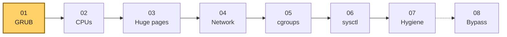
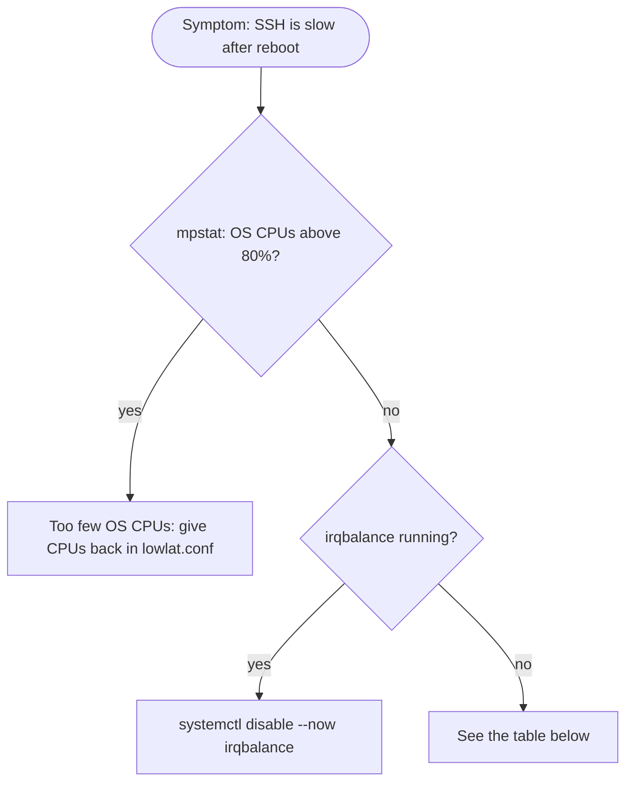

# Style Guide — Writing Pages People Can Absorb

The guides are deep on purpose. This file makes sure depth never turns into a wall of text. It applies to every page in `guides/`, `concepts/` and `examples/`, and to `README.md`, `INDEX.md` and `QUICK_START.md`.

Who we write for:

- **The operator in a hurry** needs the one command and the one check.
- **The skimmer** reads headings, bold text, diagrams and the takeaways, and nothing else.
- **The deep reader** wants every reason and every edge case.
- **Readers who lose focus easily** (for example ADHD). They need small chunks, clear signposts, early wins and a way back in after an interruption.

One page serves all four. Put the short answer first, add a picture, and fold the depth away.

---

## 1. Page skeleton for a guide

Every guide follows this order. Numbered sections stay numbered, because other pages link to their anchors.

1. **Title and nav line.** `# Guide NN — Title`, then the `> **Script:** … · **Previous:** … · **Next:** …` line.
2. **Risk table.** Risk level, reboot, applies to, depends on.
3. **At a glance.** A short block the reader can act on without reading further:

   ~~~~markdown
   ## At a glance

   - **What:** one line.
   - **Why:** one line, ending in the latency effect.
   - **Cost:** what you give up (power, throughput, security, flexibility).

   **Time:** ~20 min + reboot · **Do this if:** … · **Skip if:** …

   ```mermaid
   flowchart LR
     here["Copy the you-are-here strip from section 3.3"]
   ```
   ~~~~

4. **Body sections** (`## 1.` …). They explain what each setting does, why the value was chosen, how to verify it, how to troubleshoot it and how to roll it back (AGENTS.md §3). The depth stays. Only the packaging changes.
5. **Verification.** Commands, each with the expected result in a comment.
6. **Troubleshooting.** A decision flowchart first (§3.4), then the symptom / cause / fix table.
7. **Rollback.** A task list (`- [ ]`) the reader can tick off in order.
8. **Bare metal vs VM.**
9. **Key takeaways.** 3 to 5 bullets. A reader who reads only this section should still leave with the right mental model.
10. **References.**

Concept pages use the same idea on a smaller scale: a 3-bullet **At a glance** at the top and **Key takeaways** at the end.

## 2. Writing rules

| Rule | Why |
|---|---|
| A paragraph is at most about 4 sentences. | Short chunks are easier to hold in working memory and easier to find again after an interruption. |
| Bold a key term the first time it appears in a section. Never bold whole sentences. | Skimmers read the bold text as the outline. When everything is bold, nothing is. |
| One idea per bullet. | A bullet that needs "and also" is two bullets. |
| Tables for comparisons, lists for sequences, prose for reasoning. | Each format tells the reader how to read it. |
| Give the number with its unit and its effect: "**50 ms every second**", not "a lot". | Concrete numbers stick. Vague words don't. |
| Put a command in a code block with the expected output as a comment. | The reader can check the result without reading the paragraph around it. |
| Use American English and the neutral names from AGENTS.md §1. | Consistency. |

### 2.1 Alerts

Use GitHub alerts instead of ad-hoc bold warnings or emoji. Keep each alert to one or two sentences.

| Alert | Use for |
|---|---|
| `> [!TIP]` | A shortcut or a faster way to check something |
| `> [!NOTE]` | Context the reader may skip. Also used for **advice not yet proven in production**: `> [!NOTE]` followed by `> **Not proven in production.** …` |
| `> [!IMPORTANT]` | A precondition the reader must meet before continuing |
| `> [!WARNING]` | A step that can break the host, lock you out or hurt latency when done wrong |
| `> [!CAUTION]` | A step that **removes a security control** (mitigations off, firewall removed) |

Use at most one alert per screen. When everything is highlighted, nothing is.

### 2.2 Folding depth away

Wrap content in `<details>` when it is longer than about 15 lines and not needed to apply the step. That covers long command output, full file listings, historical notes and deep dives:

```markdown
<details>
<summary><b>Full output of <code>ethtool -S</code> on a tuned NIC</b></summary>

…content, with a blank line after the summary so Markdown renders…

</details>
```

Never fold a warning, a precondition or the command the reader must run.

## 3. Diagrams

A diagram earns its place when it shows a **flow, a sequence, a layout or a decision** that prose would need a paragraph for. It never just decorates.

### 3.1 Mermaid

Mermaid renders natively on GitHub, in both themes. Use only these diagram types: `flowchart`, `sequenceDiagram`, `stateDiagram-v2`, `timeline`, `gantt`, `quadrantChart`. `tools/lint-docs` parses every block, so a broken diagram fails `make lint`.

- Keep a diagram under about 15 nodes. Split it or use `subgraph` when it grows.
- Put the flow left-to-right (`LR`) for pipelines and top-down (`TD`) for decisions.
- Quote labels that contain punctuation: `A["idle=poll (C0 only)"]`.
- Keep decision (`{ }`) labels to two or three words, such as `{"Bare metal?"}`, and put the detail on the edge label. Mermaid sizes a diamond from its text, so a long question becomes a huge diamond.
- Mermaid wraps node text at 200 px. For wide multi-line boxes, raise the limit with `%%{init: {"flowchart": {"wrappingWidth": 480}}}%%` as the first line of the block.
- `direction` inside a `subgraph` is ignored as soon as a node inside it is linked from outside. For stacked lists, use one multi-line node instead.
- Nodes with no edges between them share a rank, so they line up **across** the flow direction. For side-by-side columns (one per NUMA node, say), use `flowchart TD` with `direction LR` inside each subgraph. For stacked lanes, link the subgraphs with invisible edges (`laneA ~~~ laneB`).
- Give subgraphs descriptive ids (`kpath`, `numa0`). One-letter ids such as `b` can collide with Mermaid internals and silently break the layout.
- **Right after every diagram, one plain sentence says what it shows.** Screen readers and readers who skip images get the same point.

### 3.2 Palette

These classes read well in both light and dark themes: dark text on a mid-light fill, with a strong border. **Color is never the only signal.** The label or the shape (`([ ])` for start/end, `{ }` for decisions, `[[ ]]` for scripts) carries the meaning too.

```text
classDef focus fill:#ffd166,stroke:#8a5a00,color:#1a1a1a,stroke-width:2px
classDef hk    fill:#cfe3ff,stroke:#1f4e8c,color:#0b1f33
classDef iso   fill:#c8f0d0,stroke:#1d6b33,color:#0b2613
classDef risk  fill:#ffc9c9,stroke:#9b1c1c,color:#2b0a0a
classDef muted fill:#eeeeee,stroke:#777777,color:#333333
```

| Class | Meaning |
|---|---|
| `focus` | "You are here", or the element the diagram is about |
| `hk` | Housekeeping: OS CPUs, IRQ CPUs, system services |
| `iso` | Isolated / latency-critical: pinned threads, critical NIC |
| `risk` | Something that breaks the host or removes a security control |
| `muted` | Out of scope, optional, or skipped on this host class |

### 3.3 The "you are here" strip

Every guide shows where it sits in the sequence. Copy this block, and move `:::focus` to the current guide:



*Guide 01 is the current step. The dotted arrow marks guide 08 as optional.*

### 3.4 Troubleshooting flowcharts

Start from the **symptom** the reader sees, ask **one check per decision**, and end at a **fix** or a link to the table row:



*Starting from slow SSH, check OS CPU load first, then irqbalance, then fall back to the table.*

### 3.5 Animated SVG

A few mechanisms are about **time**: a packet waiting for interrupt coalescing, a tick interrupting a CPU, a thread waking up. For these, an animation says what a static picture can't. Keep them few, and hold each one to these rules:

- Hand-written SVG in `assets/diagrams/<name>.svg`, animated with CSS `@keyframes` inside the file. No script, no external fonts or images. (GitHub serves SVGs as images, so scripts would not run anyway.)
- `<title>` and `<desc>` as the first children of `<svg>`. `<desc>` states the point of the animation in one or two sentences.
- An `@media (prefers-reduced-motion: reduce)` block that stops every animation and shows a meaningful static frame.
- Colors from §3.2, readable on a white and on a dark background. Put a background rectangle in the SVG, because GitHub does not theme images.
- At most 30 KB, a loop of 4 to 8 seconds, and no flashing faster than 3 times per second.
- Embed it with an `` that has an `alt` text, followed by the same one-sentence summary as a Mermaid diagram:

  ```markdown
  
  ```

## 4. Accessibility checklist (every PR that touches docs)

- [ ] The page opens with the short answer (At a glance / TL;DR).
- [ ] Each diagram has a one-sentence text summary. Each image has `alt` text.
- [ ] No meaning is carried by color alone.
- [ ] Long output and deep dives are folded. Warnings and required commands are not.
- [ ] Headings are real headings, in order (no jump from `##` to `####`), so the GitHub outline works.
- [ ] Link text says where the link goes ("Guide 05 §4.4, the cpuset trap"), never "here".
- [ ] Unproven advice is marked (§2.1).
- [ ] `make lint` passes (links, anchors, Mermaid, SVG rules).
