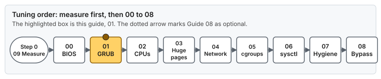
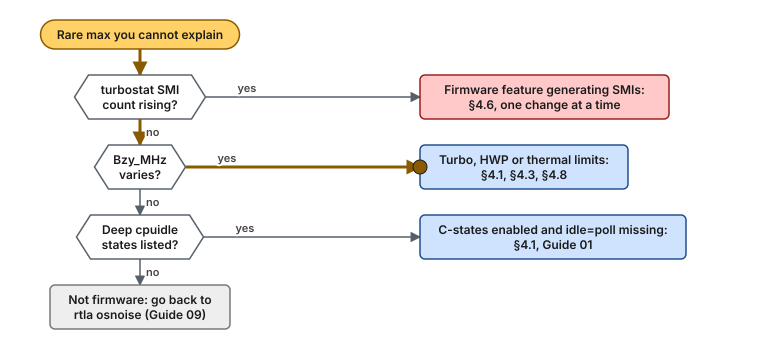

# Style Guide — Writing Pages People Can Absorb

The guides are deep on purpose. This file makes sure depth never turns into a wall of text. It applies to every page in `guides/`, `concepts/` and `examples/`, and to `README.md`, `INDEX.md` and `QUICK_START.md`.

Who we write for:

- **The operator in a hurry** needs the one command and the one check.
- **The skimmer** reads headings, bold text, diagrams and the takeaways, and nothing else.
- **The deep reader** wants every reason and every edge case.
- **Readers who lose focus easily** (for example ADHD). They need small chunks, clear signposts, early wins and a way back in after an interruption.

One page serves all four. Put the short answer first, add a picture, and fold the depth away.

---

## 1. Page skeleton for a guide

Every guide follows this order. Numbered sections stay numbered, because other pages link to their anchors.

1. **Title and nav line.** `# Guide NN — Title`, then the `> **Script:** … · **Previous:** … · **Next:** …` line.
2. **Risk table.** Risk level, reboot, applies to, depends on.
3. **At a glance.** A short block the reader can act on without reading further:

   ~~~~markdown
   ## At a glance

   - **What:** one line.
   - **Why:** one line, ending in the latency effect.
   - **Cost:** what you give up (power, throughput, security, flexibility).

   **Time:** ~20 min + reboot · **Do this if:** … · **Skip if:** …

   
   ~~~~

4. **Body sections** (`## 1.` …). They explain what each setting does, why the value was chosen, how to verify it, how to troubleshoot it and how to roll it back (AGENTS.md §3). The depth stays. Only the packaging changes.
5. **Verification.** Commands, each with the expected result in a comment.
6. **Troubleshooting.** A troubleshooting tree first (§3.4), then the symptom / cause / fix table.
7. **Rollback.** A task list (`- [ ]`) the reader can tick off in order.
8. **Bare metal vs VM.**
9. **Key takeaways.** 3 to 5 bullets. A reader who reads only this section should still leave with the right mental model.
10. **References.**

Concept pages use the same idea on a smaller scale: a 3-bullet **At a glance** at the top and **Key takeaways** at the end.

## 2. Writing rules

| Rule | Why |
|---|---|
| A paragraph is at most about 4 sentences. | Short chunks are easier to hold in working memory and easier to find again after an interruption. |
| Bold a key term the first time it appears in a section. Never bold whole sentences. | Skimmers read the bold text as the outline. When everything is bold, nothing is. |
| One idea per bullet. | A bullet that needs "and also" is two bullets. |
| Tables for comparisons, lists for sequences, prose for reasoning. | Each format tells the reader how to read it. |
| Give the number with its unit and its effect: "**50 ms every second**", not "a lot". | Concrete numbers stick. Vague words don't. |
| Put a command in a code block with the expected output as a comment. | The reader can check the result without reading the paragraph around it. |
| Use American English and the neutral names from AGENTS.md §1. | Consistency. |
| Write for readers whose first language is not English: short sentences, no idioms, one meaning per word. Spell out an abbreviation the first time it appears in a page, or link it to [`GLOSSARY.md`](GLOSSARY.md). | Most readers translate as they read. An unexplained SMI or NAPI stops them, and an idiom such as "a wall of text" may not translate at all. |

### 2.1 Picture it

Most mechanisms in these pages are invisible: a cache line, a timer, a queue in a NIC. When a section explains one, give the reader an everyday picture of it in one line, right next to the diagram that shows the real thing:

```markdown
> **Picture it.** Interrupt coalescing is a mail carrier who waits until the bag is full, or until the clock says go, before ringing your bell.
```

- **One per key idea**, not one per paragraph. A section with no abstract mechanism needs none.
- **Literal and short.** One or two sentences, everyday objects, no idioms, no wordplay. It must survive translation.
- **It never replaces the mechanism.** The next sentence says what really happens, with the number.
- **It is not an alert,** so it does not count toward the one-alert-per-screen rule.

### 2.2 Alerts

Use GitHub alerts instead of ad-hoc bold warnings or emoji. Keep each alert to one or two sentences.

| Alert | Use for |
|---|---|
| `> [!TIP]` | A shortcut or a faster way to check something |
| `> [!NOTE]` | Context the reader may skip. Also used for **advice that follows documentation and is not measured here**: `> [!NOTE]` followed by `> **Validate on your hardware.** …` |
| `> [!IMPORTANT]` | A precondition the reader must meet before continuing |
| `> [!WARNING]` | A step that can break the host, lock you out or hurt latency when done wrong |
| `> [!CAUTION]` | A step that **removes a security control** (mitigations off, firewall removed) |

Use at most one alert per screen. When everything is highlighted, nothing is.

### 2.3 Folding depth away

Wrap content in `<details>` when it is longer than about 15 lines and not needed to apply the step. That covers long command output, full file listings, historical notes and deep dives:

```markdown
<details>
<summary><b>Full output of <code>ethtool -S</code> on a tuned NIC</b></summary>

…content, with a blank line after the summary so Markdown renders…

</details>
```

Never fold a warning, a precondition or the command the reader must run.

### 2.4 Decision aid

A page that says how to change a setting must also let the reader decide whether to. Most settings are a trade: the default kernel behavior does a job, and removing it only pays on some workloads. Give every tunable one decision aid, on the concept page that explains the mechanism, directly under that text, with the heading `#### Keep or change <thing>?`. A guide does not repeat it: the guide links to the aid where it applies the setting, and that link satisfies the guide's side of this rule.

The aid has five parts, in this order:

1. **What it does for a shared system.** One or two sentences: the job the default behavior does, and who needs it.
2. **What each job is worth.** A table of jobs, why a shared system needs each one, and what happens on a system where it is not needed. Give the cost of removing it with a number and its unit.
3. **A traits-to-verdict table.** Columns: `Your thread...` (or `Your host...`), the verdict and `Why`. A verdict is one of **change**, **keep**, **measure first** or **ask the owner**. Describe the reader's workload (for example "makes frequent syscalls"), never a product or a project.
4. **A Validate note** (§2.2) for every number this repository does not measure.
5. **How to decide with data.** One command, the value that tells the two cases apart, and a pointer to the baseline protocol in [Guide 09](guides/09-measuring-latency.md).

Rules:

- The aid describes the trade. It does not prescribe. The guide still names the value it applies, and the aid tells the reader when to choose another.
- "Keep" and "measure first" are valid, common verdicts. An aid that always says "change" is advice, not a decision.
- A guide links to the aid at the place where it applies the setting. It does not repeat the table.
- Model: [`concepts/security-mitigations.md`](concepts/security-mitigations.md) §4, an ordered decision.

## 3. Diagrams

A diagram earns its place when it shows a **flow, a sequence, a layout or a decision** that prose would need a paragraph for. It never just decorates.

### 3.1 Animated SVG, and nothing else

Every diagram is a hand-written, animated SVG in `assets/diagrams/`. There is no Mermaid: `tools/lint-docs` rejects a `mermaid` code block and an SVG without `@keyframes`.

- **Why motion.** A box-and-arrow picture shows what is connected. Motion also shows the order: the path a packet takes, the check a reader makes first, the moment a CPU is interrupted.
- **Why one format.** Every diagram uses the same palette, fonts, dark-mode block and reduced-motion picture (§3.5), so the pages read as one system.
- **The cost.** Text inside an image is not searchable, cannot be copied and is not translated by the browser. The one-sentence summary under each diagram carries the point in text, so write it with care.

Pick the motion for the kind of diagram:

| Diagram | Motion | Picture without motion |
|---|---|---|
| A pipeline or a flow | A token travels the stages and waits where the real thing waits, as in [`spin-vs-block.svg`](assets/diagrams/spin-vs-block.svg) | The token at its destination, every caption visible |
| A decision or troubleshooting tree | A token starts at the symptom and walks one path, and each box pulses as the token reaches it, as in [`bios-troubleshoot.svg`](assets/diagrams/bios-troubleshoot.svg) | The whole tree, with the walked path drawn bold |
| A layout or a map (NICs to CPUs, slices, sockets) | Tokens travel each link and show where the work lands | The tokens at their destinations |
| A sequence of messages | Messages travel between the participants in order | Every message drawn |
| A timeline, a schedule | A playhead sweeps, and each event pulses as the playhead reaches it, as in [`tick-nohz.svg`](assets/diagrams/tick-nohz.svg) | No playhead, every event drawn |
| Where a guide sits in the order | A token walks from step 0 to the current guide, which then pulses (§3.3) | The current guide highlighted |

Layout rules:

- Keep a diagram under about 15 boxes. Split it when it grows.
- Put the flow left to right for pipelines and top down for decisions.
- Keep a decision label to two or three words, such as "Bare metal?", and put the detail on the edge label.
- **Right after every diagram, one plain sentence says what it shows.** Screen readers and readers who skip images get the same point.

### 3.2 Palette and shapes

These classes read well in both light and dark themes: dark text on a mid-light fill, with a strong border. **Color is never the only signal.** The label or the shape carries the meaning too.

| Class | Fill, border | Meaning |
|---|---|---|
| `.foc` | `#ffd166`, `#8a5a00` | "You are here", or the element the diagram is about |
| `.box` | `#cfe3ff`, `#1f4e8c` | Housekeeping: OS CPUs, IRQ CPUs, system services |
| `.app` | `#c8f0d0`, `#1d6b33` | Isolated / latency-critical: pinned threads, critical NIC |
| `.wait` | `#ffc9c9`, `#9b1c1c` | Something that breaks the host, removes a security control, or makes the reader wait |
| `.mut` | `#eeeeee`, `#777777` | Out of scope, optional, or skipped on this host class |

| Shape | Meaning |
|---|---|
| Rounded ends (a pill) | Start or end: the symptom, step 0 |
| Pointed sides | A decision |
| A box with a bar inside each side | A script or a unit file |
| A cylinder | A store: a file, a buffer pool |
| A dashed frame | A group: a NUMA node, a slice, a host |

### 3.3 The "you are here" strip

The ordered tuning guides (00 to 08) show where they sit in the sequence. The strip opens with Guide 09 as **step 0**, because the baseline measurement comes before Guide 00 and repeats after every guide. Guides 09 to 12 are cross-cutting (measuring, clocks, keeping a host tuned, memory pressure), so they open with a diagram of their own instead. Each guide has its own strip, `strip-guide-NN.svg`, with the current guide in `.foc`:



*Guide 01 is the current step. The rounded box is the baseline from Guide 09, taken before Guide 00. The dotted arrow marks Guide 08 as optional.*

### 3.4 Troubleshooting trees

Start from the **symptom** the reader sees, ask **one check per decision**, and end at a **fix** or a link to the table row. The token walks the most common path:



*Starting from an unexplained maximum, check SMIs first, then frequency changes, then deep idle states, and fall back to Guide 09 when all three are clean.*

### 3.5 Hand-written SVG

Each SVG makes **one point that a reader gets in about 5 seconds**. A comparison puts each case in its own lane. If you cannot say the point in one sentence, split the SVG or drop it.

Rules for every SVG:

- Hand-written, in `assets/diagrams/<name>.svg`. No script, no external fonts or images. (GitHub serves SVGs as images, so scripts would not run anyway.)
- `<title>` and `<desc>` as the first children of `<svg>`. `<desc>` states the point in one or two sentences.
- Colors from §3.2 on a white background rectangle (`class="bg"`). Add the **dark-mode block** below, which inverts the lightness and keeps the hues. Browsers apply it when the page around the image is dark, as GitHub's dark theme is:

  ```css
  @media (prefers-color-scheme: dark) {
    svg > * { filter: invert(0.88) hue-rotate(180deg); }
  }
  ```
- Color is never the only signal. Every colored box or bar carries a text label.
- At most 30 KB.

Rules for the motion:

- Animate with CSS `@keyframes` inside the file. Every diagram animates (§3.1).
- **Two kinds of motion, pick the one the idea needs:**
  - **A playhead, for timelines.** One playhead sweeps across all lanes, and each event pulses briefly as the playhead reaches it, as in [`tick-nohz.svg`](assets/diagrams/tick-nohz.svg) and [`tail-spikes.svg`](assets/diagrams/tail-spikes.svg). Time a pulse with a negative `animation-delay` computed from the event's position, so it fires exactly when the playhead gets there.
  - **Moving tokens, for a path.** A packet or a message travels through the stages, waits where it really waits, and arrives, as in [`spin-vs-block.svg`](assets/diagrams/spin-vs-block.svg). A short caption ("handled late") may appear when the token arrives. A decision tree is a path too: the token walks one branch and each box it reaches pulses.
- **Everything stays drawn.** Every box, edge, lane and label is drawn all the time. Only tokens move, boxes pulse, and only arrival captions may fade in.
- The base styles draw the complete picture: the tokens at their destination, every caption visible. An `@media (prefers-reduced-motion: reduce)` block stops every animation and hides the playhead, so the complete picture is what those readers see. It must make the point on its own.
- A loop of 4 to 10 seconds, and no flashing faster than 3 times per second.

Structure: a `viewBox` 760 wide. A comparison, as in [`tick-nohz.svg`](assets/diagrams/tick-nohz.svg), has one lane per case (default on top, tuned below), a caption and a one-line subcaption in each lane. A flow, a tree or a map needs no lane.

| Class | Use | Style |
|---|---|---|
| `.bg`, `.lane` | Background, and one rounded lane per case | `#ffffff`; `#f6f8fa` with a `#d0d7de` border |
| `.box`, `.app`, `.wait`, `.mut`, `.foc` | The §3.2 colors: housekeeping, isolated, risk, muted, focus | as in §3.2 |
| `.cap` | Lane caption | 600 14px, `#1a1a1a` |
| `.sub` | One-line subcaption | 12px, `#444444` |
| `.lbl` | Labels in and next to boxes | 600 12–13px, `#1a1a1a` |
| `.el` | Edge labels ("yes", "no") | 600 11px, `#444444`, with a white halo |
| `.axis`, `.note` | Axis labels and footnotes | 11px, `#57606a` |
| `.head` | The playhead | `#8a5a00`, 2px, dashed |
| `.tok`, `.walk` | The token, and the path it walks | `#8a5a00`; the path 3px |

Text is 11px or larger. 10px is the floor, for a label inside a narrow bar, and `tools/lint-docs` rejects anything smaller. A pulse brightens its own color: `#ff3b3b` for a red event, `#3d7fd9` for a blue one. A box that pulses gets a brighter fill and a 3px border.

**One signature animation per guide.** Each guide shows, in its first sections, the one animation that makes its point: the boot arguments for Guide 01, the PAUSE frame or the interrupt for Guide 04, the fenced agent for Guide 05. A reader who only watches the pictures should still learn what each guide removes.

Embed it with an `` that has an `alt` text, followed by the one-sentence summary of §3.1:

```markdown

```

## 4. Accessibility checklist (every PR that touches docs)

- [ ] The page opens with the short answer (At a glance / TL;DR).
- [ ] Each diagram has a one-sentence text summary. Each image has `alt` text. `make lint` fails on an image without `alt` and on an SVG that no page uses.
- [ ] No meaning is carried by color alone.
- [ ] Long output and deep dives are folded. Warnings and required commands are not.
- [ ] Headings are real headings, in order (no jump from `##` to `####`), so the GitHub outline works.
- [ ] Abstract mechanisms have one **Picture it** line (§2.1), and each SVG passes the rules of §3.5 (`make lint` checks the size, title and desc, the font sizes, that it animates, the loop length, the dark-mode and reduced-motion blocks).
- [ ] Every new abbreviation, product or unusual word has an entry in [`GLOSSARY.md`](GLOSSARY.md), in the same change (`make lint` keeps the entries sorted).
- [ ] Link text says where the link goes ("Guide 05 §4.4, the cpuset trap"), never "here".
- [ ] Unmeasured advice is marked (§2.2).
- [ ] Every tunable a concept page explains has a decision aid (§2.4), and a guide that applies the setting links to it, or the page says why not.
- [ ] `make lint` passes (links, anchors, SVG rules).
