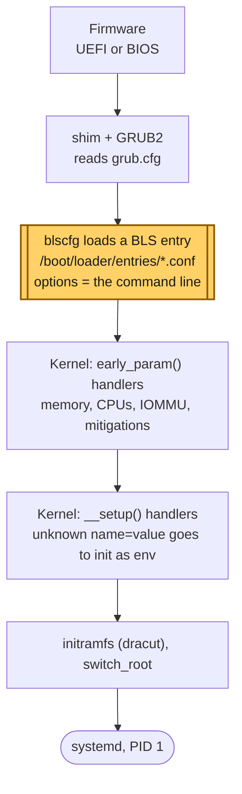
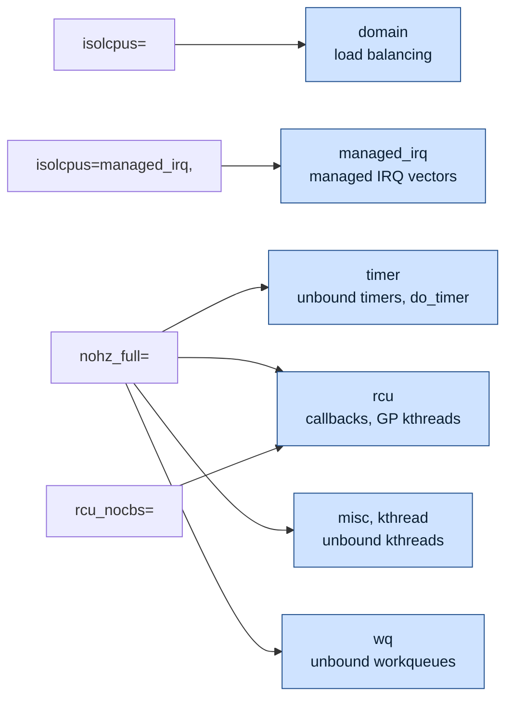

# Concept — The Boot Path and the Kernel Command Line

> Used by: [Guide 01](../guides/01-grub-bootloader-tuning.md). Related: [cpu-isolation](cpu-isolation.md), [huge-pages](huge-pages.md). Terms: [Glossary](../GLOSSARY.md).

## At a glance

- A few kernel decisions happen only once, at boot: scheduler domains, the tick, where RCU work runs, the idle driver, and the huge page sizes.
- On RHEL 8, 9 and 10 the arguments live in BootLoaderSpec entries, one per kernel, and `grubby` is the tool that edits them.
- `isolcpus`, `nohz_full` and `rcu_nocbs` each move a different kind of work to housekeeping CPUs, so they are used together with the same CPU list.

## 1. Why it matters

A handful of kernel decisions can only be made **once**, while the kernel initializes: how the scheduler groups CPUs, which CPUs run the timekeeping duty, where RCU callbacks run, which idle driver is registered, and which huge page sizes exist. The kernel command line is the only way to influence them. Getting it right is the foundation for every other latency setting. Getting it wrong can mean a host that does not boot, or one that boots and silently ignores what you asked for.

## 2. From power-on to `/proc/cmdline` (RHEL 8, 9 and 10)



*The command line is the `options` line of a BLS entry. GRUB hands it to the kernel, which parses the early parameters (`early_param()` handlers) before anything else runs, then the rest (`__setup()` handlers), and passes anything it does not recognize to init.*

<details>
<summary><b>The same path as text</b>, with a sample BLS entry</summary>

```text
Firmware (UEFI or BIOS)
  └─► shim + GRUB2 (/boot/efi/EFI/redhat/ or MBR)
        └─► reads grub.cfg ─► "blscfg" command loads BootLoaderSpec entries
              /boot/loader/entries/<machine-id>-<kernel-version>.conf
                title   Red Hat Enterprise Linux (5.14.0-...)
                linux   /vmlinuz-5.14.0-...
                initrd  /initramfs-5.14.0-....img
                options root=/dev/mapper/rhel-root ro ... isolcpus=3,5,7 nohz_full=3,5,7 ...
        └─► loads kernel + initramfs, passes "options" as the command line
  └─► kernel: early_param() handlers run during setup_arch() (very early: memory, CPUs, IOMMU)
              __setup() handlers run later during start_kernel()
              anything unrecognized with "=" becomes an environment variable for init,
              anything unrecognized without "=" becomes an argument to init
  └─► initramfs (dracut) ─► switch_root ─► systemd (PID 1)
```

</details>

Three details matter in practice:

1. **BLS entries hold the arguments per kernel.** On RHEL 8 the `options` line often contains `$kernelopts`, a variable stored in `/boot/grub2/grubenv`. On RHEL 9 the arguments are written into each entry. `grubby` knows both layouts, which is why it is the supported tool. Editing `/etc/default/grub` alone changes neither.
2. **New kernels inherit the default entry's arguments.** `kernel-install` (run by `dnf` when a kernel is installed) copies the arguments of the current default entry, or `/etc/kernel/cmdline` if it exists. After a kernel update, verify with `grubby --info=ALL` that the new entry carries your isolation arguments.
3. **Unknown parameters fail silently.** A typo like `isolcpu=3` does not produce an error. The kernel passes it to init as an environment variable. The only reliable check is to read the kernel's own view afterward: `/sys/devices/system/cpu/isolated`, `/sys/devices/system/cpu/nohz_full`, `/sys/kernel/mm/transparent_hugepage/enabled`.

## 3. The housekeeping model

Recent kernels organize CPU isolation around a **housekeeping mask**: the set of CPUs allowed to run kernel duties that could otherwise land anywhere. `isolcpus` and `nohz_full` remove CPUs from this mask for different *types* of work:

| Housekeeping type | Removed by | Work that moves to housekeeping CPUs |
|---|---|---|
| `domain` | `isolcpus=` (default flag) | Scheduler load balancing, so tasks are never migrated onto the CPU |
| `managed_irq` | `isolcpus=managed_irq,...` | Kernel-managed device IRQ vectors (best effort) |
| `timer` | `nohz_full=` | Unbound timers, and the global timekeeping duty (`do_timer`, which advances the kernel's clock) |
| `rcu` | `nohz_full=` / `rcu_nocbs=` | RCU callback processing (`rcuo*` kthreads) and the threads that track grace periods (GP kthreads) |
| `misc`, `kthread` | `nohz_full=` | Unbound kernel threads created at runtime (children of `kthreadd`, the parent of all kernel threads) |
| `wq` | `nohz_full=` (default unbound workqueue mask) | Unbound workqueue items. Refine with `/sys/devices/virtual/workqueue/cpumask`. |



*Each parameter removes the isolated CPUs from one or more housekeeping types. `nohz_full` covers most of them, `isolcpus` covers load balancing, and only together do they leave the CPU quiet.*

This is why the parameters are used **together** and with the **same CPU list**. Each one removes a different class of work, and none of them alone produces a quiet CPU.


*The housekeeping model on one CPU: each argument takes one kind of work away, until only the thread is left.*

> **Picture it.** The housekeeping mask is a list of the staff allowed to do chores. Each argument crosses the isolated CPUs off one list: `isolcpus` off "take new tasks", `nohz_full` off "keep the clock" and "clean up after RCU".

## 4. How the main parameters work

### `isolcpus=<list>`

At boot, the scheduler builds *scheduling domains*, a hierarchy (SMT siblings → cores sharing L2 → socket/LLC → NUMA) over which it balances load. CPUs in `isolcpus` are placed in no domain (each is effectively its own). Consequences:

- no task is ever *pulled* or *pushed* onto them by load balancing;
- a task lands there only if its affinity mask lets it and it is *placed* there (fork/exec/wakeup on that CPU, or an explicit `sched_setaffinity`);
- a task whose mask spans several isolated CPUs **stays on the first one**, because nothing balances them.

It does not move per-CPU kernel threads, and it does not change interrupt routing.

### `nohz_full=<list>` (adaptive ticks)

Normally every CPU takes a periodic timer interrupt (`CONFIG_HZ`, 1000 on RHEL) that accounts CPU time, runs the scheduler tick, expires timers, and advances RCU. With `nohz_full`, when a CPU has **exactly one runnable task**, the tick is stopped:

- time accounting switches to context-tracking at kernel entry/exit instead of sampling at every tick;
- RCU treats the CPU as being in an extended quiescent state while it runs user code;
- a **residual 1 Hz tick** remains for scheduler statistics. On recent kernels it is offloaded to a housekeeping CPU through a workqueue, and on older ones it still hits the CPU once per second.

The cost: every user↔kernel transition on a `nohz_full` CPU is slightly more expensive (context tracking). A thread that makes many syscalls gets *slower*. The design assumes the isolated thread stays in user space: spinning on memory, a ring buffer, or a kernel-bypass NIC queue.

### `rcu_nocbs=<list>` and `rcu_nocb_poll`

RCU (Read-Copy-Update) lets readers run without locks; writers defer freeing old data until every CPU has passed a quiescent state, then run **callbacks**. By default those callbacks run in softirq context on the CPU that queued them, in batches that take from tens of µs to milliseconds ([interrupts §5](interrupts-and-deferred-work.md#5-rcu-freeing-memory-later-safely)). `rcu_nocbs` offloads callback execution for the listed CPUs to `rcuo<type>/<cpu>` kthreads, which the scheduler keeps on housekeeping CPUs. `rcu_nocb_poll` makes those kthreads poll periodically instead of being woken by the isolated CPU, which removes a wake-up IPI. It is a boolean flag and takes no value.

### `idle=poll`, `processor.max_cstate`, `intel_idle.max_cstate`

When a CPU has nothing to run, the idle loop picks a C-state, and the next interrupt pays the exit: ~1–2 µs from C1, ~100 µs from core C6, more from a package C-state. [Power and frequency §2](power-and-frequency.md#2-idle-c-states) explains the states. `idle=poll` replaces the idle loop with a spin, so the CPU never enters any C-state. The two `max_cstate` parameters cap the idle drivers in case polling is ever turned off.

### `transparent_hugepage=never`, `default_hugepagesz`, `hugepagesz`

These configure the memory subsystem before any allocation happens. THP is disabled, the size of explicit huge pages is registered, and the default size is set for `MAP_HUGETLB` without a size flag and for hugetlbfs mounts without `pagesize=`. See [huge-pages.md](huge-pages.md).

### Mitigation switches (`pti=off`, `nospectre_v2`, `mds=off`, ...)

They are read in `setup_arch()`, and the kernel **patches its own code** at boot (the "alternatives" mechanism) to include or exclude barriers, retpolines (safe indirect jumps), `VERW` CPU-buffer clears, and page-table switches on every kernel entry/exit. Once patched, they cannot be changed at runtime. This is why the choice belongs on the command line, and why it affects every syscall and interrupt.

## 5. Numbers to remember

Typical orders of magnitude, not measurements.

| Parameter group | Removes | Order of magnitude |
|---|---|---|
| `nohz_full` | 1000 tick interrupts/s | 1–5 µs each |
| `rcu_nocbs` | RCU callback batches in softirq | tens of µs to ms, occasionally |
| `isolcpus` + systemd affinity | other tasks' time slices | ms |
| `idle=poll` / C-state caps | wake-up latency after idle | 1–100 µs per wake-up |
| `nosoftlockup`, `nmi_watchdog=0` | watchdog hrtimer + NMI | µs, periodic |
| `pti=off` etc. | per-syscall/per-IRQ mitigation overhead | 0.1–several µs per transition |
| `transparent_hugepage=never` | compaction stalls, `khugepaged` | up to ms |

## 6. How it shows up

| Symptom | Mechanism | Where it is told |
|---|---|---|
| `isolcpus` set, latency unchanged | The threads were never pinned, or a range mask stacked them on the first isolated CPU | [Use case 02](../examples/use-cases/02-critical-and-non-critical.md) |
| A comb of spikes, 1 ms apart, on an isolated CPU | `nohz_full` missing, or a second runnable task keeps the tick on | [Use case 01](../examples/use-cases/01-the-quiet-core.md) |
| Isolation gone after a kernel update | The new BLS entry did not inherit the arguments | [Guide 11 §3](../guides/11-day2-operations.md#3-kernel-updates) |
| Interfaces renamed after tuning | `biosdevname` changed on the command line; udev names the NICs from it | [Guide 01 §5.7](../guides/01-grub-bootloader-tuning.md#57-miscellaneous) |
| A security scan flags the host | Mitigations are off. Expected, and documented as an exception for that host class | [Guide 01 §5.6](../guides/01-grub-bootloader-tuning.md#56-iommu-and-cpu-vulnerability-mitigations-security-sensitive) |

## 7. Myths

- **"A typo in an argument gives a boot error."** The kernel passes unknown parameters to init and says nothing. Read `/sys` afterward.
- **"Editing `/etc/default/grub` changes the next boot."** On BLS systems it only affects kernels installed later. `grubby` edits the entries that boot.
- **"`isolcpus` alone makes a CPU quiet."** It only stops load balancing. The tick, RCU callbacks, interrupts and per-CPU kernel threads need their own settings.
- **"`nohz_full` makes every thread faster."** It makes each kernel entry slightly slower. It pays off only for a thread that stays in user space.

## 8. See it on your host

Read-only:

```bash
cat /proc/cmdline                                       # what the running kernel got
grubby --info=ALL | grep -E '^(kernel|args)='           # what each entry will boot with
cat /sys/devices/system/cpu/isolated                    # the kernel's view of isolcpus
cat /sys/devices/system/cpu/nohz_full                   # and of nohz_full
ps -eLo psr,comm | awk '$2 ~ /^rcuo/' | sort -n | uniq -c   # rcuo threads, and the CPUs they run on
journalctl -k -b | grep -i 'unknown kernel command line'   # newer kernels log unknown names here
```

## 9. Illustrative scenario

An illustrative case, not a measurement. A host was tuned, measured and signed off. Three weeks later its p99.9 was four times higher, and nothing in the change log explained it. `cat /sys/devices/system/cpu/isolated` was empty. A security update had installed a new kernel, and the host had a custom `/etc/kernel/cmdline` from its installation, so the new entry was created from that file without the isolation arguments. Running `grubby --update-kernel=ALL` with the arguments and rebooting restored the latency, and the verification timer of [Guide 11](../guides/11-day2-operations.md) now catches the next one within minutes of the reboot.

## 10. Key takeaways

- Arguments live per kernel in BLS entries. Use `grubby`, and check new kernels after every update.
- Unknown parameters fail silently. Always read the kernel's own view in `/sys` after the reboot.
- The housekeeping model explains why `isolcpus`, `nohz_full` and `rcu_nocbs` go together, with the same CPU list.
- `nohz_full` makes syscalls slightly more expensive. The isolated thread should stay in user space.
- Mitigation switches patch kernel code at boot, which is why they cannot change at runtime.

## 11. References

- <https://docs.kernel.org/admin-guide/kernel-parameters.html>
- <https://docs.kernel.org/timers/no_hz.html>
- <https://docs.kernel.org/RCU/whatisRCU.html>
- BootLoaderSpec: <https://uapi-group.org/specifications/specs/boot_loader_specification/>
- `man 8 grubby`, `man 8 kernel-install`
- Frederic Weisbecker, "NO_HZ: Reducing Scheduling-Clock Ticks" (kernel docs) and the LWN series on housekeeping and CPU isolation
