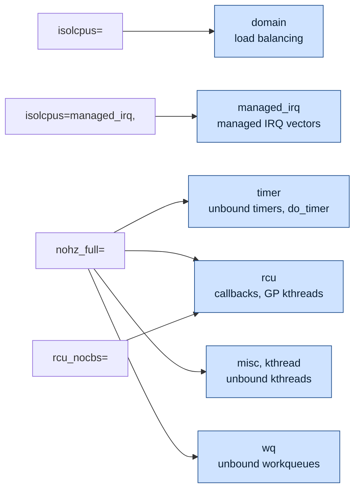
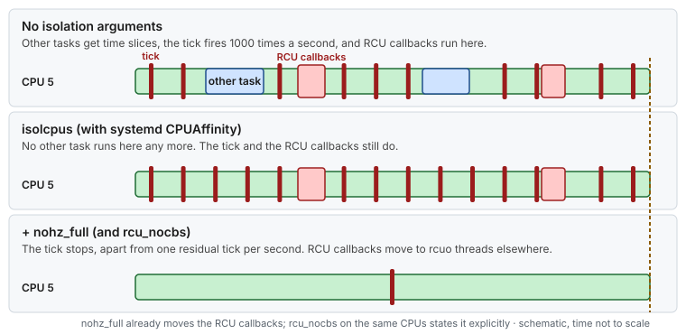

# Concept — The Boot Path and the Kernel Command Line

> Used by: [Guide 01](../guides/01-grub-bootloader-tuning.md). Related: [cpu-isolation](cpu-isolation.md), [huge-pages](huge-pages.md). Terms: [Glossary](../GLOSSARY.md).

## At a glance

- A few kernel decisions happen only once, at boot: scheduler domains, the tick, where RCU work runs, the idle driver, and the huge page sizes.
- On RHEL 8, 9 and 10 the arguments live in BootLoaderSpec entries, one per kernel, and `grubby` is the tool that edits them.
- `isolcpus`, `nohz_full` and `rcu_nocbs` each move a different kind of work to housekeeping CPUs, so they are used together with the same CPU list.

## 1. Why it matters

A handful of kernel decisions can only be made **once**, while the kernel initializes: how the scheduler groups CPUs, which CPUs run the timekeeping duty, where RCU callbacks run, which idle driver is registered, and which huge page sizes exist. The kernel command line is the only way to influence them. Getting it right is the foundation for every other latency setting. Getting it wrong can mean a host that does not boot, or one that boots and silently ignores what you asked for.

## 2. From power-on to `/proc/cmdline` (RHEL 8, 9 and 10)


*The command line is the `options` line of a BLS entry. GRUB hands it to the kernel, which parses the early parameters (`early_param()` handlers) before anything else runs, then the rest (`__setup()` handlers), and passes anything it does not recognize to init.*

<details>
<summary><b>The same path as text</b>, with a sample BLS entry</summary>

```text
Firmware (UEFI or BIOS)
  └─► shim + GRUB2 (/boot/efi/EFI/redhat/ or MBR)
        └─► reads grub.cfg ─► "blscfg" command loads BootLoaderSpec entries
              /boot/loader/entries/<machine-id>-<kernel-version>.conf
                title   Red Hat Enterprise Linux (5.14.0-...)
                linux   /vmlinuz-5.14.0-...
                initrd  /initramfs-5.14.0-....img
                options root=/dev/mapper/rhel-root ro ... isolcpus=3,5,7 nohz_full=3,5,7 ...
        └─► loads kernel + initramfs, passes "options" as the command line
  └─► kernel: early_param() handlers run during setup_arch() (very early: memory, CPUs, IOMMU)
              __setup() handlers run later during start_kernel()
              anything unrecognized with "=" becomes an environment variable for init,
              anything unrecognized without "=" becomes an argument to init
  └─► initramfs (dracut) ─► switch_root ─► systemd (PID 1)
```

</details>

Three details matter in practice:

1. **BLS entries hold the arguments per kernel.** On RHEL 8 the `options` line often contains `$kernelopts`, a variable stored in `/boot/grub2/grubenv`. On RHEL 9 the arguments are written into each entry. `grubby` knows both layouts, which is why it is the supported tool. Editing `/etc/default/grub` alone changes neither.
2. **New kernels inherit the default entry's arguments.** `kernel-install` (run by `dnf` when a kernel is installed) copies the arguments of the current default entry, or `/etc/kernel/cmdline` if it exists. After a kernel update, verify with `grubby --info=ALL` that the new entry carries your isolation arguments.
3. **Unknown parameters fail silently.** A typo like `isolcpu=3` does not produce an error. The kernel passes it to init as an environment variable. The only reliable check is to read the kernel's own view afterward: `/sys/devices/system/cpu/isolated`, `/sys/devices/system/cpu/nohz_full`, `/sys/kernel/mm/transparent_hugepage/enabled`.

## 3. The housekeeping model

Recent kernels organize CPU isolation around a **housekeeping mask**: the set of CPUs allowed to run kernel duties that could otherwise land anywhere. `isolcpus` and `nohz_full` remove CPUs from this mask for different *types* of work:

| Housekeeping type | Removed by | Work that moves to housekeeping CPUs |
|---|---|---|
| `domain` | `isolcpus=` (default flag) | Scheduler load balancing, so tasks are never migrated onto the CPU |
| `managed_irq` | `isolcpus=managed_irq,...` | Kernel-managed device IRQ vectors (best effort) |
| `timer` | `nohz_full=` | Unbound timers, and the global timekeeping duty (`do_timer`, which advances the kernel's clock) |
| `rcu` | `nohz_full=` / `rcu_nocbs=` | RCU callback processing (`rcuo*` kthreads) and the threads that track grace periods (GP kthreads) |
| `misc`, `kthread` | `nohz_full=` | Unbound kernel threads created at runtime (children of `kthreadd`, the parent of all kernel threads) |
| `wq` | `nohz_full=` (default unbound workqueue mask) | Unbound workqueue items. Refine with `/sys/devices/virtual/workqueue/cpumask`. |



*Each parameter removes the isolated CPUs from one or more housekeeping types. `nohz_full` covers most of them, `isolcpus` covers load balancing, and only together do they leave the CPU quiet.*

This is why the parameters are used **together** and with the **same CPU list**. Each one removes a different class of work, and none of them alone produces a quiet CPU.



*The housekeeping model on one CPU: each argument takes one kind of work away, until only the thread is left.*

> **Picture it.** The housekeeping mask is a list of the staff allowed to do chores. Each argument crosses the isolated CPUs off one list: `isolcpus` off "take new tasks", `nohz_full` off "keep the clock" and "clean up after RCU".

## 4. How the main parameters work

### `isolcpus=<list>`

At boot, the scheduler builds *scheduling domains*, a hierarchy (SMT siblings → cores sharing L2 → socket/LLC → NUMA) over which it balances load. CPUs in `isolcpus` are placed in no domain (each is effectively its own). Consequences:

- no task is ever *pulled* or *pushed* onto them by load balancing;
- a task lands there only if its affinity mask lets it and it is *placed* there (fork/exec/wakeup on that CPU, or an explicit `sched_setaffinity`);
- a task whose mask spans several isolated CPUs **stays on the first one**, because nothing balances them.

It does not move per-CPU kernel threads, and it does not change interrupt routing.

#### Keep or change `isolcpus`?

Load balancing is how the scheduler uses every CPU: a busy CPU hands tasks to an idle one. `isolcpus` switches that off for the listed CPUs, so they stay quiet, and so they stay empty unless you place a thread there yourself. The CPUs are reserved at boot, and changing the list needs a reboot.

| Your situation | Verdict | Why |
|---|---|---|
| A few threads, each pinned by you to its own CPU, and the rest of the host is busy | **change** (use `isolcpus`) | Nothing else may land on those CPUs, even by mistake |
| Pinning is done by a service manager or cpuset (`AllowedCPUs`, cpuset partitions), and nothing else runs on the host | **measure first** | A runtime fence may be enough, and it changes without a reboot ([Guide 05](../guides/05-cgroup-isolation.md)) |
| A thread pool that should spread over many CPUs | **keep** (do not isolate them) | A task whose mask spans several isolated CPUs stays on the first one |
| You cannot reboot, or you do not own the boot arguments | **ask the owner** | Use the runtime fence until a maintenance window |

> [!NOTE]
> **Validate on your hardware.** This repository does not measure a runtime fence against `isolcpus`. Treat the "measure first" row as an open question until you have run both.

To decide with data, put the same pinned workload under each setup and compare the tail latency, with the baseline protocol in [Guide 09](../guides/09-measuring-latency.md). Also list what else runs on the CPU (`ps -eLo psr,comm | awk '$1==5'`, for CPU 5): a runtime fence needs the list to be empty too.

### `nohz_full=<list>` (adaptive ticks)

Normally every CPU takes a periodic timer interrupt (`CONFIG_HZ`, 1000 on RHEL) that accounts CPU time, runs the scheduler tick, expires timers, and advances RCU. With `nohz_full`, when a CPU has **exactly one runnable task**, the tick is stopped:

- time accounting switches to context-tracking at kernel entry/exit instead of sampling at every tick;
- RCU treats the CPU as being in an extended quiescent state while it runs user code;
- a **residual 1 Hz tick** remains for scheduler statistics. On recent kernels it is offloaded to a housekeeping CPU through a workqueue, and on older ones it still hits the CPU once per second.

The cost: every user↔kernel transition on a `nohz_full` CPU is slightly more expensive (context tracking). A thread that makes many syscalls gets *slower*. The design assumes the isolated thread stays in user space: spinning on memory, a ring buffer, or a kernel-bypass NIC queue.

#### Keep or stop the tick?

The tick is not waste. It is how the kernel keeps order on a CPU that is shared. Stopping it trades that service for quiet, and the trade only pays when the CPU is not shared.

What each tick job is worth, and what you lose when you stop it:

| Tick job | Why a shared CPU needs it | On a CPU with one thread |
|---|---|---|
| Time-slice check | Takes the CPU from a thread that ran too long, so the others get a turn | Nothing else to give the CPU to |
| CPU-time accounting | Feeds `top`, `/proc/stat` and cgroup limits | Replaced by context tracking, at a cost on every syscall |
| Timer expiry | Fires coarse timeouts at about 1 ms resolution | Stopping the tick does not remove timers: a timer that the thread arms on its own CPU still interrupts it when it fires ([Interrupts §6](interrupts-and-deferred-work.md#6-workqueues-and-timers)) |
| RCU progress | Tells RCU the CPU is idle of readers | `rcu_nocbs` and the extended quiescent state cover it |

The benefit is the 1–5 µs stall, 1000 times a second. That is 0.1–0.5 % of the CPU, a small average, but the stall lands on the thread you care about, right in its tail (p99.9 and beyond, see [Guide 09](../guides/09-measuring-latency.md)).

The cost is context tracking at every kernel entry and exit. When a second runnable task appears, the tick starts again, so time slices and accounting work as usual. Nothing is starved, but `nohz_full` then gives you no quiet CPU while you still pay the context-tracking cost.

> [!NOTE]
> **Validate on your hardware.** How much a syscall slows down under context tracking depends on the CPU, the kernel and the mitigations. Measure your own workload with and without `nohz_full` before you rely on either number.

| Your isolated thread... | Tick | Why |
|---|---|---|
| spins in user space on memory, a ring buffer or a kernel-bypass queue, alone on its CPU | stop it (`nohz_full`) | No syscalls to slow down, and the tick is the main periodic interruption left |
| makes frequent syscalls (sockets through the kernel stack, `epoll`, file I/O) | keep it, or measure first | Context tracking taxes every transition, and that can cost more than the tick |
| shares its CPU with another runnable thread | keep it | The tick returns anyway, and you lose accounting and fairness for nothing |
| is on a CPU whose tail latency you have not measured yet | keep it for now | Take a baseline first, then change one thing ([Guide 09](../guides/09-measuring-latency.md)) |
| runs in a VM | check with the platform owner | The hypervisor's own timers and steal time can hide the gain |

To decide with data, read the `LOC` row of `/proc/interrupts` on the CPU for ten seconds. `LOC` counts every local timer interrupt, not only the scheduler tick, so read it only on a thread that arms no timers, such as a pure spinner. There, near 1000 per second means the tick runs and about 1 per second means it stopped. A thread that sleeps with a timeout, or that has a 1 kHz application timer, adds its own `LOC` counts and can look like a running tick. For that thread, trace the interrupt source instead: record the `irq_vectors:local_timer_entry` tracepoint on that CPU with `perf` or `trace-cmd` and look at what runs after each one. Then compare the tail latency of your thread in both cases.

### `rcu_nocbs=<list>` and `rcu_nocb_poll`

RCU (Read-Copy-Update) lets readers run without locks; writers defer freeing old data until every CPU has passed a quiescent state, then run **callbacks**. By default those callbacks run in softirq context on the CPU that queued them, in batches that take from tens of µs to milliseconds ([interrupts §5](interrupts-and-deferred-work.md#5-rcu-freeing-memory-later-safely)). `rcu_nocbs` offloads callback execution for the listed CPUs to `rcuo<type>/<cpu>` kthreads, which the scheduler keeps on housekeeping CPUs. `rcu_nocb_poll` makes those kthreads poll periodically instead of being woken by the isolated CPU, which removes a wake-up IPI. It is a boolean flag and takes no value.

#### Keep or change `rcu_nocbs` and `rcu_nocb_poll`?

The default runs RCU callbacks on the CPU that queued them. That is cheap and fair on a shared CPU, and it is a source of bursts of tens of µs to milliseconds on a CPU that runs one critical thread. `rcu_nocbs` moves the work to kernel threads on housekeeping CPUs. Those threads now compete with your housekeeping work, so a housekeeping set that is too small slows the cleanup instead.

| Your situation | Verdict | Why |
|---|---|---|
| The CPU runs one critical thread and `nohz_full` is on | **keep** (list the same CPUs) | `nohz_full` offloads the callbacks anyway, and `rcu_nocbs` says so explicitly |
| The CPU is shared, or you do not use `nohz_full` | **keep the default** | There is no burst to remove, and the housekeeping CPUs pay for the move |
| You have very few housekeeping CPUs | **measure first** | The `rcuo*` threads need CPU time there |
| Isolated CPUs go idle between bursts | **measure first** for `rcu_nocb_poll` | The poll removes a wake-up IPI from the isolated CPU, and costs a periodic wake-up on the housekeeping side |

To decide with data, check that the `rcuo*` threads sit on housekeeping CPUs (`ps -eLo psr,comm | grep rcuo`), then compare the p99.9 of the critical thread with and without the setting, as in [Guide 09](../guides/09-measuring-latency.md).

### `idle=poll`, `processor.max_cstate`, `intel_idle.max_cstate`

When a CPU has nothing to run, the idle loop picks a C-state, and the next interrupt pays the exit: ~1–2 µs from C1, ~100 µs from core C6, more from a package C-state. [Power and frequency §2](power-and-frequency.md#2-idle-c-states) explains the states. `idle=poll` replaces the idle loop with a spin, so the CPU never enters any C-state. The two `max_cstate` parameters cap the idle drivers in case polling is ever turned off.

#### Keep or change `idle=poll`?

Idle states save power and leave thermal room for the busy CPUs. `idle=poll` gives that up completely: every CPU runs at 100 % all the time, so power and heat rise, and on some parts the extra heat lowers the turbo headroom. With Hyper-Threading, a polling sibling competes with the busy thread. In a VM, the guest burns host CPU even when it is idle.

There are three ways to bound the wake-up delay, from strongest to lightest: `idle=poll`, a cap such as `processor.max_cstate=1`, and a PM QoS request held by the application at run time ([Power and frequency §2](power-and-frequency.md#2-idle-c-states)).

| Your situation | Verdict | Why |
|---|---|---|
| Messages arrive at random, gaps between them are long, and the first message must be fast | **change** (`idle=poll`, or a deep cap) | A wake-up from a deep C-state costs up to about 100 µs |
| The thread already spins, so its CPU never goes idle | **keep** the default for that CPU | The idle loop is not used, and polling adds nothing |
| Traffic is steady, and a shallow state (C1) is fast enough | **measure first** (cap plus PM QoS) | You keep most of the power saving and bound the exit to about 1-2 µs |
| The host is a VM, or shares power or heat with other tenants | **ask the owner** | The cost lands on the hypervisor and on the neighbors |
| Power or thermal budget is capped | **keep** | Polling leaves no headroom to turbo |

> [!NOTE]
> **Validate on your hardware.** Exit latencies and the turbo cost differ by CPU model and by BIOS setting. Measure both before you choose.

To decide with data, compare the three setups with `cyclictest` and `turbostat` ([Power and frequency §9](power-and-frequency.md#9-reading-the-cpus-power-state)): the wake-up tail on one side, the package power and clock on the other.

### `transparent_hugepage=never`, `default_hugepagesz`, `hugepagesz`

These configure the memory subsystem before any allocation happens. THP is disabled, the size of explicit huge pages is registered, and the default size is set for `MAP_HUGETLB` without a size flag and for hugetlbfs mounts without `pagesize=`. See [huge-pages.md](huge-pages.md).

#### Keep or change THP?

Transparent huge pages give an application bigger pages with no change to the application. The price is that the kernel may stop an allocation to compact memory or may copy pages in the background (`khugepaged`), and either can stall a thread for up to milliseconds. `never` removes the stalls and the benefit with them, and a latency-critical process then gets its huge pages from the explicit pool ([Guide 03](../guides/03-huge-pages-configuration.md)).

| Your situation | Verdict | Why |
|---|---|---|
| A latency JVM or a process with a fixed, pre-touched heap | **change** (`never`, plus explicit huge pages) | The pool is reserved at boot, so no compaction can stall it |
| A mixed host where other processes gain from THP, and the critical one does not use it | **measure first** (`madvise`) | Only processes that ask get THP, so the critical one is left alone |
| The host is memory-tight | **ask the owner** | The explicit pool is reserved for good, and small hosts may not have room |
| The critical process cannot ask for huge pages (no `MAP_HUGETLB`, no hugetlbfs) | **measure first** | `never` takes THP away and gives nothing back |

To decide with data, read the counters before and after a run (`grep -E 'thp_fault_alloc|compact_stall' /proc/vmstat`) and the mode in `/sys/kernel/mm/transparent_hugepage/enabled`. A growing `compact_stall` while the critical thread allocates points to THP as the cause.

### Mitigation switches (`pti=off`, `nospectre_v2`, `mds=off`, ...)

They are read in `setup_arch()`, and the kernel **patches its own code** at boot (the "alternatives" mechanism) to include or exclude barriers, retpolines (safe indirect jumps), `VERW` CPU-buffer clears, and page-table switches on every kernel entry/exit. Once patched, they cannot be changed at runtime. This is why the choice belongs on the command line, and why it affects every syscall and interrupt.

#### Keep or change the mitigations?

This one is a security decision first and a latency decision second, so it is not made on this page. The ordered way to decide (cross the kernel less, measure, then opt out with sign-off) is in [Security mitigations §4](security-mitigations.md#4-where-the-cost-lands-crossings). The short rule: if the hot path makes no syscalls and takes no interrupts, switching the mitigations off gains nothing, and **keep** is the answer.

## 5. Numbers to remember

Typical orders of magnitude, not measurements.

> [!NOTE]
> **Validate on your hardware.** These values depend on the CPU, the NIC, the driver and the kernel. Measure the ones you rely on.

| Parameter group | Removes | Order of magnitude |
|---|---|---|
| `nohz_full` | 1000 tick interrupts/s | 1–5 µs each |
| `rcu_nocbs` | RCU callback batches in softirq | tens of µs to ms, occasionally |
| `isolcpus` + systemd affinity | other tasks' time slices | ms |
| `idle=poll` / C-state caps | wake-up latency after idle | 1–100 µs per wake-up |
| `nosoftlockup`, `nmi_watchdog=0` | watchdog hrtimer + NMI | µs, periodic |
| `pti=off` etc. | per-syscall/per-IRQ mitigation overhead | 0.1–several µs per transition |
| `transparent_hugepage=never` | compaction stalls, `khugepaged` | up to ms |

## 6. How it shows up

| Symptom | Mechanism | Where it is told |
|---|---|---|
| `isolcpus` set, latency unchanged | The threads were never pinned, or a range mask stacked them on the first isolated CPU | [Use case 02](../examples/use-cases/02-critical-and-non-critical.md) |
| A comb of spikes, 1 ms apart, on an isolated CPU | `nohz_full` missing, or a second runnable task keeps the tick on | [Use case 01](../examples/use-cases/01-the-quiet-core.md) |
| Isolation gone after a kernel update | The new BLS entry did not inherit the arguments | [Guide 11 §3](../guides/11-day2-operations.md#3-kernel-updates) |
| Interfaces renamed after tuning | `biosdevname` changed on the command line; udev names the NICs from it | [Guide 01 §5.7](../guides/01-grub-bootloader-tuning.md#57-miscellaneous) |
| A security scan flags the host | Mitigations are off. Expected, and documented as an exception for that host class | [Guide 01 §5.6](../guides/01-grub-bootloader-tuning.md#56-iommu-and-cpu-vulnerability-mitigations-security-sensitive) |

## 7. Myths

- **"A typo in an argument gives a boot error."** The kernel passes unknown parameters to init and says nothing. Read `/sys` afterward.
- **"Editing `/etc/default/grub` changes the next boot."** On BLS systems it only affects kernels installed later. `grubby` edits the entries that boot.
- **"`isolcpus` alone makes a CPU quiet."** It only stops load balancing. The tick, RCU callbacks, interrupts and per-CPU kernel threads need their own settings.
- **"`nohz_full` makes every thread faster."** It makes each kernel entry slightly slower. It pays off only for a thread that stays in user space.

## 8. See it on your host

Read-only:

```bash
cat /proc/cmdline                                       # what the running kernel got
grubby --info=ALL | grep -E '^(kernel|args)='           # what each entry will boot with
cat /sys/devices/system/cpu/isolated                    # the kernel's view of isolcpus
cat /sys/devices/system/cpu/nohz_full                   # and of nohz_full
ps -eLo psr,comm | awk '$2 ~ /^rcuo/' | sort -n | uniq -c   # rcuo threads, and the CPUs they run on
journalctl -k -b | grep -i 'unknown kernel command line'   # newer kernels log unknown names here
```

## 9. Illustrative scenario

An illustrative case, not a measurement. A host was tuned, measured and signed off. Three weeks later its p99.9 was four times higher, and nothing in the change log explained it. `cat /sys/devices/system/cpu/isolated` was empty. A security update had installed a new kernel, and the host had a custom `/etc/kernel/cmdline` from its installation, so the new entry was created from that file without the isolation arguments. Running `grubby --update-kernel=ALL` with the arguments and rebooting restored the latency, and the verification timer of [Guide 11](../guides/11-day2-operations.md) now catches the next one within minutes of the reboot.

## 10. Key takeaways

- Arguments live per kernel in BLS entries. Use `grubby`, and check new kernels after every update.
- Unknown parameters fail silently. Always read the kernel's own view in `/sys` after the reboot.
- The housekeeping model explains why `isolcpus`, `nohz_full` and `rcu_nocbs` go together, with the same CPU list.
- `nohz_full` makes syscalls slightly more expensive. The isolated thread should stay in user space.
- Mitigation switches patch kernel code at boot, which is why they cannot change at runtime.

## 11. References

- <https://docs.kernel.org/admin-guide/kernel-parameters.html>
- <https://docs.kernel.org/timers/no_hz.html>
- <https://docs.kernel.org/RCU/whatisRCU.html>
- BootLoaderSpec: <https://uapi-group.org/specifications/specs/boot_loader_specification/>
- `man 8 grubby`, `man 8 kernel-install`
- Frederic Weisbecker, "NO_HZ: Reducing Scheduling-Clock Ticks" (kernel docs) and the LWN series on housekeeping and CPU isolation
