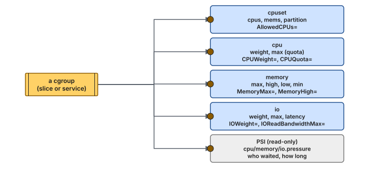
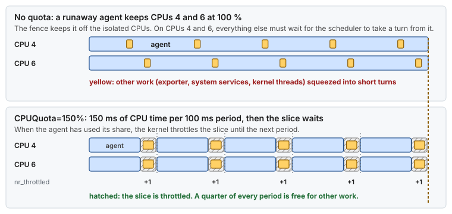

# Concept — cgroups v2 and systemd Resource Control

> Used by: [Guide 05](../guides/05-cgroup-isolation.md). Related: [cpu-isolation](cpu-isolation.md). Terms: [Glossary](../GLOSSARY.md).

## At a glance

- Affinity, nice and I/O priority are hints a process can change. cgroups are enforced by the kernel.
- Four controllers matter here: cpuset (where), cpu (how much time), memory (how much RAM), io (how much disk). PSI shows who is starved.
- systemd owns the tree. Slices group units, and resource directives on a unit become cgroup files.

## 1. Why it matters

Affinity (`sched_setaffinity`, systemd `CPUAffinity`) says where a process *prefers* to run, and any process can change its own. Nice values and I/O priorities are hints. **Control groups** are enforced by the kernel: a process in a cgroup cannot leave its cpuset, cannot exceed its memory cap without being reclaimed or OOM-killed, and cannot take more CPU time or I/O than its limits allow. On a latency-critical host that is what keeps third-party software from affecting the CPUs, memory, and disks the critical path depends on.

## 2. v1 vs v2

**cgroup v1** (RHEL 7/8 default) has a separate hierarchy per controller (`/sys/fs/cgroup/cpu,cpuacct/`, `/sys/fs/cgroup/memory/`, ...). A process can sit in different places in each tree. The semantics differ between controllers, and some combinations (memory + blkio writeback) never worked properly.

**cgroup v2** (RHEL 9 default, and available on RHEL 8 with `systemd.unified_cgroup_hierarchy=1`) has **one tree**. A process belongs to exactly one cgroup, and controllers are enabled per subtree (`cgroup.subtree_control`). Processes live only in leaf cgroups ("no internal processes" rule). It adds pressure stall information (PSI), proper writeback accounting, `memory.high`, and the cpuset partition feature.

> **Picture it.** v1 is a building with a separate floor plan for each service: one for heating, one for electricity, one for keys, and a person can be in a different room on each plan. v2 has one floor plan, and every rule applies to the room you are in.

```bash
stat -fc %T /sys/fs/cgroup     # cgroup2fs → v2
cat /sys/fs/cgroup/cgroup.controllers
```

## 3. The controllers that matter here



*Each controller exposes a few files in the cgroup directory. systemd sets them through the resource directives shown on the second line of each box. PSI is read-only: it reports stalls instead of enforcing anything.*

### cpuset

- `cpuset.cpus`: CPUs the group may use. The effective set is the intersection with the parent (`cpuset.cpus.effective`).
- `cpuset.mems`: NUMA nodes it may allocate memory from.
- **Interaction with affinity**: a task's `sched_setaffinity()` mask is always intersected with its cpuset. Asking for a CPU outside the cpuset fails with `EINVAL`. That is the fence, and it is also the trap described in [Guide 05 §4.4](../guides/05-cgroup-isolation.md#44-the-cpuset-trap).
- `cpuset.cpus.partition` (v2): `member` (default), `root` (the CPUs become an exclusive scheduling domain), and on newer kernels `isolated`, where the CPUs are removed from load balancing entirely: runtime `isolcpus`.


*Affinity versus a cpuset, on one host: the first two slices rely on an inherited mask a process can change, and housekeeping.slice is a fence the kernel enforces.*

### cpu

- `cpu.weight` (1–10000, default 100): proportional share under contention (`CPUWeight=`).
- `cpu.max` = `quota period` (for example `150000 100000` for 1.5 CPUs): a hard cap enforced by CFS bandwidth control (`CPUQuota=150%`). When a group exhausts its quota within a period, **all its threads are throttled until the next period**. That is the right outcome for agents, and a disaster if it ever applies to the latency-critical application. Never put a quota on it.
- `cpu.stat`: `nr_throttled`, `throttled_usec` show whether the quota is reached.



*A quota is counted per period: once the group has used its CPU time, every thread in it waits for the next period. That is fine for agents, and exactly what a latency-critical thread must never meet.*

### memory

- `memory.max`: hard limit. Beyond it the kernel reclaims within the group, and then OOM-kills **inside the group** (`MemoryMax=`).
- `memory.high`: soft limit. Beyond it, allocations are slowed and reclaim is aggressive (`MemoryHigh=`).
- `memory.low` / `memory.min`: protection. Memory below them is not reclaimed for the benefit of others (`MemoryLow=`, `MemoryMin=`). This is useful for the application's page cache (for example its journal files).
- `memory.swap.max`: swap limit (`MemorySwapMax=`).
- Page cache is **charged** to the cgroup that caused it, so a log shipper's reads count against *its* limit and not the application's.

### io

- `io.weight` (1–10000): proportional share with the BFQ scheduler, or cost-model based with `io.cost` (`IOWeight=`).
- `io.max`: absolute limits per device, `rbps`/`wbps`/`riops`/`wiops` (`IOReadBandwidthMax=`, `IOWriteIOPSMax=`, ...).
- `io.latency`: target latency protection for a group.

### PSI (pressure stall information)

`cpu.pressure`, `memory.pressure`, `io.pressure` in each cgroup (and `/proc/pressure/*` system-wide) report the share of time tasks were **stalled** waiting for that resource (`some` / `full`, over 10 s/60 s/300 s averages). It is an excellent signal for "is the housekeeping slice starved?" and "did the application ever wait for memory?".

## 4. How systemd maps onto cgroups

systemd owns the cgroup tree. Its unit types map to cgroups as follows:

| Unit type | cgroup | Example |
|---|---|---|
| `.slice` | an inner node that groups other units | `system.slice`, `user.slice`, `housekeeping.slice` |
| `.service` | a leaf with the service's processes | `/housekeeping.slice/node_exporter.service` |
| `.scope` | a leaf with externally started processes | `user-1000.slice/session-3.scope` (an SSH login) |

Resource directives (`man 5 systemd.resource-control`) can be set on slices and on services/scopes, and systemd writes the corresponding cgroup files. Changing them at runtime: `systemctl set-property <unit> CPUQuota=100%` (persistent unless `--runtime`).

Some directives are **not** cgroup-based: `CPUAffinity=`, `Nice=`, `IOSchedulingClass=`, `LimitRTPRIO=`. They are per-process attributes set when the service starts, so they are advisory and can be changed by the process. That difference is exactly why [Guide 05](../guides/05-cgroup-isolation.md) uses both: `AllowedCPUs=` (cgroup cpuset, enforced) on the slice, and `CPUAffinity=` (affinity, works on v1 too) in each unit's drop-in.

## 5. Design patterns for a latency host

1. **Protect the critical application by removing limits, not adding them.** Give it its own slice with every CPU allowed, no quota, and optionally `MemoryMin=` for its page cache and a high `IOWeight`.
2. **Confine everything that is not critical.** Put agents and batch work in a slice with a cpuset on specific housekeeping CPUs (not the IRQ CPUs), a quota, a memory cap, and a low I/O weight.
3. **Leave the operators a way in.** Do not cap `sshd` or `user.slice` memory or CPU tightly. During an incident you need to log in and run tools.
4. **Monitor the fences.** Watch `cpu.stat` throttling, `memory.events` (`oom_kill`), and PSI per slice, and alert when an agent's slice is starved. That is often the first sign of a misbehaving agent.

## 6. Numbers to remember

Typical values, not measurements.

> [!NOTE]
> **Validate on your hardware.** These values depend on the CPU, the NIC, the driver and the kernel. Measure the ones you rely on.

| Quantity | Value |
|---|---|
| Default CPU quota period | 100 ms |
| `CPUQuota=150%` | 150 ms of CPU time per 100 ms period, shared by every thread of the group |
| Longest wait for a throttled thread | the rest of the period: up to 100 ms with the default period |
| `cpu.weight` default / range | 100 / 1–10000 |
| PSI averaging windows | 10 s, 60 s and 300 s |
| Cost of a cpuset fence at run time | none: it only narrows where the scheduler may place a task |

## 7. How it shows up

| Symptom | Mechanism | Where it is told |
|---|---|---|
| An agent spikes and the critical thread on another CPU does not notice | The cpuset fence works | [Use case 03](../examples/use-cases/03-the-noisy-neighbor.md) |
| Monitoring gaps during an agent burst | The slice is throttled (`nr_throttled` rises) | [Guide 05 §7](../guides/05-cgroup-isolation.md#7-troubleshooting) |
| The application cannot pin a thread: `sched_setaffinity` returns `EINVAL` | Its own slice has a cpuset without the isolated CPUs | [Guide 05 §4.4](../guides/05-cgroup-isolation.md#44-the-cpuset-trap) |
| An agent is OOM-killed and restarted, nothing else happens | `MemoryMax=` on its slice | [Use case 17](../examples/use-cases/17-memory-pressure-on-a-latency-host.md) |
| The journal's `fsync` slows while a shipper replays logs | No I/O weight on the shipper | §10 |

## 8. Myths

- **"`CPUAffinity=` and `AllowedCPUs=` are the same thing."** The first is a per-process default any process can change. The second is a cgroup fence the kernel enforces.
- **"A quota is a soft share."** `cpu.weight` is a share. `cpu.max` is a hard stop: the whole group waits until the next period.
- **"Page cache belongs to nobody."** It is charged to the cgroup that read or wrote it, so it counts against that group's `MemoryMax=`.
- **"Moving a process into a slice moves its memory."** Pages already charged stay where they are; new allocations are charged to the new group.

## 9. See it on your host

Read-only:

```bash
systemd-cgls --no-pager /housekeeping.slice                      # who is inside the fence
cat /sys/fs/cgroup/housekeeping.slice/cpuset.cpus.effective      # where it may run
cat /sys/fs/cgroup/housekeeping.slice/cpu.max                    # "150000 100000" = 1.5 CPUs
grep -E 'nr_periods|nr_throttled|throttled_usec' /sys/fs/cgroup/housekeeping.slice/cpu.stat
cat /sys/fs/cgroup/housekeeping.slice/memory.events              # oom, oom_kill
cat /sys/fs/cgroup/housekeeping.slice/cpu.pressure               # "some" = time someone waited for CPU
systemd-cgtop -d 2 --depth 2                                     # live CPU, memory and I/O per slice
```

## 10. Illustrative scenario

An illustrative case, not a measurement. After a network outage, a log shipper replayed 40 GB of backlog. It used 3 CPUs and 6 GB of page cache, pushed the application's journal out of the page cache, and delayed the journal's `fsync` calls behind its own I/O. With the shipper in `housekeeping.slice` (`CPUQuota=150%`, `MemoryMax=4G`, `IOWeight=50`), the replay takes longer, and the application does not notice it.

## 11. Key takeaways

- A cpuset is a fence: `sched_setaffinity()` outside it fails with `EINVAL`. Use that for agents, and never against the application.
- A CPU quota throttles every thread of the group until the next period. Never put one on the latency-critical application.
- Page cache is charged to the cgroup that caused it, so a noisy reader pays for its own cache.
- Protect the critical application by removing limits, confine everything else, and keep a way in for operators.
- Watch `cpu.stat`, `memory.events` and PSI per slice. A starved agent slice is often the first sign of trouble.

## 12. References

- <https://docs.kernel.org/admin-guide/cgroup-v2.html>
- `man 5 systemd.resource-control`, `man 5 systemd.slice`, `man 7 cpuset`
- <https://docs.kernel.org/accounting/psi.html>
- Red Hat — *Managing, monitoring, and updating the kernel*: "Using control groups version 2 with systemd"
