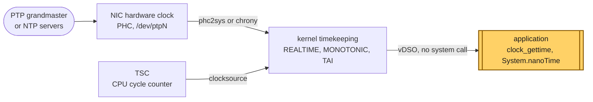

# Concept — Clocks and Time: TSC, Clock IDs, Steps, Slews and Timestamps

> Used by: [Guide 10](../guides/10-time-sync.md), [Guide 09 §3](../guides/09-measuring-latency.md#3-what-to-record). Related: [power and frequency](power-and-frequency.md), [network path](network-tuning.md). Example: [Java probe](../examples/java-latency-probe/). Terms: [Glossary](../GLOSSARY.md).

## At a glance

- Linux has one fast hardware counter (the TSC) and several clocks built on it. `CLOCK_MONOTONIC` is for durations. `CLOCK_REALTIME` is for "what time is it", and it can jump.
- Reading the clock costs tens of ns through the vDSO, but only while the clocksource is `tsc`. If the kernel falls back to HPET, every read costs about a microsecond.
- A latency across two hosts is only as good as the sync between their clocks. PTP with hardware timestamps gets below a microsecond; NTP does not.

## 1. Why it matters

Every latency number in these guides is the difference of two clock readings. If the clock is slow to read, the measurement adds its own cost to the hot path. If the clock jumps, a duration can come out negative or a timeout can fire early. If two hosts disagree on the time, a one-way latency between them is mostly the disagreement. [Guide 10](../guides/10-time-sync.md) sets up the time daemons. This page explains the clocks they discipline and which one to use for what.

## 2. From a crystal to `clock_gettime()`



*The TSC gives the kernel a fast, steady tick count. The time daemon steers the kernel's clocks toward the reference time. The application reads the result through the vDSO without entering the kernel.*

Two separate things happen:

- **Counting.** The kernel reads a hardware counter, the **clocksource**, and turns cycles into nanoseconds. On current x86 servers this is the [TSC](../GLOSSARY.md#tsc).
- **Steering.** A daemon (chrony, or `ptp4l` + `phc2sys`) compares the kernel's clock with a reference and corrects it, either by a small change of rate (**slew**) or by setting a new value (**step**).

## 3. The TSC and the clocksource

The TSC counts at a constant rate on modern CPUs. Three CPU flags in `/proc/cpuinfo` say how much you can trust it:

| Flag | Means |
|---|---|
| `constant_tsc` | The rate does not change with P-states or turbo. |
| `nonstop_tsc` | It keeps counting in deep C-states. |
| `tsc_known_freq` | The kernel knows the rate from the CPU, without measuring it at boot. |

Together, `constant_tsc` and `nonstop_tsc` are what Intel calls an **invariant TSC**. With it, the kernel uses `tsc` as the clocksource, and `clock_gettime()` reads it in user space through the [vDSO](../GLOSSARY.md#vdso), in about 20–40 ns, with no system call.

The kernel also runs a **clocksource watchdog**: it compares the TSC with another counter (HPET or ACPI PM) and, if they disagree too much, marks the TSC unstable and switches away from it. After that, every clock read goes to the slower counter, often through a system call. Look for this line in the kernel log:

```text
clocksource: timekeeping watchdog on CPU5: Marking clocksource 'tsc' as unstable because the skew is too large
```

A busy or stalled host can trigger a false alarm (an SMI that stops the watchdog CPU, for example). The `tsc=reliable` kernel argument turns the watchdog off for the TSC.

> [!NOTE]
> **Validate on your hardware.** `tsc=reliable` is common advice for latency hosts with an invariant TSC, but it is not in [Guide 01](../guides/01-grub-bootloader-tuning.md). Add it only after the watchdog has switched the clocksource on your hardware, and check `current_clocksource` after every reboot.

## 4. Which clock to read

| Clock | Jumps? | Slewed? | Use it for | Java |
|---|---|---|---|---|
| `CLOCK_REALTIME` | yes: steps, and leap seconds | yes | timestamps that leave the host: logs, events, audit | `System.currentTimeMillis()`, `Instant.now()` |
| `CLOCK_MONOTONIC` | never | yes | durations and timeouts on one host | `System.nanoTime()` |
| `CLOCK_MONOTONIC_RAW` | never | no: raw TSC rate | comparing against the hardware itself | — |
| `CLOCK_BOOTTIME` | never | yes | like MONOTONIC, but it counts suspend too | — |
| `CLOCK_TAI` | only when set | yes | timestamps without leap seconds (PTP runs on TAI) | — |
| `*_COARSE` | as their base clock | yes | cheap reads with tick resolution (1–4 ms) | — |

The rule is short: **measure durations with MONOTONIC, label events with REALTIME.** A duration taken from REALTIME is wrong whenever the daemon steps the clock between the two readings.

## 5. Step and slew


*A step moves REALTIME instantly, and any duration that spans it is wrong. MONOTONIC never jumps, and a slew changes its rate by too little to matter.*

- A **step** sets the clock to a new value at once. It is fast, and it breaks every duration and timeout that spans it. chrony steps only when told to (`makestep`), and [Guide 10](../guides/10-time-sync.md#6-chrony) limits that to the first updates after boot.
- A **slew** speeds the clock up or slows it down a little until the error is gone. The kernel's slew is limited to 500 ppm (0.5 ms per second), so a 10 ms error takes at least 20 s to remove. Durations stay correct to within that rate.
- A **leap second** is a step of one second in UTC. The kernel can insert it as a step of REALTIME, or a time server can **smear** it (slew over many hours). Both are visible to REALTIME and invisible to MONOTONIC. TAI has no leap seconds.

## 6. Timestamps on packets

A timestamp says when something happened. Where it is taken decides how much noise it carries:

| Taken | By | Includes |
|---|---|---|
| In the application, after `recv()` | `clock_gettime()` | the wire, the NIC, the interrupt, the softirq, the wake-up, the scheduler |
| In the kernel, at receive | software timestamping (`SO_TIMESTAMPNS`) | the interrupt and softirq delay |
| On the NIC, on the wire | hardware timestamping (`SO_TIMESTAMPING`, PHC) | nothing else |


*A software stamp includes a delay that changes with every packet. A hardware stamp is taken on the wire.*

A hardware stamp is in the NIC's clock, the PHC. It means something only when the PHC is synchronized: by `ptp4l` to a grandmaster, and then `phc2sys` copies it to the system clock (or the other way round).

## 7. Latency across two hosts

A one-way latency is `t_receive(host B) − t_send(host A)`. Its error is at least the offset between the two clocks:

| Sync | Typical offset between hosts | One-way numbers below this are noise |
|---|---|---|
| chrony over the internet | ~1–10 ms | ms |
| chrony on a LAN | ~10–100 µs | tens of µs |
| chrony with hardware timestamps | ~1–10 µs | µs |
| PTP with PTP-aware switches | ~0.1–1 µs | sub-µs |

When the sync is not good enough, measure a **round trip** on one host with MONOTONIC and report it as a round trip. Halving it assumes the two directions are equal, which a busy switch or an asymmetric path breaks.

## 8. Numbers to remember

Typical orders of magnitude, not measurements.

| Event | Typical cost or size |
|---|---|
| `clock_gettime()` through the vDSO, `tsc` clocksource | ~20–40 ns |
| `clock_gettime()` with `hpet` or `acpi_pm` | ~0.5–2 µs, often a system call |
| `*_COARSE` read | a few ns, but 1–4 ms resolution |
| Maximum kernel slew | 500 ppm, 0.5 ms per second |
| A leap second | 1 s step of REALTIME, or a smear over hours |
| Offset between hosts: NTP LAN / PTP | ~10–100 µs / ~0.1–1 µs |

## 9. How it shows up

| Symptom | Mechanism | Where |
|---|---|---|
| A negative or huge latency in a log, once | A duration taken from REALTIME across a step | §5 |
| Every timestamp costs about a microsecond; `perf top` shows `read_hpet` | The clocksource fell back from `tsc` | §3, [Guide 10 §9](../guides/10-time-sync.md#9-verification) |
| One-way latencies between two hosts drift by tens of µs over the day | NTP-level sync, and the offset moves | §7 |
| Software and hardware stamps differ by a varying 5–30 µs | The software stamp includes interrupt and softirq delay | §6 |
| A timeout fires early after the host boots | The first `makestep` moved REALTIME, and the timeout used it | §5 |

## 10. Myths

- **"`System.currentTimeMillis()` is fine for measuring."** It reads REALTIME. A step during the measurement makes it wrong. Use `System.nanoTime()`.
- **"MONOTONIC is the raw hardware clock."** MONOTONIC is slewed with REALTIME. Only `CLOCK_MONOTONIC_RAW` runs at the bare TSC rate.
- **"The TSC changes with turbo."** Not on CPUs with `constant_tsc`. It counts at a fixed rate whatever the core clock is, which is why `turbostat` shows `TSC_MHz` apart from `Bzy_MHz`.
- **"NTP is good to a microsecond."** On a LAN, plain NTP is good to tens of µs at best. Microseconds need hardware timestamps, and less than that needs PTP.

## 11. See it on your host

All read-only.

```bash
grep -o -w -E 'constant_tsc|nonstop_tsc|tsc_known_freq' /proc/cpuinfo | sort -u
# constant_tsc  nonstop_tsc  tsc_known_freq    (all three on a current server)

cat /sys/devices/system/clocksource/clocksource0/{current_clocksource,available_clocksource}
# tsc
# tsc hpet acpi_pm

journalctl -k | grep -i clocksource
# "Switched to clocksource tsc" is good; "Marking clocksource 'tsc' as unstable" is not

chronyc tracking | grep -E 'System time|Last offset|Leap status'
# System time: 0.000001234 seconds fast of NTP time ; Leap status: Normal

perf stat -e syscalls:sys_enter_clock_gettime -- date +%s.%N
# 0 syscalls:sys_enter_clock_gettime   <- the read went through the vDSO, not the kernel
```

`perf stat` with tracepoints needs root. A non-zero count means the clock read entered the kernel, which is what happens without a vDSO-capable clocksource.

## 12. Illustrative scenario

An illustrative case, not a measurement. After a firmware update, a latency report showed every handler 1.1 µs slower, and `perf top` on the critical CPU showed `read_hpet` near the top. The kernel log had `Marking clocksource 'tsc' as unstable` from the first minute after boot: a long SMI during start-up had stopped the watchdog CPU, and the watchdog read that as TSC skew. The application took four timestamps per message, each now a 0.3 µs HPET read. The team removed the SMI source in the BIOS, confirmed `current_clocksource` was `tsc` after the next reboot, and added the clocksource check to their day-2 verification ([Guide 11](../guides/11-day2-operations.md)).

## 13. Key takeaways

- Measure durations with `CLOCK_MONOTONIC` (`System.nanoTime()`), label events with `CLOCK_REALTIME`.
- Keep the clocksource on `tsc`. A fallback to HPET turns a 30 ns clock read into a microsecond.
- Let the daemon step only at boot. Afterwards it should slew.
- A one-way latency across hosts is only as accurate as their sync. Below that, measure round trips.
- Take timestamps as close to the wire as the question needs: hardware stamps for the network, MONOTONIC in the application.

## 14. References

- `man 2 clock_gettime`, `man 7 vdso`, `man 2 adjtimex`
- <https://docs.kernel.org/timers/timekeeping.html>
- <https://docs.kernel.org/networking/timestamping.html>
- <https://chrony-project.org/documentation.html>
- <https://linuxptp.nwtime.org/documentation/>
- Intel® 64 and IA-32 Architectures Software Developer's Manual, Vol. 3 (Time-Stamp Counter)
