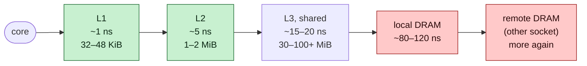
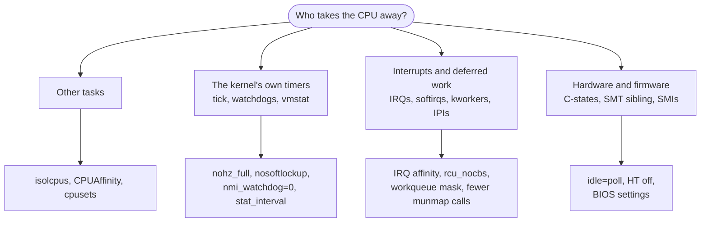

# Concept — CPU Isolation: Schedulers, Caches and Noise

> Used by: [Guide 01](../guides/01-grub-bootloader-tuning.md), [Guide 02](../guides/02-cpu-core-isolation.md), [Guide 05](../guides/05-cgroup-isolation.md). Related: [bootloader](bootloader.md), [cgroups](cgroups.md).

## At a glance

- The handler itself takes 1–10 µs. The tail comes from rare events that take the CPU away or evict its caches.
- Isolation removes those events one by one: other tasks, the tick, interrupts, kernel work, and firmware.
- Once the CPU is quiet, how the thread uses memory decides whether it stays fast: cache lines, false sharing, NUMA.

## 1. Why it matters

A latency-critical thread does a small amount of work per event: decode a message, update a book, make a decision, encode a response. That takes 1–10 µs when everything it needs is in the CPU's caches. The distribution you care about (p99.9, max) is not set by that work. It is set by the **rare events that take the CPU away** or **evict the caches**. CPU isolation is the discipline of removing those events.

## 2. The Linux scheduler in one page

- Each CPU has a **run queue**. The scheduler (CFS, and EEVDF since kernel 6.6) picks the next task from it by virtual runtime or eligibility.
- **Time slices** are a few ms. A CPU with two runnable tasks alternates between them, and the one you care about waits.
- **Load balancing** runs periodically and at idle: busy CPUs' tasks are moved to less busy CPUs *within scheduling domains* (SMT → core cluster → socket → NUMA).
- **Wake-up placement**: when a sleeping task wakes, the scheduler chooses a CPU for it, often near the waker or where the task last ran.
- **Affinity** (`sched_setaffinity`, `taskset`) restricts the CPUs a task may use. **cpusets** (cgroups) restrict the CPUs a *group* may use. The effective set is the intersection.

`isolcpus` removes CPUs from the balancing domains, and systemd's `CPUAffinity` keeps every service's mask off them. What is left on an isolated CPU is what you **explicitly** put there, plus per-CPU kernel threads.

## 3. What a context switch really costs

The direct cost of switching tasks is small: saving and restoring registers, switching the stack and possibly the page tables, about 1–3 µs including the kernel entry. The **indirect** cost is what hurts:

| Resource | Size (typical server core) | Effect of another task running for 1 ms |
|---|---|---|
| L1d / L1i | 32–48 KiB each | fully overwritten |
| L2 | 1–2 MiB | largely overwritten |
| L3 (shared per socket) | 30–100+ MiB | partially overwritten |
| TLB | ~64 L1 + ~2 K L2 entries | flushed on page-table switch unless PCID tags survive, and many entries evicted anyway |
| Branch predictors | — | retrained |

*Each level is several times slower than the one before it. A context switch pushes the critical thread's data out of L1 and L2, so its next events run from the slow end of this chain.*

*A migration is a context switch onto a CPU that holds someone else's data. Pinning removes it.*

After the switch back, the critical thread runs from L3 or DRAM for its next several events. At ~5 ns per L2 hit, ~15–20 ns per L3 hit and ~80–120 ns per DRAM access (more across sockets), a few hundred misses turn a 2 µs handler into a 20–40 µs one. That is the outlier.

## 4. Sources of noise on a CPU, and what removes each

*The sources fall into four families (other tasks, kernel timers, interrupts and deferred work, hardware and firmware), and each has its own removal. The table below lists every source.*

*The seven sources that matter on a Linux server, each with its typical cost and the one setting that removes it.*

*The periodic tick is the most regular source. `nohz_full` stops it when exactly one task is runnable on the CPU.*

| Source | Mechanism | Removal |
|---|---|---|
| Other tasks | Scheduler places them there | `isolcpus` + systemd `CPUAffinity` + cpusets |
| Scheduler tick | Periodic local timer IRQ | `nohz_full` (one runnable task) |
| Device interrupts | IRQ routed to the CPU | `/proc/irq/*/smp_affinity_list`, irqbalance off |
| Softirqs | Raised by IRQs (NET_RX, TIMER, RCU...) on the same CPU | Keep IRQs off the CPU; `rcu_nocbs` |
| Workqueues | `kworker` items queued on the CPU | Workqueue cpumask for unbound work; avoid triggering per-CPU work |
| IPIs | Reschedule, function call (`CAL`), TLB shootdown (`TLB`) | Avoid `mprotect`/`munmap` in the process while it runs; fewer threads sharing an mm; huge pages |
| Timers | hrtimers armed by the thread itself (e.g. `nanosleep`, timeouts) | Busy-spin instead of sleeping |
| Watchdogs | soft-lockup hrtimer, NMI watchdog | `nosoftlockup`, `nmi_watchdog=0` |
| vmstat | Per-CPU statistics folding | `vm.stat_interval`, `nohz_full` shepherding |
| C-state exit | CPU slept while waiting | `idle=poll` / busy-spin |
| SMT sibling | Shares execution ports and L1/L2 | HT off, or leave the sibling idle |
| SMIs | Firmware System Management Interrupts, invisible to the OS | BIOS: disable the features that generate them; measure with `hwlat` tracer / `rtla hwnoise` |

## 5. Caches and coherence: the "mechanical sympathy" part

Isolation gives a thread a CPU, and **how the thread uses memory** decides whether it stays fast.

- **Cache lines are 64 bytes**, and coherence works per line (MESI/MESIF). When two cores write to the same line, it bounces between their private caches, costing ~40–100 ns per transfer on the same socket and more across sockets.
- **False sharing**: two independent variables, written by two threads, that happen to share a line. Typical examples are per-thread counters in an array, or the head and tail indices of a queue. Pad or align hot, independently written fields to 64 bytes (128 on CPUs with adjacent-line prefetch). In Java, `@jdk.internal.vm.annotation.Contended` or manual padding.
- **Single-writer principle**: design data so each line has one writer. Single-producer/single-consumer (SPSC) ring buffers exist for this reason.
- **NUMA**: memory is attached to a socket. A thread on node 1 reading node 0 memory pays the interconnect latency on every miss. Pin threads and their memory to the same node, the node where the NIC is attached.
- **Prefetchers love sequential access**. Arrays of primitives beat pointer-chasing object graphs. Keep hot data compact.

## 6. Spinning vs blocking

| | Busy-spin | Block (futex/epoll wait) |
|---|---|---|
| Wake-up latency | ~50–100 ns (cache line transfer when the producer writes) | 2–50 µs (IPI + scheduler + possibly C-state exit) |
| CPU cost | 100 % of one core | ~0 when idle |
| Requires | A dedicated (isolated) core | Nothing |

*A blocked consumer has to be woken through the kernel. A spinning consumer on its own core sees the write after a single cache-line transfer.*

Spin loops should include a pause hint (`Thread.onSpinWait()` in Java, `_mm_pause()` in C). It reduces power, frees resources for an SMT sibling, and avoids a memory-order pipeline flush when the awaited write arrives. Back-off strategies (spin → yield → park) are the right choice when cores are shared, as in VMs and development machines.

## 7. Real-time scheduling classes

`SCHED_FIFO`/`SCHED_RR` tasks always preempt `SCHED_OTHER` tasks. On an isolated CPU with one thread, that makes no difference. Where it matters, it can hurt: a FIFO spinner prevents `ksoftirqd` or a `kworker` on the same CPU from running, and that stalls whatever they were doing (network receive, deferred frees). RT throttling (`sched_rt_runtime_us`) is the kernel's safety net: it forcibly idles RT tasks for 50 ms each second, which is exactly the kind of stall you are trying to avoid. The coherent combination is: isolated CPU + one thread + no IRQs there + RT throttling off (if FIFO is used at all).

## 8. Measuring noise

| Tool | What it shows |
|---|---|
| `ps -eLo psr,pid,tid,comm` | Which CPU each thread last ran on |
| `/proc/interrupts` (`LOC`, `RES`, `CAL`, `TLB`, device rows) | Interrupt counts per CPU |
| `perf stat -e context-switches,cpu-migrations -t <tid>` | Scheduler events of one thread |
| `/proc/<pid>/task/<tid>/status` (`nonvoluntary_ctxt_switches`) | Preemptions |
| `rtla osnoise` / `osnoise` tracer | Per-CPU noise: every interruption of a spinning workload, with duration and source |
| `rtla timerlat` | Wake-up latency of a timer-driven thread |
| `perf sched record/latency` | Scheduling delays per task |
| `trace-cmd record -e irq -e sched -M <cpumask>` | Everything that happened on a CPU |

A good isolated CPU under `rtla osnoise` shows single-digit µs max noise over hours, and the remaining events are explainable (the residual tick, NMIs).

## 9. Illustrative scenario

A gateway's p99.9 was 180 µs, while p50 was 6 µs. `rtla osnoise` on the network thread's CPU showed a 150 µs `kworker` every ~2 s, and a `LOC` rate of 1000/s. Findings: `nohz_full` was missing (a new kernel entry without the arguments), and the thread wrote its audit log synchronously, which queued writeback work on its own CPU. Fixes: restore the arguments ([Guide 01](../guides/01-grub-bootloader-tuning.md)), set the workqueue cpumask ([Guide 02](../guides/02-cpu-core-isolation.md)), and hand the audit log to a non-critical thread through an SPSC queue. p99.9 went to 14 µs.

## 10. Key takeaways

- A context switch costs little directly. The cost is the cold caches that come after it.
- Remove noise by family: other tasks, kernel timers, interrupts and deferred work, hardware and firmware.
- Spin only on a core the thread owns, with a pause hint. Back off on shared or virtual cores.
- One writer per cache line. Pad hot, independently written fields, and keep threads and memory on the NIC's NUMA node.
- Measure with `rtla osnoise`. A good isolated CPU shows single-digit µs of maximum noise over hours.

## 11. References

- `man 7 sched`, `man 7 cpuset`
- <https://docs.kernel.org/scheduler/index.html>
- <https://docs.kernel.org/trace/osnoise-tracer.html>
- Ulrich Drepper, *What Every Programmer Should Know About Memory*
- Martin Thompson, *Mechanical Sympathy* blog
- Intel® 64 and IA-32 Architectures Optimization Reference Manual (cache, TLB, PAUSE)
