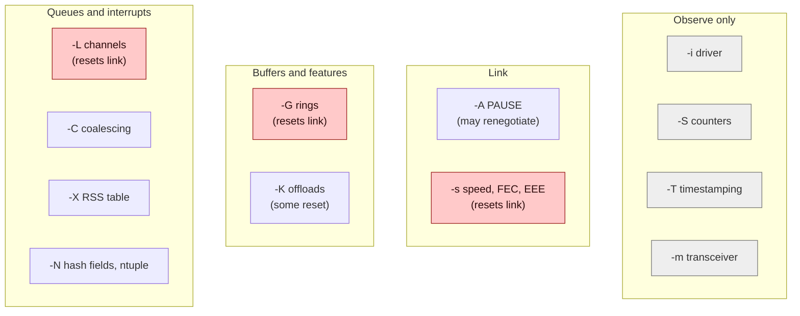
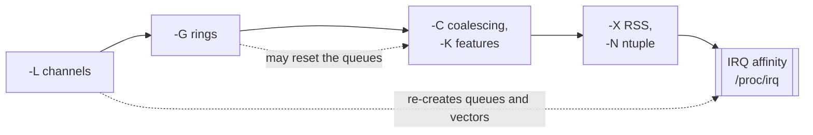

# Concept — `ethtool`: What Each Option Controls

> Used by: [Guide 04](../guides/04-network-optimization.md), [Guide 08](../guides/08-kernel-bypass.md). Related: [network-tuning](network-tuning.md). Example: [network-segmentation-example](../examples/network-segmentation-example.md). Terms: [Glossary](../GLOSSARY.md).

## At a glance

- Lowercase shows, uppercase sets: `-l`/`-L` channels, `-g`/`-G` rings, `-c`/`-C` coalescing, `-k`/`-K` features, `-a`/`-A` PAUSE.
- Every setting is a request to the driver, lost at reboot or driver reload. Some of them reset the link.
- Apply in a fixed order: channels, rings, coalescing and features, RSS and ntuple, then IRQ affinity.

`ethtool` is the one tool that talks to the NIC **driver** about the hardware under a network interface: its queues, rings, interrupt timers, offloads, flow control, hash tables, filters, counters and clocks. `ip` configures the network stack above it (addresses, routes, MTU, qdiscs), and `ethtool` configures the device below it. This page explains every `ethtool` option these guides use, and a few more you will meet while debugging, so that a line like `ethtool -L ens1f0 combined 1` is never a mystery.

## 1. How `ethtool` works (and why answers differ between NICs)

- **Show with a lowercase option, set with the uppercase one.** `-l` shows channels and `-L` sets them, `-c`/`-C` do the same for coalescing, `-g`/`-G` for rings, and so on.
- **Every option is a request to the driver.** The kernel passes it through the ethtool netlink API (older kernels and tools use the `SIOCETHTOOL` ioctl) to the driver's callback for that feature. If the driver does not implement the callback, you get `Operation not supported`. If it implements the callback but not a given value, you get `Invalid argument`, or the value is silently rounded (ring sizes, coalescing timers).
- **Settings are runtime state.** A reboot, a driver reload (`modprobe -r`), a firmware reset and on some drivers a link flap all discard them. Persist them as described in §15.
- **`[fixed]` in `ethtool -k` output** means the driver reports the feature but does not let you change it.
- **Maxima are per device and per firmware.** `Pre-set maximums` in `-l`/`-g` output is the source of truth. Do not copy values between NIC models.

## 2. Map of options

| Show | Set | Controls | Resets the link? | Section |
|---|---|---|---|---|
| `-i` | — | driver, firmware, PCI address | — | §3 |
| `-l` | `-L` | channels: number of queues and interrupt vectors | **usually yes** | §4 |
| `-g` | `-G` | ring sizes (descriptors per queue) | **usually yes** | §5 |
| `-c` | `-C` | interrupt coalescing (moderation) | no | §6 |
| `-k` | `-K` | offload features (segmentation, aggregation, checksum, filters) | some features | §7 |
| `-a` | `-A` | Ethernet flow control (PAUSE frames) | may renegotiate | §8 |
| `-x` | `-X` | RSS indirection table and hash key | no | §9 |
| `-n` | `-N` | RSS hash fields and ntuple flow-steering rules | no | §10 |
| `-S` | — | hardware and driver counters | — | §11 |
| `-T` | — | timestamping capabilities and PTP clock | — | §12 |
| `--show-priv-flags` | `--set-priv-flags` | driver-private switches | often | §13 |
| (none) | `-s` | speed, duplex, autonegotiation | **yes** | §14 |
| `--show-fec` | `--set-fec` | forward error correction mode | **yes** | §14 |
| `--show-eee` | `--set-eee` | Energy-Efficient Ethernet | may renegotiate | §14 |
| `-m` | — | transceiver (SFP/QSFP) diagnostics | — | §14 |



*The options fall into four groups. The ones marked "resets link" (in red) stop traffic briefly and bring the queue interrupts back with default affinity. The observe-only group changes nothing.*

"Resets the link" means the driver tears down and rebuilds its queues. Traffic stops for roughly 0.1–3 s, and every queue interrupt comes back with default affinity. Never do this on the interface you are logged in through, and always re-apply IRQ placement afterward ([Guide 04 §6](../guides/04-network-optimization.md#6-interrupt-affinity-set_nic_irq_affinity)).

## 3. `-i`: driver information

```
$ ethtool -i ens1f0
driver: ice                      ← kernel module: decides which options exist
version: 5.14.0-427.el9.x86_64
firmware-version: 4.40 0x8001c967 1.3534.0
bus-info: 0000:3b:00.0           ← PCI address: lspci -s, NUMA node, DPDK binding (Guide 08)
supports-statistics: yes
supports-test: yes
supports-eeprom-access: yes
supports-register-dump: yes
supports-priv-flags: yes
```

Start here every time. The driver name tells you which documentation to read (`/usr/share/doc/kernel-doc-*/Documentation/networking/device_drivers/`, or docs.kernel.org). It also tells the scripts whether a NIC belongs to a kernel-bypass stack (`KERNEL_BYPASS_DRIVER` in `lowlat.conf`). The firmware version is the first thing a vendor asks for.

## 4. `-l` / `-L`: channels (queues and their interrupts)

A **channel** is a hardware queue together with the interrupt vector that signals it. There are four kinds:

| Kind | What it is | Typical use |
|---|---|---|
| `rx` | receive-only queue with its own interrupt | older or split-IRQ drivers |
| `tx` | transmit-only queue with its own interrupt | same |
| `combined` | one RX queue + one TX queue sharing **one** interrupt | almost every current driver (ice, i40e, ixgbe, mlx5, sfc, bnxt) |
| `other` | an interrupt that carries no packets: link state, mailbox, errors | fixed, usually 1 |

```
$ ethtool -l ens1f0
Pre-set maximums:        Current hardware settings:
RX:       0              RX:       0
TX:       0              TX:       0
Other:    1              Other:    1
Combined: 63             Combined: 63      ← default: typically one per CPU, up to the maximum
```

`ethtool -L ens1f0 combined 4` asks for 4 queue pairs, and therefore 4 interrupts. Consequences:

- **RSS spreads received flows across the RX queues** (§9). Each queue is drained in the softirq of whichever CPU its interrupt is routed to (`/proc/irq/<n>/smp_affinity_list`).
- **More queues give parallelism only if their interrupts land on more CPUs.** Otherwise they are processed one after another on the same CPU. On a low-latency host the interrupts are confined to a few housekeeping CPUs, so the useful queue count is the number of those CPUs ([Guide 04 §5.1](../guides/04-network-optimization.md#51-queues-channels-ethtool--l)).
- **Each queue costs memory**: its rings, and pre-allocated receive buffers, with ring size × buffer size per queue.
- **Changing the count resets the NIC.** The new vectors appear with default affinity, and irqbalance (if running) or your placement script must run again.
- **The kernel refuses to reduce the count below a queue that is in use**, for example by an ntuple rule (§10), a user-set RSS table, an AF_XDP socket or an XDP program. Remove those first.

With kernel-bypass stacks the meaning shifts. The bypass stack creates its own hardware queues outside this count, and the kernel queues carry only what is left. See [Guide 08 §3](../guides/08-kernel-bypass.md#3-what-happens-to-the-kernel-queues-the-combined-question).

## 5. `-g` / `-G`: ring sizes

```
$ ethtool -g ens1f0
Pre-set maximums:      Current hardware settings:
RX:        8160        RX:        2048
TX:        8160        TX:        2048
```

A ring is a circular array of **descriptors**, each pointing at one packet buffer. The NIC writes received packets into the buffers named by the RX descriptors (DMA) and advances; the driver refills them. When the NIC reaches a descriptor the driver has not refilled yet, the packet is **dropped in hardware**: the `rx_missed`/`rx_no_buffer`/`fifo` counters rise in `ethtool -S`.

[Concept: network buffers §2](network-buffers.md#2-anatomy-of-a-ring) draws the ring and its pointers.

- `rx N` / `tx N`: descriptors per queue. Larger rings absorb longer bursts, and cost N × buffer size of memory per queue. A larger ring **does not add latency** while it is not backed up, because packets are processed as soon as they arrive. It only lets the backlog grow instead of dropping.
- `rx-mini` and `rx-jumbo`: separate rings for small or jumbo frames on a few older drivers.
- Newer `ethtool` versions also show `rx-buf-len`, `cqe-size`, `tx-push` and `rx-push`. These are driver-specific: leave them at their defaults unless the vendor's low-latency guide says otherwise.

Values are rounded to what the hardware supports (often a multiple of 32 or a power of two). Read them back after setting.

## 6. `-c` / `-C`: interrupt coalescing

Coalescing (interrupt moderation) makes the NIC **wait** before raising an interrupt, hoping to report several packets with one interrupt. That saves CPU and costs latency.

```
$ ethtool -c ens1f0
Adaptive RX: off  TX: off        ← dynamic moderation (DIM): rewrites the usecs values below at runtime
rx-usecs: 0                      ← max time from the first packet to the interrupt; 0 = interrupt immediately
rx-frames: 0                     ← interrupt after this many packets; 0 = this trigger is disabled
rx-usecs-irq: 0                  ← the same two limits while an interrupt is already being serviced
rx-frames-irq: 0
tx-usecs: 0                      ← the same for TX completions (freeing sent buffers)
tx-frames: 0
...
```

| Parameter | Meaning | Low-latency value |
|---|---|---|
| `adaptive-rx`, `adaptive-tx` | let the driver retune `*-usecs` from the observed packet rate | **off**. Otherwise your fixed values are overwritten within milliseconds. |
| `rx-usecs` | time budget from the first packet to the interrupt | **0** for critical NICs; 8–100 for bulk NICs if their interrupt load hurts |
| `rx-frames` | packet-count trigger | 0 or 1, per the driver documentation |
| `tx-usecs` / `tx-frames` | same for TX completions | **0**, so the TX ring never fills while waiting to be cleaned |
| `rx-usecs-irq`, `*-frames-irq` | limits applied while the interrupt handler is running | leave at the defaults |
| `pkt-rate-low/high`, `rx-usecs-low/high`, `sample-interval` | rate-based adaptive moderation on some drivers | irrelevant once adaptive is off |
| `cqe-mode-rx/tx` (mlx5) | start the timer at the completion rather than at the first packet | leave at the default; measure if you change it |

When several triggers are enabled, the interrupt fires on the first one reached. The exact semantics of 0 differ between drivers, so read the driver documentation, set the value, and read it back.

Some drivers (i40e, ice, and others) accept **per-queue** values, so a critical-flow queue can run at 0 µs while the other queues coalesce:

```bash
ethtool --per-queue ens1f0 queue_mask 0x1 --coalesce rx-usecs 0 tx-usecs 0     # queue 0 only
ethtool --per-queue ens1f0 queue_mask 0x1 --show-coalesce
```

## 7. `-k` / `-K`: offload features

`ethtool -k` lists every feature with its state. `ethtool -K ens1f0 <feature> on|off` changes one. The features that matter here:

| Feature (`-K` name) | Long name in `-k` | What it does | Latency view |
|---|---|---|---|
| `tso` | tcp-segmentation-offload | NIC cuts a large TCP send into MSS-sized segments | off on critical NICs: it encourages large batched sends |
| `gso` | generic-segmentation-offload | software TSO, late in the stack | off on critical NICs |
| `lro` | large-receive-offload | NIC merges received TCP segments into one large packet | **off**: adds merge delay, and breaks routing and bridging |
| `gro` | generic-receive-offload | software merge within one NAPI poll | usually harmless with coalescing 0; turn off if traces show it |
| `rx-gro-hw` | rx-gro-hw | hardware GRO (bnxt, mlx5, …) | treat like `lro` |
| `rx` / `tx` | rx-checksumming / tx-checksumming | NIC computes and verifies checksums | **keep on**. Free in hardware, CPU work otherwise. |
| `sg` | scatter-gather | NIC sends from several memory fragments | keep on. TSO needs it. |
| `rxhash` | receive-hashing | driver passes the RSS hash to the stack | keep on |
| `ntuple` | ntuple-filters | enables the hardware flow rules of §10 | **on** when you steer flows |
| `rxvlan` / `txvlan` | rx/tx-vlan-offload | VLAN tag insertion and stripping in hardware | keep on |
| `hw-tc-offload` | hw-tc-offload | lets `tc` program the NIC (flower filters, mqprio channels) | on only for designs that use it (Intel ADQ, Guide 08 §2) |
| `rx-fcs` / `rx-all` | rx-fcs / rx-all | deliver frame checksums and bad frames | capture setups only |

Features depend on each other. Turning off `sg` or `tx` also turns off `tso`, for example, and `ethtool` prints the actual resulting changes. Changing `lro`, `rx-fcs` or `rx-all` resets the queues on some drivers.

## 8. `-a` / `-A`: flow control (PAUSE frames)

```
$ ethtool -a ens1f0
Autonegotiate: off
RX:            off      ← honor PAUSE frames from the peer (stop our transmitter)
TX:            off      ← send PAUSE frames when our buffers fill
```

IEEE 802.3x PAUSE lets a congested receiver stop the sender for up to 65,535 × 512 bit times: about 3.3 ms at 10 GbE. That stops the whole port, every flow on it. Low-latency NICs run with `autoneg off rx off tx off`, and the switch port must match ([Guide 04 §5.4](../guides/04-network-optimization.md#54-pause-frames-off-ethtool--a-autoneg-off-rx-off-tx-off) animates the difference). Priority Flow Control (PFC, per traffic class, used by RoCE) is configured with Data Center Bridging (DCB) tools (`dcb` from iproute2, or `lldptool`, which speaks the link-layer discovery protocol, LLDP), not with `-A`. Leave it alone on RDMA fabrics unless you own the whole design. Changing pause autonegotiation can renegotiate the link.

## 9. `-x` / `-X`: RSS indirection table and hash key

RSS computes a hash over each received packet's header fields (§10 selects which ones) and uses the low bits as an index into the **indirection table**. Each entry of that table names a queue.

```
$ ethtool -x ens1f0
RX flow hash indirection table for ens1f0 with 4 RX ring(s):
    0:      0     1     2     3     0     1     2     3      ← entry → queue
   ...
RSS hash key:
6d:5a:56:da:25:5b:0e:c2:...
RSS hash function:
    toeplitz: on
```

| Command | Effect |
|---|---|
| `ethtool -X ens1f0 equal 2` | spread hashed traffic evenly over queues 0–1 only |
| `ethtool -X ens1f0 weight 0 1 1` | queue 0 gets no hashed traffic; queues 1 and 2 share it (reserve queue 0 for ntuple rules) |
| `ethtool -X ens1f0 default` | back to the driver default |
| `ethtool -X ens1f0 hkey <bytes>` / `hfunc toeplitz` | set the hash key or function (symmetric hashing, reproducible placement) |
| `ethtool -X ens1f0 context new ...` | an additional RSS context (a separate table), on drivers that support it; ntuple rules can target it |

A user-set table survives until you change it back or reload the driver, and it blocks reducing the channel count below the queues it references.

## 10. `-n` / `-N`: hash fields and flow-steering rules

**Which fields RSS hashes.** Many drivers hash **UDP on IP addresses only** by default. All UDP flows between two hosts then land in one queue, whatever their ports. Check, and include the ports if you want flows spread:

```bash
ethtool -n ens1f0 rx-flow-hash udp4            # e.g. "IP SA, IP DA" → ports not hashed
ethtool -N ens1f0 rx-flow-hash udp4 sdfn       # s/d = src/dst IP, f/n = src/dst port
```

**ntuple rules** override RSS for matching packets and send them to a chosen queue (or drop them). This is how one critical flow gets its own queue, its own interrupt and its own CPU:

```bash
ethtool -K ens1f0 ntuple on
ethtool -N ens1f0 flow-type udp4 dst-ip 10.10.1.10 dst-port 5000 action 0   # → queue 0
ethtool -N ens1f0 flow-type tcp4 src-ip 10.200.1.5 action 1                 # → queue 1
ethtool -N ens1f0 flow-type udp4 dst-port 9 action -1                       # drop in hardware
ethtool -n ens1f0                                                           # list rules (with their IDs)
ethtool -N ens1f0 delete 1023                                               # remove one
```

Match fields (`src-ip`, `dst-ip`, `src-port`, `dst-port`, `vlan`, `dst-mac`, `user-def`, with masks `m`) and the number of rules depend on the hardware. `loc N` pins a rule to a slot. `context N` sends matches to an RSS context instead of a single queue. Kernel-bypass stacks install their own hardware filters through the same mechanism, which is why `ethtool -n` on an Onload NIC can list rules you did not write ([Guide 08](../guides/08-kernel-bypass.md)).

## 11. `-S`: statistics

`ethtool -S ens1f0` prints every counter the driver exposes, often hundreds of them, with **driver-specific names**. The ones that explain latency spikes:

```bash
ethtool -S ens1f0 | grep -iE 'drop|miss|discard|no_buf|fifo|over|pause|err' | grep -v ': 0$'
```

| Counter family (names vary) | Meaning |
|---|---|
| `rx_missed_errors`, `rx_no_buffer_count`, `rx_fifo_errors` | ring full (§5), or the host was too slow to refill it |
| `rx_dropped` / `port.rx_dropped` | dropped by the driver or port logic |
| `rx_pause`, `tx_pause`, `*_xoff*` | PAUSE frames exchanged (§8) |
| `rx_queue_N_packets`, `tx_queue_N_packets` | per-queue load: verifies RSS or ntuple placement |
| `rx_crc_errors`, `rx_symbol_err*` | physical layer: cable, optic (§14 `-m`) |

Newer kernels and `ethtool` versions also offer standardized groups with the same names on every driver: `ethtool -S ens1f0 --all-groups` (`eth-mac`, `eth-phy`, `eth-ctrl`, `rmon`).

## 12. `-T`: timestamping

```
$ ethtool -T ens1f0
Capabilities:
    hardware-transmit / hardware-receive / hardware-raw-clock
PTP Hardware Clock: 2                     ← /dev/ptp2, used by ptp4l / phc2sys
Hardware Transmit Timestamp Modes: off on
Hardware Receive Filter Modes: none all
```

Hardware timestamps are what PTP needs (the `timing` NIC role), and they are the only honest way to measure time from the wire into the application (`SO_TIMESTAMPING`). If `-T` shows no PTP hardware clock, that NIC cannot be your PTP interface.

## 13. `--show-priv-flags` / `--set-priv-flags`: driver-private switches

Drivers expose features that fit no generic option as named boolean flags:

```bash
ethtool --show-priv-flags ens1f0
ethtool --set-priv-flags ens1f0 <flag> on|off
```

The names and meanings belong to each driver, and so does the documentation. Examples you will meet include receive-completion compression and striding RQ on mlx5, and link or firmware LLDP behavior on Intel drivers. Change one only when the vendor's low-latency guide names it, measure before and after, and expect a queue reset.

## 14. Physical layer: `-s`, FEC, EEE, `-m`

- **`ethtool ens1f0`** (no option) shows speed, duplex, autonegotiation and link state. `-s ens1f0 speed 25000 duplex full autoneg off` forces them, which resets the link, and both ends must agree.
- **FEC (`--show-fec`/`--set-fec`)**: forward error correction on 25/50/100 GbE links. Reed-Solomon FEC adds on the order of 100 ns per hop, while BASE-R (FireCode) or no FEC adds less. The mode must match the switch and the optic's requirements. It is a real latency lever on short, clean links, but decide it together with the network team.
- **EEE (`--show-eee`/`--set-eee`)**: Energy-Efficient Ethernet puts an idle link to sleep, and waking it costs microseconds. Turn it **off** on latency links where the NIC supports it.
- **`-m`**: transceiver EEPROM and diagnostics (temperature, RX/TX optical power). Check it first when CRC or symbol errors rise.

## 15. Persistence

Nothing set with `ethtool` survives a reboot or driver reload. The options:

| What | NetworkManager connection key (RHEL 9) | Otherwise |
|---|---|---|
| Coalescing (`-C`) | `ethtool.coalesce-adaptive-rx`, `ethtool.coalesce-rx-usecs`, `ethtool.coalesce-tx-usecs`, … | `lowlat-runtime.service` |
| Rings (`-G`) | `ethtool.ring-rx`, `ethtool.ring-tx` | `lowlat-runtime.service` |
| Features (`-K`) | `ethtool.feature-tso`, `ethtool.feature-gso`, `ethtool.feature-lro`, `ethtool.feature-ntuple`, … | `lowlat-runtime.service` |
| Pause (`-A`) | `ethtool.pause-autoneg`, `ethtool.pause-rx`, `ethtool.pause-tx` | `lowlat-runtime.service` |
| Channels (`-L`) | `ethtool.channels-combined` (recent NetworkManager) | `lowlat-runtime.service` |
| RSS table (`-X`), hash fields and ntuple rules (`-N`), per-queue coalescing, private flags, FEC, EEE | none | `lowlat-runtime.service`, or a NetworkManager dispatcher script on `up` |
| IRQ affinity (not `ethtool`) | none | `lowlat-runtime.service`, always **after** any `-L` |

The keys and their spelling are listed in `man nm-settings-nmcli` (section `ethtool`). Whatever the mechanism, the order is fixed:



*Every earlier step can reset or re-create the queues that the later steps configure, so the order is channels, rings, coalescing and features, RSS and ntuple, and IRQ affinity last.*

## 16. Numbers to remember

Typical values, not measurements.

| Quantity | Value |
|---|---|
| Traffic stop when channels or rings change | ~0.1–3 s, on most drivers |
| RX ring: default / maximum on common server NICs | 512–2048 / 4096–8160 descriptors |
| Adaptive coalescing, first packet of a burst | +30–50 µs |
| One PAUSE frame at 10 GbE / 100 GbE | up to 3.3 ms / 0.3 ms |
| Reed-Solomon FEC per hop | on the order of 100 ns |
| Wake-up of a link in EEE sleep | microseconds |

## 17. Myths

- **"A value `ethtool` accepted is in effect."** Drivers round ring sizes and timers. Read the value back.
- **"Settings survive a reboot."** None does. Something must apply them at every boot (§15).
- **"A bigger ring adds latency."** Only the packets waiting behind a backlog wait longer. An empty ring adds nothing.
- **"`ethtool -S` names are standard."** Each driver names its counters; search for the idea (`miss`, `no_buf`, `drop`), not one name.

## 18. Key takeaways

- Lowercase shows, uppercase sets. `[fixed]` means the driver will not let you change the feature.
- `Pre-set maximums` are per device and per firmware. Never copy values between NIC models.
- `-L`, `-G` and physical-layer changes reset the link. Never run them on the interface you are logged in through.
- Nothing persists. Re-apply at boot in the fixed order, and place IRQs last.

## 19. References

- `man 8 ethtool`; the ethtool netlink API: <https://docs.kernel.org/networking/ethtool-netlink.html>
- Scaling (RSS, RPS, RFS, XPS, ntuple): <https://docs.kernel.org/networking/scaling.html>
- Interrupt moderation (DIM): <https://docs.kernel.org/networking/net_dim.html>
- Driver documentation: <https://docs.kernel.org/networking/device_drivers/ethernet/index.html>
- `man 5 nm-settings-nmcli` (`ethtool` section)
