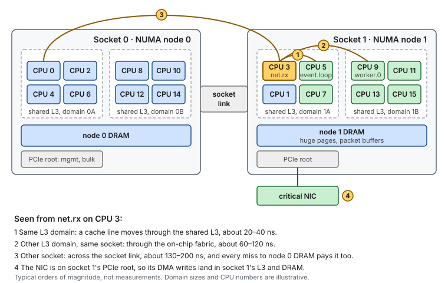
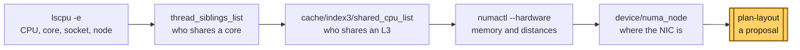

# Concept — Hardware Topology: Sockets, Cores, Caches and Where the NIC Sits

> Used by: [Guide 00 §4.4–4.5](../guides/00-bios-firmware.md#44-hyper-threading), [Guide 02 §3](../guides/02-cpu-core-isolation.md#3-designing-the-cpu-layout). Related: [CPU isolation](cpu-isolation.md), [huge pages and NUMA](huge-pages.md), [`plan-layout`](../scripts/plan-layout). Use cases: [06](../examples/use-cases/06-two-sockets-one-mistake.md), [12](../examples/use-cases/12-the-sibling-that-shares-your-core.md), [18](../examples/use-cases/18-adding-a-worker-without-re-planning.md). Terms: [Glossary](../GLOSSARY.md).

## At a glance

- A "CPU" in Linux is a hardware thread. Two of them can share one core, several cores share one L3 cache, and one or more L3 domains, a memory controller and a PCIe root make up a socket.
- Distance is latency. Two threads that hand data to each other pay about 20–40 ns inside one L3 domain and 130–200 ns across sockets, on every cache line.
- Read the topology from the machine (`lscpu`, sysfs, `numactl`, `lstopo`) before you write a layout. CPU numbers say nothing about who is next to whom.

## 1. Why it matters

Every layout decision in these guides is a statement about distance. "Keep the thread on the NIC's node" means the NIC's buffers are near. "Never split Hyper-Threading siblings" means two CPUs share one core. "Put the producer and the consumer next to each other" means their shared cache lines have a short trip. When the mental picture is wrong, a correct-looking `lowlat.conf` puts two busy threads on one core, or a handoff across the slowest link in the box.

The picture is not printed on the server. Linux numbers CPUs in the order the firmware lists them, and on many two-socket machines the numbers alternate between sockets (even CPUs on socket 0, odd CPUs on socket 1, as on the reference host). This page explains each level and how to read it from the host.

## 2. The levels, from a hardware thread to the box



*Seen from one pinned thread, the machine is a set of rings: its own core, its L3 domain, its socket, and the other socket. Each ring costs several times more than the one inside it.*

> **Picture it.** A building. Your desk is the core, your floor's shared shelf is the L3, the building is the socket, and the other socket is the building across the street. Handing a note across the desk is cheap; across the street, you need a courier for every note.

| Level | What it is | Shared by | Linux name |
|---|---|---|---|
| **Hardware thread** | One instruction stream. Linux calls it a CPU. | — | `cpuN` |
| **Core** | Execution units, L1 and L2 caches, the TLBs. With [SMT](../GLOSSARY.md#smt) on, two threads share it. | the SMT siblings | `core_id`, `thread_siblings_list` |
| **L3 domain** | The [last-level cache](../GLOSSARY.md#llc) and the cores attached to it. On Intel Xeon (mesh) it is usually the whole socket. On AMD EPYC it is one [CCX](../GLOSSARY.md#ccx), typically 8 cores. | all its cores | `cache/index3/shared_cpu_list` |
| **NUMA node** | A memory controller and the cores closest to it. Usually one per socket. [SNC / NPS](../GLOSSARY.md#snc) splits a socket into several. | its cores | `nodeN` |
| **Socket (package)** | One physical processor: its cores, L3 domains, memory channels and PCIe lanes. | — | `physical_package_id` |
| **Socket link** | The connection between sockets: [UPI](../GLOSSARY.md#upi) on Intel, [Infinity Fabric](../GLOSSARY.md#infinity-fabric) on AMD. | both sockets | — |
| **PCIe root** | Where devices attach. Each PCIe slot belongs to one socket. | the devices below it | `device/numa_node` |

### 2.1 Hardware threads and SMT

With Hyper-Threading (Intel's name for SMT), one core runs two instruction streams. They share the execution ports, the L1 and L2 caches, the TLBs and the branch predictors. When one sibling is busy, the other runs slower, often by 20–40 % and sometimes much more. Linux shows the siblings as two CPUs with the same `CORE` in `lscpu -e`.

The guides turn SMT off in the BIOS ([Guide 00 §4.4](../guides/00-bios-firmware.md#44-hyper-threading)), or isolate both siblings and leave one idle. [`plan-layout`](../scripts/plan-layout) never gives two roles to the siblings of one core.


*Two CPUs that are one core: the sibling's work slows every message on the other side ([use case 12](../examples/use-cases/12-the-sibling-that-shares-your-core.md)).*

### 2.2 L3 domains: the part most layouts forget

Cores exchange data through the cache hierarchy. When a thread on CPU 3 writes a cache line and a thread on CPU 5 reads it, the line moves from CPU 3's L2 to CPU 5's L2. If both cores share one L3, the trip is short. If they do not, the line crosses the on-chip fabric or the socket link.

- **Intel Xeon (Skylake-SP and later)** connects the cores of a socket with a mesh and one shared L3, so the whole socket is one L3 domain. With SNC on, each sub-NUMA cluster has its own share of the L3.
- **AMD EPYC** groups cores into [CCXs](../GLOSSARY.md#ccx) on chiplets (CCDs). Each CCX has its own L3: 4 cores on Zen 2, 8 cores on Zen 3 and later. A socket has up to 12 or more L3 domains, and moving a line between two of them goes through the I/O die.

On EPYC, two threads that hand messages to each other (`net.rx` → `event.loop`, say) belong in **one CCX**. In two CCXs, every handoff pays the fabric trip, even though both threads are "on the right NUMA node".

> [!NOTE]
> **Validate on your hardware.** `plan-layout` models NUMA nodes and SMT siblings, not L3 domains. On a CPU with several L3 domains per node, check `shared_cpu_list` (§4) and keep handoff pairs inside one domain by hand.

### 2.3 NUMA nodes and the socket link

Each socket has its own memory controllers. Memory attached to the local socket is about 80–120 ns away. Memory on the other socket adds the trip across the socket link, about 60–100 ns more, for every cache miss. The [huge pages and NUMA concept](huge-pages.md#6-numa) explains first-touch allocation and per-node reservation. `numactl --hardware` prints the **distance table** that the firmware reports: 10 means local, and a value around 20–32 means one socket link away. It is a relative weight, not nanoseconds.

### 2.4 PCIe: every device belongs to one socket

A NIC sits in a slot that is wired to one socket's PCIe root. Its [DMA](../GLOSSARY.md#dma) writes go to that socket first. On Intel, [DDIO](../GLOSSARY.md#ddio) writes arriving packets straight into that socket's L3, so a thread on the same socket reads them as cache hits. A thread on the other socket reads them across the socket link, and DDIO helps the wrong cache.

This is why the guides plan the whole layout around one question: **which node is the critical NIC on?** The answer is in `/sys/class/net/<nic>/device/numa_node`. A value of `-1` means the firmware did not say. That is common in VMs and on some single-socket boards. On a two-socket host it is a firmware bug to raise with the vendor.

## 3. Numbers to remember

Typical orders of magnitude on a recent server, not measurements. Use them to judge whether a layout choice matters, then measure.

| Event | Typical cost |
|---|---|
| L1 hit / L2 hit | ~1 ns / ~4–5 ns |
| L3 hit, local domain | ~15–20 ns (more on a large mesh, far slice) |
| Cache line handoff, same L3 domain | ~20–40 ns |
| Cache line handoff, other L3 domain, same socket | ~60–120 ns |
| Cache line handoff, other socket | ~130–200 ns |
| Local DRAM | ~80–120 ns |
| Remote DRAM | local + ~60–100 ns |
| SMT sibling busy | the other sibling's work slows by ~20–40 %, often more |

A handler that touches 50 cache lines from another thread pays about 1 µs for the trip within one domain, and about 8 µs across sockets. On a 5 µs budget, that alone can decide the result.

## 4. Reading the topology from a host



*Five reads, from the smallest level to the NIC, give everything `plan-layout` needs and the one thing it does not model, the L3 domains.*

```bash
lscpu -e=CPU,NODE,SOCKET,CORE,CACHE,ONLINE
# CPU NODE SOCKET CORE L1d:L1i:L2:L3 ONLINE
#   0    0      0    0 0:0:0:0          yes
#   1    1      1    1 1:1:1:1          yes      <- CPU 1 is on socket 1 on this host
# the last CACHE field is the L3 id: CPUs with the same L3 id share an L3

cat /sys/devices/system/cpu/cpu3/topology/thread_siblings_list
# 3          (SMT off)    or    3,35    (CPU 35 is the other half of the same core)

cat /sys/devices/system/cpu/cpu3/cache/index3/shared_cpu_list
# 1,3,5,7,...   every CPU that shares CPU 3's L3

numactl --hardware | sed -n '/distances/,$p'
# node   0   1
#   0:  10  21
#   1:  21  10      <- 21: one socket link away

cat /sys/class/net/ens1f0/device/numa_node /sys/class/net/ens1f0/device/local_cpulist
# 1
# 1,3,5,...,31     the CPUs on the NIC's node
```

`index3` is the L3 on current x86 CPUs. Check `cat /sys/devices/system/cpu/cpu3/cache/index3/level` if in doubt: it prints `3`.

<details>
<summary><b>A picture of the whole box with <code>lstopo</code></b></summary>

The `hwloc` package draws the topology, including the PCIe tree and which socket every NIC and disk hangs off:

```bash
dnf install -y hwloc
lstopo-no-graphics --no-io        # packages, L3 domains, cores, PUs (hardware threads)
lstopo-no-graphics --whole-io | grep -B3 -i net    # NICs with their parent package
```

In the text output, a `Package` is a socket, `L3` lines group cores, and `PU` is a hardware thread. `PU L#0 (P#0)` and `PU L#1 (P#32)` under one `Core` are SMT siblings. `lstopo` uses its own logical numbers (`L#`) and shows the Linux CPU number as `P#`.

</details>

## 5. How it shows up

| Symptom | Topology cause | Where it is told |
|---|---|---|
| Two humps in the histogram after a restart | A critical thread or its memory landed on the other socket | [Use case 06](../examples/use-cases/06-two-sockets-one-mistake.md) |
| One thread slows down only while another one is busy | The two CPUs are SMT siblings of one core | [Use case 12](../examples/use-cases/12-the-sibling-that-shares-your-core.md) |
| A new thread is slower than its twins and the OS CPUs are busy | It was never given a CPU, and it spins on the OS CPUs | [Use case 18](../examples/use-cases/18-adding-a-worker-without-re-planning.md) |
| A handoff is slower on one host than on its twin with the same tuning | Different CPU model: the pair sits in two L3 domains on one host and in one on the other | §2.2 |
| `numa_node` is `-1` for the NIC | The firmware does not report it, or the host is a VM | §2.4 |
| The node count doubled after a BIOS update | SNC or NPS was turned on | [Guide 00 §4.5](../guides/00-bios-firmware.md#45-memory-and-numa) |

## 6. Myths

- **"CPU 2 and CPU 3 are neighbors."** Not necessarily. On the reference host they are on different sockets. Linux CPU numbers follow the firmware's order, so read `lscpu -e`.
- **"One socket is one NUMA node."** Only when SNC and NPS are off. Count the nodes with `numactl --hardware` after every BIOS change.
- **"The right NUMA node is enough."** Not on CPUs with several L3 domains per node. A handoff pair in two CCXs pays the fabric trip on every message.
- **"SMT doubles the cores."** It doubles the instruction streams, not the caches or the execution units. For a latency-critical thread, a busy sibling is a noisy neighbor inside the core.

## 7. See it on your host

This lab only reads. Steps 1 and 2 work on any Linux box. Step 3 needs enough cores on one NUMA node, as it explains. Step 4 needs two sockets.

1. Print the CPU table, and write down which CPUs share a core and which share an L3:

   ```bash
   lscpu -e=CPU,NODE,SOCKET,CORE,CACHE
   for c in /sys/devices/system/cpu/cpu[0-9]*; do
     printf '%s siblings=%s l3=%s\n' "${c##*/}" "$(cat "$c/topology/thread_siblings_list")" \
       "$(cat "$c/cache/index3/shared_cpu_list" 2>/dev/null || echo n/a)"
   done
   # one line per CPU; CPUs with the same l3= list share an L3 domain
   ```

2. Find the node of every NIC:

   ```bash
   for n in /sys/class/net/*/device; do printf '%s node=%s\n' "$(basename "$(dirname "$n")")" "$(cat "$n/numa_node")"; done
   # ens1f0 node=1 ... ; virtual interfaces have no device/ and do not appear
   ```

3. Let `plan-layout` propose a layout from what you just read, and compare it with your notes:

   ```bash
   scripts/plan-layout --nic ens1f0 --threads 4
   # ISOLATED_CPUS and OS_CPUS on the NIC's node; no core split between two roles
   ```

   It needs 4 threads plus 2 spares (`--spares`) of free cores on the NIC's node, beside one housekeeping core, and it refuses with a message that says what is missing. On a smaller box, try `--nic-node 0 --threads 1 --spares 0`. A VM NIC with `numa_node` `-1` cannot be used with `--nic`: pass the node with `--nic-node`.

4. Optional, on a two-socket host that is not in production: compare local and remote memory bandwidth. Bandwidth is not latency, but the gap shows the socket link at work.

   ```bash
   numactl --cpunodebind=1 --membind=1 perf bench mem memcpy -s 1GB    # local
   numactl --cpunodebind=1 --membind=0 perf bench mem memcpy -s 1GB    # remote: lower GB/sec
   ```

## 8. Illustrative scenario

An illustrative case, not a measurement. A team moved a gateway from an Intel host to an AMD EPYC host with the same core count and the same `lowlat.conf` rules, generated by `plan-layout`. p50 was unchanged, but the `net.rx` → `event.loop` handoff time went from about 0.3 µs to about 0.9 µs. `shared_cpu_list` showed why: on the new host each L3 domain held 8 CPUs, and `plan-layout` had given `net.rx` and `event.loop` CPUs in two different CCXs. Swapping `event.loop` onto a spare CPU in `net.rx`'s CCX brought the handoff back to about 0.3 µs. The fix was one line in the application's affinity file, and a note in the runbook to check L3 domains on every new CPU model.

## 9. Key takeaways

- A Linux CPU is a hardware thread. Know which CPUs share a core, an L3, a node and a socket before you assign roles.
- Distance is latency: each ring (core, L3 domain, socket, other socket) costs several times the one inside it.
- The critical NIC's node decides the layout. Read it from `device/numa_node`, never guess it.
- On CPUs with several L3 domains per node, keep threads that hand data to each other in one domain. `plan-layout` does not do this for you.
- Re-read the topology after every BIOS change and on every new CPU model.

## 10. References

- `man 1 lscpu`, `man 8 numactl`, `man 1 lstopo`
- <https://docs.kernel.org/admin-guide/cputopology.html>
- <https://www.open-mpi.org/projects/hwloc/>
- Intel® 64 and IA-32 Architectures Optimization Reference Manual (cache hierarchy, mesh, SNC)
- AMD, *Performance tuning guidelines* for EPYC processors (CCX, CCD, NPS)
- Ulrich Drepper, *What Every Programmer Should Know About Memory*
