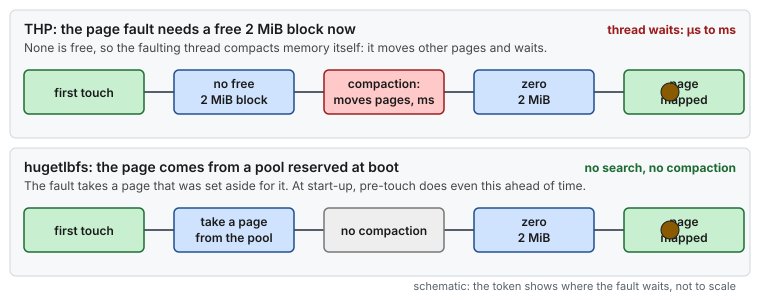
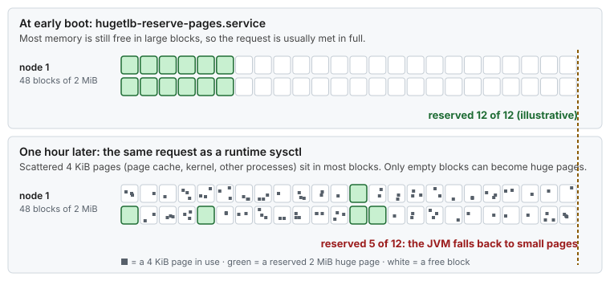
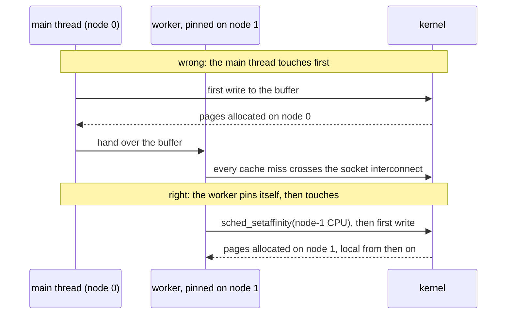

# Concept — Virtual Memory, TLBs, Page Faults and NUMA

> Used by: [Guide 03](../guides/03-huge-pages-configuration.md). Related: [cpu-isolation](cpu-isolation.md), [bootloader](bootloader.md). Example: [hugepages-java-example](../examples/hugepages-java-example.md). Terms: [Glossary](../GLOSSARY.md).

## At a glance

- Every memory access needs an address translation. With 4 KiB pages, the TLB covers only about 8 MiB, so large working sets pay page walks on the hot path.
- 2 MiB pages cover 4 GiB with the same TLB entries. Pre-touching moves page faults to start-up.
- Explicit pools (hugetlbfs), reserved per NUMA node early in boot, are predictable. THP is not.

## 1. Why it matters

Every load and store your code issues uses a **virtual** address. Before the cache can even be checked, the CPU has to translate it to a physical address. With 4 KiB pages and multi-GiB working sets, translation becomes a measurable share of memory latency. Page faults, which allocate and zero memory on first touch, can land in the middle of a latency-critical code path. Huge pages and pre-touching remove both problems.


*Cache hits are nanoseconds, and the events that set p99.9 (page faults, reclaim, SMIs, throttling) are microseconds to milliseconds, so one event costs as much as thousands of memory accesses.*

## 2. Translation: page tables and the TLB

x86-64 with 4-level paging splits a virtual address into four 9-bit indices and a 12-bit offset:

```
 47        39 38        30 29        21 20        12 11          0
 [ PML4 idx ][ PDPT idx  ][  PD idx   ][  PT idx   ][  offset    ]
      │            │            │            │
      ▼            ▼            ▼            ▼
    PML4 ────► PDPT ────►    PD ────►     PT ────► 4 KiB page
                  └─ 1 GiB page     └─ 2 MiB page (PD entry points straight at it)
                     (2 levels)        (3 levels)
```

> **Picture it.** A virtual address is a postal address: country, city, street, house number, and the name on the door. The page walk reads one directory per part. A huge page is a building with one big room: the walk stops a level earlier, and one TLB card covers the whole building.

A miss in the TLB triggers a **page walk**: up to four dependent memory reads (five with 5-level paging). Page-walk caches and data caches usually hold the upper levels. Even so, a walk costs ~20–40 cycles when everything hits in cache, and hundreds of cycles when the page-table entries themselves miss to DRAM, which happens exactly when the working set is large.

TLB sizes on a recent server core (approximately):

| Level | Entries (4 KiB) | Entries (2 MiB) | Entries (1 GiB) |
|---|---|---|---|
| L1 DTLB | 64–96 | 32 | 4–8 |
| L2 STLB (shared) | 1,536–2,048 | shared with 4 KiB | 16–1,024 (varies) |

**TLB reach** = entries × page size. With 2,048 × 4 KiB = 8 MiB, a 256 MiB hash table walked randomly misses the TLB almost every time. With 2 MiB pages, the same entries cover 4 GiB.


*With 4 KiB pages the TLB reach is a thin slice of the working set, and most reads trigger a page walk. With 2 MiB pages the reach covers the whole set.*

## 3. Page faults

A virtual mapping (`mmap`, `malloc` of a large block, JVM heap reservation) does not allocate memory. The first access to each page raises a **page fault**, and the kernel then:

1. allocates a physical page (from the local NUMA node, under the default *first-touch* policy);
2. **zeroes it** (4 KiB takes ~100 ns; 2 MiB takes ~50–100 µs);
3. installs the page-table entry, and returns.

A minor fault on 4 KiB costs ~0.5–2 µs. If memory is low, allocation can fall into **direct reclaim or compaction**, costing ms. A JVM that grows its heap during the day, an off-heap buffer touched for the first time by the first burst of traffic, or a new thread's stack all fault on the hot path.

**Pre-touching** (`-XX:+AlwaysPreTouch`, `memset`, `MAP_POPULATE`, or pre-allocated non-sparse files) moves all of that to start-up.


*Pre-touch does not remove the faults, it moves them to start-up, before the first request.*

## 4. Transparent Huge Pages (THP) vs hugetlbfs

**THP** tries to back anonymous memory with 2 MiB pages automatically:

- at fault time, if a contiguous 2 MiB block is available. If none is, and `defrag` allows it, the kernel **compacts memory synchronously**, moving other pages around while the faulting thread waits;
- in the background, where `khugepaged` scans processes and collapses 4 KiB pages into huge pages. That needs locks and TLB shootdowns in the target process;
- huge pages get **split** again on partial `munmap`/`mprotect`.

That is great for throughput workloads and unpredictable for latency. Databases (Redis, MongoDB, Oracle) and low-latency systems commonly recommend turning it off.



*The difference is who pays for finding 2 MiB of contiguous memory. With THP, the thread that faults pays, at that moment. With hugetlbfs, the boot-time reservation already paid.*

**hugetlbfs** (explicit huge pages) keeps a **pool** of huge pages that the kernel sets aside when you ask (`nr_hugepages`). They are never used for anything else, never swapped, never split, and never migrated by NUMA balancing. Applications must ask for them explicitly (`MAP_HUGETLB`, a hugetlbfs file, `SHM_HUGETLB`, the JVM's `-XX:+UseLargePages`). If the pool cannot satisfy a mapping, the mapping fails, or the fault gets `SIGBUS`, so under-provisioning shows up immediately.

Pool accounting in `/proc/meminfo`:

| Field | Meaning |
|---|---|
| `HugePages_Total` | Pages in the pool (plus surplus) |
| `HugePages_Free` | Not yet faulted in by anyone |
| `HugePages_Rsvd` | Promised to existing mappings but not yet faulted (a shared/private mapping reserves at `mmap` time) |
| `HugePages_Surp` | Surplus pages allocated beyond `nr_hugepages` thanks to `nr_overcommit_hugepages` |

"Free − Rsvd" is what a new mapping can still get.

## 5. Why reservation must happen early

The buddy allocator hands out physical memory in power-of-two blocks. After a host has run for a while, free memory is scattered: plenty of free 4 KiB pages, but few free, aligned 2 MiB blocks (order 9), and almost never a free 1 GiB block (order 18). Reserving thousands of 2 MiB pages is reliable only **before** services start and the page cache fills memory. That is why [Guide 03](../guides/03-huge-pages-configuration.md) reserves them in an early-boot oneshot unit, and why 1 GiB pages are reserved on the kernel command line. Check fragmentation with `cat /proc/buddyinfo` (free blocks per order, per zone and node).



*The same request at early boot and an hour later: scattered small pages leave few whole 2 MiB blocks. The numbers are illustrative.*

## 6. NUMA

On a multi-socket server, each socket has its own memory controllers. Access to local memory costs ~80–120 ns, and the other socket's memory adds ~60–100 ns, with lower bandwidth. `numactl --hardware` shows the node distance matrix.

- **First touch**: by default, a page is allocated on the node of the CPU that first touches it. A thread pinned on node 1 that initializes its data gets node-1 memory. A main thread on node 0 that initializes everything before handing it over puts everything on node 0.


*Under the default first-touch policy, memory lands on the node of whichever thread writes it first. So a thread should pin itself before it touches its own working set.*

- **Policies**: `numactl --membind` / `mbind(MPOL_BIND)` (a memory policy that binds to a node) force a node, `--interleave` spreads pages round-robin (good for shared read-mostly data), and `--preferred` tries a node first.
- **Huge-page pools are per node**. A process bound to node 1 can only use node 1's pool. The system-wide `vm.nr_hugepages` splits the pool evenly, which is why [Guide 03](../guides/03-huge-pages-configuration.md) writes the per-node sysfs files instead.
- **Automatic NUMA balancing** (`kernel.numa_balancing`) samples accesses by unmapping pages (hint faults) and migrates them. That is useful for unpinned workloads and pure overhead for pinned ones.

## 7. The JVM specifically

| Flag | Effect |
|---|---|
| `-XX:+UseLargePages` | Heap and code cache from explicit huge pages. On Linux this means hugetlbfs (`MAP_HUGETLB`); ZGC uses `memfd_create(MFD_HUGETLB)`. |
| `-XX:LargePageSizeInBytes=1g` | Use 1 GiB pages (if a 1 GiB pool exists) |
| `-XX:+UseTransparentHugePages` | Only `madvise(MADV_HUGEPAGE)`. Has no effect with THP `never`. Different mechanism, and not what this documentation uses. |
| `-XX:+AlwaysPreTouch` | Touch every committed heap page at start-up |
| `-XX:+UseNUMA` | NUMA-aware heap allocation (per-node allocation for thread-local buffers) |
| `-Xms` = `-Xmx` | Commit the full heap at start. Nothing to grow later. |
| `-XX:-ZUncommit` | ZGC never returns memory, so it never has to re-fault it |

Off-heap memory (`ByteBuffer.allocateDirect`, `Unsafe`, memory-mapped files) is **not** covered by `-XX:+UseLargePages`. Libraries that need huge pages for off-heap memory map hugetlbfs files themselves, or use a native allocator.

## 8. Numbers to remember

Typical values, not measurements.

> [!NOTE]
> **Validate on your hardware.** These values depend on the CPU, the NIC, the driver and the kernel. Measure the ones you rely on.

| Quantity | Value |
|---|---|
| TLB reach of 2,048 entries: 4 KiB / 2 MiB / 1 GiB pages | 8 MiB / 4 GiB / 2 TiB |
| Page walk with tables in cache / tables in DRAM | ~20–40 cycles / hundreds of cycles |
| Minor fault on 4 KiB, zeroing included | ~0.5–2 µs |
| Zeroing a 2 MiB page | ~50–100 µs |
| Fault that falls into direct reclaim or compaction | ms |
| DRAM local / remote | ~80–120 ns / + ~60–100 ns |

What huge pages and pre-touch change:

| Effect | Without | With huge pages + pre-touch |
|---|---|---|
| TLB misses on a 1 GiB random-access structure | nearly every access, 20–200+ cycles each | rare |
| First-touch faults on the hot path | µs each, ms under reclaim | none (paid at start-up) |
| `khugepaged` / compaction stalls | possible at any time (THP on) | none (THP off) |
| Swap-in stalls | possible | impossible for pool pages |
| TLB-shootdown IPIs on unmap | per 4 KiB range | far fewer |

## 9. How it shows up

| Symptom | Mechanism | Where it is told |
|---|---|---|
| A random-access lookup is far slower at p99 than at p50 | TLB misses and page walks | §12 |
| Slow first minutes after a restart, then fine | First-touch page faults on the hot path | [Use case 05](../examples/use-cases/05-page-faults-on-the-hot-path.md) |
| `HugePages_Free` did not drop when the JVM started | The JVM silently fell back to 4 KiB pages | [Guide 03 §9](../guides/03-huge-pages-configuration.md#9-troubleshooting) |
| The pool is short on one node after boot | Fragmentation, or the reservation ran too late | §5 |
| A pinned thread is slower on one host of a pair | Its memory came from the other node (first touch) | [Use case 06](../examples/use-cases/06-two-sockets-one-mistake.md) |

## 10. Myths

- **"THP and hugetlbfs are the same thing, automatic or manual."** They come from different places: THP from the general allocator at fault time, hugetlbfs from a pool set aside in advance.
- **"`-XX:+UseTransparentHugePages` gives the JVM huge pages."** With THP set to `never`, it does nothing.
- **"Pre-touch removes page faults."** It moves them to start-up, where nobody waits for them.
- **"More huge pages are always better."** Pool pages are taken from everything else, the page cache included.

## 11. See it on your host

Read-only:

```bash
grep -i huge /proc/meminfo                                 # pool size, free, reserved, surplus
cat /sys/devices/system/node/node*/hugepages/hugepages-2048kB/nr_hugepages   # per node
cat /sys/kernel/mm/transparent_hugepage/enabled            # always madvise [never]
cat /proc/buddyinfo                                        # free blocks per order: order 9 = 2 MiB
numastat -p <pid>                                          # the "Huge" row, per node
perf stat -e dtlb_load_misses.walk_completed -p <pid> -- sleep 10   # page walks (Intel event name)
```

## 12. Illustrative scenario

An illustrative case, not a measurement. A lookup service kept a 12 GiB in-memory cache and saw 30 µs p99 on lookups that took 1 µs at p50. `perf stat -e dtlb_load_misses.walk_completed,dtlb_load_misses.walk_active` showed that ~35 % of cycles in the lookup were spent in page walks. Moving the JVM to `-XX:+UseLargePages` with a 16 GiB per-node pool, plus pre-touch, brought p99 to 4 µs. `HugePages_Free` dropping by 8,192 pages at start-up confirmed the heap was actually on huge pages.

## 13. Key takeaways

- TLB reach is entries × page size. 4 KiB pages cover megabytes, and 2 MiB pages cover gigabytes.
- Page faults allocate and zero memory. Pre-touch at start-up so none happen on the hot path.
- THP is best-effort and can compact memory synchronously. hugetlbfs pools are reserved in advance and fail loudly.
- Reserve per node, early in boot, before memory fragments.
- Pin first, then touch: first-touch decides the NUMA node.

## 14. References

- <https://docs.kernel.org/admin-guide/mm/hugetlbpage.html>
- <https://docs.kernel.org/admin-guide/mm/transhuge.html>
- <https://docs.kernel.org/admin-guide/mm/numa_memory_policy.html>
- Ulrich Drepper, *What Every Programmer Should Know About Memory*, sections 4 (virtual memory) and 5 (NUMA)
- Intel® 64 and IA-32 Architectures Software Developer's Manual, Vol. 3A, chapter 4 (Paging)
- `man 2 mmap`, `man 2 mbind`, `man 8 numactl`, `man 8 numastat`
