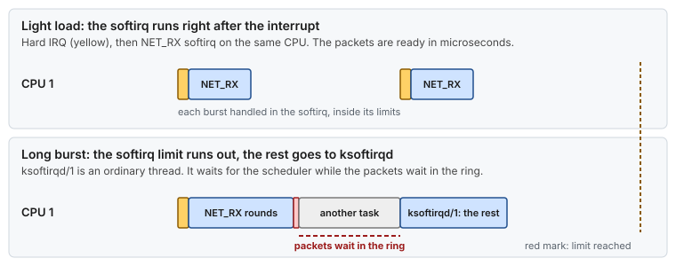
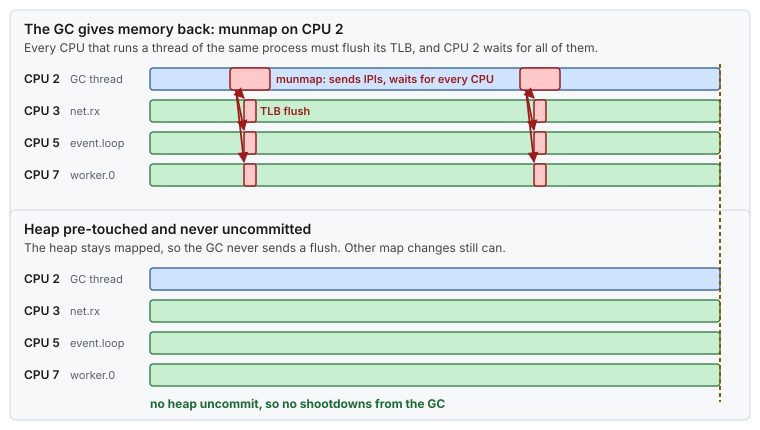

# Concept — Interrupts and Deferred Work: IRQs, Softirqs, IPIs, RCU and Workqueues

> Used by: [Guide 01 §5](../guides/01-grub-bootloader-tuning.md#5-the-parameters-one-by-one), [Guide 02 §5](../guides/02-cpu-core-isolation.md#5-kernel-threads-that-stay-on-isolated-cpus), [Guide 04 §6](../guides/04-network-optimization.md#6-interrupt-affinity-set_nic_irq_affinity). Related: [CPU isolation](cpu-isolation.md), [network path](network-tuning.md), [security mitigations](security-mitigations.md). Use cases: [04](../examples/use-cases/04-one-nic-one-queue-one-cpu.md), [14](../examples/use-cases/14-the-spinner-that-stalled-the-kernel.md), [15](../examples/use-cases/15-the-coalescing-timer.md). Terms: [Glossary](../GLOSSARY.md).

## At a glance

- The kernel does most of its work later, and somewhere else, than the event that caused it: an interrupt raises a softirq, a softirq can hand off to a thread, a freed object waits for an RCU callback, a timer queues a workqueue item.
- Each kind of deferred work has a rule for **which CPU** runs it. Isolation works when every one of those rules points at a housekeeping CPU.
- `/proc/interrupts` and `/proc/softirqs`, read twice, show which kinds still reach an isolated CPU. Each row has one fix.

## 1. Why it matters

A pinned thread on an isolated CPU can still be interrupted by work it never asked for: a packet for another flow, a TLB flush caused by a thread on another CPU, an RCU callback, a statistics timer. Each one takes the CPU for microseconds and evicts some of the thread's cache. [Guide 02](../guides/02-cpu-core-isolation.md) and [Guide 01](../guides/01-grub-bootloader-tuning.md) remove these one by one. This page explains the machinery behind them, so a new row in `/proc/interrupts` has an explanation and a fix.

## 2. Execution contexts, from most urgent to least



*Each level can interrupt every level below it on the same CPU. A user thread, however urgent, runs only when no interrupt, softirq or higher-class thread wants the CPU.*

- **Hard IRQ.** A device or another CPU signals the CPU. The handler runs at once, with interrupts off, and should take 1–5 µs. It does the minimum (acknowledge the device, mask the queue) and leaves the rest for later.
- **Softirq.** The "later" for the most time-critical deferred work. It runs on the **same CPU**, right after the hard IRQ returns. There are ten kinds (`HI`, `TIMER`, `NET_TX`, `NET_RX`, `BLOCK`, `IRQ_POLL`, `TASKLET`, `SCHED`, `HRTIMER`, `RCU`), one row each in `/proc/softirqs`.
- **Kernel threads.** Work that may sleep or take long runs in ordinary threads that the scheduler places: `ksoftirqd/N`, `kworker/N:M`, `rcuo*`, and `irq/NN-name` for threaded interrupts.

## 3. Softirqs and `ksoftirqd`

After a hard IRQ, the kernel runs the pending softirqs. To keep a flood of interrupts from starving everything else, it stops after about 2 ms or 10 rounds, and wakes **`ksoftirqd/N`** to finish the rest. `ksoftirqd` is an ordinary `SCHED_OTHER` thread. It waits its turn like any task, while the packets it should process wait in the NIC ring.



*Inside its limits, a softirq finishes in microseconds. Beyond them, the work becomes a thread that waits for the scheduler.*

The network receive softirq has its own budget inside that limit: `net.core.netdev_budget` packets (300) or `netdev_budget_usecs` (2 ms) per round. Running out of it counts as `time_squeeze` in `/proc/net/softnet_stat` and raises NET_RX again, which often just runs another round at once. Only when the outer limit above is reached, or the CPU must reschedule, does the rest move to `ksoftirqd`. So `time_squeeze` says the NIC is busy, and not by itself that packets waited for the scheduler ([concept: network path §4](network-tuning.md#4-napi-softirq-budget-and-ksoftirqd)).

Two consequences for the layout:

- **Softirqs follow interrupts.** A NIC interrupt on an isolated CPU brings its NET_RX softirq there too, and with it `ksoftirqd`. That is why IRQ affinity, not `isolcpus`, keeps the network off the isolated CPUs ([Guide 04 §6](../guides/04-network-optimization.md#6-interrupt-affinity-set_nic_irq_affinity)).
- **A `SCHED_FIFO` spinner starves `ksoftirqd`.** If anything raises a softirq on its CPU, `ksoftirqd` never runs, and the work it holds stalls ([use case 14](../examples/use-cases/14-the-spinner-that-stalled-the-kernel.md)).

## 4. IPIs: interrupts from other CPUs

An **inter-processor interrupt** ([IPI](../GLOSSARY.md#ipi)) is one CPU interrupting another. It does not come from a device, so IRQ affinity cannot move it. Each kind has its own row in `/proc/interrupts`:

| Row | Kind | Typical cause | How to avoid it on an isolated CPU |
|---|---|---|---|
| `RES` | Reschedule | Another CPU woke a task that should run here | Do not wake threads on isolated CPUs; spin instead of block |
| `CAL` | Function call | Another CPU asked this one to run a function (cache flush, `perf` setup, some memory operations) | Keep tools and admin commands off the critical process |
| `TLB` | TLB shootdown | A thread of the **same process** changed its memory map (`munmap`, `mprotect`, `madvise`, a GC giving memory back) | Fewer map changes on the critical process; huge pages; pre-touch |
| `IWI` | IRQ work | Deferred work from contexts that cannot do it themselves (perf, printk) | Fewer perf events and kernel messages |

The `TLB` row is the one that surprises people. A housekeeping thread of the same JVM that releases memory sends a TLB flush to **every CPU that runs a thread of that process**, including the isolated ones, and waits for each to answer. [Guide 02 §1](../guides/02-cpu-core-isolation.md#1-the-problem-everything-else-that-wants-your-cpu) puts its cost at 1–5 µs per event.



*One `munmap` on a housekeeping CPU reaches every CPU that runs a thread of the same process, isolated or not. A pre-touched heap that is never uncommitted removes the GC's share. Thread creation, class loading and new mappings can still change the map, so watch the `TLB` row.*

> **Picture it.** Every CPU keeps a pocket map of the process's memory. When one thread tears out a page, it has to phone every other holder of the map to cross it out, and it waits on the line until each one confirms.

## 5. RCU: freeing memory later, safely

**Read-Copy-Update** ([RCU](../GLOSSARY.md#rcu)) lets kernel readers run without locks. A writer publishes a new version, and the old one is freed only after a **grace period**: once every CPU has passed through a quiescent state, no reader can still hold it. The freeing runs as an **RCU callback**.

- By default, callbacks run in the `RCU` softirq on the CPU that queued them. A burst of callbacks (many sockets closed, many files deleted) can take that CPU for milliseconds.
- `rcu_nocbs=<isolated CPUs>` offloads callbacks to `rcuo` threads, which [Guide 02](../guides/02-cpu-core-isolation.md) keeps on housekeeping CPUs. `rcu_nocb_poll` lets those threads poll, so the isolated CPU does not even have to wake them ([Guide 01 §5](../guides/01-grub-bootloader-tuning.md#5-the-parameters-one-by-one)).
- A `nohz_full` CPU running in user space counts as quiescent, so it does not hold up grace periods.

## 6. Workqueues and timers

A **workqueue** item is a function the kernel runs later in a `kworker` thread.

- **Bound** work runs on the CPU that queued it (`kworker/5:1`). Something on CPU 5 has to queue it, for example a per-CPU statistics update (`vmstat_update`, tuned by `vm.stat_interval` in [Guide 06](../guides/06-kernel-sysctl-tuning.md#8-virtual-memory)), or an operation that asks every CPU to drain a per-CPU list.
- **Unbound** work runs on any CPU in the workqueue cpumask (`kworker/u64:2`). [Guide 02](../guides/02-cpu-core-isolation.md) sets that mask to the workqueue CPUs, which removes it from the isolated ones.

**Timers** come in two kinds. The timer wheel handles coarse timeouts in jiffies, and expires them in the `TIMER` softirq. High-resolution timers (`hrtimer`) fire at exact times, from the `HRTIMER` softirq or the interrupt itself. Pinned and per-CPU timers fire on the CPU where they were armed. An ordinary timer armed on a `nohz_full` CPU can be moved to a housekeeping CPU (timer migration), so its callback need not interrupt the isolated CPU. The thread it wakes still runs there, so a thread that calls `nanosleep` or `epoll_wait` with a timeout on an isolated CPU still brings a wake-up, often a reschedule IPI, back to it: one more reason to spin.

## 7. Where each kind runs, and the setting that moves it

| Work | Runs on | Moved off isolated CPUs by | Shows in |
|---|---|---|---|
| Device IRQ | The CPUs in its affinity | `smp_affinity_list`, irqbalance off, `isolcpus=managed_irq` | `/proc/interrupts` device rows |
| Softirq | The CPU that took the IRQ | The IRQ's affinity | `/proc/softirqs` |
| `ksoftirqd` | Same CPU as the softirq | The IRQ's affinity | `ps`, `perf sched` |
| IPI | The target CPU | Behavior of the other CPUs (§4) | `RES`, `CAL`, `TLB`, `IWI` |
| RCU callbacks | The CPU that queued them | `rcu_nocbs`, `rcu_nocb_poll` | `RCU` row of `/proc/softirqs` |
| Bound workqueue | The CPU that queued it | Not queuing it (§6) | `kworker/N:*` runtime |
| Unbound workqueue | The workqueue cpumask | `/sys/devices/virtual/workqueue/cpumask` | `kworker/u*` placement |
| Local timer tick | Every CPU | `nohz_full` | `LOC` row |

## 8. Numbers to remember

Typical orders of magnitude, not measurements.

| Event | Typical cost on the CPU that runs it |
|---|---|
| Hard IRQ handler | ~1–5 µs, plus cache damage |
| NET_RX softirq round | µs, up to the 2 ms budget under a burst |
| Waiting for `ksoftirqd` | one scheduler time slice: up to ms |
| One IPI received | ~1–2 µs |
| TLB shootdown, per target CPU | ~1–5 µs, and the sender waits for all targets |
| A burst of RCU callbacks | up to ms |
| One `kworker` item | µs to ms |

## 9. How it shows up

| Symptom | Mechanism | Where it is told |
|---|---|---|
| Spikes on the isolated CPU that track packet rate | A NIC IRQ lands on it | [Use case 04](../examples/use-cases/04-one-nic-one-queue-one-cpu.md) |
| A FIFO spinner and a stuck network or block device on the same CPU | `ksoftirqd` or a `kworker` starved | [Use case 14](../examples/use-cases/14-the-spinner-that-stalled-the-kernel.md) |
| First packet of each burst late by a fixed time | NIC interrupt moderation | [Use case 15](../examples/use-cases/15-the-coalescing-timer.md) |
| `TLB` count rises on isolated CPUs when the GC runs | Shootdowns from the same process | §4 |
| `time_squeeze` grows during bursts | NET_RX budget exhausted; `ksoftirqd` takes over only when the outer softirq limit is reached too | §3 |
| `LOC` near 1000/s on an isolated CPU | The tick did not stop | [Guide 01](../guides/01-grub-bootloader-tuning.md) `nohz_full` |

## 10. Myths

- **"`isolcpus` keeps interrupts away."** It keeps tasks away. Device IRQs follow their affinity, and IPIs follow the other CPUs. Each needs its own setting.
- **"A `kworker/5:1` on CPU 5 is a problem."** Its existence is fine. What matters is whether it wakes up. Measure runtime, not presence.
- **"Softirqs run where the application reads the socket."** They run where the interrupt landed (or where RPS sends them), which may be far from the reader.
- **"IPIs come from devices."** They come from other CPUs, usually because of something the same process or the scheduler did.

## 11. See it on your host

Read-only. Compare two snapshots of one CPU's column. Run it for an isolated CPU while the application runs:

```bash
cpu=5; col=$((cpu + 2))      # field 1 is the row name, field 2 is CPU0
snap() { awk -v c="$col" 'NR > 1 { print $1, $c }' "$1"; }
snap /proc/interrupts >/tmp/i1; snap /proc/softirqs >/tmp/s1
sleep 10
snap /proc/interrupts >/tmp/i2; snap /proc/softirqs >/tmp/s2
paste /tmp/i1 /tmp/i2 | awk '$4 - $2 > 0 { print "irq", $1, $4 - $2 }'
paste /tmp/s1 /tmp/s2 | awk '$4 - $2 > 0 { print "softirq", $1, $4 - $2 }'
# on a well isolated CPU: LOC around 10 (residual tick), nothing else, or a few explainable rows
```

Every line that remains points at a section above: a device row at §7, `RES`/`CAL`/`TLB` at §4, `RCU` at §5, `TIMER`/`HRTIMER` at §6. To see who caused the events, trace them on that CPU for a few seconds:

```bash
trace-cmd record -M 0x20 -e irq_vectors -e irq -e workqueue:workqueue_execute_start sleep 5   # 0x20 = CPU 5
trace-cmd report | head -50
```

## 12. Illustrative scenario

An illustrative case, not a measurement. A JVM gateway showed a 20 µs spike on its isolated `net.rx` CPU every few minutes. The delta method found nothing in the device rows, but the `TLB` row grew by a few hundred during each spike. The spikes lined up with the garbage collector giving unused heap back to the operating system: a GC thread on a housekeeping CPU called `madvise` and `munmap`, and every CPU running a thread of the JVM received a TLB flush. Pre-touching the heap, turning off heap uncommit and moving off-heap buffers to huge pages removed the map changes (`-XX:+AlwaysPreTouch`, heap uncommit off), and the `TLB` row stopped moving. The [JVM pauses concept](jvm-pauses.md#4-garbage-collection-with-zgc) covers the flags.

## 13. Key takeaways

- An interrupt is only the start: its softirq, its `ksoftirqd`, its RCU callbacks and its workqueue items all follow rules about where they run.
- Device IRQs move with affinity. Softirqs follow their IRQ. IPIs follow what other CPUs do. RCU and workqueues need their own settings.
- `ksoftirqd` is an ordinary thread. When softirq work spills into it, latency becomes scheduling latency.
- The `TLB` row is the one most often missed: memory map changes in the same process reach every CPU it runs on.
- Diff `/proc/interrupts` and `/proc/softirqs` per CPU. Each row that still moves has one owner and one fix.

## 14. References

- <https://docs.kernel.org/core-api/irq/index.html>
- <https://docs.kernel.org/RCU/whatisRCU.html>
- <https://docs.kernel.org/core-api/workqueue.html>
- <https://docs.kernel.org/admin-guide/kernel-per-CPU-kthreads.html>
- <https://docs.kernel.org/timers/highres.html>
- `man 5 proc` (`/proc/interrupts`, `/proc/softirqs`)
