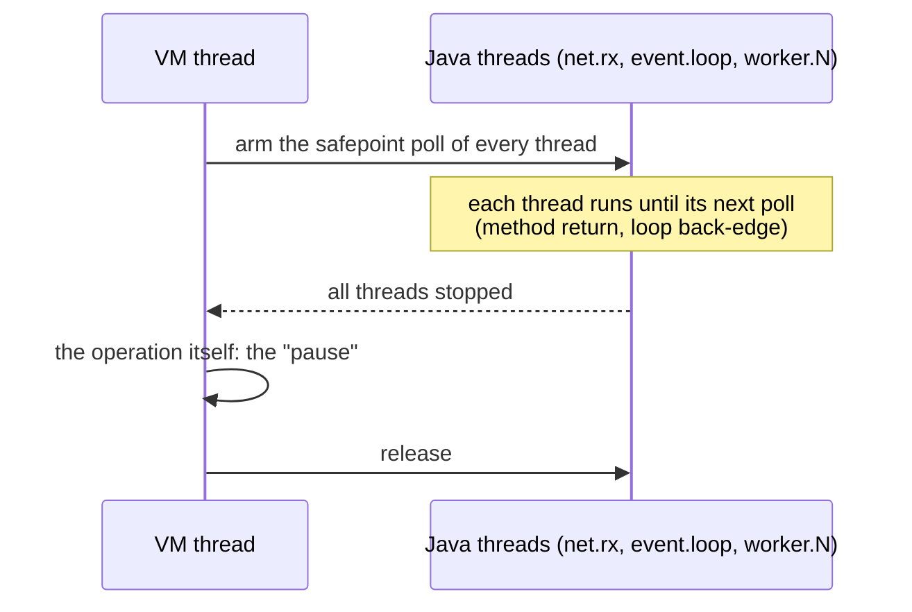
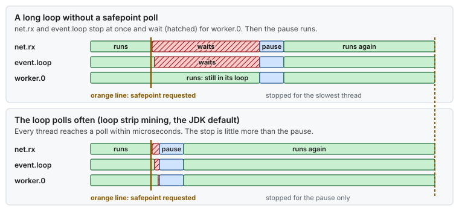

# Concept — JVM Pauses: Safepoints, GC, JIT Warm-up and Deoptimization

> Used by: [Guide 03 §5](../guides/03-huge-pages-configuration.md#5-java-applications), [Java example](../examples/hugepages-java-example.md). Related: [thread handoff](thread-handoff.md), [interrupts and deferred work](interrupts-and-deferred-work.md), [memory reclaim](memory-reclaim.md), [logging and I/O](logging-and-io.md). Code: [Java probe](../examples/java-latency-probe/). Terms: [Glossary](../GLOSSARY.md).

## At a glance

- A pinned Java thread on an isolated CPU can still be stopped by the JVM itself. Every stop-the-world operation waits until **all** Java threads reach a safepoint, then runs, then lets them go.
- With ZGC, the pause itself is usually well under a millisecond. The time to reach the safepoint, and the stalls that are not pauses at all (allocation stalls, deoptimization, class loading, a cold JIT), often cost more.
- Log them: `-Xlog:safepoint` and `-Xlog:gc` (asynchronously), or JFR. A pause you cannot see in the logs is not a pause you can fix.

## 1. Why it matters

The other concepts remove what the operating system and the hardware do to a thread. A JVM adds its own layer: it compiles code while it runs, collects garbage, and sometimes needs every thread to stop at a known point. The flags in [Guide 03 §5](../guides/03-huge-pages-configuration.md#5-java-applications) remove the memory part (pre-touched huge pages, no uncommit). This page covers the rest, so that a 300 µs spike in the probe or the application can be traced to the JVM event that caused it, or ruled out.

## 2. Safepoints

A **safepoint** is a point in the code where the JVM knows exactly where every object reference is. Some operations need all Java threads stopped at one: some GC phases, a heap dump, a thread dump, class redefinition, some deoptimizations. They run in four steps:



*The stop lasts from the request until the release. The slowest thread to reach a poll decides the first part, the operation decides the second.*

Two parts, and they are measured separately:

| Part | Name in `-Xlog:safepoint` | Decided by |
|---|---|---|
| From request until every thread is stopped | "Reaching safepoint", **time to safepoint** (TTSP) | The thread that takes longest to reach a poll |
| The operation | "At safepoint" | The operation (a GC phase, a dump) |

**Handshakes** let the JVM run an operation on one thread at a time instead of stopping all of them, and recent JDKs use them for much of what used to need a global safepoint. ZGC scans thread stacks concurrently, so its pauses do not grow with the number of threads.

## 3. Time to safepoint

A thread stops only at a **poll**. Compiled code polls on method return and on loop back-edges. Three things delay a thread on its way to the next poll:

- **A long loop without a poll.** The JIT used to remove polls from counted (`int`-indexed) loops. Since JDK 10, **loop strip mining** splits such loops into chunks of 1,000 iterations with a poll between them, and it is on by default with G1 and ZGC. Very long intrinsics (huge array copies or fills) can still delay a thread.
- **A thread that is not running.** A thread that the operating system has descheduled cannot reach its poll until it runs again. On an oversubscribed host, TTSP includes scheduler delay. On isolated CPUs with one pinned thread each, it does not.
- **A page fault or a stall on the way.** Anything that slows the thread before its next poll slows every other thread's release.



*Every thread waits for the slowest one to arrive. With frequent polls, the stop shrinks to the pause itself.*

A thread inside a native call (JNI, or an FFM downcall like the probe's [`ThreadAffinity`](../examples/java-latency-probe/src/main/java/com/example/lowlat/ThreadAffinity.java)) counts as already stopped. It is held only if it tries to return to Java during the pause.

## 4. Garbage collection with ZGC

On JDK 25, ZGC is always generational. Almost all its work runs concurrently in GC threads, next to the application. Each young and old collection has three short stop-the-world pauses (mark start, mark end, relocate start), typically tens to a few hundred microseconds each, independent of heap size.

What can still stop or slow a latency thread:

| Event | What happens | Log line or event |
|---|---|---|
| The three ZGC pauses | Every Java thread stops, briefly | `-Xlog:gc*`: `Pause Mark Start`, `Pause Mark End`, `Pause Relocate Start` |
| **Allocation stall** | The application allocates faster than ZGC frees. The allocating thread **waits** until memory is freed. It is not a pause, so `-Xlog:safepoint` does not show it | `-Xlog:gc`: `Allocation Stall`; JFR `jdk.ZAllocationStall` |
| Load barriers | Reading a reference may take a slow path while objects move | Spread out, small; seen as a higher median |
| GC threads | They need CPU time. Unpinned, they run on the OS CPUs ([Java example](../examples/hugepages-java-example.md)) | — |
| Heap uncommit | Giving memory back changes the memory map: TLB shootdowns to every CPU running the JVM ([interrupts and deferred work §4](interrupts-and-deferred-work.md#4-ipis-interrupts-from-other-cpus)) | `-XX:-ZUncommit` removes it |

The best GC pause is the one for garbage that was never made. A hot path that allocates nothing per message (pre-allocated messages, rings of reused slots, primitives instead of boxed values) leaves ZGC little to do and never meets an allocation stall.

## 5. The JIT: warm-up and deoptimization

The JVM starts by interpreting bytecode, then compiles hot methods with C1, then recompiles the hottest with C2 using what it has seen (types, branches taken). Until C2 code exists, the hot path runs 10–100 times slower.

- **Warm-up.** Send representative traffic before taking real traffic, long enough for every hot path to reach C2. The probe throws away its first 1,000,000 round trips for this reason ([Java example](../examples/hugepages-java-example.md)).
- **Deoptimization.** C2 code relies on assumptions: "this branch is never taken", "this call always reaches one class". When an assumption breaks (the first rare message, a new subclass loaded), the JVM throws the compiled code away, runs that path in the interpreter, and compiles again later. The first rare message pays it, and so do the next few. Warm-up should include the rare cases too.
- **Code cache full.** If the code cache fills, the JIT stops compiling (`CodeCache is full. Compiler has been disabled`), and new hot code stays interpreted. Size `-XX:ReservedCodeCacheSize` with room to spare.

## 6. Class loading and first use

The first use of a class loads it from disk (I/O, perhaps a major fault on the JAR), verifies it and runs its static initializer, all on the thread that touched it. The first message of a new type, the first error path, the first log line at a new level: each can cost milliseconds once. Touch these paths during warm-up. Class Data Sharing (CDS, and AppCDS for application classes) makes loading cheaper at start-up.

## 7. Seeing it: logs and JFR

Unified logging writes to a file, and file writes can block ([logging and I/O](logging-and-io.md)). `-Xlog:async` (JDK 17+) moves that I/O to a separate thread:

```text
-Xlog:async
-Xlog:safepoint*=info,gc*=info:file=log/jvm.log:uptimenanos,tags:filecount=10,filesize=50m
```

A safepoint line then looks like this (operation name and values illustrative):

```text
[...][safepoint] Safepoint "ZMarkEnd", Time since last: 1003421337 ns, Reaching safepoint: 2810 ns, At safepoint: 41250 ns, Total: 44060 ns
```

Reaching safepoint is TTSP, At safepoint is the operation. For the stalls that are not safepoints, use JFR, which costs about 1 % with the default settings:

```bash
jcmd <pid> JFR.start duration=10m filename=/var/tmp/app.jfr
jfr print --events jdk.SafepointBegin,jdk.GCPhasePause,jdk.ZAllocationStall,jdk.Deoptimization,jdk.ClassLoad /var/tmp/app.jfr | head
```

> [!WARNING]
> A thread dump (`jcmd <pid> Thread.print`, `jstack`), a heap histogram or a heap dump pauses the JVM: a heap dump for seconds. Never run them as a casual check on a production latency JVM.

## 8. Numbers to remember

Typical orders of magnitude, not measurements.

| Event | Typical cost |
|---|---|
| One ZGC pause | ~10 µs to a few hundred µs |
| Time to safepoint, pinned threads, polls everywhere | a few µs |
| Time to safepoint, a long loop or a descheduled thread | up to ms |
| Interpreted vs C2-compiled hot path | 10–100× slower |
| A deoptimization on the hot path | tens of µs to ms, for the next few calls |
| First load of a class | ~0.1–1 ms |
| A ZGC allocation stall | ms |
| JFR overhead, default settings | ~1 % |

## 9. How it shows up

| Symptom | Mechanism | Check |
|---|---|---|
| Every pinned thread stalls at the same instant | A safepoint | `-Xlog:safepoint`, Total near the stall |
| The stall is much longer than "At safepoint" | Time to safepoint (§3) | "Reaching safepoint" |
| One thread stalls in ms; safepoint log is quiet | Allocation stall, class load or deoptimization | JFR events of §7 |
| Slow for the first minutes, then fine | JIT warm-up, class loading | Warm up with representative traffic |
| A spike on the first rare message of the day | Deoptimization or first class use | `jdk.Deoptimization`, `jdk.ClassLoad` |
| `TLB` rises on isolated CPUs during GC | Heap uncommit | `-XX:-ZUncommit` |
| Latency rises steadily after hours; JIT log says the code cache is full | Compilation stopped | `-XX:ReservedCodeCacheSize` |

## 10. Myths

- **"ZGC has no pauses."** It has three short ones per cycle, and it can stall an allocating thread. Both are small and both are measurable.
- **"My thread is pinned and isolated, so the JVM cannot stop it."** Every Java thread takes part in every global safepoint.
- **"Counted loops block safepoints."** They did in old JDKs. With loop strip mining (default since JDK 10 with G1 and ZGC), they poll every 1,000 iterations.
- **"Biased locking revocations cause pauses."** Biased locking was removed in JDK 18. On JDK 25 it does not exist.

## 11. See it on your host

Run the [Java probe](../examples/java-latency-probe/) with safepoint and GC logging added to its options, and compare its slowest round trips with the log:

```bash
cd examples/java-latency-probe
printf '%s\n' '-Xlog:async' '-Xlog:safepoint*=info,gc*=info:file=log/jvm.log:uptimenanos,tags' >>conf/jvm.options   # jvm-low-resource.options on a VM
APP_NUMA_NODE=1 bin/launch
grep -E 'Safepoint "|Pause|Allocation Stall' log/jvm.log | tail -20
# Total of each safepoint in ns; with -Xmx and a small working set there may be no GC at all
git checkout conf/
```

Then run it with a small heap (`-Xmx256m` in a copy of the options) and a working set that allocates, to see ZGC cycles and their pauses appear. The probe's own `rtt` maximum should match the longest `Total` within the run, when a safepoint was the cause.

## 12. Illustrative scenario

An illustrative case, not a measurement. A JVM gateway on a tuned host had a p99.99 of 15 µs and a max of 2.1 ms, a few times an hour. `rtla osnoise` on the isolated CPUs was clean, so the cause was inside the process. The safepoint log showed `Total` values around 2 ms with "Reaching safepoint" at 1.9 ms: a reporting thread on the OS CPUs ran a long `System.arraycopy` of a large snapshot array when a ZGC pause was requested, and every pinned thread waited for it. Splitting the copy into 64 KiB chunks brought "Reaching safepoint" under 10 µs. A second, rarer 0.8 ms spike had no safepoint at all: JFR showed `jdk.Deoptimization` on the first order type of the day that the warm-up never sent. Adding that type to the warm-up removed it.

## 13. Key takeaways

- Every Java thread, pinned or not, stops at every global safepoint. Measure time to safepoint and the operation separately.
- ZGC pauses are short. Allocation stalls, deoptimization, class loading and a cold JIT are the JVM stalls that are not pauses, and JFR shows them.
- Allocate nothing per message on the hot path, so the GC has little to do.
- Warm up with representative traffic, rare cases included.
- Log safepoints and GC asynchronously (`-Xlog:async`), and never take thread or heap dumps casually on a production latency JVM.

## 14. References

- <https://docs.oracle.com/en/java/javase/25/gctuning/z-garbage-collector.html>
- <https://openjdk.org/jeps/439> (Generational ZGC), <https://openjdk.org/jeps/376> (concurrent thread-stack processing), <https://openjdk.org/jeps/312> (handshakes), <https://openjdk.org/jeps/374> (biased locking)
- `java` command documentation, `-Xlog` (unified logging)
- <https://docs.oracle.com/en/java/javase/25/jfapi/>
- Nitsan Wakart, *Safepoints: Meaning, Side Effects and Overheads* (blog)
