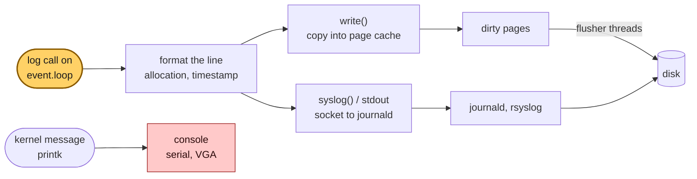
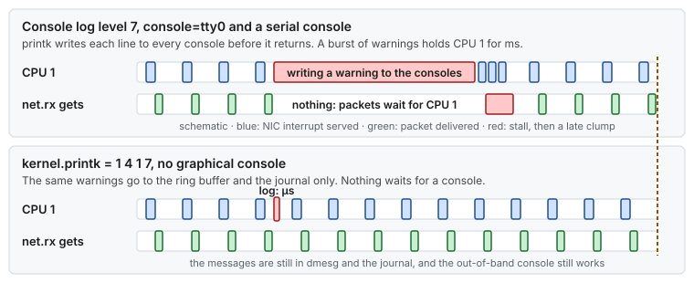
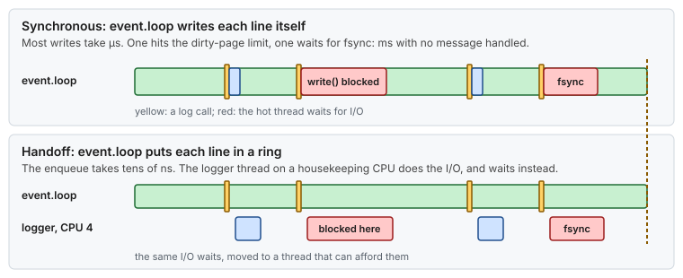

# Concept — Logging and I/O on the Hot Path: Page Cache, Writeback, fsync and the Console

> Used by: [Guide 06 §2, §8](../guides/06-kernel-sysctl-tuning.md#2-kernel-logging-and-debug), [Guide 07](../guides/07-os-hygiene.md). Related: [memory reclaim and faults](memory-reclaim.md), [interrupts and deferred work](interrupts-and-deferred-work.md), [clocks and time](clocks-and-time.md). Use case: [16](../examples/use-cases/16-the-log-line-that-cost-five-milliseconds.md). Terms: [Glossary](../GLOSSARY.md).

## At a glance

- A log line looks cheap because `write()` only copies into the page cache. Usually it takes microseconds. Now and then it blocks for milliseconds: at the dirty-page limit, on a new block of the file, on `fsync`, or on a slow consumer at the other end of a socket.
- The kernel's own messages are worse: more urgent than the console log level, they are printed to the console synchronously, at the speed of a serial line.
- The hot path should not do I/O. Put the line into a ring, and let a logger thread on a housekeeping CPU do the writing and the waiting.

## 1. Why it matters

Every latency-critical application logs: audit trails, journals, errors, metrics. Logging is also the most common way that I/O gets onto the hot path unnoticed, because the call looks like a string operation. The guides keep the kernel's console quiet ([Guide 06 §2](../guides/06-kernel-sysctl-tuning.md#2-kernel-logging-and-debug)) and start writeback early ([Guide 06 §8](../guides/06-kernel-sysctl-tuning.md#8-virtual-memory)). This page shows every place a log line can wait, so the application's own logging can be designed to never wait on the critical thread.

## 2. The path of a log line



*An application line goes to the page cache or to a logging daemon, and reaches the disk later. A kernel line more urgent than the console log level goes to the console at once, on the CPU that printed it.*

## 3. Where a log line waits

| Step | Usually | Can block when | For |
|---|---|---|---|
| Format (string building, allocation) | 0.5–5 µs | The allocation triggers a GC or a page fault | µs to ms |
| `write()` into the page cache | 1–5 µs (a system call and a copy) | Dirty pages reach `vm.dirty_ratio`: the writer is **throttled** | ms to seconds |
| | | The write extends the file: a new page (reclaim) and a new block (filesystem journal) | µs to ms |
| | | The file's modification time changes: a metadata update in the filesystem journal | µs to ms |
| `fsync()` / `fdatasync()` | — | Always: it waits for the disk | 0.1 ms (NVMe) to tens of ms |
| `syslog()` or stdout to journald | 2–10 µs | journald is slow and the socket buffer is full | ms to seconds |
| Kernel message (`printk`) | µs into the ring buffer | Its level is more urgent than the console log level: printed synchronously to every console | ~7 ms per line on a 115200-baud serial console |

The common case is fast, which is why logging passes every benchmark. The blocking cases are rare and depend on what the rest of the host is doing: another process filling the page cache, journald rotating, a disk busy with a backup. They set the maximum, not the median.

### 3.1 Dirty throttling

Every `write()` makes pages dirty. When dirty pages pass `vm.dirty_background_ratio`, flusher threads start writing them out. When they pass `vm.dirty_ratio`, the kernel makes **each writing thread wait** inside `write()` until enough has been written ([memory reclaim §6](memory-reclaim.md#6-dirty-pages-and-writeback)). The limit is global: a backup or a log shipper writing gigabytes can push the host over it, and the critical thread's next small `write()` waits for their data.

### 3.2 fsync

`fsync()` returns only when the data and the metadata needed to read it back are on stable storage. On NVMe that is about 0.1 ms, on a busy disk or a network filesystem much more. A journal that must survive a crash needs it. The hot path does not: it can hand the line to a thread that batches many lines into one `fsync`.

### 3.3 The kernel console

`printk` stores each kernel message in a ring buffer, which is fast. Messages with a level above the **console log level** are also written to every console, **synchronously**, on the CPU that printed them. A serial console at 115,200 baud sends about 11,500 characters per second, so one 80-character line holds the CPU for about 7 ms ([use case 16](../examples/use-cases/16-the-log-line-that-cost-five-milliseconds.md)).



*A kernel warning on a housekeeping CPU holds that CPU while it prints to the console, and the interrupts it should serve wait.*

`kernel.printk = 1 4 1 7` ([Guide 06 §2](../guides/06-kernel-sysctl-tuning.md#2-kernel-logging-and-debug)) sends only emergencies to the console. Every message still reaches `dmesg` and the journal.

### 3.4 Interrupts from the disk

A write that reaches an NVMe disk completes with an interrupt. NVMe drivers create one queue per CPU, and the completion interrupt of a queue is often delivered to the CPU that submitted the I/O. A critical thread that calls `fsync` itself can therefore bring a disk interrupt back to its own isolated CPU. `isolcpus=managed_irq` asks the kernel to keep such interrupts on housekeeping CPUs where it can ([Guide 04 §6](../guides/04-network-optimization.md#6-interrupt-affinity-set_nic_irq_affinity)).

## 4. The design: hand off, do not write



*The I/O waits do not disappear. They move to a thread whose delay costs nothing.*

> **Picture it.** A waiter who walks every order to the kitchen and waits for the chef to read it serves one table at a time. A waiter who drops the order slip on a spike and goes back to the room serves them all; the kitchen reads the spike at its own pace.

| Rule | Why |
|---|---|
| **Enqueue, do not write.** The critical thread puts a fixed-size record in a single-producer, single-consumer ring ([SPSC](../GLOSSARY.md#spsc)). | An enqueue is a few stores and one cache line handoff: tens of ns. |
| **Log fields, format later.** Put the raw values (IDs, numbers, a template index) in the ring. The logger thread formats them. | No string building and no allocation on the hot path. |
| **Pin the logger to a housekeeping CPU.** | Its system calls, faults and disk interrupts land on a CPU that can afford them. |
| **Decide what happens when the ring is full.** Drop and count, or block. | Blocking moves the I/O wait back onto the hot path. A counted drop is visible and bounded. Audit logs may require blocking: then size the ring for the worst burst ([`size-buffers`](../scripts/size-buffers) gives the arithmetic for a queue). |
| **Batch the `fsync`.** One per N lines or per few ms, on the logger thread. | One disk wait covers many lines. If a message may be acknowledged only once its record is on disk, see the note below. |
| **Pre-create the next file.** Allocate (`fallocate`) and pre-touch it before rotation, on the logger thread. | No block allocation or page fault when the file is first written. |
| **Timestamp with MONOTONIC on the hot path.** Convert to wall-clock time in the logger. | A `CLOCK_MONOTONIC` read is cheap and never jumps ([clocks and time §4](clocks-and-time.md#4-which-clock-to-read)). |

> [!IMPORTANT]
> A handoff changes what is durable when. If the application acknowledges work only after its record is on disk (an order journal, say), the critical thread must not acknowledge on enqueue: it waits for the logger to report that its sequence is synced (group commit), which keeps the `fsync` off the critical thread but not its wait. If it acknowledges at once, the design accepts that a crash loses the records since the last sync. Decide which, and write it down.

In Java, this is what an asynchronous logger with a preallocated ring does ([Log4j 2](../GLOSSARY.md#log4j)'s asynchronous loggers are one example), and the same structure as the probe's [`PaddedSequence`](../examples/java-latency-probe/src/main/java/com/example/lowlat/PaddedSequence.java) handoff. Whatever the library, check that it does not allocate per call and that its appender thread is pinned.

## 5. The rest of the storage path

- **Mount options.** `noatime` ([Guide 07 §4](../guides/07-os-hygiene.md#4-noatime)) removes the metadata write that reading a file can cause. Writes still update the modification time.
- **Writeback threads** are unbound workqueue items, so they run on the workqueue CPUs that [Guide 02](../guides/02-cpu-core-isolation.md) sets, never on isolated CPUs.
- **I/O priority.** `IOWeight=` on the housekeeping slice ([Guide 05](../guides/05-cgroup-isolation.md)) makes agents yield the disk to the application's own logger under contention.
- **journald** rate-limits and may drop bursts. For an application log that must be complete, write files from the logger thread instead of through stdout.

## 6. Numbers to remember

Typical orders of magnitude, not measurements.

| Event | Typical cost |
|---|---|
| Enqueue a record in an SPSC ring | ~20–100 ns |
| Format a log line with allocation (JVM) | ~0.5–5 µs |
| `write()` of one line into the page cache | ~1–5 µs |
| Writer throttled at `dirty_ratio` | ms to seconds |
| `fsync` on NVMe / on a busy disk | ~0.1 ms / ~10 ms+ |
| One 80-character kernel line on a 115200-baud console | ~7 ms |

## 7. How it shows up

| Symptom | Mechanism | Check |
|---|---|---|
| A ms stall that lines up with a kernel warning in `dmesg` | Synchronous console print | `sysctl kernel.printk`, [use case 16](../examples/use-cases/16-the-log-line-that-cost-five-milliseconds.md) |
| Stalls while another process writes a lot (a backup, a log shipper) | Dirty throttling hits every writer | `grep -E '^(Dirty|Writeback):' /proc/meminfo` |
| A stall at every log rotation | New file: block allocation and first-touch faults | Pre-create the next file (§4) |
| The critical CPU shows disk interrupts in `/proc/interrupts` | The critical thread does its own I/O (§3.4) | Hand the I/O off |
| Stalls when journald is busy or rotating | The stdout or syslog socket is full | `journalctl --disk-usage`, journald rate-limit messages |

## 8. Myths

- **"`write()` is non-blocking because it only copies to memory."** It is usually fast, and it can block at the dirty limit, on a page allocation or on a filesystem lock.
- **"Logging at DEBUG off costs nothing."** A disabled call can still build its message or its arguments before the level check. Check the call site, not only the level.
- **"An async logger is enough."** Not if it formats on the caller's thread, allocates per call, or blocks when its queue is full.
- **"Kernel messages only matter when something is wrong."** A harmless warning printed to a slow console stalls a CPU the same way.

## 9. See it on your host

1. Read the settings that decide when writers wait (read-only):

   ```bash
   sysctl kernel.printk vm.dirty_background_ratio vm.dirty_ratio vm.dirty_expire_centisecs
   # kernel.printk = 1 4 1 7 ; 3 ; 10 ; 3000 on a tuned host
   grep -E '^(Dirty|Writeback):' /proc/meminfo
   ```

2. On a development box, watch one writer get throttled by another one's dirty data. Neither uses `fsync`, so any wait is in `write()` itself:

   ```bash
   lab="$(mktemp -d /var/tmp/writeback-lab.XXXXXX)"       # a private directory: nothing else is overwritten
   # a large buffered writer in the background (size it to about twice dirty_ratio of your RAM)
   dd if=/dev/zero of="$lab/fill" bs=1M count=8192 status=none &
   # a small buffered writer, timed once a second: 2,560 writes of 4 KiB
   TIMEFORMAT='%R s'
   for i in $(seq 10); do time dd if=/dev/zero of="$lab/small" bs=4k count=2560 status=none; grep '^Dirty:' /proc/meminfo; sleep 1; done
   wait; rm -rf "$lab"
   # a few ms while Dirty is low; tens to hundreds of ms once Dirty reaches the dirty_ratio limit
   ```

   The small writer did nothing different. It was throttled because of the other process's data. `strace -T -e trace=write` on the small `dd` shows the time of each `write()`.

## 10. Illustrative scenario

An illustrative case, not a measurement. A gateway wrote an audit line per order with a synchronous file appender, and its p99.99 was 40 µs, except for 3–15 ms stalls a few times an hour. The stalls matched the minutes when a log shipper on the same host compressed and copied old files: `Dirty` in `/proc/meminfo` climbed to the `dirty_ratio` limit, and the gateway's next `write()` waited. The team moved the audit appender behind a 64 Ki-entry SPSC ring, drained by a logger thread pinned to housekeeping CPU 4 that formats, writes and calls `fdatasync` every 2 ms. The `event.loop` cost per audit line fell to about 60 ns, and the stalls left the gateway; they now appear only in the logger thread's own lag metric.

## 11. Key takeaways

- Logging is I/O. It is usually fast and occasionally slow, and the occasional case sets your maximum latency.
- The critical thread enqueues fixed-size records. A logger thread on a housekeeping CPU formats, writes, syncs and rotates.
- Keep the kernel console quiet (`kernel.printk = 1 4 1 7`), and start writeback early so no writer reaches `dirty_ratio`.
- Decide the full-ring policy on purpose: drop and count, or size the ring for the worst burst.
- Never call `fsync` on the critical thread. Batch it on the logger.

## 12. References

- <https://docs.kernel.org/admin-guide/sysctl/vm.html> (`dirty_*`)
- <https://docs.kernel.org/core-api/printk-basics.html>
- `man 2 write`, `man 2 fsync`, `man 2 fallocate`, `man 5 journald.conf`
- Martin Thompson, *Mechanical Sympathy* blog (single writer, asynchronous logging)
- LMAX, *Disruptor* technical paper
