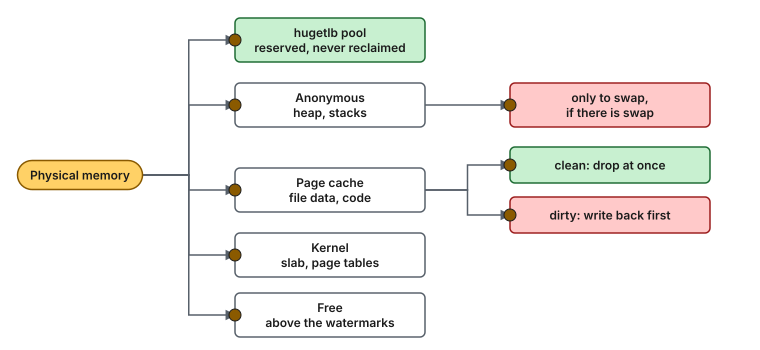
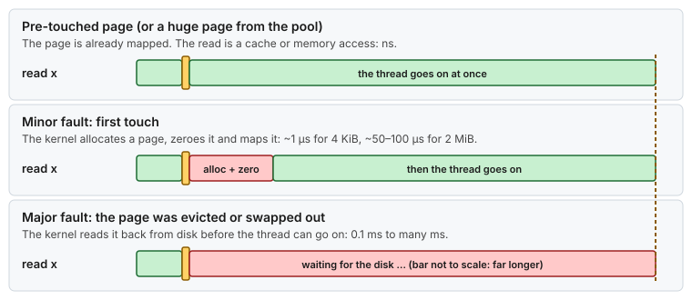

# Concept — Memory Reclaim and Faults: Page Cache, Watermarks, kswapd, Compaction and Writeback

> Used by: [Guide 06 §8](../guides/06-kernel-sysctl-tuning.md#8-virtual-memory), [Guide 03](../guides/03-huge-pages-configuration.md). Related: [huge pages and NUMA](huge-pages.md) (page tables, TLB, first touch), [cgroups](cgroups.md) (memory limits, PSI), [interrupts and deferred work](interrupts-and-deferred-work.md). Use cases: [05](../examples/use-cases/05-page-faults-on-the-hot-path.md), [17](../examples/use-cases/17-memory-pressure-on-a-latency-host.md). Terms: [Glossary](../GLOSSARY.md).

## At a glance

- On a busy host, free memory always runs out: the page cache takes whatever is free. Latency depends on **who** gives memory back, and **when**.
- Above the watermarks, `kswapd` reclaims in the background on a housekeeping CPU. Below the min watermark, the thread that asked for memory reclaims it, inline, for milliseconds.
- A page that is not in memory when the thread touches it costs a fault: about a microsecond if it only needs a fresh page, a disk read if it was evicted.

## 1. Why it matters

The [huge pages concept](huge-pages.md) explains how a page gets mapped the first time. This page is about the rest of a page's life: how it ages, how the kernel takes it back, and what a thread pays when the page it needs is gone. These events are rare, which is why they set the maximum latency, and they often appear only after days of uptime, when the host has filled its memory ([use case 17](../examples/use-cases/17-memory-pressure-on-a-latency-host.md)).

## 2. Where the memory goes



*Memory is a set of pools. The kernel can take back clean page cache cheaply, dirty page cache only after writing it, and anonymous memory only to swap. The hugetlb pool is never taken back.*

| `/proc/meminfo` line | Pool | Reclaimable? |
|---|---|---|
| `MemFree` | Free pages | — |
| `Cached`, `Active(file)`, `Inactive(file)` | Page cache | Yes. Clean pages are dropped; dirty ones are written first. |
| `Dirty`, `Writeback` | Page cache waiting for, or in, write-back | Only after the write |
| `AnonPages`, `Active(anon)`, `Inactive(anon)` | Process memory without a file | Only to swap ([swap and the OOM killer](swap-and-oom.md)) |
| `SReclaimable` / `SUnreclaim` | Kernel caches (dentries, inodes) / kernel objects | Partly |
| `Mlocked` | Pages locked with `mlock` | No |
| `HugePages_Total` × `Hugepagesize` | The hugetlb pool | No |
| `MemAvailable` | An estimate of what could be freed without swapping | — |

`MemFree` low and `MemAvailable` high is normal: the page cache is using the room. `MemAvailable` low is the warning.

## 3. Aging: the LRU lists

The kernel keeps file pages and anonymous pages on separate **LRU** lists, each split into **active** and **inactive**. A new page starts inactive. A page that is used again moves to active. Reclaim takes pages from the tail of the inactive lists, so a page used once is evicted before a page used often. When an evicted page is needed again soon, the kernel counts a **refault** (`workingset_refault_file` and `_anon` in `/proc/vmstat`, or one `workingset_refault` on RHEL 8), and takes it as a sign that the lists are too short.

## 4. Watermarks: who reclaims

> **Picture it.** Watermarks are the lines on a fuel gauge. Below `low`, a helper (`kswapd`) starts refilling in the background. Below `min`, whoever asks for fuel has to pump it themselves, and waits.

Each memory zone (on x86-64, mainly `Normal` on each NUMA node) has three watermarks, `min` < `low` < `high`, in pages:

| Free pages in the zone | What happens |
|---|---|
| Above `low` | Allocations succeed at once. |
| Below `low` | The node's **`kswapd`** thread wakes and reclaims in the background until free pages reach `high`. Allocations still succeed. |
| Below `min` | The allocating thread runs **direct reclaim** itself, on its own CPU, before it gets its page. It can take milliseconds. |


*The watermarks decide who pays for reclaim: `kswapd` on a housekeeping CPU, or the thread that asked for memory.*

`vm.min_free_kbytes` sets `min`, and `low` and `high` follow it: each gap is the larger of a quarter of `min` and the `vm.watermark_scale_factor` share of the zone. [Guide 06 §8](../guides/06-kernel-sysctl-tuning.md#8-virtual-memory) raises it, so `kswapd` starts early and a burst of allocations has a cushion. `vm.watermark_scale_factor` widens the gap between the marks without raising `min`.

> [!NOTE]
> **Validate on your hardware.** `vm.watermark_scale_factor` (default `10`, meaning a gap of at least 0.1 % of the zone, or a quarter of `min` if that is larger) is an alternative to a large `min_free_kbytes`. The guides use `min_free_kbytes` only.

Reclaim is per NUMA node. With `vm.zone_reclaim_mode=0` (the RHEL default), a node that is short of memory takes pages from another node instead of reclaiming locally. Keep it at `0`: a value of `1` makes allocations stall to reclaim on their own node.

## 5. Compaction: free is not enough

Some allocations need several contiguous pages: a 2 MiB huge page needs 512, and some drivers and kernel structures ask for 2, 4 or 8. After days of uptime, free memory is scattered in single pages. To serve a larger request, the kernel **compacts**: it moves pages around to make a contiguous block. `kcompactd` does it in the background. If that is not enough, the allocating thread does **direct compaction** itself, counted as `compact_stall` in `/proc/vmstat`.

This is one reason the guides reserve huge pages per node at early boot ([Guide 03](../guides/03-huge-pages-configuration.md#4-reserving-the-pages)) and keep THP off: a THP allocation at run time can trigger direct compaction on the hot path, while a pool reserved at boot never needs it.

## 6. Dirty pages and writeback

A `write()` to a file only copies the data into the page cache and marks the pages **dirty**. Flusher threads write them to disk later. Two limits shape this, both in percent of reclaimable memory:

| Key | When it acts | Effect |
|---|---|---|
| `vm.dirty_background_ratio` | Dirty pages above it | Flusher threads start writing in the background |
| `vm.dirty_ratio` | Dirty pages above it | **The writing thread is throttled**: `write()` blocks until enough is written |
| `vm.dirty_expire_centisecs` | A page dirty for longer than this (30 s) | Written at the next flush |

Dirty pages also slow reclaim, because they cannot be dropped until they are written. The [logging and I/O concept](logging-and-io.md#31-dirty-throttling) shows what this means for a thread that writes a journal.

## 7. Faults: what a missing page costs



*The same read costs nanoseconds, a microsecond or milliseconds, depending on where the page is.*

| Fault | When | Cost | Prevented by |
|---|---|---|---|
| **Minor** | First touch of anonymous memory, or a page already in the page cache but not yet mapped | ~1 µs (4 KiB), ~50–100 µs (2 MiB) | Pre-touch ([huge pages §3](huge-pages.md#3-page-faults)) |
| **Major** | The page must be read from disk: an evicted file page, the program's own code, or a swapped-out page | 0.1 ms (NVMe) to many ms | `mlockall`, enough memory, no swap |

The program's code and its shared libraries are file pages too. After a large file copy or a batch job fills the page cache, the kernel can evict the pages of `libjvm.so` that the critical path has not run for a while, and the next call takes a major fault. `mlockall(MCL_CURRENT | MCL_FUTURE)` pins every mapped page, code included ([Guide 03 §6](../guides/03-huge-pages-configuration.md#6-c-and-c-applications)).

## 8. Numbers to remember

Typical orders of magnitude, not measurements.

| Event | Typical cost |
|---|---|
| Minor fault, 4 KiB | ~0.5–2 µs |
| Minor fault, 2 MiB (zeroing) | ~50–100 µs |
| Major fault from NVMe / from a spinning disk | ~0.1–0.5 ms / ~5–10 ms |
| Direct reclaim | 0.1 ms to tens of ms |
| Direct compaction | ms |
| A writer throttled at `dirty_ratio` | ms to seconds |
| Gap between watermarks | the larger of 0.1 % of the zone and a quarter of `min` |

## 9. How it shows up

| Symptom | Mechanism | Counter | Where it is told |
|---|---|---|---|
| A burst of faults on the first busy minute after start-up | First touch of heap or buffers | `minor-faults` | [Use case 05](../examples/use-cases/05-page-faults-on-the-hot-path.md) |
| Millisecond stalls that appear only after days of uptime | Direct reclaim below `min` | `allocstall_*`, `pgscan_direct` | [Use case 17](../examples/use-cases/17-memory-pressure-on-a-latency-host.md) |
| A slow first call after a nightly batch job | Code pages evicted, then a major fault | `pgmajfault`, `ps -o maj_flt` | §7 |
| Stalls when a large allocation happens, with free memory available | Direct compaction | `compact_stall` | §5 |
| A writer blocks for ms while the disk is busy | Throttled at `dirty_ratio` | `Dirty`, `nr_dirty_threshold` | §6 |
| Refaults climb, the disk reads the same files again and again | The working set does not fit | `workingset_refault_file` (`workingset_refault` on RHEL 8) | §3 |

## 10. Myths

- **"Low `MemFree` means the host is short of memory."** The page cache uses free memory on purpose. Watch `MemAvailable`, `allocstall_*` and PSI instead.
- **"`echo 3 > drop_caches` fixes stalls."** It empties the page cache, and every file the host needs is then read from disk again: a burst of major faults. The stalls come back when the cache refills.
- **"No swap means no major faults."** File pages, including the program's code, are evicted and read back whether swap exists or not.
- **"Huge pages are reclaimed under pressure."** Pages in the hugetlb pool are never reclaimed. They do not help when memory is short, and they make the rest of memory smaller.

## 11. See it on your host

Steps 1 and 2 only read. Step 3 changes the page cache, so run it on a development box only.

1. Count the faults of one command. `dd` allocates its buffer and fills it, so a 512 MiB block touches 131,072 new 4 KiB pages:

   ```bash
   perf stat -e minor-faults,major-faults -- dd if=/dev/zero of=/dev/null bs=512M count=1 status=none
   #   ~131,000  minor-faults      <- one per 4 KiB page of the buffer, with THP off (a tuned host)
   #         0  major-faults
   # with THP on (the RHEL default), a few hundred faults instead: one per 2 MiB page
   ```

2. Watch reclaim and faults on a running host, once a second:

   ```bash
   sar -B 1 10
   # majflt/s: major faults; pgscank/s: kswapd scanning; pgscand/s: direct reclaim (want 0)
   grep -E '^(allocstall|compact_stall|pgmajfault|workingset_refault)' /proc/vmstat   # RHEL 8 has one workingset_refault, newer kernels split it
   ```

3. On a development box only: see major faults appear when code pages are no longer cached.

   ```bash
   sync; echo 1 | sudo tee /proc/sys/vm/drop_caches >/dev/null
   perf stat -e major-faults -- python3 -c 'pass'     # tens to hundreds: code read from disk
   perf stat -e major-faults -- python3 -c 'pass'     # 0: now in the page cache
   ```

## 12. Illustrative scenario

An illustrative case, not a measurement. Every Monday at 08:00, the first orders of the week took 2–4 ms, and the rest of the day was normal. A weekend backup job read several TiB through the page cache. By Monday, the pages of the application's own code and its configuration files had moved to the end of the inactive list and been evicted. `ps -o maj_flt` on the application showed a few hundred major faults at 08:00 and none after. The team added `mlockall` at start-up (the memlock limit was already unlimited for the service), and ran the backup with `O_DIRECT` so that it no longer filled the page cache. Monday mornings became like any other morning.

## 13. Key takeaways

- The page cache fills free memory on purpose. What matters is who reclaims and when.
- Keep reclaim in `kswapd`, on housekeeping CPUs: raise `vm.min_free_kbytes` so that allocations stay above `min`.
- Reserve huge pages at boot and keep THP off, so no allocation on the hot path needs compaction.
- Pre-touch to remove minor faults, and `mlockall` to keep code and data from major faults.
- Test after days of uptime and after the batch jobs, not only after a reboot.

## 14. References

- <https://docs.kernel.org/admin-guide/sysctl/vm.html>
- <https://docs.kernel.org/admin-guide/mm/concepts.html>
- <https://docs.kernel.org/admin-guide/mm/index.html>
- `man 5 proc` (`/proc/meminfo`, `/proc/vmstat`), `man 2 mlockall`, `man 1 sar`
- Mel Gorman, *Understanding the Linux Virtual Memory Manager*
