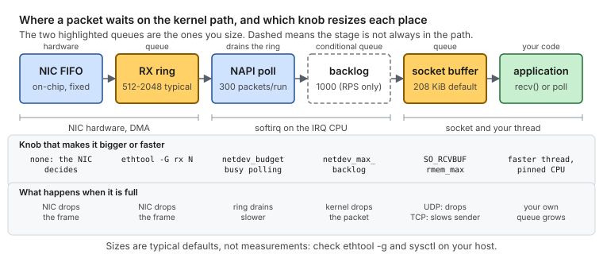
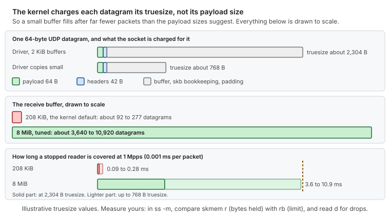
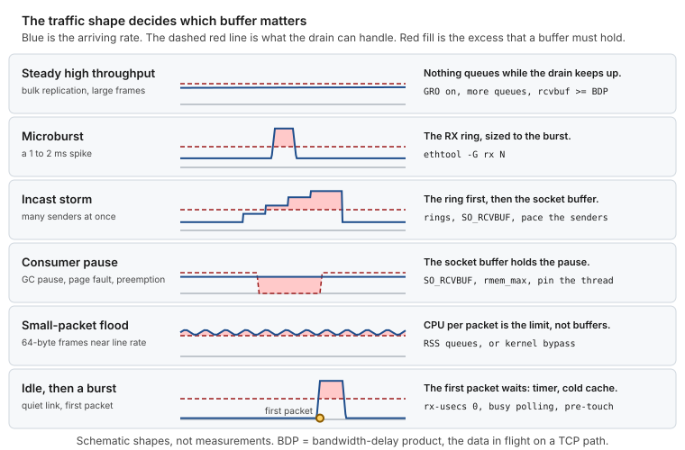
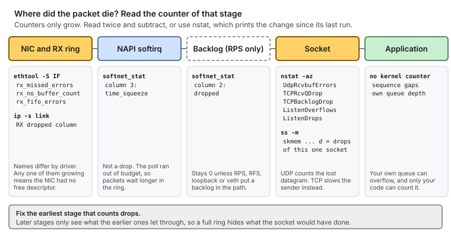
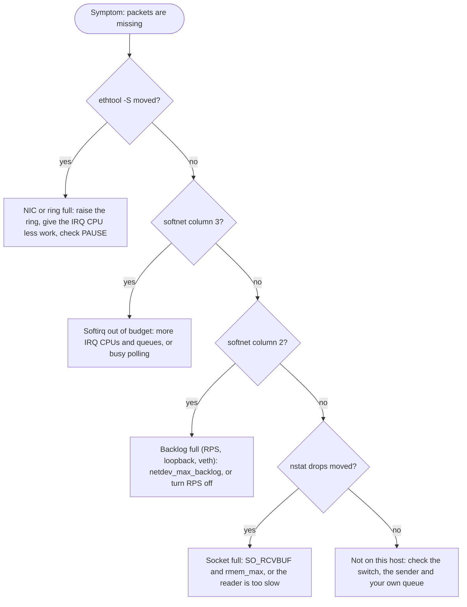
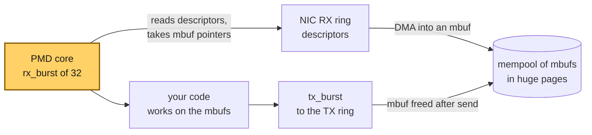
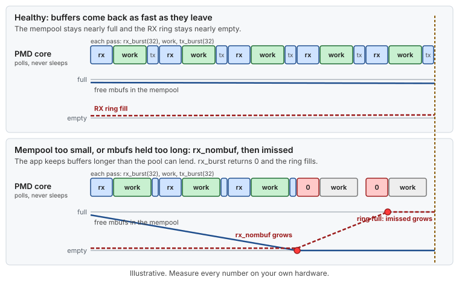
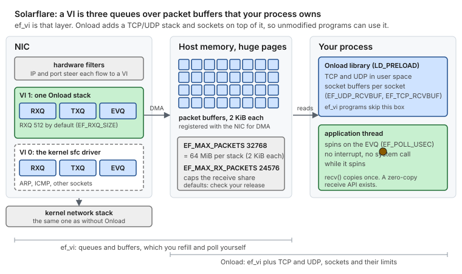
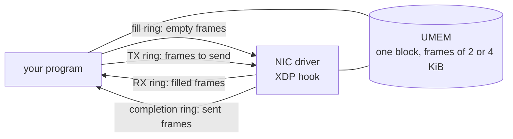

# Concept — Network Buffers, Rings and Where Bursts Die

> Used by: [Guide 04 §5.7](../guides/04-network-optimization.md#ring-sizes), [Guide 06 §4](../guides/06-kernel-sysctl-tuning.md#4-socket-buffers), [Guide 08](../guides/08-kernel-bypass.md). Related: [network-tuning](network-tuning.md), [ethtool](ethtool.md), [huge-pages](huge-pages.md). Terms: [Glossary](../GLOSSARY.md).

## At a glance

- A packet waits in **queues** between the wire and your code. Each queue has a size, a knob, and a counter that says when it overflowed. A burst survives only if every queue on its path is big enough, or the drain is fast enough.
- On the kernel path the queues that matter are the **RX ring** and the **socket buffer**. The default sizes hold a few hundred microseconds of a busy link. The tuned sizes hold milliseconds.
- **Kernel bypass** (DPDK, Onload, ef_vi) removes queues and copies. It also replaces the kernel's counters with its own, so you must know where to look.

## 1. The queues between the wire and `recv()`



*The RX ring and the socket buffer are the two queues you size. The backlog exists only with RPS, loopback, veth and some tunnels.*

Three things in the picture are easy to get wrong:

- **The ring is the first big queue.** A modern driver takes packets from the ring straight into the protocol stack ([NAPI](../GLOSSARY.md#napi)). It does not put them in the per-CPU backlog first. That queue, sized by `netdev_max_backlog`, is only used with RPS/RFS, loopback, veth and some tunnels. On a NIC without RPS its counter stays at zero.
- **NAPI is not a queue.** It is the code that empties the ring, up to `netdev_budget` packets (300 by default) per round. When it runs out of budget, packets simply wait longer in the ring.
- **The socket buffer is charged in bytes, not packets** (§4). That is why a small buffer overflows much sooner than its size suggests.

Typical defaults, and the values the guides set:

| Queue | Typical default | This repository | Where |
|---|---|---|---|
| RX ring | 512 to 2048 descriptors, depending on the driver | the hardware maximum (4096 to 8160) on critical NICs | [Guide 04 §5.7](../guides/04-network-optimization.md#ring-sizes) |
| TX ring | 256 to 1024 | the hardware maximum | same |
| `txqueuelen` (qdisc) | 1000 packets | default on critical NICs, 300000 on bulk NICs | [Guide 04 §5.8](../guides/04-network-optimization.md#58-txqueuelen-bulk-nics) |
| `netdev_budget` | 300 packets per round | not changed | [Concept: network tuning §4](network-tuning.md#4-napi-softirq-budget-and-ksoftirqd) |
| `netdev_max_backlog` | 1000 packets | 300000 | [Guide 06 §5](../guides/06-kernel-sysctl-tuning.md#5-queues) |
| `rmem_default`, `rmem_max` | 212992 bytes (208 KiB) | 8 MiB, 128 MiB | [Guide 06 §4](../guides/06-kernel-sysctl-tuning.md#4-socket-buffers) |
| `tcp_rmem` | `4096 131072 6291456` | `4096 8388608 134217728` | same |

> [!NOTE]
> These defaults are typical for recent RHEL 8 and 9 kernels and drivers, and they are not measurements. From the driver sources: `ice` starts with 2048 RX and 256 TX descriptors and allows 8160, and `i40e` starts with 512 and allows 4096. Always read your own values with `ethtool -g` and `sysctl`.

## 2. Anatomy of a ring


*The NIC fills slots at the head, the driver empties them at the tail, and a drop is the head meeting a slot that is not ready.*

A **ring buffer** is a fixed array of [descriptors](../GLOSSARY.md#descriptor) used as a circle. Each descriptor points at one packet buffer in host memory. The NIC reads the next ready descriptor, [DMA](../GLOSSARY.md#dma)-writes the packet into that buffer, and moves on. The driver later reads the filled descriptors in the same order and posts new empty buffers behind it.

Two facts follow from this:

- **A refill that is late is a drop.** If the NIC reaches a descriptor that has no buffer yet, it cannot store the packet. The counter (`rx_missed_errors`, `rx_no_buffer_count`, or a driver-specific name) goes up. A bigger ring gives the driver more time.
- **A bigger ring costs memory, not latency.** While the ring is not backed up, each packet is handled as soon as it arrives. The price is `descriptors × buffer size × queues`.

<details>
<summary><b>Memory cost of the rings, and the cache caveat</b></summary>

```text
memory per queue  = descriptors x buffer size
                  = 4096 x 2 KiB        = 8 MiB
memory per NIC    = 8 MiB x 63 queues   = 504 MiB   (a driver default of one queue per CPU)
```

That is why [Guide 04 §5.1](../guides/04-network-optimization.md#51-queues-channels-ethtool--l) cuts the queue count before raising the rings. The buffer size is typically 2 KiB, or a page fragment on drivers that use page pools, so check yours.

> [!NOTE]
> **Validate on your hardware.** A very large ring can hold more packet data than the part of the last-level cache that [DDIO](../GLOSSARY.md#ddio) writes into (a small part of it, commonly two of its ways). Then arriving packets are written to memory, and the CPU reads them from there. If p99.9 gets worse after you raise a ring to the maximum, measure the same load with half of the maximum before you decide.

</details>

## 3. Burst math

One formula answers most sizing questions. [Concept: queueing](queueing.md) gives the general theory behind it: utilization, variability and back pressure.

```text
time to overflow = capacity / (arrival rate - drain rate)
```

**Packet rate** is fixed by the link. A 64-byte frame takes 84 bytes on the wire, so 10 GbE carries at most **14.88 Mpps** (25 GbE: 37.2, 100 GbE: 148.8). With 1500-byte frames, 10 GbE carries 0.81 Mpps.

| Ring | Time to fill at line rate (14.88 Mpps, nothing drained) | Same ring, 1.5 ms burst at 4 Mpps, drained at 1.5 Mpps |
|---|---|---|
| 512 | 34 µs | full after 0.2 ms, **3,238 packets dropped** |
| 1024 | 69 µs | full after 0.4 ms, 2,726 dropped |
| 2048 | 138 µs | full after 0.8 ms, 1,702 dropped |
| 4096 | 275 µs | **absorbed**: peaks at 3,750 |
| 8160 | 548 µs | absorbed: peaks at 3,750 |

The burst brings 6,000 packets and software drains 2,250 of them meanwhile, so 3,750 must wait somewhere. Every number in the table is illustrative.


*The same burst hits two rings. The small one overflows almost at once, and the large one holds the whole burst and drains it in 2.5 ms.*

Two consequences that surprise people:

- **The ring must hold the whole excess of the burst.** Draining faster helps as much as growing the ring, and the two multiply. With two drain CPUs the excess is `arrival - 2 x drain`: at 4 Mpps against 1.5 Mpps per CPU it falls from 2.5 Mpps to 1 Mpps, and it is zero once the combined drain reaches the arrival rate.
- **Coalescing eats ring headroom.** While the NIC waits for `rx-usecs`, packets pile up in the ring. With `rx-usecs 50` at 1 Mpps, 50 slots are already used before the first interrupt fires. This is one more reason the guides set `rx-usecs 0` on critical NICs.

## 4. Socket buffers

The **socket receive buffer** is the last queue before your code. It is set per socket with [`SO_RCVBUF`](../GLOSSARY.md#so-rcvbuf), and it is charged in bytes of [truesize](../GLOSSARY.md#truesize): the payload plus headers, the buffer around them and the bookkeeping. For a small datagram the payload is a tiny part of it.



*Drawn to scale: the kernel default buffer covers a stopped reader for a fraction of a millisecond, and the tuned buffer for several.*

The rules, in the order in which they take effect:

1. **The kernel doubles what you ask for.** `setsockopt(SO_RCVBUF, v)` stores `2 × min(v, rmem_max)`, and `getsockopt` returns the doubled value. The doubling pays for the bookkeeping.
2. **A request above `rmem_max` is clamped silently.** The call succeeds, and you get less than you asked for. `SO_RCVBUFFORCE` (needs `CAP_NET_ADMIN`) skips the cap.
3. **A socket that never calls `setsockopt` gets `rmem_default`.** Most UDP receivers inside libraries are like this.
4. **TCP grows its buffer by itself** between the min and max of `tcp_rmem` (`tcp_moderate_rcvbuf`). UDP never does. A UDP buffer is exactly what you set.

For TCP, the buffer must cover the **bandwidth-delay product (BDP)**: the bytes in flight on the path. At 10 Gb/s and 1 ms round-trip time that is 1.25 MB. At 100 µs inside a data center it is 125 KB, which the default already covers, so TCP inside one site rarely needs more.

Read a live socket with `ss`:

```bash
ss -umn 'sport = :5000'
# skmem:(r0,rb8388608,t0,tb212992,f0,w0,o0,bl0,d0)
#   r  = bytes now queued for the reader (charged as truesize)
#   rb = the limit: rmem_default here, or twice what SO_RCVBUF asked for
#   d  = datagrams this socket dropped because it was full
```

## 5. Traffic shapes: which queue saves you



*The shape of the traffic, not its average, decides which buffer matters.*

| Shape | What happens | What absorbs it | Counter that shows the failure |
|---|---|---|---|
| **Steady high throughput** (bulk replication, large frames) | The drain keeps up, so nothing queues. TCP fills its window instead. | Nothing. Check the CPU and the window: `rcvbuf` at least the BDP, GRO on. | `TCPRcvQDrop`, `TCPRcvCollapsed` |
| **Microburst** (a market open, a batch flush) | Arrival passes the drain for 1 to 2 ms. | The RX ring, sized as in §3. | `rx_missed_errors` |
| **Incast** (many senders answering at once, a reconnect storm) | Several microbursts add up on one port. | The ring, then the socket buffer. Upstream, the switch queue. | ring counters, then `UdpRcvbufErrors` |
| **Consumer pause** (a GC pause, a page fault, a preempted reader) | The NIC and the kernel keep working, and your code does not read. | The socket buffer, for as long as it lasts (§4). | `UdpRcvbufErrors`, `ss -m` `d` |
| **Small-packet flood** (64-byte frames near line rate) | The limit is CPU per packet, not memory. One kernel core handles very roughly 1 to 2 Mpps. | No buffer helps. More queues with RSS, or [kernel bypass](../guides/08-kernel-bypass.md). | ring counters, `softnet_stat` column 3 |
| **Idle, then a burst** | The first packet waits for the coalescing timer and finds cold caches. | `rx-usecs 0`, busy polling, [pre-touch](../GLOSSARY.md#pre-touch). | none: it shows in p99.9, not in a counter |

> [!NOTE]
> The 1 to 2 Mpps per kernel core is a rough order of magnitude for small packets. It varies with the CPU, the driver and the work per packet. Measure yours with the calculator or with your own traffic.

## 6. Where did the packet die?



*Each stage has its own counter. Fix the earliest stage that counts drops, because later stages only see what the earlier ones let through.*



*Starting from missing packets, check the stages in the order the packet crosses them: the NIC counters, the two softnet columns, the socket counters, and only then look outside the host. If several moved, fix the earliest.*

<details>
<summary><b>Commands to read every counter, twice, with the change between</b></summary>

```bash
IF=ens1f0                                            # your critical NIC
snap() {
  ethtool -S "$IF" | grep -iE 'miss|no_buf|fifo|drop'
  awk '{ printf "cpu%d softnet: dropped=%d squeezed=%d\n", NR-1, strtonum("0x"$2), strtonum("0x"$3) }' /proc/net/softnet_stat
  nstat -az | grep -E 'UdpRcvbufErrors|TCPRcvQDrop|TCPBacklogDrop|ListenOverflows|ListenDrops'
}
snap > /tmp/before; sleep 10; snap > /tmp/after
diff /tmp/before /tmp/after                          # a line that changed is a stage that dropped
# expect: on a tuned, idle host, no line changes
```

`strtonum` needs `gawk`. On `mawk`, read the file by eye: the columns are hexadecimal, and the first three are processed, dropped and time_squeeze.

</details>

## 7. Buffers under kernel bypass

Bypass keeps the same ideas (a ring, a buffer pool, a burst) and changes who owns them. **You** post the buffers, poll the ring and return the buffers. Nothing runs in an interrupt to help you, and the kernel's counters no longer see the traffic.

### 7.1 DPDK



*A poll-mode core reads descriptors from the ring, works on packets in `mbuf` buffers taken from one mempool, and frees each buffer back to the pool when it is sent.*

- **The mempool is the second ring.** Each RX descriptor holds an `mbuf` from it. A DPDK `mbuf` has a two-cache-line header, and the default data room is 2048 bytes plus 128 bytes of headroom, so about 2.3 KiB per packet. 8192 `mbuf`s are about 18 MiB.
- **Sizing rule.** The pool must exceed all the descriptors you post plus what the application holds. The `l3fwd` example uses `max(ports × rx queues × rx descriptors + ports × cores × burst + ports × tx queues × tx descriptors + cores × cache size, 8192)`. Four RX queues of 4096 descriptors already tie up 16,384 `mbuf`s.
- **The burst is small.** `rte_eth_rx_burst` returns up to 32 packets (the `l3fwd` default), and the example starts with 1024 descriptors per ring.
- **Two counters, two failures.** In `rte_eth_stats`, **`imissed`** counts packets the NIC dropped because the RX ring was full (your loop is too slow). **`rx_nombuf`** counts times the driver found the mempool empty (the pool is too small, or the application holds buffers too long).



*When the application holds buffers too long, the mempool empties first, then the ring fills, and only then does the NIC drop. `rx_nombuf` warns before `imissed`.*

> [!NOTE]
> **Source.** [Guide 08 §6](../guides/08-kernel-bypass.md#6-dpdk-on-intel-nics) follows the [DPDK documentation](https://doc.dpdk.org/guides/). Read the DPDK numbers here as the library's defaults and formulas, and size your own pool under your own load.

### 7.2 Solarflare: ef_vi and Onload



*A hardware filter picks the VI, the NIC writes into your packet buffers, and a spinning thread reads the event queue.*

A **VI** (virtual interface) is one set of hardware queues that one process owns: an RX ring, a TX ring and an **event queue** that reports completions. **ef_vi** is the layer where you post buffers and poll events yourself. **Onload** runs a TCP and UDP stack on top of it, so an unmodified program keeps its sockets.

| Setting | Default in the Onload sources | What it bounds |
|---|---|---|
| `EF_RXQ_SIZE`, `EF_TXQ_SIZE` | 512 (allowed: 512, 1024, 2048, 4096) | descriptors in the VI's RX and TX rings: the same idea as `ethtool -G`, but per stack |
| `EF_MAX_PACKETS` | 32768 | packet buffers per stack, 2 KiB each, so 64 MiB |
| `EF_MAX_RX_PACKETS`, `EF_MAX_TX_PACKETS` | 24576 each | the share of those buffers the receive or transmit path may use |
| `EF_RXQ_LIMIT` | 65535 | a software cap on how full Onload lets the RX ring get. It does not add ring capacity, so size the ring with `EF_RXQ_SIZE` and leave this at its default |
| `EF_UDP_RCVBUF`, `EF_TCP_RCVBUF` | 0 (do not override `SO_RCVBUF`) | the socket buffer, as in §4 |
| `EF_PREFAULT_PACKETS` | 1 | how many packet buffers to touch at stack creation. Set it to the number you expect to use ([Guide 08 §5.3](../guides/08-kernel-bypass.md#53-the-application-profile)) |

> [!NOTE]
> Defaults come from the open Onload sources and can change between releases. Check the Onload user guide (UG1586) for yours.

Where a drop shows:

```bash
onload_stackdump lots | grep -E 'oflow_drop|memory_pressure|pkt_bufs'
# oflow_drop      socket receive buffer overflowed: raise EF_UDP_RCVBUF or the reader is slow
# memory_pressure the stack ran low on packet buffers and dropped on receive: raise EF_MAX_PACKETS
# pkt_bufs        shows CRITICAL while under memory pressure
# expect: on a healthy stack, the counters stay at 0
```

If the RX ring itself is too small, raise `EF_RXQ_SIZE` first. If `memory_pressure` moves, raise `EF_MAX_PACKETS`.

### 7.3 AF_XDP, between the two

AF_XDP keeps the kernel driver and lets it hand packets to your memory through four rings that share one block of memory, the [UMEM](../GLOSSARY.md#umem).



*Frames live in the UMEM. The four rings only pass around the numbers of frames: empty ones going in, filled ones coming back, and the same for transmit.*

The failure mode is the same as with a ring: if your program does not put empty frames in the **fill ring** fast enough, the NIC has nowhere to write and drops. It is covered briefly in [Guide 08 §7](../guides/08-kernel-bypass.md#7-other-stacks-briefly).

## 8. Kernel and bypass, side by side


*Bypass removes queues, a copy and the interrupt, and moves the drop counters to the stack's own tools.*

| | Kernel stack | Onload sockets | DPDK or ef_vi |
|---|---|---|---|
| Queues crossed | 3, or 4 with RPS | 3, in user space | 2 |
| CPU copies before your code | 1 | 1 (0 with the zero-copy API) | 0 |
| Interrupts | yes | none while the thread spins | none (polling) |
| Where you read drops | `ethtool -S`, `nstat`, `ss -m` | `onload_stackdump` | `rte_eth_stats`, or your own counters with ef_vi |
| What you lose | nothing | `tcpdump` and netfilter on accelerated traffic | the same, and you own the whole stack |
| What it costs | a shared CPU | one spinning CPU per stack | one spinning CPU per queue |

When bypass is not worth it: your traffic fits the kernel's limits (§5, first and last rows), your p99.9 target is above tens of microseconds, or you cannot spare a core that spins at 100%. [Guide 08 §1](../guides/08-kernel-bypass.md#1-what-kernel-bypass-is-and-what-it-costs) has the full decision.

## 9. Try your own numbers

The [`size-buffers`](../scripts/size-buffers) script and the [buffer simulator](https://vitor-tadashi.github.io/mechanical-sympathy/buffers.html) apply the formula of §3 to your rates and sizes. They run the same model, and `tools/check-size-buffers` keeps the burst numbers of §3 equal to what the script prints.

```bash
scripts/size-buffers --ring 512 --burst-mpps 4 --burst-us 1500 --drain-mpps 1.5
# dropped, stage 1  3238 packets (rx_missed_errors)
# ring              3750 packets, 7500 KiB per queue at 2048 B   <- the ring that holds this burst
```

## Key takeaways

- **Size the queue to the burst, not to the average.** Capacity divided by (arrival minus drain) is the time you have, and the ring is the only queue that can hold a microburst.
- **A default socket buffer is small in packets, not in bytes.** The kernel charges each datagram its truesize, so 208 KiB holds a few hundred small datagrams. Set `SO_RCVBUF` and `rmem_max` together.
- **Every stage has its own counter.** Read the counter of the earliest stage that drops, and fix that stage first.
- **Bypass moves the queues, it does not remove the problem.** The mempool or the packet-buffer budget is the new limit, and `rx_nombuf`, `imissed` and `memory_pressure` are the new counters.

## References

- [Concept: network tuning](network-tuning.md), the receive path stage by stage.
- [Concept: ethtool §5 and §11](ethtool.md#5--g---g-ring-sizes), ring sizes and statistics.
- Linux kernel documentation, `Documentation/networking/scaling.rst` (RSS, RPS, RFS, XPS) and `Documentation/admin-guide/sysctl/net.rst`.
- DPDK Programmer's Guide, Mbuf Library and Mempool Library; the `l3fwd` sample application.
- Onload User Guide (UG1586), "Running Out of Packet Buffers" and the environment variable reference.
- Kernel source, `include/uapi/linux/if_xdp.h`, and the AF_XDP documentation in `Documentation/networking/af_xdp.rst`.
