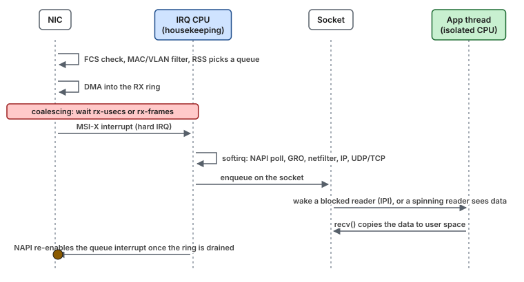

# Concept — The Linux Receive/Transmit Path and Where Latency Hides

> Used by: [Guide 04](../guides/04-network-optimization.md), [Guide 06](../guides/06-kernel-sysctl-tuning.md). Related: [network-buffers](network-buffers.md), [cpu-isolation](cpu-isolation.md), [huge-pages](huge-pages.md). Terms: [Glossary](../GLOSSARY.md).

## At a glance

- A received packet waits in up to ten places between the wire and `recv()`. On a tuned host, only the interrupt, softirq and wake-up are left.
- The median barely changes with tuning. The tail does: adaptive coalescing adds 30–50 µs, PAUSE frames add milliseconds, and a dropped segment adds a round trip, or 200 ms or more when only the timeout can repair it.
- Each stage has one knob. Know the stage and you know which knob fixes which part of the histogram.

## 1. Why it matters

On a well-tuned host, the time between a packet arriving at the NIC and the application seeing it is about 5–10 µs with the kernel stack, and about 1–2 µs with kernel bypass. On an untuned host the *median* is often similar. The difference shows up in the tail: 30–50 µs from adaptive interrupt coalescing, milliseconds from PAUSE frames, and up to hundreds of ms from a dropped segment that TCP can only repair after its timeout. Understanding each stage tells you which knob fixes which part of the histogram.

## 2. The receive path, step by step



*The NIC receives, hashes and DMAs the frame, may wait for the coalescing timer, and interrupts the housekeeping CPU. That CPU runs the protocol stack in softirq and queues the data on the socket, where the application thread on its isolated CPU picks it up. FCS is the frame's checksum, RSS the hash that picks a queue, and GRO the merging of consecutive TCP segments.*

<details>
<summary><b>The same path as a numbered list</b></summary>

```text
 1. Frame arrives; NIC checks FCS, filters by MAC/VLAN
 2. RSS: NIC hashes the flow (src/dst IP + ports) → picks an RX queue
 3. NIC DMAs the frame into a buffer described by the next RX descriptor in that queue's ring
 4. Interrupt moderation: NIC waits for rx-usecs / rx-frames (or adaptive logic) ...
 5. ... then raises that queue's MSI-X interrupt → hard IRQ handler on the CPU in smp_affinity
 6. Hard IRQ handler masks the queue's interrupt and schedules NAPI (raises NET_RX softirq)
 7. Softirq (same CPU): NAPI poll pulls up to `budget` packets from the ring, allocates skbs,
    runs GRO, passes each packet up: netfilter hooks → IP → UDP/TCP → socket receive queue
 8. Socket: wakes a blocked reader (IPI to its CPU if different) or a busy-polling reader sees data
 9. Application: recv()/recvmsg() copies data to user space
10. NAPI re-enables the queue interrupt when the ring is drained
```

</details>

Latency added at each step, and the knob for it:

| Step | Latency added | Knob |
|---|---|---|
| 2 RSS | none, but flows sharing a queue share its IRQ and CPU | `ethtool -L`, `-N`/`-X` (flow steering) |
| 4 moderation | **0 up to the timer value**; adaptive coalescing adds 30–50 µs to the first packet of a burst | `ethtool -C rx-usecs 0 adaptive-rx off` |
| 5 IRQ delivery | ~1 µs; far more if the CPU is in a deep C-state or busy with another IRQ | IRQ affinity, `idle=poll` |
| 7 softirq | 1–3 µs of protocol work; more with conntrack/netfilter rules; waits if the CPU is busy | Housekeeping CPU dedicated to IRQs; no conntrack ([Guide 07 §6](../guides/07-os-hygiene.md#6-opt-in-removing-host-packet-filtering)) |
| 7 GRO | holds packets for merging within one poll | `gro off` if it shows up |
| 8 wake-up | 2–50 µs (scheduler + IPI + possibly C-state) | Spin on a non-blocking socket, busy polling, or bypass |
| 9 copy | ~0.1 µs per KiB | Small messages; zero-copy APIs for large ones |

## 3. Interrupt moderation, with numbers


*With coalescing, the first packet of a burst sits in the NIC until the timer expires. With `rx-usecs 0`, it raises the interrupt at once and reaches the application much earlier.*

Without moderation, every packet raises an interrupt. At 1 Mpps that is 1 M interrupts/s on one CPU, each costing ~1 µs of entry/exit, which is too much. Moderation trades latency for efficiency:

- `rx-usecs = N`: after the first packet, wait up to N µs for more before interrupting.
- `rx-frames = M`: interrupt after M packets, whichever comes first.
- **Adaptive (DIM, dynamic interrupt moderation)**: the driver measures the rate and moves N between a low and a high value.

> **Picture it.** Moderation is a shuttle bus that leaves when it is full or when its timer runs out. At rush hour it fills at once. At night the first passenger always waits for the timer.

For a latency-critical flow (requests, RPCs or event messages: a few thousand to a few hundred thousand small messages per second, arriving in bursts), the first packet of a burst is exactly the one that matters, and moderation delays it by the full N. Setting `rx-usecs 0` interrupts immediately. The extra IRQ load is absorbed by a housekeeping CPU dedicated to that NIC, and NAPI switches to polling automatically under load, so the interrupt rate stays bounded: while the ring has packets, interrupts stay masked.

## 4. NAPI, softirq budget and `ksoftirqd`

NAPI processes up to `net.core.netdev_budget` packets (300 by default) or `netdev_budget_usecs` (2 ms) per softirq round. Anything left over waits for the next round, and each early stop counts as `time_squeeze` (`/proc/net/softnet_stat` column 3).

Most of the time the next round runs at once. Only when the outer softirq limit runs out does the rest move to `ksoftirqd/<cpu>`, a normal-priority thread that waits for the scheduler ([interrupts §3](interrupts-and-deferred-work.md#3-softirqs-and-ksoftirqd) has the picture). So a growing `time_squeeze` says the NIC is busy; latency spikes under bursts say the work also waited.

Remedies: a CPU dedicated to the NIC's IRQs, more queues spread over more housekeeping CPUs, or busy polling so the application does the work. While NAPI is behind, the RX ring holds the packets. The per-CPU backlog queue (`netdev_max_backlog`) is only in the path with RPS/RFS, loopback, veth and some tunnels. [Concept: network buffers](network-buffers.md) covers every queue on the path.

## 5. Steering: RSS, RPS, RFS, XPS

| Mechanism | Where | What | For low latency |
|---|---|---|---|
| RSS | NIC hardware | Hash → RX queue → IRQ → CPU | Yes. Place each queue's IRQ deliberately. |
| RPS | Software, in step 7 | Re-hash and hand the packet to another CPU via IPI | No. It adds an IPI and a hop. |
| RFS | Software | RPS, but toward the CPU where the consuming thread last ran | Rarely. Isolated threads should not receive IPIs. |
| aRFS | NIC + driver | Hardware flow steering toward the consumer's CPU | Possible for kernel-stack designs with IRQs on the consumer's CPU; conflicts with isolation |
| XPS | TX | Map sending CPUs to TX queues | Yes, when several pinned threads send on one NIC |

The `ethtool` options that control queues, RSS indirection and flow rules are described one by one in [concepts/ethtool.md](ethtool.md).

## 6. Transmit path

`send()` → socket → TCP/UDP → qdisc (`fq_codel` by default, length `txqueuelen`) → driver TX ring → NIC DMA → wire → TX completion interrupt (moderated by `tx-usecs`) → buffers freed.

- For TCP, **Nagle's algorithm** delays small segments while earlier data is unacknowledged. Every latency-critical socket should set `TCP_NODELAY`. Kernel-bypass stacks often force it on for all sockets.
- **Delayed ACK** on the peer can interact with Nagle, the classic 40 ms stall. `TCP_QUICKACK` on the receiver, or `TCP_NODELAY` on the sender, avoids it.
- TSO/GSO let the stack hand the NIC large buffers. Disabling them keeps small messages from being coalesced into large ones.
- A backed-up qdisc (a bulk sender on the same NIC) delays a small message behind it. That is the argument for **separate NICs per traffic class**.

## 7. Flow control (PAUSE)

802.3x PAUSE frames let a receiver ask the sender to stop transmitting for a time expressed in 512-bit-time quanta (up to 65,535, or 3.3 ms at 10 Gb/s). A single slow host or congested switch port can therefore stall *all* traffic of a port for milliseconds, without a single drop or log line. Most low-latency networks disable PAUSE end to end and rely on sizing and loss handling instead. [Guide 04 §5.4](../guides/04-network-optimization.md#54-pause-frames-off-ethtool--a-autoneg-off-rx-off-tx-off) shows it as an animation.

## 8. Busy polling

`SO_BUSY_POLL` (per socket) or `net.core.busy_read`/`busy_poll` (global) make a blocking `recv`/`poll`/`epoll_wait` spin **on the NIC queue's NAPI context** for up to N µs before sleeping. The application thread runs the driver's poll function itself, which skips the IRQ → softirq → wake-up chain. With `napi_defer_hard_irqs` and `gro_flush_timeout` (per device, kernel ≥ 5.x), interrupts can be suppressed entirely while the application polls. It is a middle ground between the classic kernel path and full bypass, and it is enabled globally by the tuned `network-latency` profile.

## 9. Kernel bypass

A user-space driver maps the NIC's rings (descriptor queues and doorbells) into the process. Packets are DMA'd straight into memory the application reads, and the application polls the ring. There is no interrupt, no softirq, no syscall, no copy, and no netfilter. Socket-compatible implementations intercept the libc socket calls, so existing applications work unmodified with an `LD_PRELOAD` launcher. The costs are one spinning core per polling thread, vendor-specific tuning, huge pages for buffers, and operational differences: `tcpdump` does not see accelerated traffic without vendor tooling. See [Guide 08 — Kernel bypass](../guides/08-kernel-bypass.md) for the stacks, how each one interacts with the kernel queues, and how to set them up.


*Kernel bypass removes the interrupt, the softirq, the socket and the wake-up from the path, which are the steps that shape its tail.*

## 10. Measuring

| Question | Tool |
|---|---|
| Round-trip latency distribution | `sockperf ping-pong`, or your own probe with HdrHistogram |
| Where time goes per packet | Hardware RX/TX timestamps (`SO_TIMESTAMPING`, `ethtool -T`), compared with application timestamps |
| Drops | `ethtool -S`, `/proc/net/softnet_stat`, `nstat` (`UdpRcvbufErrors`, `TcpExtTCPBacklogDrop`) |
| Interrupt placement | `/proc/interrupts`, `effective_affinity_list` |
| Softirq time per CPU | `mpstat -P ALL 1` (`%soft`), `perf top -C <cpu>` |
| Kernel path events | `perf trace`, `bpftrace` on `net:*` tracepoints |

## 11. Numbers to remember

Typical values, not measurements. The [cheat sheet](../CHEATSHEET.md#orders-of-magnitude) has the rest.

> [!NOTE]
> **Validate on your hardware.** These values depend on the CPU, the NIC, the driver and the kernel. Measure the ones you rely on.

| Quantity | Value |
|---|---|
| NIC to `recv()`: tuned kernel stack / kernel bypass | ~5–10 µs / ~1–2 µs |
| Adaptive coalescing, first packet of a burst | +30–50 µs |
| Hard IRQ entry and exit | ~1 µs |
| Softirq protocol work per packet | 1–3 µs |
| Wake-up of a blocked reader | 2–50 µs |
| NAPI budget per round | 300 packets or 2 ms |
| One PAUSE frame at 10 Gb/s / 100 Gb/s | up to 3.3 ms / 0.3 ms |
| TCP repair of a drop: fast retransmit / retransmit timeout | about one round trip / ≥ 200 ms |
| Nagle and delayed ACK together | the classic 40 ms stall |

## 12. How it shows up

| Symptom | Mechanism | Where it is told |
|---|---|---|
| p99 worse on a quiet stream than on a busy one | Adaptive coalescing | [Use case 15](../examples/use-cases/15-the-coalescing-timer.md) |
| Spikes on the isolated CPU that track the packet rate | The NIC's IRQ lands on it | [Use case 04](../examples/use-cases/04-one-nic-one-queue-one-cpu.md) |
| Drops only during bursts, `rx_missed_errors` rising | The RX ring fills | [Use case 09](../examples/use-cases/09-the-two-millisecond-burst.md) |
| Millisecond silences on every flow of a port, no drops | PAUSE frames | §7 |
| A 40 ms stall on small TCP writes | Nagle with delayed ACK | §6 |

## 13. Myths

- **"Coalescing 0 floods the CPU with interrupts."** NAPI masks the queue's interrupt while the ring has packets, so the rate stays bounded.
- **"RPS spreads the load, so it helps latency."** It adds an IPI and a hop to another CPU.
- **"No drops means no network problem."** PAUSE frames and coalescing delay packets without dropping any.
- **"Busy polling needs special hardware."** It is a kernel feature for any NAPI driver.

## 14. Illustrative scenario

An illustrative case, not a measurement. An event-stream consumer saw p50 = 7 µs and p99 = 60 µs on a quiet stream, but p99 = 12 µs during busy periods, which is backwards. The cause was adaptive coalescing: at low rates the driver raised `rx-usecs` to save interrupts, and the first packet after a lull waited the full interval. With `adaptive-rx off rx-usecs 0`, p99 was 11 µs at all rates.

## 15. Key takeaways

- The first packet after a quiet period is the one coalescing hurts most. Turn adaptive coalescing off and set `rx-usecs 0` on critical NICs.
- NAPI bounds the interrupt rate by itself: while the ring has packets, interrupts stay masked.
- Keep RPS and RFS off for critical flows. Use RSS and deliberate IRQ placement instead.
- Set `TCP_NODELAY` on every latency-critical TCP socket, and keep PAUSE frames off end to end.
- Busy polling sits between the kernel path and bypass. It is the cheapest next step when the tuned kernel path is not enough.

## 16. References

- [concepts/ethtool.md](ethtool.md): every `ethtool` option used in these guides
- <https://docs.kernel.org/networking/scaling.html> (RSS/RPS/RFS/XPS)
- <https://docs.kernel.org/networking/napi.html> (NAPI, busy polling, IRQ deferral)
- <https://docs.kernel.org/networking/timestamping.html>
- Red Hat — *Tuning the network performance* (RHEL 9)
- Brendan Gregg, *Systems Performance*, 2nd ed., chapter 10 (Network)
