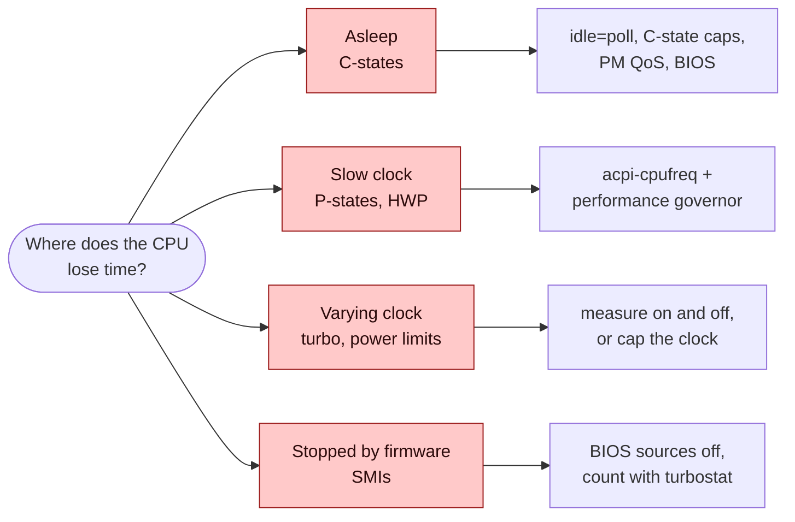
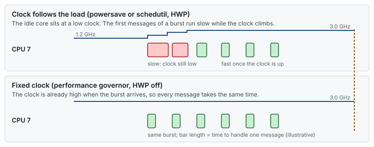

# Concept — Power, Frequency and Firmware: C-states, P-states, Turbo and SMIs

> Used by: [Guide 00 §4](../guides/00-bios-firmware.md#4-the-settings), [Guide 01 §5](../guides/01-grub-bootloader-tuning.md#5-the-parameters-one-by-one), [Guide 07 §5](../guides/07-os-hygiene.md#5-tuned-profile). Related: [hardware topology](hardware-topology.md), [CPU isolation](cpu-isolation.md), [bootloader](bootloader.md). Use cases: [07](../examples/use-cases/07-the-freeze-nobody-logs.md), [11](../examples/use-cases/11-the-first-message-after-a-quiet-spell.md), [13](../examples/use-cases/13-turbo-the-lottery.md). Terms: [Glossary](../GLOSSARY.md).

## At a glance

- A server CPU saves power in two ways: it sleeps when idle (C-states) and it slows its clock when lightly loaded (P-states). Both make the next event wait.
- Turbo raises the clock above base only while power and temperature allow, so the clock, and the handler time with it, changes with the room and the load.
- The firmware can stop every CPU at once (SMIs), and Linux sees nothing. Only a counter shows it.

## 1. Why it matters

A server's default settings save power, and a CPU saves power by doing less: sleeping deeper, running slower. Every saving has a wake-up cost, and a latency-critical thread pays it at the worst moment, when a message arrives after a pause. The settings in [Guide 00](../guides/00-bios-firmware.md), [Guide 01](../guides/01-grub-bootloader-tuning.md) and the tuned profile of [Guide 07](../guides/07-os-hygiene.md) trade that power for a CPU that is always awake and always at the same clock. This page explains what each mechanism does, so the trade is a decision and not a recipe.



*Four ways a CPU can lose time to power and firmware management, each with the setting that removes it.*

## 2. Idle: C-states

When a CPU has nothing to run, the kernel's idle loop asks it to stop. The deeper it stops, the more power it saves, and the longer it takes to start again.

| State | What the core does | Typical exit latency |
|---|---|---|
| **C0** | Runs instructions (or spins in a polling idle loop). | 0 |
| **C1** (`HLT`/`MWAIT`) | Stops its clock. Caches stay powered and coherent. | ~1–2 µs |
| **C1E** | C1 plus a lower voltage. | a few µs |
| **C6** | Flushes L1/L2, saves its state, cuts power to the core. | up to ~100 µs |
| **Package C-states** (PC2–PC6) | When every core of a socket is idle, the L3 and the uncore power down too. | tens to hundreds of µs |

Linux picks the state with the **idle governor** (`menu` or `teo`). It guesses how long the CPU will stay idle and chooses the deepest state that pays off. It cannot know when the next packet arrives, so after a quiet spell it chooses deep, and the first message pays the exit ([use case 11](../examples/use-cases/11-the-first-message-after-a-quiet-spell.md)).


*The longer the gap, the deeper the sleep and the longer the wake-up. With `idle=poll` the CPU never sleeps.*

Three things limit the depth, from strongest to weakest:

1. **The BIOS** can hide deep states completely ([Guide 00 §4.1](../guides/00-bios-firmware.md#41-power-and-performance-profile)).
2. **Kernel arguments**: `idle=poll` replaces the idle loop with a busy loop, and `processor.max_cstate=0` plus `intel_idle.max_cstate=0` cap the drivers ([Guide 01 §5](../guides/01-grub-bootloader-tuning.md#5-the-parameters-one-by-one)).
3. **PM QoS** at run time: a process that holds `/dev/cpu_dma_latency` open with a value tells the governor the longest exit latency it accepts. tuned's latency profiles do this.

A spinning thread on an isolated CPU never lets its CPU go idle, so it never pays a C-state exit. A blocking thread does, on every message that arrives after a pause.

## 3. Frequency: P-states and who chooses them

> **Picture it.** A P-state is a gear. The CPU, or the OS, shifts up when it is busy and down when it is not, and every shift takes a moment. For a burst that starts in low gear, that moment is the latency.

A **P-state** is a pair of clock frequency and voltage. A lower clock uses much less power (power grows roughly with frequency × voltage²). Who chooses the P-state matters as much as which one is chosen:

| Driver | Who decides | What the guides do |
|---|---|---|
| `intel_pstate` with [HWP](../GLOSSARY.md#hwp) (default on recent Intel) | The CPU itself, every few ms, guided by a hint (EPP) | `intel_pstate=disable` in [Guide 01](../guides/01-grub-bootloader-tuning.md) |
| `acpi-cpufreq` | The Linux governor | `performance` governor through tuned |
| `amd-pstate` (`active`, `passive`, `guided`) | The CPU (active) or the governor (passive) | `amd_pstate=passive` or `acpi-cpufreq`, with `performance` |

> [!NOTE]
> **Validate on your hardware.** The examples use Intel Xeon names. The AMD rows follow the kernel documentation and this repository does not measure them on AMD EPYC ([Guide 01 §5](../guides/01-grub-bootloader-tuning.md#5-the-parameters-one-by-one)).

The **governor** is the Linux policy. `performance` asks for the highest P-state all the time. `powersave`, `ondemand` and `schedutil` follow the load: they raise the clock only after they see the CPU busy, which takes milliseconds. A burst that arrives on a slow core is handled at the slow clock until the governor reacts.



*When the clock follows the load, the start of every burst runs slow. A fixed clock removes the ramp.*

The change itself is not free either. On many models, the core stalls for some µs while the voltage and the clock settle. With `performance` and HWP off, the clock never changes, so neither cost appears.

**EPB and EPP** are hints, not settings. The Energy Performance Bias (`energy_perf_bias`, 0 = performance, 15 = power saving) and, with HWP, the Energy Performance Preference (`energy_performance_preference`) tell the hardware how to trade power for speed. [Guide 00](../guides/00-bios-firmware.md#41-power-and-performance-profile) sets EPB to `0`.

## 4. Turbo: a clock that depends on the weather

Turbo lets a core run above its base frequency while the chip stays inside its power, current and temperature limits. The maximum depends on how many cores are busy: one busy core may reach the single-core turbo, while all cores busy get a lower **all-core turbo**. With `idle=poll`, every core is always busy, so a latency host sees all-core turbo at best.

Power limits (Intel calls them PL1 and PL2) allow a short burst above the long-term budget, and then pull the clock down. Heat does the same. So the clock, and every handler time, drifts with the rack position, the room temperature and the time since boot. Wide vector instructions (AVX-512, AVX2 on some models) can lower the clock of the whole core for a while after they run.


*With turbo on, the clock steps down as the chip warms up. With turbo off, it stays where it is ([use case 13](../examples/use-cases/13-turbo-the-lottery.md)).*

Turbo is the one setting in this page that the guides do not decide for you: lower median against a wandering clock. [Guide 00 §4.3](../guides/00-bios-firmware.md#43-turbo-a-measured-decision) says how to measure it.

## 5. The uncore

The **uncore** is everything on the socket that is not a core: the L3 cache, the on-chip mesh or fabric, the memory controllers, the socket link. It has its own clock, and by default it scales down when the cores look idle. A slower uncore makes every L3 hit and every memory access slower, even on a core at full clock. [Guide 00](../guides/00-bios-firmware.md#41-power-and-performance-profile) fixes it at maximum. On recent Intel kernels, `/sys/devices/system/cpu/intel_uncore_frequency/` shows its limits.

## 6. SMIs: the firmware takes every CPU

A **System Management Interrupt** ([SMI](../GLOSSARY.md#smi)) moves every CPU of the box into System Management Mode, where firmware code runs that the operating system cannot see, interrupt or trace. Firmware uses it for error handling, power monitoring, legacy USB emulation and power capping. While it runs, nothing else does: an SMI of 100 µs is a 100 µs freeze on every isolated CPU at the same instant.

Linux cannot see SMIs in `/proc/interrupts`, in `rtla osnoise` sources, or in any log. Three things can:

- **The SMI counter** (MSR `0x34` on Intel), shown by `turbostat` in the `SMI` column.
- **The `hwlat` tracer** and `rtla hwnoise`: they spin with interrupts off and report gaps that no OS event explains.
- **A gap** in an `rtla osnoise` trace with no source.


*An SMI stops every CPU at once, and only the SMI counter moves ([use case 07](../examples/use-cases/07-the-freeze-nobody-logs.md)).*

## 7. Numbers to remember

Typical orders of magnitude, not measurements. Read your own CPU's exit latencies from `cpuidle` (§9).

| Event | Typical cost |
|---|---|
| C1 exit | ~1–2 µs |
| C6 exit | up to ~100 µs |
| Package C-state exit | tens to hundreds of µs |
| Governor reacting to a burst (`schedutil`, `ondemand`) | a few ms |
| A P-state change itself | a few µs to tens of µs stall, on many models |
| Turbo clock drift after warm-up | 5–15 % lower clock, so 5–15 % longer handlers |
| One SMI | tens to hundreds of µs, on every CPU at once |

## 8. How it shows up

| Symptom | Mechanism | Where it is told |
|---|---|---|
| The first message after a pause is slow, the rest are fast | C-state exit on a blocking thread | [Use case 11](../examples/use-cases/11-the-first-message-after-a-quiet-spell.md) |
| The start of each burst is slow, then it speeds up | The governor ramps the clock (§3) | this page |
| Two identical hosts have different medians; the median creeps up after boot | Turbo and power limits (§4) | [Use case 13](../examples/use-cases/13-turbo-the-lottery.md) |
| L3 and memory-bound code is slower when the host is quiet | Uncore frequency scaling (§5) | [Guide 00 §4.1](../guides/00-bios-firmware.md#41-power-and-performance-profile) |
| A rare freeze on every CPU at once, nothing logged | SMI (§6) | [Use case 07](../examples/use-cases/07-the-freeze-nobody-logs.md) |

## 9. Reading the CPU's power state

```bash
grep . /sys/devices/system/cpu/cpu3/cpuidle/state*/{name,latency,disable} 2>/dev/null
# .../state0/name:POLL   .../state1/name:C1   .../state2/name:C6 ; latency in µs, disable 0/1
# no output at all: no cpuidle driver, which is what idle=poll gives you

cat /sys/devices/system/cpu/cpuidle/current_driver /sys/devices/system/cpu/cpuidle/current_governor 2>/dev/null
# none (idle=poll)   or   intel_idle / acpi_idle and menu / teo

cat /sys/devices/system/cpu/cpu3/cpufreq/{scaling_driver,scaling_governor,scaling_cur_freq}
# acpi-cpufreq
# performance
# 3000000          (kHz)

turbostat --quiet --interval 5 --num_iterations 1 \
  --show CPU,Busy%,Bzy_MHz,TSC_MHz,C1%,CPU%c6,SMI,CoreTmp,PkgWatt
# Bzy_MHz: the clock while busy;  CPU%c6: time in C6 (want 0);  SMI: count in the interval (want 0)
```

<details>
<summary><b>How to read the <code>turbostat</code> columns</b></summary>

| Column | Means | On a tuned latency host |
|---|---|---|
| `Busy%` | Share of time in C0 | 100 on every CPU with `idle=poll` |
| `Bzy_MHz` | Average clock while in C0 | Steady between runs. A drift means turbo or power limits. |
| `TSC_MHz` | The constant [TSC](../GLOSSARY.md#tsc) rate | The base clock. It does not change with P-states. |
| `C1%`, `CPU%c6` | Share of time in each idle state | 0 with `idle=poll` |
| `SMI` | SMIs counted in the interval, per CPU (the counter is per logical CPU; most firmware stops every CPU for each SMI, so the rows usually match, but they can differ) | 0, or a small constant you cannot remove |
| `CoreTmp`, `PkgWatt` | Temperature and package power | Watch them while the clock drifts |

`turbostat` reads model-specific registers, so it needs root and the `msr` module. It is part of `kernel-tools`, which [Guide 09](../guides/09-measuring-latency.md) installs.

</details>

## 10. Myths

- **"The `performance` governor fixes the clock."** Only when the OS decides. With HWP on, the CPU still picks its own clock, and with turbo on the clock still moves with power and heat.
- **"`idle=poll` is free."** It costs power and heat, which can lower the turbo clock of the busy cores. With SMT on, a polling sibling also takes execution resources from the busy thread.
- **"C-states only matter for idle hosts."** They matter for every thread that blocks between messages, on hosts that are busy overall.
- **"Deep C-states off in the BIOS is enough."** Not always. On some models `intel_idle` uses deep states the BIOS did not list, which is why [Guide 01](../guides/01-grub-bootloader-tuning.md) also caps the driver.

## 11. See it on your host

`cyclictest` (from `rt-tests`, installed by [Guide 09](../guides/09-measuring-latency.md)) measures how late a thread wakes up from a timer. It needs root: `-p 80` asks for `SCHED_FIFO`, and `-m` locks its memory. By default it holds `/dev/cpu_dma_latency` at 0, which keeps CPUs out of deep C-states. `--laptop` turns that off. Run both on a host that is **not** tuned with `idle=poll`, for example a development box:

```bash
sudo cyclictest -m -q -p 80 -t 1 -a 3 -i 2000 -l 15000 --laptop   # C-states allowed
# T: 0 (...) P:80 I:2000 C:15000 Min: ... Act: ... Avg: ... Max:   <- note Avg and Max
sudo cyclictest -m -q -p 80 -t 1 -a 3 -i 2000 -l 15000             # PM QoS holds C-states off
# Avg and Max lower: the gap is the cost of waking from the idle states your CPU chose
```

Then watch the governor and the clock follow the load (skip this on a host with a fixed clock):

```bash
sudo timeout 5 turbostat --quiet --interval 1 --show CPU,Bzy_MHz,Busy% --cpu 3 &
taskset -c 3 timeout 3 sh -c 'while :; do :; done'
# Bzy_MHz climbs over the first second of load, then stays; turbostat stops after 5 s
```

Both steps change nothing that survives the command. On a tuned host, the two `cyclictest` runs should give the same numbers: that is the point of the tuning.

## 12. Illustrative scenario

An illustrative case, not a measurement. A market-data handler blocked in `epoll_wait` on a host with default power settings. p50 was 9 µs, but every message after a gap of more than about 1 ms took 60–90 µs. `cpuidle` showed `CPU%c6` near 80 % on the handler's CPU, and the `C6` state's `usage` counter grew with every message. Adding `idle=poll` and the C-state caps, and switching to `acpi-cpufreq` with the `performance` governor, removed both the C6 exits and the clock ramp at the start of each burst. Max latency after a gap fell to 12 µs. `turbostat` then showed a steady `Bzy_MHz` and `CPU%c6` at 0.

## 13. Key takeaways

- Every power saving has a wake-up cost, and a latency-critical thread pays it on the first event after a pause.
- Keep CPUs out of deep C-states: `idle=poll` and the caps on the command line, PM QoS at run time, the BIOS as a backstop.
- Let the OS fix the clock (`acpi-cpufreq` + `performance`, HWP off) so bursts do not wait for a governor.
- Turbo trades a lower median for a clock that drifts. Decide it by measurement.
- SMIs are invisible to Linux. Count them with `turbostat` and remove their sources in the BIOS.

## 14. References

- <https://docs.kernel.org/admin-guide/pm/cpuidle.html>
- <https://docs.kernel.org/admin-guide/pm/cpufreq.html>
- <https://docs.kernel.org/admin-guide/pm/intel_pstate.html>
- <https://docs.kernel.org/admin-guide/pm/amd-pstate.html>
- <https://docs.kernel.org/trace/hwlat_detector.html>
- `man 8 turbostat`, `man 8 cyclictest`
- Intel® 64 and IA-32 Architectures Software Developer's Manual, Vol. 3 (power management, SMM)
