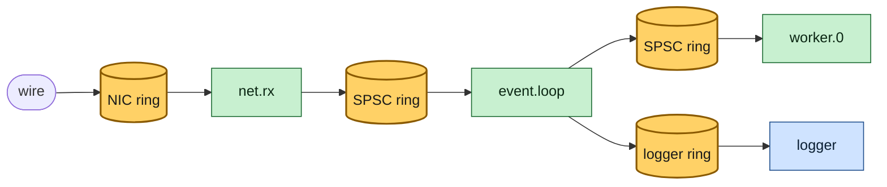
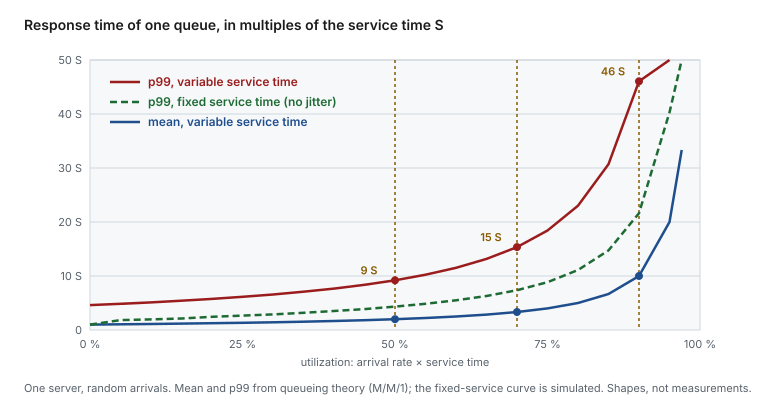
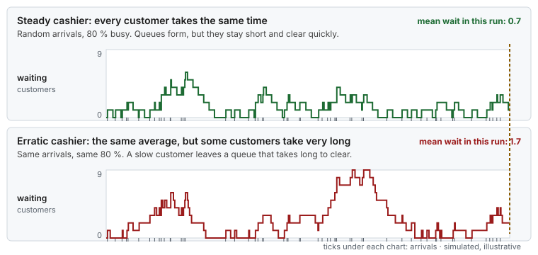

# Concept — Queueing: Utilization, Bursts, Little's Law and Back Pressure

> Used by: [Guide 09 §1](../guides/09-measuring-latency.md#1-why-measure-and-what-better-means), [`size-buffers`](../scripts/size-buffers). Related: [tail latency](tail-latency.md), [network buffers](network-buffers.md), [logging and I/O](logging-and-io.md). Use case: [19](../examples/use-cases/19-the-benchmark-that-lied.md). Terms: [Glossary](../GLOSSARY.md).

## At a glance

- There is a queue in front of every thread and device: the NIC ring, the socket buffer, the application's handoff rings, the logger ring. Most latency on a busy system is time spent waiting in one of them.
- Waiting grows like 1/(1 − utilization). At 50 % busy a request waits about one service time on average. At 90 % it waits nine, and the p99 is over forty.
- Variability makes it worse, and removing it helps as much as adding capacity. That is the hidden reason isolation pays: a steady service time shortens every queue behind it.

## 1. Why it matters

The other concepts remove the stalls that make one message slow. This one explains what happens to the messages **behind** it. A thread that is busy 70 % of the time looks healthy on a CPU graph, and yet a message that arrives while it works must wait. When the work is jittery or the arrivals come in bursts, those waits pile up into the tail. Queueing theory gives the arithmetic, and it says where the next microsecond is cheaper to find: in more capacity, in less variability, or in smaller bursts.

A message on a latency host crosses several queues in series, each one in front of a server:



*Every cylinder is a queue and every box a server. The response time of a message is the sum of its waits in each queue plus each service time.*

## 2. The vocabulary

| Symbol | Name | Example |
|---|---|---|
| λ | **Arrival rate**: messages per second | 200,000 /s |
| S | **Service time**: time to handle one message, without waiting | 2 µs |
| ρ = λ × S | **Utilization**: share of time the server is busy | 0.4 (40 %) |
| W | **Waiting time** in the queue | |
| R = W + S | **Response time**: what the sender sees | |
| L | **Queue length**: messages waiting or in service | |

**Little's law** links them, for any stable queue, whatever the distributions: **L = λ × R**. At 200,000 messages per second and an average response time of 5 µs, there is on average 1 message in the system. If a ring shows 50 messages waiting on average at that rate, the average response time is 250 µs, without measuring a single timestamp.

## 3. Why waiting explodes near full load

For one server with random arrivals and random service times (the M/M/1 model), the mean response time is

```text
R = S / (1 − ρ)        and the p99 is about 4.6 × S / (1 − ρ)
```



*Waiting is small while the server is mostly idle, and grows without limit as utilization approaches 100 %. In this model the p99 stays about 4.6 times the mean, so every step toward 100 % adds 4.6 times more to the tail, and a steady service time cuts it about in half.*

| Utilization | Mean response | p99 response |
|---|---|---|
| 50 % | 2 S | ~9 S |
| 70 % | 3.3 S | ~15 S |
| 80 % | 5 S | ~23 S |
| 90 % | 10 S | ~46 S |
| 95 % | 20 S | ~92 S |

With S = 2 µs, a thread at 70 % has a p99 of about 30 µs, although it never takes more than a few µs to handle one message. That is why the latency-critical threads in these guides are sized to be mostly idle, and why a busy-spinning thread at "100 % CPU" says nothing about its utilization in this sense: only the time spent on messages counts.

## 4. Variability: the other half of the formula

The M/M/1 numbers are a reference model: random arrivals **and** random service times, each with a coefficient of variation of 1. They are not a worst case. Bursty or correlated arrivals and heavy-tailed service times (rare long stalls) have coefficients above 1, and they wait longer than the table says. For one server with any arrival and service distributions, Kingman's approximation of the mean wait, most accurate at high utilization, shows both kinds of variability side by side:

```text
W ≈ S × ρ / (1 − ρ) × (ca² + cs²) / 2
```



*Same arrivals, same average service time, same 80 % utilization. Only the variability of the service time differs, and the erratic server makes customers wait about twice as long. The simulation is illustrative.*

> **Picture it.** Two cashiers who both average one minute per customer. One takes exactly a minute every time. The other is quick for most customers, and once in a while spends five minutes on a price check. The second line is always longer.

`ca` and `cs` are the coefficients of variation (standard deviation divided by the mean) of the gaps between arrivals and of the service times. Random (exponential) gives 1. A perfectly steady value gives 0.

- **Service-time variability (`cs`)** is what the tuning in these guides removes. Every tick, page fault, C-state exit or cache miss after a migration makes one service time longer, and every message behind it waits. With a fixed service time, waiting halves at any utilization (the green curve above).
- **Arrival variability (`ca`)** comes from the traffic: bursts, batches from upstream, many clients that synchronize. It cannot be tuned away on the host, only absorbed (§5) or smoothed upstream.

So a host that is "only 40 % busy" can still have a bad tail when its service times are jittery or its traffic is bursty. Halving `cs` is often cheaper than doubling the CPUs.

## 5. Bursts: averages hide them

Utilization must be measured at the time scale of the queue. A feed that averages 30 % over a minute can arrive at four times the drain rate for 1.5 ms. During that burst, ρ is above 1, and the queue grows linearly:

```text
backlog after t = (λ_burst − μ) × t          μ = 1 / S, the drain rate
```

The queue must hold the whole excess, or drop it. The [network buffers concept](network-buffers.md#3-burst-math) works this out for NIC rings, and [`size-buffers`](../scripts/size-buffers) and the [buffer simulator](https://vitor-tadashi.github.io/mechanical-sympathy/buffers.html) compute it for your rates.


*The same burst against two queue sizes: the small one drops, the large one holds the excess and drains it after the burst.*

## 6. A stall is a burst in disguise

When a server stops for a time D (a GC pause, a reclaim stall, an SMI), arrivals do not stop. A backlog of λ × D builds up, and after the stall the server drains it only with its spare capacity, 1 − ρ. The drain takes

```text
drain time = D × ρ / (1 − ρ)
```

At 20 % utilization, a 20 ms stall leaves 5 ms of drain behind it, and every message in that window is late. At 80 %, the same stall leaves 80 ms. The busier the server, the longer one stall echoes ([use case 19](../examples/use-cases/19-the-benchmark-that-lied.md)).


*One stall, seen by an open-loop client: a sawtooth of late requests during the stall, then a drain while the backlog clears.*

## 7. Bounded queues and back pressure

An unbounded queue never drops anything, so it hides overload: when λ stays above the drain rate, the queue and the latency grow until memory runs out. A **bounded** queue makes overload visible, and forces a decision when it is full:

| When full | Effect | Good for |
|---|---|---|
| **Drop and count** | Bounded latency, lost messages, a counter that shows it | Market data that is stale anyway, metrics, debug logs |
| **Block the producer** (back pressure) | No loss. The wait moves upstream, to the producer | Order flow where the sender can slow down or reject |
| **Reject with an error** | The client decides | Request-response services |

Whichever you choose, choose it explicitly, size the queue for the worst burst you accept (§5), and alert on the counter. The [logging concept](logging-and-io.md#4-the-design-hand-off-do-not-write) applies the same choice to the logger ring.

## 8. One queue or several

A pool of workers that shares one queue keeps every worker busy and gives the best average. On a latency host it has a cost the theory ignores: every worker fights over the queue's head and tail cache lines. **One queue per pinned thread** (sharding by key) removes the contention, at the price of imbalance when one shard gets the burst. Most latency designs shard, and keep each shard well below 50 % utilization so the imbalance has room.

## 9. Numbers to remember

| Fact | Value |
|---|---|
| Little's law | L = λ × R |
| Mean response, one random server, at 50 / 70 / 90 % | 2 / 3.3 / 10 × S |
| p99 response at the same points | ~9 / 15 / 46 × S |
| Effect of a steady service time | waiting about halves |
| Drain time after a stall D | D × ρ / (1 − ρ) |
| Backlog of a burst | (λ_burst − μ) × duration |

## 10. How it shows up

| Symptom | Mechanism | Read |
|---|---|---|
| p99 grows much faster than p50 as load rises | Utilization approaching 1 | §3 |
| The tail is bad on a host that "is only 40 % busy" | Service-time jitter or bursty arrivals | §4 |
| Drops during bursts with a low average rate | The queue is smaller than the burst excess | §5 |
| A tail of late messages for milliseconds after each pause | The backlog draining | §6 |
| Latency climbs for minutes and never recovers | Arrival rate above drain rate, unbounded queue | §7 |
| One worker much slower than its twins | One shard gets more of the traffic | §8 |

## 11. Myths

- **"70 % CPU is plenty of headroom."** For the mean, yes. For p99, the response time is already about 15 service times.
- **"A faster server fixes the tail."** It helps, but a server with the same speed and half the jitter often helps as much, and costs less.
- **"The queue was empty when I looked."** Queues fill in bursts of microseconds. Sample their maximum per burst, not their average per minute.
- **"Unbounded queues are safer because they never drop."** They turn overload into unlimited latency and, eventually, an out-of-memory kill.

## 12. See it on your host

No host needed. This simulates one server with service time S = 1 at three utilizations, first with random service times, then with fixed ones, and prints the mean and p99 response in units of S:

```bash
q() { awk -v rho="$1" -v fixed="$2" 'BEGIN { srand(1); t = 0; free = 0
  for (i = 0; i < 200000; i++) {
    t += -log(1 - rand()) / rho                         # next arrival (random gaps)
    start = (t > free) ? t : free                       # wait while the server is busy
    free = start + (fixed ? 1 : -log(1 - rand()))       # service: fixed, or random with mean 1
    print free - t } }' | sort -n | awk '{ s += $1; v[NR] = $1 } END { printf "mean %.1f S, p99 %.1f S\n", s / NR, v[int(NR * 0.99)] }'; }
for rho in 0.5 0.7 0.9; do printf 'utilization %s, random service: ' "$rho"; q "$rho" 0; done
for rho in 0.5 0.7 0.9; do printf 'utilization %s, fixed service:  ' "$rho"; q "$rho" 1; done
# approximate, and different with each awk implementation and seed:
# random: mean about 2 / 3.3 / 10 S, p99 about 9 / 15 / 45 S
# fixed:  p99 about half of the random case at each utilization
```

Then size a real queue with your own burst: `scripts/size-buffers --burst-mpps 4 --burst-us 1500 --drain-mpps 1.5` prints the backlog and the ring that holds it.

## 13. Illustrative scenario

An illustrative case, not a measurement. A pricing engine ran one pinned worker per instrument group at about 75 % utilization during the market open, with a service time of 3 µs and a p99 of 60 µs. The team first planned to double the workers. Before that, they removed two sources of service-time jitter: a lock shared with a statistics thread, and allocation on the hot path that caused minor faults. The mean service time barely changed, but its spread fell sharply. At the same 75 % utilization, p99 fell to 25 µs, and the extra workers were not needed. The same arithmetic told them how much headroom to keep: below 60 % at the open, so that a 5 ms stall would drain in under 8 ms.

## 14. Key takeaways

- Waiting grows like 1/(1 − ρ), and the p99 with it, at several times the mean. Keep latency-critical threads mostly idle.
- Variability counts as much as utilization. Removing service-time jitter, the aim of all the tuning here, shortens every queue behind it.
- Measure utilization at the time scale of a burst, and size queues for the burst excess.
- A stall leaves a backlog that drains in D × ρ / (1 − ρ). Busy servers echo stalls longer.
- Bound every queue and decide what happens when it is full: drop and count, block, or reject.

## 15. References

- John D. C. Little, *A Proof for the Queuing Formula: L = λW*, Operations Research, 1961
- J. F. C. Kingman, *The single server queue in heavy traffic*, 1961
- Mor Harchol-Balter, *Performance Modeling and Design of Computer Systems*
- Neil J. Gunther, *Guerrilla Capacity Planning*
- [Concept: network buffers](network-buffers.md) for the burst arithmetic of NIC rings
