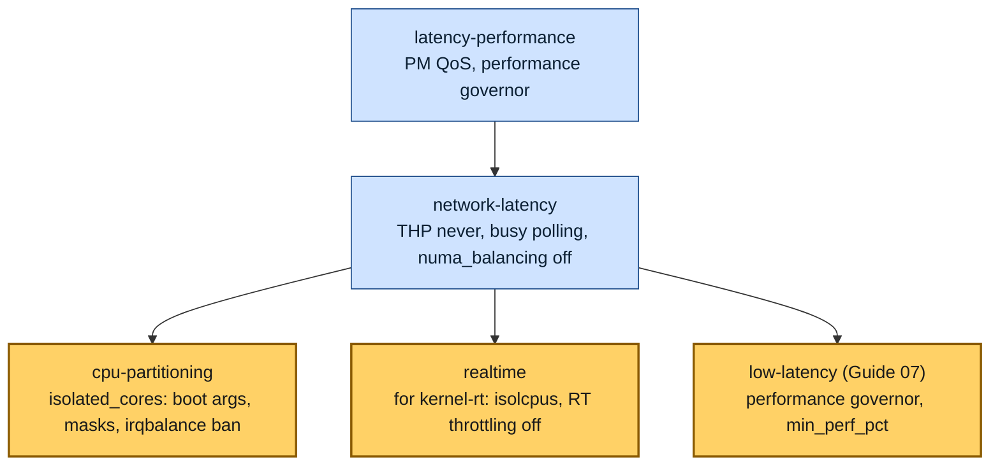
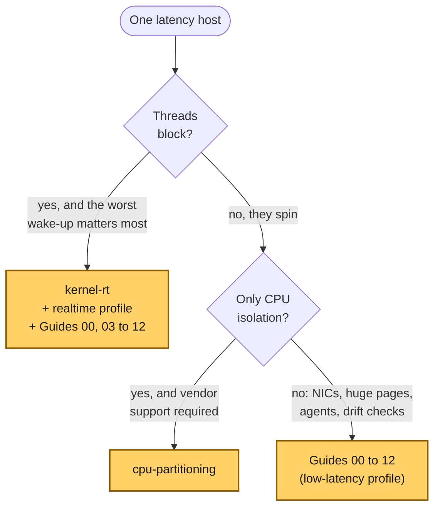

# Concept — RHEL's Own Tools: tuned Profiles and the Real-Time Kernel

> Used by: [Guide 01](../guides/01-grub-bootloader-tuning.md), [Guide 02 §4.4](../guides/02-cpu-core-isolation.md#44-real-time-throttling), [Guide 07 §5](../guides/07-os-hygiene.md#5-tuned-profile). Related: [CPU isolation](cpu-isolation.md), [boot path](bootloader.md), [interrupts and deferred work](interrupts-and-deferred-work.md). Terms: [Glossary](../GLOSSARY.md).

## At a glance

- RHEL ships its own answer to CPU isolation: the [tuned](../GLOSSARY.md#tuned) profile **[cpu-partitioning](../GLOSSARY.md#cpu-partitioning)**. It sets about the same boot arguments and masks as Guides 01 and 02, from one variable, `isolated_cores`.
- It covers the CPUs only. Huge pages per node, NIC roles and interrupts, the agent slice, memory pressure, verification and rollback are left to you, and that is what the other guides add.
- The real-time kernel, **[kernel-rt](../GLOSSARY.md#kernel-rt)**, solves a different problem: how long a thread that **blocks** waits to run again. A thread that spins alone on an isolated CPU gains little from it.

## 1. Why it matters

The first question an experienced RHEL administrator asks about these guides is: why not just run `tuned-adm profile cpu-partitioning`? It is a fair question. The profile is supported by Red Hat, it ships in a package, and it does a large part of what Guides 01 and 02 do.

This page answers it setting by setting. It also says when the profile, or the real-time kernel, is the better choice, and how to combine them with the guides without two tools fighting over the same file.

> [!NOTE]
> **Validate on your hardware.** The profile contents below are read from tuned 2.21. Profiles change between tuned versions, so read the one on your host (§8) before you rely on any row. This repository does not measure the profiles or the real-time kernel.

## 2. The profiles in one picture

tuned profiles are layered. A profile names another one in `include=`, takes all of its settings, and adds or overrides its own.



*All three profiles that isolate or tune for latency start from `network-latency`, which starts from `latency-performance`. They differ in what they add on top, and the profile of Guide 07 adds the least, because the scripts do the rest.*

> **Picture it.** A profile is a recipe card that says "start from that other card, then change these lines". Reading one card alone never tells you the whole dish.

## 3. cpu-partitioning, setting by setting

You give the profile one list, in `/etc/tuned/cpu-partitioning-variables.conf`:

```ini
isolated_cores=3,5,7,9          # by default: all but one core per socket
# no_balance_cores=3,5,7,9      # optional: the CPUs that also get isolcpus
```

From that list it derives everything below. The third column says where this repository does the same.

| What cpu-partitioning sets | Where the guides do it | Difference |
|---|---|---|
| `nohz_full=` and `rcu_nocbs=` on `isolated_cores` | [Guide 01 §5.2](../guides/01-grub-bootloader-tuning.md#52-cpu-isolation-bare-metal-only) | Same |
| `isolcpus=` **only** on `no_balance_cores`, and only if you set it | Guide 01 sets `isolcpus` on every isolated CPU | Without `no_balance_cores`, the scheduler still balances tasks onto the isolated CPUs. The profile relies on the masks below to keep them away. |
| `nohz=on` | Guide 01 sets `nohz=off` | Only matters when a CPU goes idle. With `idle=poll` it rarely does. |
| `intel_pstate=disable`, `nosoftlockup` | [Guide 01 §5.3, §5.4](../guides/01-grub-bootloader-tuning.md#53-frequency-and-power) | Same |
| Workqueue cpumask on the other CPUs, also written from the initramfs at early boot | [Guide 02 §4.2](../guides/02-cpu-core-isolation.md#42-unbound-kernel-workqueues-runtime), at every boot by `lowlat-runtime.service` | The profile sets it earlier, before most drivers load |
| systemd `CPUAffinity` on the other CPUs | [Guide 02 §4.1](../guides/02-cpu-core-isolation.md#41-systemd-cpuaffinity-persistent) | Same |
| irqbalance bans `isolated_cores` | [Guide 02 §4.3](../guides/02-cpu-core-isolation.md#43-irqbalance-persistent): irqbalance off, or the same ban | Same goal |
| Moves running threads off `isolated_cores` (the `scheduler` plugin), except names that match DPDK and similar patterns | systemd `CPUAffinity`, and [Guide 05](../guides/05-cgroup-isolation.md) pins the agents | The profile also catches processes started before it ran |
| Corrected machine-check errors ignored (`ignore_ce` in sysfs) | `mce=ignore_ce` on the command line ([Guide 01 §5.4](../guides/01-grub-bootloader-tuning.md#54-silence-the-watchdogs-and-error-pollers)) | Same effect |
| [KSM](../GLOSSARY.md#ksm) (kernel same-page merging) off | Not set | KSM scans memory in the background. It is off unless something turns it on. |
| Everything from `network-latency`: PM QoS, `performance` governor, THP `never`, busy polling, `numa_balancing=0`, `nmi_watchdog=0` | [Guide 07 §5](../guides/07-os-hygiene.md#5-tuned-profile) includes the same profile | Same |

What the profile does **not** do, and the guides do:

- huge pages reserved per NUMA node at early boot ([Guide 03](../guides/03-huge-pages-configuration.md));
- NIC roles, coalescing, offloads and one IRQ CPU per queue ([Guide 04](../guides/04-network-optimization.md));
- a fenced, limited slice for agents ([Guide 05](../guides/05-cgroup-isolation.md)), the sysctl profile ([Guide 06](../guides/06-kernel-sysctl-tuning.md)) and the service list ([Guide 07](../guides/07-os-hygiene.md));
- RT throttling (`sched_rt_runtime_us`), the time daemons' CPUs ([Guide 10](../guides/10-time-sync.md)), swap and the OOM order ([Guide 12](../guides/12-memory-pressure.md));
- a PASS/WARN/FAIL report, a drift timer ([Guide 11](../guides/11-day2-operations.md)) and a recorded rollback for every file.

**When to choose the profile instead.** Your organization requires vendor-supported configuration only. Or the host needs CPU isolation and nothing else: no special NIC, no huge pages, no agents to fence. The profile is a few lines to apply, and Red Hat supports it.

> **Picture it.** cpu-partitioning is a "do not disturb" sign on a set of desks. The guides also move the phones, the mail and the cleaners away, and check every morning that the sign is still up.

### 3.1 Using both on one host

Do not run cpu-partitioning **and** Guides 01 and 02 on the same CPUs. Both write kernel arguments: tuned through its bootloader plugin, the scripts through `grubby`. Both write the systemd CPU mask too, and the next one to run wins. Pick one owner for each setting:

- **Guides only** (the default of this repository). Guide 07 includes `network-latency`, which isolates nothing. Recent tuned versions (2.21 here) still add `skew_tick=1 tsc=reliable rcupdate.rcu_normal_after_boot=1` to the command line through it: `/etc/tuned/bootcmdline` shows what your version adds.
- **The profile for the CPUs, the guides for the rest.** Set `isolated_cores` to `ISOLATED_CPUS`, and set `no_balance_cores` to the same list if you want `isolcpus`. Then skip `01-grub-bootloader` and `02-cpu-isolation`, and run the other guides. Those two scripts also set things the profile does not, so add them by hand, or other guides lose what they build on:
  - the latency subset of [Guide 01 §5.1](../guides/01-grub-bootloader-tuning.md#51-latency-subset-bare-metal-and-vms) (`idle=poll`, the C-state caps, `transparent_hugepage=never`) and `rcu_nocb_poll`;
  - the huge page size of [Guide 01 §5.5](../guides/01-grub-bootloader-tuning.md#55-huge-page-size) (`default_hugepagesz` and `hugepagesz`). Without `hugepagesz=` on the command line, the early-boot reservation of Guide 03 does not run, and only its best-effort runtime attempt is left;
  - your IOMMU and mitigation choices from [Guide 01 §5.6](../guides/01-grub-bootloader-tuning.md#56-iommu-and-cpu-vulnerability-mitigations-security-sensitive);
  - `kernel.sched_rt_runtime_us=-1` from [Guide 02 §4.4](../guides/02-cpu-core-isolation.md#44-real-time-throttling), which no profile but `realtime` sets, and the RT limits in `system.conf` from [Guide 02 §4.1](../guides/02-cpu-core-isolation.md#41-systemd-cpuaffinity-persistent).

  `verify-tuning` will still report the boot arguments that differ (`nohz=on`, and no `isolcpus` without `no_balance_cores`) as FAIL. Read those lines against this table.

> [!WARNING]
> tuned writes its own boot arguments into every boot entry. After switching profiles, check the result with `grubby --info=ALL` and `/proc/cmdline` after a reboot, as in [Guide 01 §7](../guides/01-grub-bootloader-tuning.md#7-verification).

## 4. realtime and realtime-virtual-*

The `realtime` profile is meant for hosts that boot the real-time kernel (§5). It includes `network-latency`, like the others, and adds:

- `isolcpus=managed_irq,domain,<isolated_cores>`, so that kernel-managed interrupts move to a housekeeping CPU where they can ([boot path §3](bootloader.md#3-the-housekeeping-model)). It is best effort: a device queue whose mask holds only isolated CPUs keeps them. Check where each one lands with `/proc/irq/*/effective_affinity_list`, and watch its count in `/proc/interrupts`. `isolate_managed_irq=N` drops the flag.
- `kernel.sched_rt_runtime_us = -1`: no RT throttling, as in [Guide 02 §4.4](../guides/02-cpu-core-isolation.md#44-real-time-throttling).
- the same workqueue masks, irqbalance ban, scheduler plugin and `intel_pstate=disable` as cpu-partitioning.
- The channel count of every NIC set to `netdev_queue_count`, or by default to the number of housekeeping CPUs. That overlaps [Guide 04 §5.1](../guides/04-network-optimization.md#51-queues-channels-ethtool--l), which sets channels per NIC role, so give it one owner.

`realtime-virtual-host` and `realtime-virtual-guest` build on it for KVM: a host that runs real-time guests on dedicated CPUs, and the guest inside it. On RHEL they come in separate packages (`tuned-profiles-nfv-host` and `tuned-profiles-nfv-guest`), and both sides run a real-time kernel.

## 5. The real-time kernel (kernel-rt)

**[PREEMPT_RT](../GLOSSARY.md#preempt-rt)** changes the kernel itself, not its settings. Red Hat ships it as a separate kernel, `kernel-rt`, through the *Red Hat Enterprise Linux for Real Time* add-on, which is a separate subscription and repository.

What changes inside the kernel:

- **Interrupt handlers become threads.** Each one is a kernel thread with a priority, so a more urgent user thread can run first.
- **Most kernel locks can sleep.** A thread that waits for a lock no longer blocks the CPU, so a higher-priority thread can preempt the kernel almost anywhere.
- **Priority inheritance.** A low-priority holder of a lock that a high-priority thread wants is boosted until it releases the lock.

> **Picture it.** On the standard kernel, a clerk who has started a form finishes it before anyone else is served. On the real-time kernel, the clerk can put the form down at almost any line when an urgent customer arrives.

Who gains, and who does not:

| Thread | Standard kernel, tuned | Real-time kernel, tuned |
|---|---|---|
| Spins alone on an isolated CPU, never blocks | Nothing to preempt: it already owns the CPU | About the same. The extra preemption points cost a little throughput. |
| Blocks in `epoll_wait` or on a futex, and must wake fast | The wake-up can wait behind a non-preemptible kernel section, rarely for hundreds of µs | The worst wake-up delay is bounded much lower. This is the case PREEMPT_RT is built for. |
| Throughput-heavy work on the same host | Full throughput | Lower: threaded interrupts and sleeping locks add overhead |

So the real-time kernel is the right tool when a critical thread **must block** (a control loop that sleeps until a timer fires, for example) and its worst wake-up time matters more than throughput. It does not replace isolation: on `kernel-rt` you still isolate the CPUs, move the interrupts and fence the agents, usually with the `realtime` profile.

The guides target the standard kernel. On `kernel-rt`, the scripts run the same way, but nobody has checked them there. Measure with `rtla timerlat` and `cyclictest` ([Guide 09](../guides/09-measuring-latency.md)), which test exactly the wake-up latency that the real-time kernel improves.

> [!NOTE]
> **Validate on your hardware.** The effects above follow the kernel and Red Hat documentation. This repository does not measure `kernel-rt`, and its scripts are not checked on it.

## 6. RT throttling and the fair server

Two kernel mechanisms stop real-time threads from starving everything else on a CPU:

| Mechanism | Since | Switch | What it does to a FIFO spinner |
|---|---|---|---|
| [RT throttling](../GLOSSARY.md#rt-throttling) | long before RHEL 8 | `kernel.sched_rt_runtime_us=-1` turns it off | Takes 50 ms of every second, even when nothing else waits |
| [Fair server](../GLOSSARY.md#deadline-server) | upstream kernel 6.12 (RHEL 10) | per CPU, in debugfs. The scripts leave it on | Takes up to 50 ms per second, only when a normal task is waiting on that CPU |

Both the guides and the `realtime` profile turn RT throttling off. Neither switches off the fair server, and neither should: it is the kernel's last guard against a CPU that never lets its own threads run. [Guide 02 §4.4](../guides/02-cpu-core-isolation.md#rhel-10-the-fair-server) shows how to check it, and [use case 14](../examples/use-cases/14-the-spinner-that-stalled-the-kernel.md) shows why a `SCHED_OTHER` spinner avoids both.

## 7. Which one for my host?



*Start from how the critical threads wait. Blocking threads whose worst wake-up matters point to the real-time kernel. Spinning threads that need only isolation can use cpu-partitioning. Everything else is what these guides are for.*

## 8. See it on your host

```bash
tuned-adm active                                    # the profile in use
tuned-adm list | grep -E 'partitioning|realtime'    # installed only with their packages
rpm -ql tuned-profiles-cpu-partitioning | grep tuned.conf   # where the profile file is
cat /etc/tuned/cpu-partitioning-variables.conf      # isolated_cores, no_balance_cores
cat /etc/tuned/bootcmdline                          # the kernel arguments tuned adds
uname -r                                            # a kernel-rt release contains rt, such as .rt7. or +rt
cat /sys/kernel/realtime 2>/dev/null                # 1 on a PREEMPT_RT kernel
ls /sys/kernel/debug/sched/fair_server/ 2>/dev/null # present when the kernel has the fair server
```

## 9. Key takeaways

- cpu-partitioning does what Guides 01 and 02 do, from one list, with vendor support. It sets `isolcpus` only for `no_balance_cores`.
- It stops at the CPUs. Huge pages, NICs, agents, memory pressure, verification and rollback come from the other guides.
- Give each setting one owner. tuned and the scripts both write boot arguments and the systemd CPU mask.
- The real-time kernel bounds how long a **blocking** thread waits. A thread that spins alone on an isolated CPU gains little from it.
- `sched_rt_runtime_us=-1` ends RT throttling, but on RHEL 10 the fair server still gives a waiting normal task up to 50 ms per second. Spin as `SCHED_OTHER`.

## 10. References

- The profile files on your host (§8), and `man 7 tuned-profiles-cpu-partitioning`, `man 7 tuned-profiles-realtime`, `man 7 tuned-profiles-nfv-host`
- Red Hat — *Monitoring and managing system status and performance*: "Getting started with TuneD"
- Red Hat — *Optimizing RHEL for Real Time for low latency operation*
- Kernel documentation: `Documentation/scheduler/sched-rt-group.rst` (RT throttling and the fair server), `Documentation/admin-guide/kernel-parameters.txt` (`isolcpus`, `nohz_full`)
- <https://wiki.linuxfoundation.org/realtime/start> (PREEMPT_RT)
