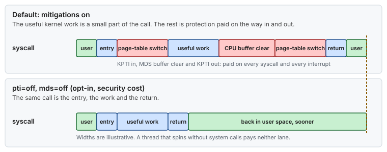
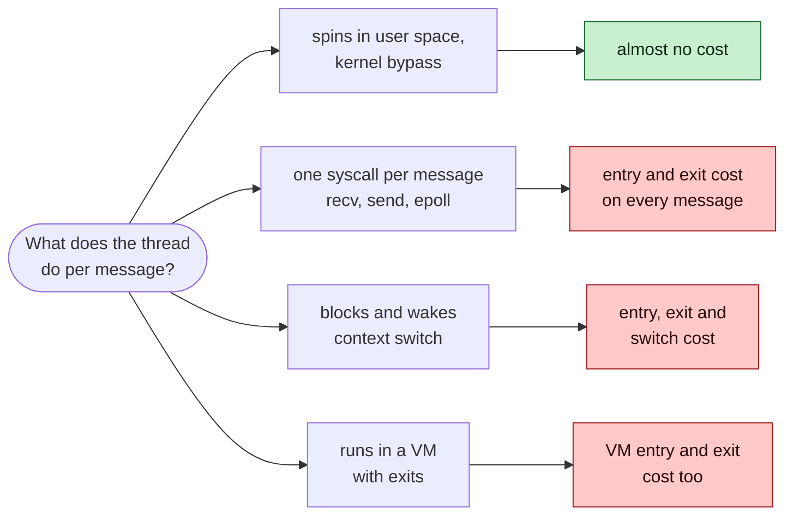

# Concept — CPU Security Mitigations: What They Cost and Who Pays

> Used by: [Guide 01 §5.6](../guides/01-grub-bootloader-tuning.md#56-iommu-and-cpu-vulnerability-mitigations-security-sensitive). Related: [safety model](../SAFETY.md), [CPU isolation](cpu-isolation.md), [kernel bypass](../guides/08-kernel-bypass.md), [hardware topology](hardware-topology.md). Terms: [Glossary](../GLOSSARY.md).

## At a glance

- Since 2018, CPUs have had flaws that let one program read another's data through speculative execution. The kernel protects against them with extra work at the boundaries: entering and leaving the kernel, switching processes, entering and leaving a VM.
- So the cost lands on **crossings**, not on computation. A thread that spins in user space without system calls pays almost nothing. A thread that makes a system call per message pays on every message.
- Before you turn a protection off, cross the boundary less. When you still need the last few hundred nanoseconds, the opt-out is per mitigation, written down and signed off.

## 1. Why it matters

The mitigations are the one tuning topic where a latency gain is paid with a security control. [Guide 01 §5.6](../guides/01-grub-bootloader-tuning.md#56-iommu-and-cpu-vulnerability-mitigations-security-sensitive) lists the switches and the conditions. This page explains what each protection does, where its cost lands, and how to measure that cost on your own path, so the decision is about your numbers and not about a benchmark from the internet.

> [!CAUTION]
> Every switch in this page **removes a security control**. They are opt-in in `lowlat.conf` (`GRUB_DISABLE_MITIGATIONS=no` by default) and belong only on single-tenant hosts that run no untrusted code, with written approval ([safety model](../SAFETY.md)).

## 2. The idea in one paragraph

Modern CPUs guess ahead: they run instructions before they know the instructions are needed, and throw the results away if the guess was wrong. The results are thrown away, but traces stay in caches and buffers, and a careful program can read those traces. The flaws differ in which guess and which buffer, but the defense is always the same kind: **clear or separate the shared state** whenever execution moves from one trust domain to another. That clearing is the cost.

## 3. The families, and what the kernel does

| Family (names you meet) | What leaks | Kernel defense | Where the cost lands |
|---|---|---|---|
| **Meltdown** | Kernel memory, read from user space | **KPTI**: user space runs with a page table that does not map the kernel | Every syscall, interrupt and exception: a page-table switch (CR3) on entry and exit. Affected Intel CPUs only. |
| **Spectre v1** (bounds check bypass) | Data past an array bound | `lfence` and index masking after checks in the kernel | Small, spread over kernel code |
| **Spectre v2**, **Retbleed**, **BHI** (branch target injection) | Data through a poisoned indirect branch or return | Retpolines, IBRS / eIBRS, IBPB on context switch, return thunks, branch history clearing | Indirect calls in the kernel, context switches, kernel entry |
| **MDS**, **TAA**, **MMIO stale data** | Data left in internal CPU buffers | `VERW` buffer clear on every return to user space (and VM entry) | Every return from the kernel |
| **L1TF** | L1 cache contents, mainly across VMs | PTE inversion; L1 flush on VM entry | VM entries (hypervisors) |
| **SSB** (speculative store bypass) | Stale data through a load that runs before a store | SSBD, per process on request (`prctl`, seccomp) | Only processes that ask for it |
| **SMT-related** variants | Data from the sibling hardware thread | Some are only fully fixed with SMT off | Half the hardware threads, which latency hosts give up anyway |
| **Downfall (GDS)**, **Inception (SRSO)**, newer | Varies | Microcode plus kernel changes | Varies: specific instructions, returns |

The list grows. A kernel update or a microcode update can add a mitigation, and its cost, without any change to your configuration. That is why [Guide 01](../guides/01-grub-bootloader-tuning.md#56-iommu-and-cpu-vulnerability-mitigations-security-sensitive) lists explicit switches instead of `mitigations=off`: a new protection stays on until someone reviews it.

## 4. Where the cost lands: crossings



*The useful work of a small system call is short. On an affected CPU, the protection on the way in and out can take longer than the work.*



*The cost follows the crossings a thread makes, not the work it does.*

This gives the order of decisions:

1. **Cross less.** Busy-poll instead of blocking, batch messages per system call, or move the critical path to kernel bypass ([Guide 08](../guides/08-kernel-bypass.md)). Each removes crossings, and with them the mitigation cost, with no security change.
2. **Measure what is left** (§8). If the critical path makes no system calls, turning mitigations off gains nothing there.
3. **Opt out per mitigation**, only for what the measurement shows, with the sign-off of [Guide 01 §5.6](../guides/01-grub-bootloader-tuning.md#56-iommu-and-cpu-vulnerability-mitigations-security-sensitive).

Interrupts are crossings too. With the IRQs and softirqs of kernel-stack NICs kept off the isolated CPUs, that part of the cost lands on the housekeeping CPUs, which is where it belongs.

## 5. Reading the host's state

```bash
grep . /sys/devices/system/cpu/vulnerabilities/*
# .../meltdown:Mitigation: PTI                      <- KPTI on (affected Intel CPU)
# .../meltdown:Not affected                         <- newer CPU or AMD: nothing to pay
# .../mds:Mitigation: Clear CPU buffers; SMT disabled
# .../spectre_v2:Mitigation: Enhanced / Automatic IBRS; IBPB: conditional; ...

tr ' ' '\n' </proc/cmdline | grep -E '^(mitigations|pti|nospectre|mds|tsx_async_abort)'
# nothing: the defaults (all on)

journalctl -k -b | grep -i -E 'mitigation|vulnerab' | head
```

Each line in `vulnerabilities/` is one of three kinds: `Not affected` (the CPU does not have the flaw, so there is nothing to pay or to turn off), `Mitigation: …` (protected, and the text says how), or `Vulnerable` (not protected). Read them again after every kernel and microcode update.

## 6. Numbers to remember

Typical orders of magnitude on affected CPUs, not measurements. Newer CPUs fix several flaws in hardware and pay much less.

| Item | Typical cost |
|---|---|
| A bare system call (no mitigations) | ~50–100 ns |
| KPTI, per kernel entry and exit | ~100–200 ns |
| `VERW` buffer clear, per return to user | tens of ns |
| IBPB on a context switch | a few µs on older CPUs |
| Retpolines vs eIBRS | retpolines cost more on every indirect call in the kernel |
| A thread that spins without system calls | ~0 |

## 7. How it shows up

| Symptom | Mechanism | Check |
|---|---|---|
| A syscall-heavy path got slower after a kernel or microcode update, with no configuration change | A new mitigation came on | Compare `vulnerabilities/*` before and after |
| `perf top` on the critical CPU shows `entry_SYSCALL_64`, `__x86_indirect_thunk_*` or `switch_mm_irqs_off` high | Crossing cost dominates | Cross less (§4) |
| A twin host with a newer CPU is faster on the same code | The newer CPU is `Not affected` by Meltdown or MDS | `vulnerabilities/*` on both |
| Turning mitigations off changed nothing | The critical path makes no crossings | Good news: keep them on |

## 8. See it on your host

Measure the cost of a crossing on your own CPU and kernel. `dd` with a 1-byte block makes one `read` and one `write` system call per byte, so a million bytes is two million system calls:

```bash
time dd if=/dev/zero of=/dev/null bs=1 count=1000000 status=none
# real 0m0.42s  ->  0.42 s / 2,000,000 calls = ~210 ns per call (illustrative)
```

Run it pinned to one CPU (`taskset -c 3`) a few times and keep the lowest number. To see what the mitigations cost, compare with the same command on a **scratch VM or test host** booted with `mitigations=off`, never on a production host. On a CPU that reports `Not affected` for Meltdown and MDS, the two numbers will be close.

`perf stat -e 'syscalls:sys_enter_*' -p <pid> -- sleep 10` (root) counts how many system calls your application makes per second. Multiply by the per-call cost to see what the mitigations cost the whole process.

## 9. Myths

- **"`mitigations=off` gives you 30 %."** That number comes from syscall-heavy benchmarks on affected CPUs. A latency thread that spins in user space can gain nothing at all. Measure your path.
- **"`mitigations=off` is the same as listing the switches."** It also turns off every mitigation a future kernel adds, including ones nobody has reviewed.
- **"The isolated CPUs need it more than the others."** The isolated CPUs make the fewest crossings when the tuning is right. Most of the cost lands on housekeeping CPUs, where interrupts and system services run.
- **"Turning SMT off is only for latency."** Some flaws are only fully closed with SMT off, so a latency host that already runs without SMT gets that protection for free.

## 10. Illustrative scenario

An illustrative case, not a measurement. A gateway on a kernel-stack socket path made one `recvmsg` and one `sendmsg` per message. After a quarterly kernel and microcode update, p50 rose by 0.6 µs with no configuration change. `vulnerabilities/` showed a new `Mitigation:` line, and `perf top` on the critical CPU had kernel entry and exit code near the top. Instead of asking for `mitigations=off`, the team switched the receive path to `recvmmsg` with a batch of 16 and enabled busy polling. That cut the system calls per message by about ten, and p50 ended 0.4 µs lower than before the update, with every mitigation still on.

## 11. Key takeaways

- Mitigations tax crossings: kernel entry and exit, context switches, VM exits. Computation in user space is not taxed.
- Cross less first: busy polling, batching, kernel bypass. That gain comes with no security cost.
- Read `/sys/devices/system/cpu/vulnerabilities/*` after every kernel and microcode update. A new line can mean a new cost.
- If you still opt out, do it per mitigation, only where measured, with written sign-off, never with `mitigations=off`.

## 12. References

- <https://docs.kernel.org/admin-guide/hw-vuln/index.html>
- <https://docs.kernel.org/admin-guide/kernel-parameters.html> (`mitigations=`, `pti=`, `mds=`, `spectre_v2=`)
- Intel, *Affected Processors: Transient Execution Attacks*
- AMD, *Product Security* bulletins
- `man 2 prctl` (`PR_SET_SPECULATION_CTRL`)
