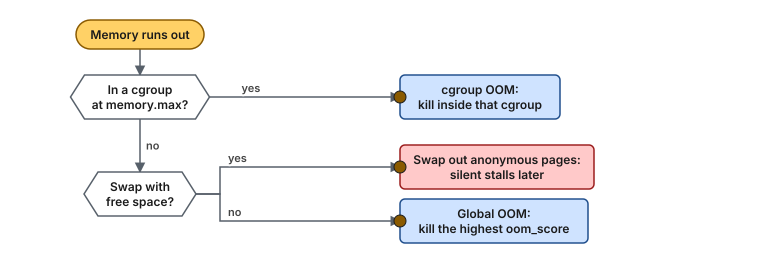
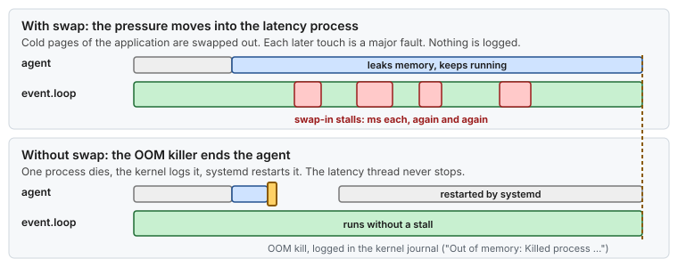

# Concept — Swap and the OOM Killer: Silent Stalls or a Loud Failure

> Used by: [Guide 12](../guides/12-memory-pressure.md), [Guide 05 §4](../guides/05-cgroup-isolation.md#4-design-three-slices), [Guide 06 §8](../guides/06-kernel-sysctl-tuning.md#8-virtual-memory). Related: [memory reclaim and faults](memory-reclaim.md), [cgroups](cgroups.md), [huge pages and NUMA](huge-pages.md). Use case: [17](../examples/use-cases/17-memory-pressure-on-a-latency-host.md). Terms: [Glossary](../GLOSSARY.md).

## At a glance

- Swap lets the kernel reclaim **anonymous** memory (heap, stacks) by writing it to disk. Reading it back later is a major fault: milliseconds on the thread that touches it.
- When memory runs out, a host with swap slows down quietly, in every process, while a host without swap kills one process and logs it. On a latency host, the loud failure is the better one.
- The OOM killer chooses its victim by a score you can steer. Make the agents go first and the latency service last.

## 1. Why it matters

[Memory reclaim](memory-reclaim.md) explains how the kernel takes back page cache. Anonymous memory has no file to go back to, so the only way to reclaim it is to write it to swap. That is useful on a desktop or a batch server, where a slow program is better than a dead one. On a latency host it is the wrong trade: a page swapped out of the critical process costs a disk read the next time the hot path touches it, and nothing tells you it happened. This page explains what swap does, what `vm.swappiness` really controls, and how the OOM killer picks a victim, so the policy for memory exhaustion is a decision, not a default.

## 2. What swap does

| Step | What happens | Cost |
|---|---|---|
| **Swap-out** | Under pressure, the kernel writes cold anonymous pages to the swap device and frees them | Disk writes, on `kswapd` or on the thread in direct reclaim |
| **Swap-in** | A thread touches a swapped-out page. It takes a major fault and waits while the kernel reads the page back | 0.1 ms to many ms, **on the thread that touched it** |
| **Readahead** | The kernel reads a few neighbors at the same time (`vm.page-cluster`: the default `3` means 2³ = 8 pages) | More I/O, sometimes fewer faults |

What can and cannot be swapped:

| Memory | Swappable? |
|---|---|
| Heap, stacks, `malloc` memory, JVM metaspace and code cache, direct buffers in 4 KiB pages | **Yes**, unless the process called `mlockall` |
| Pages in the hugetlb pool (a heap in explicit huge pages, [Guide 03](../guides/03-huge-pages-configuration.md)) | Never |
| Pages locked with `mlock` / `mlockall` | Never |
| Page cache (file data, code) | Not swapped: evicted and read back from its file ([memory reclaim §7](memory-reclaim.md#7-faults-what-a-missing-page-costs)) |

So a JVM with its heap in huge pages is **not** safe from swap by that alone. Its thread stacks, metaspace, code cache and direct buffers are ordinary anonymous memory.

## 3. What `vm.swappiness` really means

> **Picture it.** `swappiness` is how the kernel prices two chores when memory runs short: throwing away library copies of files (page cache) or moving private notes (anonymous memory) to the basement (swap). A low value makes the basement expensive, not closed.

`vm.swappiness` (0–200, default 60) is **not** a threshold. It is the relative cost the kernel assigns to reclaiming anonymous pages versus file pages. A low value says "prefer dropping page cache over swapping".

- `swappiness=0` does **not** turn swap off. It makes the kernel avoid swapping while there is page cache to drop. When the page cache is gone, it swaps anyway.
- tuned's `latency-performance` profile, which `network-latency` includes ([Guide 07 §5](../guides/07-os-hygiene.md#5-tuned-profile)), sets it to `10`. [Guide 12 §4.2](../guides/12-memory-pressure.md#42-swap-kept-latency-services-protected-swap_policyprotect) sets `1` when you keep swap. Check the value on your host with `sysctl vm.swappiness`.
- In cgroup v2, `memory.swap.max` (`MemorySwapMax=` in systemd) caps swap per cgroup. `0` means the group never swaps, whatever the global setting. [Guide 05](../guides/05-cgroup-isolation.md#4-design-three-slices) sets it for the housekeeping slice.

The only setting that guarantees a page is never swapped is that the page cannot be: no swap device, `memory.swap.max=0` on the group, `mlock`, or the hugetlb pool.

## 4. Compressed swap: zswap and zram

Two kernel features compress pages in RAM instead of, or before, writing them to disk:

- **zswap** is a compressed cache in front of a swap device. Swapped pages are compressed into RAM first, and only written to disk when that cache is full. It is off by default on RHEL: `cat /sys/module/zswap/parameters/enabled`.
- **zram** is a compressed RAM disk used as a swap device. Some distributions enable it by default; `swapon --show` lists it as `/dev/zram0`.

Both make swap-in faster, from µs instead of ms, but a swap-in is still a fault on the hot path, plus a decompression. They change the size of the stall, not the fact of it.

## 5. The OOM killer

When reclaim cannot free enough memory for an allocation, the kernel's **OOM killer** chooses a process and kills it with `SIGKILL`. It runs in two scopes:

| Scope | Trigger | Victim chosen from |
|---|---|---|
| **cgroup OOM** | A cgroup reaches `memory.max` (`MemoryMax=`) | The processes of that cgroup only ([concept: cgroups](cgroups.md)) |
| **Global OOM** | The whole host runs out | Every process on the host |

The victim is the process with the highest **`oom_score`** (0–1000). The score is the share of memory the process uses (resident memory, swap and page tables), plus `oom_score_adj` (−1000 to +1000):

| `oom_score_adj` | Effect |
|---|---|
| `+500` | Killed early: agents, batch tools |
| `0` | Default |
| `−900` | Killed only if almost nothing else is left |
| `−1000` | Never killed |

systemd sets it per service with `OOMScoreAdjust=`. Every kill is logged: `journalctl -k | grep -i 'out of memory'`.



*A cgroup limit contains the damage to its own group. Without a limit, a host with swap degrades every process, and a host without swap kills one, chosen by score.*

Why not `−1000` for the latency service? A service that cannot be killed and leaks memory makes the kernel kill everything else first, the agents, `sshd`, `systemd-journald`, and then panic when nothing is left. `−900` keeps it last in line while the host stays reachable.

## 6. Silent stalls versus a loud failure



*The same leak. With swap, the cost spreads into the latency process as stalls nobody logs. Without swap, it ends in one logged kill of the process that leaked.*

The argument for no swap on a latency host follows the Unix rule "fail loudly and early":

- With swap, a leak in an agent becomes millisecond stalls in the critical process, hours later, with no message. The usual tools see a slow application, not a memory problem.
- Without swap, the same leak ends the agent within seconds, with a kernel log line that names it. The critical process is untouched.

Pair it with a memory cap on the agents ([Guide 05](../guides/05-cgroup-isolation.md#4-design-three-slices)), so most leaks end in a cgroup OOM inside the agents' slice and never reach the global OOM killer. [Guide 12](../guides/12-memory-pressure.md) applies this policy with one script.

> [!NOTE]
> **Validate on your hardware.** Turning swap off makes a global OOM more likely when the host is sized too tightly. Size memory for the peak, cap the agents, and watch PSI and `MemAvailable` before you remove swap from a host that has it.

## 7. Watching for pressure

| Signal | Where | What it says |
|---|---|---|
| Swap in use | `swapon --show`, `free -m`, `SwapTotal`/`SwapFree` | Whether any page is on swap right now |
| Swap traffic since boot | `pswpin`, `pswpout` in `/proc/vmstat` | Whether anything was ever swapped in or out |
| Swap of one process | `VmSwap` in `/proc/<pid>/status` | How much of the critical process sits on swap |
| Locked memory of one process | `VmLck` in `/proc/<pid>/status` | Whether `mlockall` worked |
| Stall time | `/proc/pressure/memory` (PSI) | Share of time tasks waited for memory: `some` (at least one) and `full` (all) |
| Kills | `journalctl -k`, `memory.events` (`oom_kill`) | Who was killed, and in which cgroup |

## 8. Numbers to remember

Typical orders of magnitude, not measurements.

| Event | Typical cost |
|---|---|
| Swap-in from NVMe | ~0.1–0.5 ms per fault |
| Swap-in from a spinning disk | ~5–10 ms per fault |
| Swap-in from zswap or zram | ~5–50 µs (decompression) |
| Default `vm.swappiness` / tuned latency profiles / Guide 12 `protect` | 60 / 10 / 1 |
| Default swap readahead | 8 pages |
| `oom_score_adj` range | −1000 (never) to +1000 (first) |

## 9. How it shows up

| Symptom | Mechanism | Check |
|---|---|---|
| Rare ms stalls in the critical thread, worse after an agent misbehaves | Its cold pages were swapped out | `VmSwap` of the process, `pswpin` |
| The stalls continue after the pressure is gone | Pages are swapped in one by one as they are touched | `pswpin` rising slowly |
| An agent restarts now and then, the application is unaffected | cgroup OOM inside the agents' slice, working as intended | `memory.events` of the slice |
| The latency service was killed during a deploy | Global OOM, and it had the highest score | `oom_score_adj` of the service |
| `swappiness=0` but `pswpout` still grows | 0 does not disable swap (§3) | `swapon --show` |

## 10. Myths

- **"`swappiness=0` disables swap."** It lowers the preference for swapping. The kernel still swaps when it has no page cache left to drop.
- **"Huge pages protect the JVM from swap."** They protect the heap. Stacks, metaspace, code cache and direct buffers in 4 KiB pages can still be swapped.
- **"Swap is a safety net."** On a latency host it turns a clear failure into a slow and invisible one. A memory cap on the agents is the safety net.
- **"`limits.d` memlock settings apply to my service."** They apply to login sessions through PAM. A systemd service needs `LimitMEMLOCK=` in its unit, or `mlockall` fails.

## 11. See it on your host

All read-only.

```bash
swapon --show                     # empty: no swap device
sysctl vm.swappiness              # 10 with tuned's latency profiles, 1 after Guide 12 protect
cat /sys/module/zswap/parameters/enabled 2>/dev/null   # N
grep -E '^(pswpin|pswpout) ' /proc/vmstat              # 0 0 on a host that never swapped

pid=$(pgrep -o -u app-user java)
grep -E '^(VmSwap|VmLck|VmRSS)' "/proc/${pid}/status"
# VmSwap: 0 kB ; VmLck: > 0 if mlockall worked
cat "/proc/${pid}/oom_score" "/proc/${pid}/oom_score_adj"
systemctl show -p OOMScoreAdjust,LimitMEMLOCK <service>   # what systemd gives the service

cat /proc/pressure/memory
# some avg10=0.00 avg60=0.00 avg300=0.00 total=...
# full avg10=0.00 avg60=0.00 avg300=0.00 total=...
```

## 12. Illustrative scenario

An illustrative case, not a measurement. A host had 4 GiB of swap from the default installation, and `swappiness` at 10. A log shipper leaked about 1 GiB a day. After three days, `event.loop` showed 2–6 ms stalls a few times an hour, with no pattern in the application. `VmSwap` of the JVM was 180 MiB: thread stacks and metaspace pages that had been cold during the pressure. `pswpin` grew by a few hundred per hour. The team turned swap off, capped the shipper's slice with `MemoryMax=`, and set `OOMScoreAdjust=-900` on the gateway. The next leak ended with the shipper killed and restarted inside its slice, one log line, and no stall in the gateway.

## 13. Key takeaways

- Swap only helps reclaim anonymous memory, and a swapped page costs a major fault on the thread that touches it.
- `vm.swappiness` is a preference, not a switch. Only no swap, `memory.swap.max=0`, `mlock` or the hugetlb pool guarantee no swapping.
- On a latency host, prefer the loud failure: no swap, memory caps on the agents, and an OOM score that puts the latency service last.
- Use `−900`, not `−1000`, for the latency service, so the host stays reachable if it is the one that leaks.
- Watch `VmSwap`, `pswpin`, PSI and the kernel log for OOM kills.

## 14. References

- <https://docs.kernel.org/admin-guide/mm/concepts.html>
- <https://docs.kernel.org/admin-guide/sysctl/vm.html> (`swappiness`, `page-cluster`, `overcommit_memory`)
- <https://docs.kernel.org/admin-guide/mm/zswap.html>
- <https://docs.kernel.org/admin-guide/blockdev/zram.html>
- <https://docs.kernel.org/accounting/psi.html>
- `man 5 proc` (`oom_score`, `oom_score_adj`), `man 5 systemd.exec` (`OOMScoreAdjust=`, `LimitMEMLOCK=`), `man 5 systemd.resource-control` (`MemorySwapMax=`)
