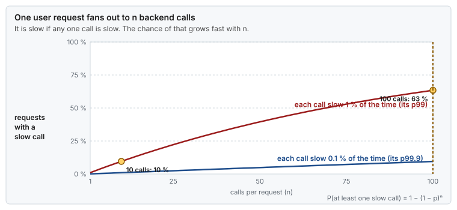

# Concept — Tail Latency: Percentiles, Histograms and What the Shape Says

> Used by: [Guide 09](../guides/09-measuring-latency.md). Related: [clocks and time](clocks-and-time.md), [CPU isolation](cpu-isolation.md). Use case: [19](../examples/use-cases/19-the-benchmark-that-lied.md). Example: [Java probe](../examples/java-latency-probe/). Terms: [Glossary](../GLOSSARY.md).

## At a glance

- The tail is not rare for your users. When calls are independent, a client that makes 100 calls sees at least one above p99 almost two times out of three.
- Percentiles cannot be averaged. To combine hosts or time windows, merge the histograms, then read the percentile.
- The shape of the histogram names the cause: two humps, a comb, a long slope. Read the shape before the numbers.

## 1. Why it matters

Tuning in these guides moves the high percentiles far more than the median. To see that, and to prove it, you need numbers that mean what they say. [Guide 09](../guides/09-measuring-latency.md) gives the measurement protocol. This page explains the statistics behind it: why the tail matters, how much data a percentile needs, why averaging percentiles is wrong, how a histogram keeps precision, and how to read its shape.

## 2. Why the tail is everyone's problem

A percentile describes one event. Users and downstream systems see many. If a single call is above p99 with probability 1 %, and the calls are independent, the chance that a sequence of *n* calls has at least one above p99 is 1 − 0.99ⁿ:

| Calls per user action | At least one above p99 | At least one above p99.9 |
|---|---|---|
| 1 | 1 % | 0.1 % |
| 10 | 9.6 % | 1 % |
| 100 | 63 % | 9.5 % |
| 1,000 | ~100 % | 63 % |



*The backend's p99 becomes the user's median somewhere around 70 calls per request. That is why a fan-out service watches p99.9 and p99.99 of each call.*

The table is the independent case. Calls of one user action often share a host, a queue or a stall, so they are correlated: if one stall delays all of them or none, 100 calls see the tail with the same 1 % as one call. Real systems fall between the two, so read the table as an upper bound that is often close.

The same holds over time. At 100,000 messages per second, p99.99 is crossed **10 times every second**, 864,000 times a day. A "rare" event at that rate is a steady stream.

## 3. What a percentile is

Sort the samples. The p-th percentile is the value below which p % of them fall. p50 is the median, p99 the value that 99 % of samples do not exceed, and max is the single slowest sample.

How many samples a percentile needs follows from how many samples lie **beyond** it. With *N* samples, about N × (1 − p) of them are above the p-th percentile, and the percentile is decided by those few:

| Samples | Above p99 | Above p99.9 | Above p99.99 |
|---|---|---|---|
| 10,000 | 100 | 10 | 1 |
| 1,000,000 | 10,000 | 1,000 | 100 |
| 100,000,000 | 1,000,000 | 100,000 | 10,000 |

With only 1 or 10 samples beyond it, the percentile is the value of one or a few samples and changes from run to run. With about 100 beyond it, the count is stable to roughly ±10 %: a usable value. With about 1,000 beyond it, roughly ±3 %: the "comfortable" column of [Guide 09 §3.2](../guides/09-measuring-latency.md#32-enough-samples), which asks for 10,000,000 samples for p99.99.

## 4. Never average percentiles

The p99 of two hosts is not the mean of their p99s. Neither is the p99 of an hour the mean of sixty one-minute p99s. Percentiles depend on the whole distribution, and averaging throws it away.

| | Host A | Host B | Mean of the two p99.9 | p99.9 of all samples |
|---|---|---|---|---|
| Illustrative (the lab in §11) | ~240 µs (A has rare stalls) | ~7 µs | **~120 µs**: wrong | **~7 µs**: right |

Here the average reports a fleet p99.9 about seventeen times too high. With other numbers it can be just as wrong in the other direction. The correct way is to **merge the histograms** (add the counts bucket by bucket) and read the percentile from the merged histogram. HdrHistogram does this with `add()`. Dashboards that plot "average p99 across hosts" are drawing a number that does not describe any request.

## 5. Histograms that keep precision

Storing every sample is expensive at millions per second, and fixed-width buckets cannot cover 1 µs and 10 ms with the same precision. An **HDR histogram** ([HdrHistogram](../GLOSSARY.md#hdrhistogram)) uses buckets that grow by powers of two, each split into linear sub-buckets:

- With **3 significant digits**, every value is stored within 0.1 %: 1,000 ns ± 1 ns and 10,000,000 ns ± 10,000 ns.
- Its size is fixed by the range and the precision (tens of KiB), not by the number of samples.
- Recording a value is a few arithmetic operations and one increment, cheap enough for the hot path, with no allocation.
- Two histograms can be added, so per-thread and per-host histograms merge exactly (§4).

Record in nanoseconds from `CLOCK_MONOTONIC` ([clocks and time §4](clocks-and-time.md#4-which-clock-to-read)), keep the raw histogram (not only the percentiles), and report p50, p90, p99, p99.9, p99.99 and max.

## 6. Service time and response time

**Service time** starts when the work starts. **Response time** starts when the request was due, and includes the time it waited for earlier work. A closed-loop benchmark measures service time and stops sending during a stall, so a 20 ms stall becomes one slow sample instead of every request that would have waited behind it. That is [coordinated omission](../GLOSSARY.md#coordinated-omission) ([Guide 09 §3.3](../guides/09-measuring-latency.md#33-coordinated-omission), [use case 19](../examples/use-cases/19-the-benchmark-that-lied.md)).


*A closed loop records the stall once. An open loop records every request that was due during it.*

The difference between the two is queueing. The [queueing concept](queueing.md) explains how fast it grows with load.

## 7. Reading the shape


*Each shape points at a family of causes. Two humps mean two paths, a comb means a fixed added wait, a long slope means queueing or rare stalls.*

| Shape | What it means | Typical causes | Read next |
|---|---|---|---|
| One narrow peak, short tail | Every sample took the same path | A quiet host | — |
| Two humps | Samples took two different paths | A remote NUMA node, a busy SMT sibling, a cache hit and a miss, two code paths | [Hardware topology](hardware-topology.md) |
| A comb: spikes at fixed latencies | A fixed wait was added to some samples | Interrupt coalescing, a timer tick, a polling interval, a batch timeout | [Interrupts and deferred work](interrupts-and-deferred-work.md) |
| A long smooth slope over decades | Waiting behind other work, or rare stalls of many sizes | Queueing near saturation, GC, reclaim, page faults | [Memory reclaim](memory-reclaim.md) |
| Max far beyond everything else | One event of a different kind | SMI, direct reclaim, a GC pause, a clock step | [Power and frequency](power-and-frequency.md) |

Plot the histogram on a **log latency axis**: a linear axis squeezes the whole tail into one pixel. A **percentile plot** (latency against 1/(1 − p), so p90, p99, p99.9 are evenly spaced) shows the whole ladder at once:


*Tuning moves the high percentiles much more than the median, so the ladder, not one number, shows the effect.*

A histogram has no time axis. When the shape suggests a periodic cause (a comb), also plot the **maximum per second over time**: a spike every second or every few seconds names the timer ([Guide 09 §7](../guides/09-measuring-latency.md#7-reading-the-results)).

## 8. Numbers to remember

| Fact | Value |
|---|---|
| P(at least one above p99 in 100 calls) | 63 % |
| P(at least one above p99.9 in 1,000 calls) | 63 % |
| Samples above the percentile: usable / comfortable | ~100 (±10 %) / ~1,000 (±3 %) |
| Samples for p99.99: usable / comfortable (Guide 09) | ~1,000,000 / ~10,000,000 |
| p99.99 events per day at 100,000 messages/s | 864,000 |
| HDR histogram precision with 3 significant digits | 0.1 % of the value |

## 9. How it shows up

| Symptom | What went wrong in the measurement | Fix |
|---|---|---|
| The fleet dashboard p99 moves when one host is drained | Percentiles averaged across hosts | Merge histograms (§4) |
| p99.99 jumps between identical runs | Too few samples beyond it | Run longer (§3) |
| The load test is clean, production is not | Closed-loop load: coordinated omission | Open-loop load from intended send times (§6) |
| Every sample is a multiple of 1 ms or 4 ms | The clock or the timer has that resolution | A `MONOTONIC` clock in ns, no `*_COARSE` clock |
| The tail looks flat at "everything above 10 ms" | The histogram's highest bucket is too low | Set the range above the worst case you can imagine |

## 10. Myths

- **"p99 means 1 % of users are affected."** With many calls per user, most users see p99 regularly (§2).
- **"The average of the hosts' p99 is the fleet p99."** It can be wrong by an order of magnitude either way (§4).
- **"The max is noise; report p99.9 instead."** The max is a real event that someone waited for. Report it, and explain it.
- **"More decimal places mean more precision."** Precision comes from the number of samples beyond the percentile, not from the digits printed.

## 11. See it on your host

No host needed. This generates two hosts' samples in microseconds: A has rare 200–300 µs stalls, B has none. Compare the average of their p99.9 with the p99.9 of the merged samples:

```bash
awk 'BEGIN { srand(7)
  for (i = 0; i < 100000; i++) { v = 5 + rand() * 2; if (rand() < 0.0015) v = 200 + rand() * 100; print "A", v }
  for (i = 0; i < 100000; i++) print "B", 5 + rand() * 2 }' >/tmp/lat.txt
p999() { sort -n | awk '{ a[NR] = $1 } END { i = int(NR * 0.999); if (i < NR * 0.999) i++; print a[i] }'; }
a=$(awk '$1 == "A" { print $2 }' /tmp/lat.txt | p999)
b=$(awk '$1 == "B" { print $2 }' /tmp/lat.txt | p999)
echo "A=$a B=$b mean-of-p99.9=$(awk -v a="$a" -v b="$b" 'BEGIN { print (a + b) / 2 }') merged=$(awk '{ print $2 }' /tmp/lat.txt | p999)"
# A=2xx B=6.99... mean-of-p99.9=1xx merged=6.99...   (exact values depend on your awk)
```

The merged p99.9 is about 7 µs, because the stalls are only 0.075 % of all samples. The average says more than 100 µs. Then run the [Java probe](../examples/java-latency-probe/) on your host and look at its percentile ladder: compare p50 with p99.99 and max, and check how many samples it took.

## 12. Illustrative scenario

An illustrative case, not a measurement. A team's dashboard showed the fleet's p99.9 as the average of 40 hosts' p99.9 values, and it read 90 µs. After a rollout it rose to 160 µs, and they rolled back. Merging the hosts' HdrHistograms instead gave a fleet p99.9 of 18 µs before the rollout and 17 µs after. One host had a bad NIC firmware with 2–3 ms stalls, and it alone had moved the average. The rollout was fine. The bad host showed up as a second hump in its own histogram, and nowhere else.

## 13. Key takeaways

- The tail is the common case for anyone who makes many calls. Measure and report it.
- Collect enough samples: at least 100 beyond the percentile you report, and 1,000 to trust it.
- Merge histograms, never average percentiles.
- Time requests from when they were due, not from when they were sent.
- Read the shape first: two humps, a comb or a long slope each point at a different family of causes.

## 14. References

- Gil Tene, *How NOT to Measure Latency* (talk)
- <https://hdrhistogram.github.io/HdrHistogram/>
- Jeffrey Dean and Luiz André Barroso, *The Tail at Scale*, Communications of the ACM, 2013
- [Guide 09](../guides/09-measuring-latency.md) for the measurement protocol
