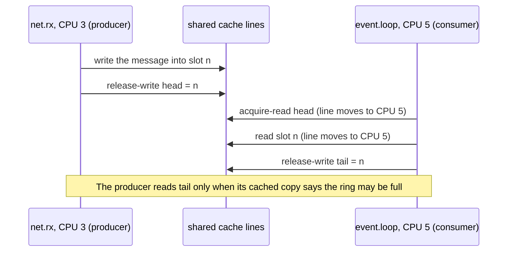
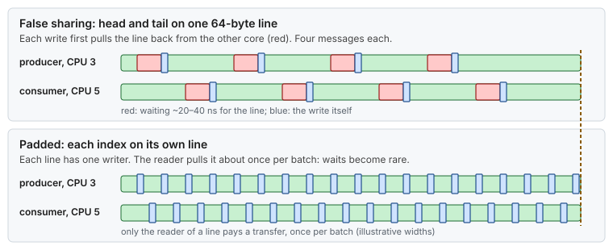
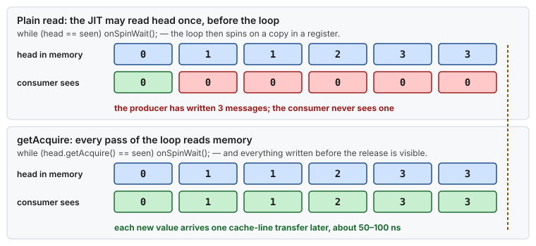

# Concept — Thread Handoff: Cache Lines, Memory Ordering, SPSC Rings and Wait Strategies

> Used by: [Guide 02 §6](../guides/02-cpu-core-isolation.md#6-pinning-the-application), [Java example](../examples/hugepages-java-example.md). Related: [CPU isolation §5–6](cpu-isolation.md#5-caches-and-coherence-the-mechanical-sympathy-part), [hardware topology](hardware-topology.md), [queueing](queueing.md), [logging and I/O](logging-and-io.md). Code: [`PaddedSequence.java`](../examples/java-latency-probe/src/main/java/com/example/lowlat/PaddedSequence.java), [`IdleStrategy.java`](../examples/java-latency-probe/src/main/java/com/example/lowlat/IdleStrategy.java). Terms: [Glossary](../GLOSSARY.md).

## At a glance

- Passing a message between two pinned threads costs a few cache-line transfers, about 50–100 ns, when it is done right. Done wrong, it costs a lock, a system call and a wake-up: microseconds.
- Cost is counted in cache lines: every line that both threads write bounces between their cores. Give each line one writer, and pad hot fields so two writers never share a line.
- Correctness comes from memory ordering: publish with a release write, read with an acquire read. On x86 that costs nothing extra; a full `volatile` write costs a fence.

## 1. Why it matters

The layouts in these guides split work across pinned threads: `net.rx` receives, `event.loop` decides, `worker.N` computes, a logger writes. Every arrow between them is a handoff, and a handoff is a cache-line transfer between two cores. With a lock or a blocking queue, it is also a system call and a scheduler wake-up. Isolation gives each thread a quiet CPU. This page is about the path **between** those CPUs, where the next microseconds often hide once the host is tuned.

## 2. A handoff, counted in cache lines



*One message moves at least two lines from the producer's core to the consumer's: the index and the slot. The consumer's progress moves back only when the producer needs it.*

A **single-producer, single-consumer ring** ([SPSC](../GLOSSARY.md#spsc)) is the cheapest correct handoff between two threads:

- A fixed array of slots, allocated and pre-touched at start-up. No allocation per message.
- A **head** index that only the producer writes, and a **tail** index that only the consumer writes. No compare-and-swap is needed, because no line has two writers.
- The producer keeps a **cached copy of tail** and reads the real tail only when the cached copy says the ring is full. The consumer does the same with head. This cuts the line transfers per message nearly in half.
- The consumer reads every slot up to head in one go, then publishes tail once (**batching**). Under a burst, the per-message cost falls, because one tail update covers many messages.

## 3. False sharing: two writers, one line

Coherence works per 64-byte line. If the producer's head and the consumer's tail sit in the same line, every write by one thread invalidates the other's copy, and its next write must pull the line back first.



*Two indexes that share a line make both threads wait on every write. Padding gives each writer a line of its own: the reader still pulls that line now and then, about once per batch with cached indexes, but no longer on every write.*

- **Pad** each independently written hot field to its own line: 64 bytes, or 128 on CPUs whose adjacent-line prefetcher fetches lines in pairs.
- In Java, the JVM decides field order inside a class, so padding fields next to each other may be reordered. The probe's [`PaddedSequence`](../examples/java-latency-probe/src/main/java/com/example/lowlat/PaddedSequence.java) uses **class-hierarchy padding**: the JVM does not move fields across a superclass boundary. `@jdk.internal.vm.annotation.Contended` does the same, but needs `-XX:-RestrictContended` for application classes.
- The same applies to arrays of per-thread counters: `counters[0]` and `counters[1]` share a line. Give each thread its own padded object, and sum them when you read.

## 4. Memory ordering: what the CPU and the compiler may reorder

A handoff is correct only if the consumer, when it sees the new head, also sees the message written before it. Both the compiler and the CPU may reorder memory operations unless told not to.

**x86 (total store order)** keeps loads in order and stores in order. It allows one reordering: a store followed by a load from a different address may complete the other way round, because the store waits in the core's store buffer.

> **Picture it.** Each core has an outbox: its writes sit there for a moment before they reach the shared shelf. The core reads its own outbox, but other cores only see the shelf. Release and acquire are the rule "post the letter before the notice that says it is there".

So on x86:

| Java access mode (`VarHandle`) | Guarantees | x86 cost |
|---|---|---|
| plain | Nothing across threads. The JIT may keep the value in a register **forever** | none |
| opaque (`getOpaque`/`setOpaque`) | The access really happens, no ordering with other variables | none |
| acquire / release (`getAcquire`/`setRelease`) | Everything written before the release is visible after the matching acquire | none beyond stopping compiler reordering |
| volatile (`getVolatile`/`setVolatile`, `volatile` fields) | Sequential consistency: also orders a store before a later load | a full fence (`lock`-prefixed instruction) on every store: ~20–40 cycles |



*The bug is not slowness but blindness: with a plain field, the compiler may read `head` once and spin on the copy forever. An acquire read goes to memory on every pass.*

Release and acquire are exactly what a handoff needs, so [`PaddedSequence`](../examples/java-latency-probe/src/main/java/com/example/lowlat/PaddedSequence.java) uses `setRelease` and `getAcquire`. A plain field is not enough even on x86: the JIT can hoist a plain read out of a spin loop, and the consumer then spins forever on a value it read once. On ARM servers, acquire and release become real instructions (`ldar`, `stlr`) and still cost far less than a full fence.

## 5. Waiting for the next message

When the ring is empty, the consumer must wait. How it waits sets its wake-up latency and what it costs the rest of the host. [CPU isolation §6](cpu-isolation.md#6-spinning-vs-blocking) compares spinning and blocking. The probe's [`IdleStrategy`](../examples/java-latency-probe/src/main/java/com/example/lowlat/IdleStrategy.java) implements both ends:

| Strategy | Wake-up latency | CPU cost | Use on |
|---|---|---|---|
| **spin** with `Thread.onSpinWait()` (`PAUSE`) | ~50–100 ns in one L3 domain: one line transfer, plus the loop noticing it | a whole core | isolated CPUs |
| **backoff**: spin, then `Thread.yield()`, then `parkNanos` with growing sleeps | ns to ~100 µs, depending on how long it was idle | low | shared CPUs, VMs, development |
| **block** on a lock or a blocking queue | 2–50 µs: futex, wake-up [IPI](../GLOSSARY.md#ipi), scheduler, maybe a C-state exit | none while idle | threads off the critical path |

A blocking handoff also brings kernel work onto the consumer's CPU: the wake-up is a reschedule IPI (the `RES` row of `/proc/interrupts`), and the futex system call pays the [mitigation](security-mitigations.md) costs. That is why the critical threads in these guides spin on their own cores.

## 6. Placement

Where the two threads sit decides the price of every line transfer ([hardware topology §3](hardware-topology.md#3-numbers-to-remember)):

| Producer and consumer | One line transfer |
|---|---|
| Same L3 domain | ~20–40 ns |
| Other L3 domain, same socket (AMD CCX, Intel SNC) | ~60–120 ns |
| Other socket | ~130–200 ns |

Put each handoff pair in one L3 domain, on the node of the NIC and of the ring's memory. Allocate and pre-touch the ring from a thread already pinned on that node, so first-touch places its pages there.

## 7. Numbers to remember

Typical orders of magnitude, not measurements.

| Event | Typical cost |
|---|---|
| One-way handoff through an SPSC ring, both threads spinning, same L3 | ~50–100 ns |
| Round trip (ping-pong) in the probe, same L3 | ~100–250 ns |
| A `volatile` store on x86 (full fence) | ~20–40 cycles |
| A contended `compareAndSet` | a line transfer plus retries |
| Handoff through a blocking queue to a parked thread | ~2–50 µs |
| False sharing between two busy writers | throughput can fall by 10× or more |

## 8. How it shows up

| Symptom | Mechanism | Check |
|---|---|---|
| Two threads slow each other down although they share no data | False sharing (§3) | `perf c2c record` then `perf c2c report`: high HITM on one line |
| The handoff is several times slower on one host model | The pair is in two L3 domains (§6) | `cache/index3/shared_cpu_list` of both CPUs |
| The consumer never sees a message in a test, only with the JIT warm | A plain read hoisted out of the loop (§4) | Use `getAcquire` or `getOpaque` |
| `RES` interrupts and futex calls on the consumer's CPU | A blocking queue or a lock in the handoff (§5) | `perf trace -s -p <pid>` or `strace -c -f` on a test host |
| Throughput collapses when a third thread is added to the queue | Several writers on one index line | One SPSC ring per producer |

## 9. Myths

- **"x86 needs no memory barriers."** The CPU keeps most orders, but the store-then-load case needs a fence, and the compiler and the JIT reorder freely unless the code asks for ordering. Use acquire and release.
- **"`volatile` is slow, so use a plain field."** Plain is not correct across threads. Acquire and release are correct and cost no fence on x86.
- **"Lock-free means fast."** A compare-and-swap on a contended line pays a line transfer on every attempt. Single writer per line is what makes a handoff fast.
- **"Padding to 64 bytes is always enough."** With adjacent-line prefetching, two lines are fetched as a pair. Pad to 128 bytes where it matters.

## 10. See it on your host

1. Run the [Java probe](../examples/java-latency-probe/) twice: once with `ping.cpu.affinity` and `pong.cpu.affinity` on two CPUs that share an L3, once on two CPUs on different sockets. Compare the `rtt` percentiles:

   ```bash
   cd examples/java-latency-probe
   grep -E '^(ping|pong).cpu.affinity|^idle.strategy' conf/application.properties
   cp conf/application.properties conf/application.properties.orig   # keep your own settings
   APP_NUMA_NODE=1 bin/launch          # rtt p50 around 100-250 ns in one L3 domain
   # edit pong.cpu.affinity to a CPU on the other socket and run again: p50 rises by the socket link
   mv conf/application.properties.orig conf/application.properties   # restore exactly what you had
   ```

2. Set `idle.strategy=backoff` and run again. The median barely moves: `BackoffIdleStrategy` spins 100 times and yields 10 times before it parks, and a ping-pong answers long before that. Only the rare slow round trips reach the park, and they show its wake-up cost in the highest percentiles. In production, the same strategy parks after every quiet gap, and the first message after the gap pays it.

3. On a test host, record cache-line contention while the probe runs. The two `PaddedSequence` lines should show transfers, but no line written by both threads:

   ```bash
   perf c2c record -a -- sleep 5 && perf c2c report --stdio | head -60
   ```

## 11. Illustrative scenario

An illustrative case, not a measurement. A gateway passed decoded messages from `net.rx` to `event.loop` through a `java.util.concurrent` blocking queue. p50 was 9 µs end to end, and `/proc/interrupts` showed thousands of `RES` interrupts per second on `event.loop`'s isolated CPU. The team replaced the queue with an SPSC ring of pre-allocated slots, with padded head and tail indexes written by `setRelease`, read by `getAcquire`, and a cached copy of the other side's index. `event.loop` spins with `Thread.onSpinWait()`. The handoff fell from about 6 µs to about 80 ns, the `RES` row stopped moving, and the end-to-end p50 fell to 3 µs. A later `perf c2c` run found one more shared line, a pair of statistics counters in one array, and padding them removed the last contended line.

## 12. Key takeaways

- A handoff costs cache-line transfers. Count the lines each message moves, and make each line have one writer.
- Pad independently written hot fields to their own lines (128 bytes where adjacent-line prefetch is on).
- Publish with release, read with acquire. Never a plain field across threads, and no full fence where acquire and release suffice.
- Spin on isolated cores, back off on shared ones, and keep blocking queues off the critical path.
- Place each handoff pair in one L3 domain, on the node of the NIC and the ring's memory.

## 13. References

- Doug Lea, *Using JDK 9 Memory Order Modes*
- `java.lang.invoke.VarHandle` (Java SE 25 API documentation)
- Martin Thompson, *Mechanical Sympathy* blog (single writer principle, false sharing)
- LMAX, *Disruptor* technical paper
- Paul E. McKenney, *Is Parallel Programming Hard, And, If So, What Can You Do About It?*
- `man 1 perf-c2c`
