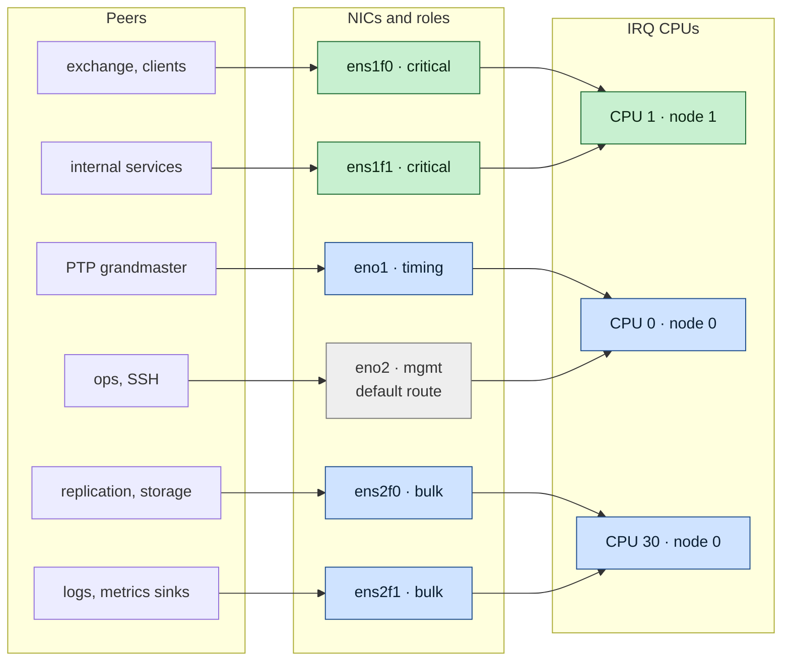
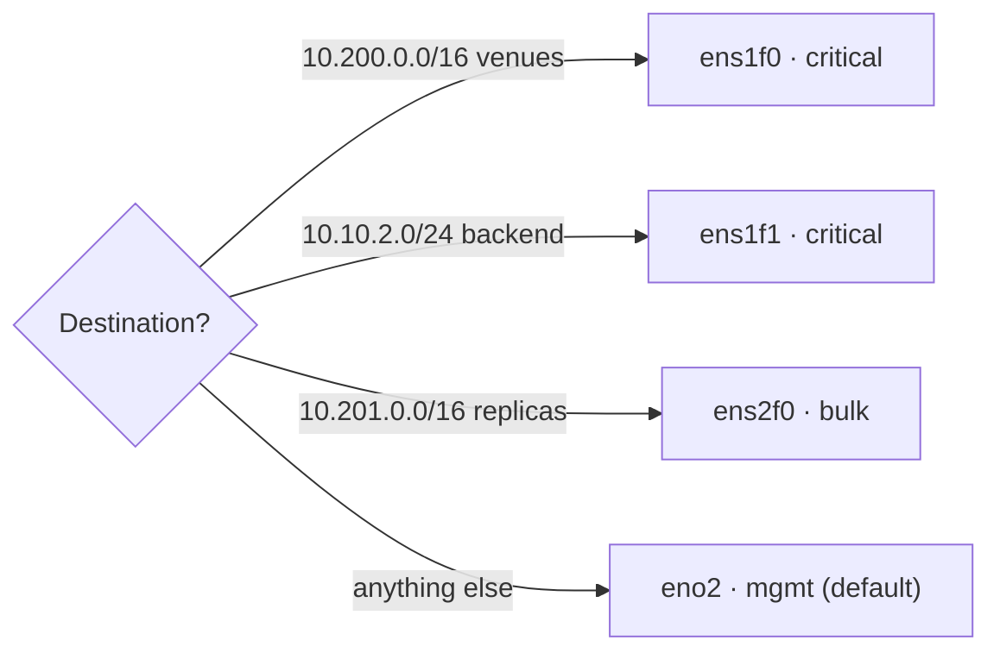

# Example — Segmenting a Multi-NIC Low-Latency Host

> Guide: [04 Network](../guides/04-network-optimization.md) · Concept: [network-tuning](../concepts/network-tuning.md) · Script: [`scripts/04-network`](../scripts/04-network)

## At a glance

- **What:** six NICs, each with one role, its own subnet, its own IRQ CPU and the right qdisc.
- **Rule:** one traffic class per NIC, and the only default route on the management network.
- **Check:** the critical round-trip p99 must not move when bulk traffic runs.

This walkthrough builds the network side of the reference host from scratch: six interfaces, each with a role, its own subnet, its own IRQ CPU, and the right queueing. At the end, the order path shares nothing with the bulk traffic (no NIC, queue, IRQ, CPU, or qdisc), and every setting is re-applied at boot.

## 1. The target



*Each peer group reaches the host through its own NIC. The two critical NICs share CPU 1 on node 1, timing and management go to CPU 0, and bulk goes to CPU 30. Only the management NIC carries the default route.*

<details>
<summary><b>The same target as text</b>, with addresses and routes</summary>

```text
                          ┌─────────────────────────────── host (2 sockets) ───────────────────────────────────┐
                          │                                                                                    │
  exchange / clients ─────┤ ens1f0  10.10.1.10/24  critical  gw 10.10.1.1 for 10.200.0.0/16     IRQ → CPU 1    │ node 1
  internal services ──────┤ ens1f1  10.10.2.10/24  critical  (on-link)                          IRQ → CPU 1    │ (same card)
                          │                                                                                    │
  PTP grandmaster ────────┤ eno1    10.10.9.10/24  timing    (on-link)                          IRQ → CPU 0    │ node 0
  replication/storage ────┤ ens2f0  10.20.1.10/24  bulk      gw 10.20.1.1 for 10.201.0.0/16     IRQ → CPU 30   │ node 0
  logs/metrics sinks ─────┤ ens2f1  10.20.2.10/24  bulk      (on-link)                          IRQ → CPU 30   │
  ops / SSH ──────────────┤ eno2    10.99.0.10/24  mgmt      DEFAULT ROUTE 10.99.0.1            IRQ → CPU 0    │
                          └────────────────────────────────────────────────────────────────────────────────────┘
```

</details>

Principles:

- **One traffic class per NIC**, and per switch VLAN. Critical links never carry bulk traffic.
- **The default route lives on the management network.** Every other network gets explicit routes, so a misconfigured peer can never pull bulk or management traffic onto a critical link.
- **Critical NICs on the same NUMA node as the isolated CPUs** (node 1), so their IRQs go to that node's housekeeping CPU (CPU 1).
- **Bulk IRQs on the other node** (CPU 30). They can use as much CPU as they want there.

## 2. Discover the hardware

```bash
for i in ens1f0 ens1f1 eno1 ens2f0 ens2f1 eno2; do
  printf '%-7s node=%-2s driver=%-8s %s\n' "$i" "$(cat /sys/class/net/$i/device/numa_node)" \
    "$(ethtool -i $i | awk '/^driver/{print $2}')" "$(ethtool $i | awk '/Speed/{print $2}')"
done
lscpu -e=CPU,NODE | awk 'NR==1 || $2==1' | head       # CPUs on node 1
```

If a critical NIC reports the wrong node, move the card to a slot wired to the other socket (see the server's PCIe slot map). No software setting compensates for that.

## 3. Addressing and routing with NetworkManager

```bash
# Management: the only default route
nmcli con add type ethernet ifname eno2 con-name mgmt ipv4.method manual \
  ipv4.addresses 10.99.0.10/24 ipv4.gateway 10.99.0.1 ipv6.method disabled

# Critical: exchange-facing, explicit route to the venue networks only
nmcli con add type ethernet ifname ens1f0 con-name crit-ext ipv4.method manual \
  ipv4.addresses 10.10.1.10/24 ipv4.never-default yes \
  ipv4.routes "10.200.0.0/16 10.10.1.1" ipv6.method disabled

# Critical: internal backend (on-link only)
nmcli con add type ethernet ifname ens1f1 con-name crit-int ipv4.method manual \
  ipv4.addresses 10.10.2.10/24 ipv4.never-default yes ipv6.method disabled

# Timing (PTP)
nmcli con add type ethernet ifname eno1 con-name timing ipv4.method manual \
  ipv4.addresses 10.10.9.10/24 ipv4.never-default yes ipv6.method disabled

# Bulk
nmcli con add type ethernet ifname ens2f0 con-name bulk-repl ipv4.method manual \
  ipv4.addresses 10.20.1.10/24 ipv4.never-default yes \
  ipv4.routes "10.201.0.0/16 10.20.1.1" ipv6.method disabled
nmcli con add type ethernet ifname ens2f1 con-name bulk-logs ipv4.method manual \
  ipv4.addresses 10.20.2.10/24 ipv4.never-default yes ipv6.method disabled

ip route        # exactly one "default via 10.99.0.1 dev eno2"
```



*Every network gets an explicit route to its own NIC. Only unknown destinations fall through to the management default route, so bulk or management traffic can never drift onto a critical link.*

Multi-homed hosts also need:

- `arp_ignore=1` per interface ([Guide 06 §6](../guides/06-kernel-sysctl-tuning.md#6-endpoint-not-router)), so the host answers ARP for an address only on the NIC that owns it;
- reverse-path filtering appropriate for your routing: RHEL's default `rp_filter=1` (strict) drops packets that arrive on an interface the reply would not use. With explicit per-network routes that is exactly what you want. Asymmetric designs need `rp_filter=2` (loose).

## 4. `lowlat.conf` for this host

```bash
ISOLATED_CPUS=(3 5 7 9 11 13 15 17 19 21 23 25 27 29 31)
OS_CPUS=(0 1 2 4 6 8 10 12 14 16 18 20 22 24 26 28 30)

NICS=(
  "ens1f0|critical|1|0"
  "ens1f1|critical|1|0"
  "eno1|timing|0|0"
  "ens2f0|bulk|30|300000"
  "ens2f1|bulk|30|300000"
  "eno2|mgmt|0|0"
)
NIC_BULK_COALESCE_USECS=0        # raise to 50 if CPU 30 becomes busy
NIC_DISABLE_CSUM_OFFLOAD=no
```

Apply and check:

```bash
sudo scripts/04-network --apply
scripts/04-network --verify
```

## 5. Resulting interrupt and CPU map

| CPU | Node | Serves | Must never run |
|---|---|---|---|
| 0 | 0 | eno1 (PTP) and eno2 (mgmt) IRQs, workqueues | — |
| 1 | 1 | **ens1f0 + ens1f1 IRQs and NET_RX softirq** | agents, cron, anything bursty |
| 2 | 0 | workqueues | — |
| 4, 6 | 0 | housekeeping.slice (agents) | NIC IRQs |
| 30 | 0 | ens2f0 + ens2f1 IRQs | critical anything |
| 3, 5, 7 … 31 | 1 | pinned application threads only | IRQs, softirqs, kworkers, agents |

Check it live:

```bash
watch -d -n1 "grep -E 'CPU0|ens1f0|ens2f0|eno' /proc/interrupts | cut -c1-120"
for irq in $(ls /sys/class/net/ens1f0/device/msi_irqs); do
  echo "irq $irq -> $(cat /proc/irq/$irq/effective_affinity_list)"; done
```

## 6. Queueing discipline per role

### 6.1 Critical NICs: keep the qdisc out of the way

Critical links carry small messages at modest rates. The qdisc should never hold a packet. `fq_codel` (the default) is fine as long as it is never backlogged. `noqueue` is not possible on physical NICs, so the smallest-overhead choice is a plain multi-queue `pfifo_fast`/`mq`:

```bash
tc qdisc replace dev ens1f0 root mq           # one child per TX queue, default child qdiscs
tc -s qdisc show dev ens1f0                   # "backlog 0b 0p" and "dropped 0" at all times
```

A backlog on a critical NIC means something is sending bulk data on it. Fix the routing (§3); tuning the qdisc does not fix that.

### 6.2 Bulk NICs: flow fairness and pacing

Replication and log shipping are throughput traffic. Make them behave well towards each other and towards the network:

```bash
# Long queue (txqueuelen 300000 set by the script) so bursts are queued, not dropped
ip link show ens2f0 | grep -o 'qlen [0-9]*'

# Fair queueing with pacing: one replication stream cannot starve the others,
# and the NIC never bursts at line rate into a shallow-buffered switch
tc qdisc replace dev ens2f0 root fq maxrate 8gbit
tc qdisc replace dev ens2f1 root fq_codel
```

### 6.3 When traffic classes must share a NIC

Sometimes a dedicated NIC is not available: for example, a single uplink in a cloud VM, or a critical and a bulk VLAN on one physical port. Then prioritize at the qdisc and mark the traffic so the switches can do the same:

```bash
# Three-band priority qdisc: band 0 (critical) is always dequeued first
tc qdisc replace dev ens3 root handle 1: prio bands 3 priomap 1 2 2 2 1 2 0 0 1 1 1 1 1 1 1 1

# Critical flows: destination port 9000 (order gateway) -> band 0
tc filter add dev ens3 parent 1: protocol ip prio 1 u32 match ip dport 9000 0xffff flowid 1:1
# Bulk: bounded, fair queue in band 2
tc qdisc add dev ens3 parent 1:3 handle 30: fq_codel

# Mark critical traffic with DSCP EF (46) so the network prioritises it too
nft add table inet mangle
nft add chain inet mangle output '{ type route hook output priority mangle; }'
nft add rule inet mangle output tcp dport 9000 ip dscp set ef
```

Applications can also set `SO_PRIORITY` (maps to the `priomap`) and `IP_TOS` on their critical sockets directly, which is cheaper than classifying every packet with filters.

The limits of this approach: packets still share the TX ring. The NIC transmits in ring order, and a large bulk frame already in the ring delays a critical one. Only separate NICs, or separate hardware TX queues with `mqprio` and hardware QoS, remove that.

## 7. PTP on the timing NIC

The timing NIC gets the critical profile (coalescing 0, no pause), so that hardware timestamps are taken promptly and the time daemon's sync messages are not delayed:

```bash
ethtool -T eno1                          # hardware-transmit / hardware-receive / PHC index
# /etc/ptp4l.conf: [global] time_stamping hardware; [eno1]
systemctl enable --now ptp4l phc2sys
```

Pin `ptp4l`/`phc2sys` to CPU 0 with a drop-in (`CPUAffinity=0`), not into the housekeeping slice, because their scheduling latency affects clock accuracy. [Guide 10](../guides/10-time-sync.md) covers the whole setup, and `scripts/10-time-sync` applies it.

## 8. Persistence

| Setting | Persisted by |
|---|---|
| Addresses, routes, `never-default`, IPv6 off | NetworkManager connection profiles (§3) |
| Coalescing, offloads, pause, rings | `lowlat-runtime.service` (`04-network --runtime`) **or** NM `ethtool.*` properties ([Guide 04 §8](../guides/04-network-optimization.md#8-persistence)) |
| Channels (`combined`) | `lowlat-runtime.service` (or NM ≥ 1.36 `ethtool.channels-combined`) |
| IRQ affinity | `lowlat-runtime.service`. It must run **after** any channel change. |
| `txqueuelen` | `lowlat-runtime.service`, or a udev rule: `ACTION=="add", SUBSYSTEM=="net", KERNEL=="ens2f*", ATTR{tx_queue_len}="300000"` |
| qdiscs (§6) | a small oneshot unit after `network-online.target`, or NM `tc.qdiscs` (`nmcli con modify bulk-repl tc.qdiscs 'root fq maxrate 8gbit'`) |
| sysctls (ARP, rp_filter, buffers) | `/etc/sysctl.d/90-lowlat.conf` ([Guide 06](../guides/06-kernel-sysctl-tuning.md)) |

## 9. Acceptance checks

```bash
scripts/verify-tuning                                     # includes "no NIC IRQ on an isolated CPU"
ip route get 10.200.1.5     # → dev ens1f0 (venue traffic leaves via the critical NIC)
ip route get 10.201.3.7     # → dev ens2f0 (replication via bulk)
ip route get 203.0.113.7    # → dev eno2   (everything else via management)

# Under load: generate bulk traffic on ens2f0 and confirm the critical round-trip does not move
iperf3 -c 10.20.1.20 -t 60 -P 4 &                                          # bulk load
taskset -c 9 sockperf ping-pong -i 10.10.2.20 -p 11111 --tcp -t 60 --full-rtt   # critical RTT
```

The critical p99 with and without the bulk load should be the same. If it moves, something is shared: a CPU, a queue, a NIC, or a switch port.

## 10. Troubleshooting

| Symptom | Cause | Fix |
|---|---|---|
| Replication traffic appears on `ens1f0` | Missing specific route; default route used | `ip route get <peer>`; add the route to the bulk connection |
| Replies to venue arrive on `eno2` | ARP answered on the wrong NIC | `arp_ignore=1`; check `ip neigh` on the peer |
| Packets dropped with `rp_filter` | Asymmetric routing | Fix the routing, or `rp_filter=2` on that interface |
| Critical RTT rises with bulk load | Shared CPU (IRQ CPUs overlap) or shared switch uplink | §5 map; check switch port utilization |
| IRQ affinity lost after the link came back | Driver re-created its queues | Re-run `04-network --runtime`, or use a NetworkManager dispatcher script on `up` |

## 11. Key takeaways

- One traffic class per NIC and per VLAN. Critical links never carry bulk traffic.
- The default route lives on the management network. Every other network gets an explicit route.
- Critical NICs sit on the isolated CPUs' NUMA node and interrupt that node's housekeeping CPU. Bulk interrupts go to the other node.
- Persist every layer: NetworkManager for addresses and routes, `lowlat-runtime.service` for NIC settings and IRQs, `sysctl.d` for ARP and buffers.
- Accept a host only when the critical p99 stays flat under bulk load.
