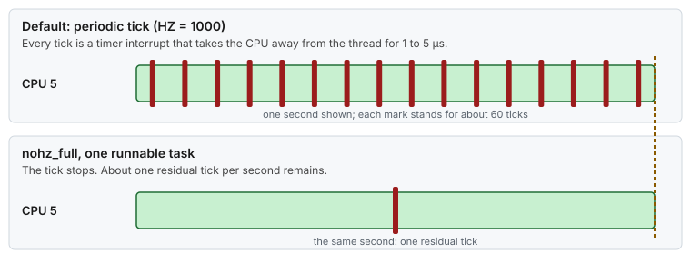

# Use case 1 — The quiet core

> Guides: [01 Kernel command line](../../guides/01-grub-bootloader-tuning.md), [02 CPU isolation](../../guides/02-cpu-core-isolation.md) · Scripts: [`01-grub-bootloader`](../../scripts/01-grub-bootloader), [`02-cpu-isolation`](../../scripts/02-cpu-isolation) · Concept: [CPU isolation](../../concepts/cpu-isolation.md)

## At a glance

- **Situation:** one busy-spinning thread on CPU 5 has a clean median and a ragged tail.
- **Cause:** the CPU is shared with the scheduler tick, RCU callbacks and any task the scheduler decides to place there.
- **Fix:** three kernel arguments make the CPU eligible to be quiet, and pinning exactly one thread on it makes it quiet.

**Time:** ~30 min + one reboot · **You need:** root, out-of-band console, `rtla` installed.

> [!NOTE]
> **Illustrative.** The figures come from the mechanism costs in [Guide 02 §1](../../guides/02-cpu-core-isolation.md#1-the-problem-everything-else-that-wants-your-cpu) and [Guide 01 §7](../../guides/01-grub-bootloader-tuning.md#7-verification). Measure your own host before and after.

## 1. Situation

A request loop spins on CPU 5 and answers in about 2 µs. The p50 is fine. The p99.9 is several times higher, and the histogram shows a regular comb of small spikes on top of a tight body.



*The comb is the scheduler tick. Every tick is a timer interrupt that takes the CPU away for 1 to 5 µs, 250 to 1000 times a second.*

## 2. Diagnose

Three questions, asked in this order, each with one command:


*Ask about tasks first, then about the tick, then let `rtla osnoise` name the sources.*

```bash
# 1. Anything but your thread (and sleeping per-CPU kernel threads) on CPU 5?
ps -eLo psr,pid,tid,comm --sort=psr | awk '$1 == 5'
# expect after the fix: your thread, plus kworker/5:*, ksoftirqd/5, migration/5 asleep

# 2. Tick rate: sample the LOC (local timer) row twice, 10 s apart. Column 7 is CPU 5.
awk '/LOC:/{print $7}' /proc/interrupts; sleep 10; awk '/LOC:/{print $7}' /proc/interrupts
# before: a delta of ~2500 at 250 Hz, or ~10000 at 1000 Hz
# after:  a delta of ~10 (the 1 Hz residual tick)

# 3. Which source interrupts the CPU, and for how long (RHEL 9: dnf install rtla)
sudo rtla osnoise top -c 5 -d 30s
# columns: max single noise in µs, and the count per source (IRQ, softirq, thread)
```

## 3. Change

The layout comes from `/etc/lowlat/lowlat.conf`. For this story only the isolated list matters, and the reference host isolates the odd CPUs from 3 to 31:

```bash
ISOLATED_CPUS=(3 5 7 9 11 13 15 17 19 21 23 25 27 29 31)
OS_CPUS=(0 1 2 4 6 8 10 12 14 16 18 20 22 24 26 28 30)   # the exact complement
```

```bash
scripts/01-grub-bootloader --dry-run | less      # read it: it prints every grubby call
sudo scripts/01-grub-bootloader --apply          # isolcpus, nohz_full, rcu_nocbs (and the rest of the set)
sudo scripts/02-cpu-isolation --apply            # systemd CPUAffinity moves services off CPU 5
sudo systemctl reboot
```

What each argument does to CPU 5:

| Argument | Effect on CPU 5 | Reversible without reboot |
|---|---|---|
| `isolcpus=3,5,…` | Removed from load balancing: nothing lands there unless its affinity says so | No |
| `nohz_full=3,5,…` | With exactly one runnable task, the tick stops | No |
| `rcu_nocbs=3,5,…` | RCU callbacks run in `rcuo*` threads on housekeeping CPUs | No |

Then pin the thread. Isolation only makes the CPU quiet, and nothing runs there until you ask. The spinner and the tick check below both need it:

```bash
taskset -c 5 ./my-spinning-loop        # or pin inside the application, Guide 02 section 6
```

> [!IMPORTANT]
> `nohz_full` stops the tick only while **one** task is runnable on the CPU. Two pinned threads on CPU 5 bring the tick back.

## 4. Result

Illustrative, from the mechanism costs above:

| | Before | After |
|---|---|---|
| Ticks on CPU 5 | 250 to 1000 per second | about 1 per second |
| Time taken by ticks | 1 to 5 µs each, so up to 1 to 5 ms every second at 1000 Hz | about 5 µs every second |
| Other tasks on the CPU | placed by the scheduler | none, unless pinned there |
| Histogram | tight body with a comb of spikes | tight body, the comb gone |

The tail that remains comes from other sources: interrupts, kernel threads, firmware. [Use case 4](04-one-nic-one-queue-one-cpu.md) removes the interrupts, and [Guide 00](../../guides/00-bios-firmware.md) covers firmware.

## 5. Verify and roll back

- [ ] `cat /sys/devices/system/cpu/isolated` prints `3,5,7,…,31`
- [ ] `cat /sys/devices/system/cpu/nohz_full` prints the same list
- [ ] The tick delta from step 2 is about 10 over 10 seconds
- [ ] `scripts/verify-tuning` shows PASS for Guides 01 and 02
- [ ] Roll back: `sudo scripts/01-grub-bootloader --rollback`, then follow [Guide 02 §10](../../guides/02-cpu-core-isolation.md#10-rollback), then reboot

## 6. Key takeaways

- **The tick is the most regular source of noise.** It is also the easiest to remove, and only at boot.
- **Isolation makes a CPU eligible to be quiet.** Pinning one thread on it makes it quiet.
- **Verify the tick, do not assume it.** Ten seconds of `LOC` deltas tell you whether `nohz_full` took effect.
