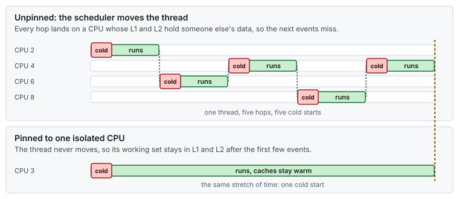
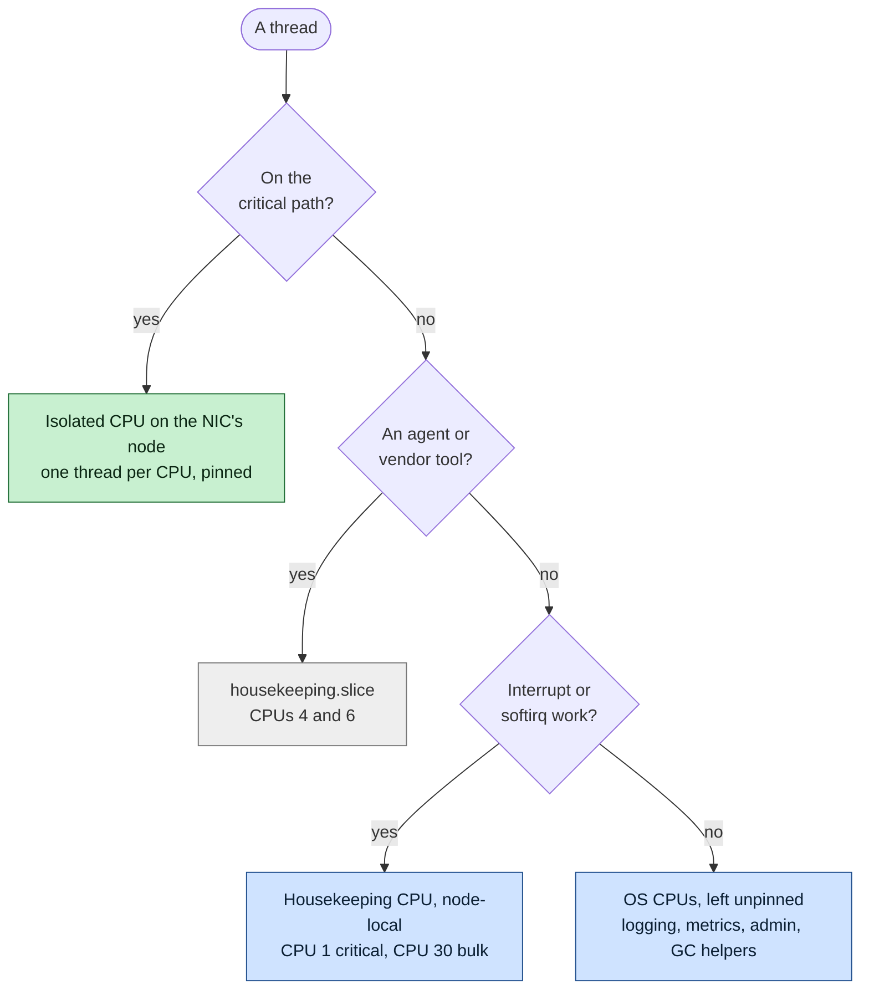
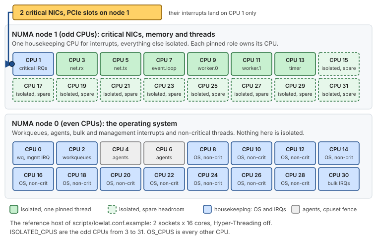

# Use case 2 — Critical and non-critical, side by side

> Guides: [02 CPU isolation](../../guides/02-cpu-core-isolation.md), [05 cgroups](../../guides/05-cgroup-isolation.md) · Scripts: [`02-cpu-isolation`](../../scripts/02-cpu-isolation), [`05-cgroup-isolation`](../../scripts/05-cgroup-isolation) · Example: [Java on a tuned host](../hugepages-java-example.md)

## At a glance

- **Situation:** an application has a handful of latency-critical threads and dozens of ordinary ones, and they all compete for the same CPUs.
- **Rule:** one critical thread per isolated CPU, and every other thread on the OS CPUs.
- **How:** design the CPU map first, then pin each role from a properties file, and check with one command.

**Time:** ~45 min for the design, then minutes per host · **You need:** [Use case 1](01-the-quiet-core.md) applied.

> [!NOTE]
> **Illustrative.** The host is the fictional reference host of [`lowlat.conf.example`](../../scripts/lowlat.conf.example). Your CPU numbers will differ, and the rules will not.

## 1. Situation

The application has six latency-critical roles (network receive, network transmit, an event loop, two workers and a timer) and many non-critical threads: logging, metrics, admin, a JIT compiler, garbage collector workers. With no plan, the scheduler places all of them everywhere, and the critical threads meet the ordinary ones on the same cores.



*A thread that may move will move, and each hop lands on a CPU whose caches hold someone else's data.*

## 2. Design the map

Write the layout down before touching the host. Three commands give you the facts:

```bash
lscpu -e=CPU,NODE,SOCKET,CORE              # topology: which CPU is on which node, HT siblings
numactl --hardware                         # memory per node
cat /sys/class/net/ens1f0/device/numa_node # the node of the critical NIC
# expect: 1
```

Then place every thread with one question:



*Only threads on the critical path get an isolated CPU. Everything else has a home on the OS CPUs, and the ones that need fencing go into the housekeeping slice.*



*The result on the reference host: node 1 holds the NICs, their interrupts and the six pinned roles, and node 0 carries everything else.*

## 3. Pin the roles

Map roles to CPUs in a file the application reads at start-up, so a layout change never touches code ([Guide 02 §6.1](../../guides/02-cpu-core-isolation.md#61-describe-the-mapping-in-configuration-not-in-code)):

```properties
# affinity.properties - thread role -> CPU (all on NUMA node 1)
affinity.enable=true
net.rx.cpu.affinity=3
net.tx.cpu.affinity=5
event.loop.cpu.affinity=7
worker.0.cpu.affinity=9
worker.1.cpu.affinity=11
timer.cpu.affinity=13
# not listed (logging, metrics, admin): unpinned, they stay on the OS CPUs
```

Each thread pins itself first, before it touches its data, so its first-touch memory lands on node 1 as well. The [Java probe](../java-latency-probe/) does it with the Foreign Function and Memory API and no third-party library. If you cannot change the code, pin from outside ([Guide 02 §6.3](../../guides/02-cpu-core-isolation.md#63-pin-from-the-outside)):

```bash
taskset -cp 9 <tid>                    # one thread onto one isolated CPU
taskset -a -cp 1 <pid>                 # a whole process onto node 1's housekeeping CPU
```

The operating system stays on its side of the fence through systemd's `CPUAffinity`, which `sudo scripts/02-cpu-isolation --apply` writes from `OS_CPUS`.

## 4. Verify

```bash
. scripts/02-cpu-isolation
show_affinity "$(pgrep -f my-app)"     # TID, allowed CPUs, last CPU, thread name
# expect: net.rx allowed={3} last=3, net.tx allowed={5} last=5, ... and every other thread on OS CPUs

perf stat -e context-switches,cpu-migrations -t <tid> -- sleep 10
# expect: about 0 migrations and no involuntary context switches for a pinned critical thread
```

Name your threads (`Thread.setName`, `pthread_setname_np`). Without names, `show_affinity` and `top -H` show only numbers.

## 5. Result

Illustrative:

| | Before | After |
|---|---|---|
| Critical threads | float across all CPUs | one per isolated CPU on the NIC's node |
| Migrations of a critical thread | every scheduler decision | about 0 |
| Non-critical threads | everywhere, including the critical cores | on the OS CPUs only |
| What is left to remove | everything | interrupts ([use case 4](04-one-nic-one-queue-one-cpu.md)) and agents ([use case 3](03-the-noisy-neighbor.md)) |

## 6. Roll back

- [ ] Set `affinity.enable=false` and restart the application. The same build then runs unpinned
- [ ] Follow [Guide 02 §10](../../guides/02-cpu-core-isolation.md#10-rollback) for the systemd defaults

## 7. Key takeaways

- **Decide by role, not by thread.** A role has one CPU, and the layout lives in a file.
- **One critical thread per isolated CPU.** A mask that spans several isolated CPUs puts every thread on the first one.
- **Everything else has a home.** The OS CPUs, the housekeeping slice or a housekeeping IRQ CPU. Nothing is left to the scheduler's judgment on the critical node.
