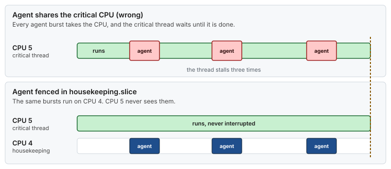
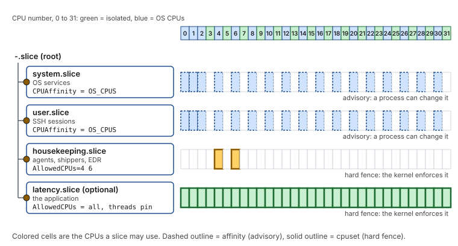

# Use case 3 — The noisy neighbor

> Guide: [05 cgroups](../../guides/05-cgroup-isolation.md) · Script: [`05-cgroup-isolation`](../../scripts/05-cgroup-isolation) · Concept: [cgroups](../../concepts/cgroups.md)

## At a glance

- **Situation:** every few seconds the latency spikes, and nothing in the application explains it.
- **Cause:** an agent (endpoint security, log shipper, exporter) bursts onto a CPU the critical path depends on.
- **Fix:** a `housekeeping.slice` that fences agents onto two quiet CPUs with a hard cpuset, and caps their CPU, memory and I/O.

**Time:** ~30 min, no reboot · **You need:** [Use case 2](02-critical-and-non-critical.md) applied and cgroup v2 (RHEL 9 default).

> [!NOTE]
> **Illustrative.** Agent names and burst sizes are made up. The mechanism and the directives are those of [Guide 05](../../guides/05-cgroup-isolation.md).

## 1. Situation

The host runs a security scanner and a log shipper next to the application. Guide 02 already moved every systemd service off the isolated CPUs, through `CPUAffinity`. That is affinity, and it is advisory: a process may call `sched_setaffinity()` and move itself, and an agent started by a vendor init script never inherited the mask in the first place. Then a network blip makes the shipper read a 2 GB backlog, and the scanner walks the filesystem.



*The same three bursts, two placements. Sharing the critical CPU stalls the thread each time, and the fence sends the bursts elsewhere.*

The agent does not need an isolated CPU to hurt you. Saturating the housekeeping CPUs where the NIC interrupts run, or filling the page cache, is enough. That is why the fence also carries limits.

## 2. Diagnose

```bash
# Where does every thread of each agent actually run?
for p in $(pgrep -f 'edr-agentd|fluent-bit'); do ps -L -o psr=,comm= -p "$p"; done | sort | uniq -c
# a CPU number from the isolated list, or CPU 1 (the NIC's interrupt CPU), is the finding

# Which cgroup is the agent in?
cat /proc/$(pgrep -o edr-agentd)/cgroup

# Who uses the OS CPUs during the spikes?
mpstat -P ALL 1
```

## 3. Change

The slice and its members come from `lowlat.conf`, and the reference host fences agents on CPUs 4 and 6, which serve no interrupts and no workqueues:

```bash
HOUSEKEEPING_SLICE_CPUS=(4 6)
HOUSEKEEPING_SLICE_MEMORY_MAX=4G
HOUSEKEEPING_SLICE_CPU_QUOTA=150%
HOUSEKEEPING_SLICE_IO_WEIGHT=50
HOUSEKEEPING_SLICE_UNITS=(node_exporter.service fluent-bit.service)
```

```bash
scripts/05-cgroup-isolation --dry-run | less
sudo scripts/05-cgroup-isolation --apply
sudo systemctl restart node_exporter fluent-bit      # a unit moves slices only when it restarts
```



*What the script builds: the first two slices rely on an inherited mask, and `housekeeping.slice` is a fence the kernel enforces.*

Processes that are not systemd units (started by a vendor script, or respawning workers that reset their affinity) are pinned by name with `pin_housekeeping_processes`, which `lowlat-runtime.service` re-runs. The cpuset decides where an agent runs, and the quota decides how much: without it, a runaway agent keeps both CPUs at 100%.

> [!WARNING]
> Do not put `AllowedCPUs=` on `system.slice` or `user.slice` unless the application runs in its own slice. A cpuset without the isolated CPUs makes the application's own `sched_setaffinity()` fail with `EINVAL`. See [Guide 05 §4.4, the cpuset trap](../../guides/05-cgroup-isolation.md#44-the-cpuset-trap).

## 4. Verify

```bash
scripts/05-cgroup-isolation --verify
systemd-cgls --no-pager /housekeeping.slice                    # the agents are inside
cat /sys/fs/cgroup/housekeeping.slice/cpuset.cpus.effective    # expect: 4,6
cat /sys/fs/cgroup/housekeeping.slice/cpu.stat                 # nr_throttled rises when the quota is reached
```

## 5. Result

Illustrative:

| | Before | After |
|---|---|---|
| Agent threads on isolated CPUs or the NIC's interrupt CPU | possible, at any time | none: the cpuset refuses |
| A burst of an agent | competes with any CPU it lands on | limited to CPUs 4 and 6, at most 1.5 CPUs of time |
| Agent memory | unbounded, can fill the page cache | capped at 4 GiB, and an OOM stays inside the slice |
| Cost | none | agents get less headroom and may report degraded health: agree on the limits with their owners |

## 6. Roll back

- [ ] `sudo scripts/05-cgroup-isolation --rollback`
- [ ] `sudo systemctl restart node_exporter fluent-bit`
- [ ] `systemctl show -p Slice node_exporter` shows `system.slice` again

## 7. Key takeaways

- **Affinity is a request and a cpuset is a fence.** Agents that reset their own affinity need the fence.
- **A fence needs a budget.** The cpuset says where, and the quota says how much.
- **Never fence the application out of its own CPUs.** Give it a slice that spans every CPU and let its threads pin themselves.
