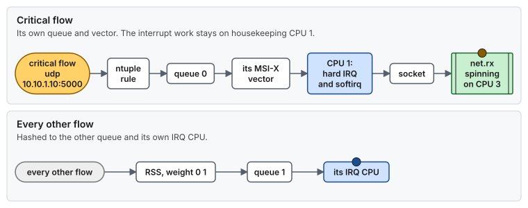

# Use case 4 — One NIC, one queue, one CPU

> Guide: [04 Network](../../guides/04-network-optimization.md) · Script: [`04-network`](../../scripts/04-network) · Concepts: [network path](../../concepts/network-tuning.md), [`ethtool` reference](../../concepts/ethtool.md), [interrupts and deferred work](../../concepts/interrupts-and-deferred-work.md)

## At a glance

- **Situation:** a spinning receive thread on an isolated CPU is interrupted for microseconds, once per packet burst.
- **Cause:** the critical NIC's interrupt is routed to that CPU, so the hardirq and the softirq preempt the thread.
- **Fix:** send the interrupt to a node-local housekeeping CPU, give the NIC as many queues as it has interrupt CPUs, and steer one flow to its own queue.

**Time:** ~20 min, no reboot (the queue change resets the link for 1 to 3 s) · **You need:** out-of-band console, a maintenance window.

> [!NOTE]
> **Illustrative.** The interface names and addresses are made up. The 1 to 50 µs per interrupt, softirq included, is the cost quoted in [Guide 02 §1](../../guides/02-cpu-core-isolation.md#1-the-problem-everything-else-that-wants-your-cpu).

## 1. Situation

On a kernel-stack host, the CPU that takes a NIC's interrupt also runs the softirq: the protocol work that turns descriptors into a socket buffer. If that CPU is the isolated one where `net.rx` spins, every packet cuts into the spin.


*Where the interrupt lands decides whether the spinning thread is interrupted. Housekeeping CPU 1 takes the work, and CPU 3 only ever spins.*

## 2. Diagnose

```bash
# Which CPU column increases for the critical NIC's rows?
watch -d -n1 "grep -E 'CPU|ens1f0' /proc/interrupts"
# a column of an isolated CPU (3, 5, 7, ...) moving is the finding

# How many queues does the NIC have, and how many are in use?
ethtool -l ens1f0
# Combined: 63 under "Current hardware settings" is the driver default: one queue per CPU

# What does the tool blame on the isolated CPU?
sudo rtla osnoise top -c 3 -d 30s
# IRQ and softirq sources with a max in the µs range
```

## 3. Change



*Where the critical packet goes after the change: its own queue, an interrupt on the housekeeping CPU 1, and only the finished data reaches the isolated CPU 3. Every other flow is hashed to the other queue. The addresses are made up.*

The NIC roles and their interrupt CPUs come from `lowlat.conf`. The reference host puts both critical NICs on CPU 1, the housekeeping CPU of NUMA node 1, where the NICs live:

```bash
NICS=(
	"ens1f0|critical|1|0"      # name | role | irq_cpus | txqueuelen
	"ens1f1|critical|1|0"
	"eno1|timing|0|0"
	"ens2f0|bulk|30|300000"
)
```

```bash
scripts/04-network --dry-run | less
sudo scripts/04-network --apply                     # applies now. These settings are runtime-only
```

`04-network` does not survive a reboot on its own: `lowlat-runtime.service` re-applies it at every boot, and `sudo scripts/apply-all --apply` is what installs that unit ([Guide 04 §8](../../guides/04-network-optimization.md#8-persistence)). If you applied only this guide, run `systemctl is-enabled lowlat-runtime.service` and install the unit before you rely on the result.

Behind that one call, for each critical NIC, in this order ([Guide 04 §5](../../guides/04-network-optimization.md#5-per-nic-settings-tune_nic_low_latency)): queues equal to the number of IRQ CPUs, adaptive coalescing off, coalescing 0, PAUSE off, TSO/GSO/LRO off, rings at maximum, then the IRQs placed. The placement is the part this story is about:

```bash
ls /sys/class/net/ens1f0/device/msi_irqs            # the exact vectors of this PCI function
echo 1 > /proc/irq/<irq>/smp_affinity_list          # to CPU 1, in CPU list format
cat /proc/irq/<irq>/effective_affinity_list         # what the interrupt controller really uses
```

If one flow must never queue behind the others, give it its own queue with an ntuple rule, which overrides RSS for matching packets ([Guide 04 §5.1](../../guides/04-network-optimization.md#51-queues-channels-ethtool--l)):

```bash
ethtool -K ens1f0 ntuple on
ethtool -L ens1f0 combined 2                                                # queue 0: the critical flow, queue 1: the rest
ethtool -X ens1f0 weight 0 1                                                # RSS spreads hashed traffic to queue 1 only
ethtool -N ens1f0 flow-type udp4 dst-ip 10.10.1.10 dst-port 5000 action 0   # the critical flow goes to queue 0
ethtool -n ens1f0                                                           # list the rules
# then place both IRQs: queue 0 on CPU 1, queue 1 on CPU 1 too, or on a node-0 OS CPU if CPU 1 gets busy
```

> [!IMPORTANT]
> These commands are **not managed by `04-network`**. It sets the queue count from the `irq_cpus` field of the `NICS` entry (one queue for `1`), and it never restores RSS weights or ntuple rules. After a reboot or a driver reload the NIC is back to `combined 1` and the flow steering is gone. To keep it, run the same commands, and the IRQ placement for both queues, from a oneshot unit of your own ordered `After=lowlat-runtime.service` ([Guide 04 §8](../../guides/04-network-optimization.md#8-persistence)). Not tested by this repository.

> [!WARNING]
> Changing channels resets the NIC on most drivers, with the link down for 1 to 3 seconds, and the new queues come up with default IRQ affinity. Do it in a maintenance window, and keep irqbalance off, or it rewrites the affinity within 10 seconds ([Guide 02 §4.3](../../guides/02-cpu-core-isolation.md#43-irqbalance-persistent)).

## 4. Result

Illustrative:

| | Before | After |
|---|---|---|
| Interrupts on the isolated CPU | one per packet burst, 1 to 50 µs each with its softirq | none |
| Softirq work | preempts `net.rx`, or waits in `ksoftirqd` behind it | runs on CPU 1 |
| Queues | 63 (driver default), each with an interrupt to place | as many as there are IRQ CPUs |
| Data path to `net.rx` | packet processed on the same CPU | a few cache-line transfers from CPU 1 to CPU 3 |

## 5. Verify and roll back

### Verify

```bash
scripts/04-network --verify                         # per-NIC PASS/FAIL, and "no NIC IRQ on an isolated CPU"
watch -d -n1 "grep -E 'CPU|ens1f0' /proc/interrupts"
# expect: the critical NIC's counters increase only in the CPU 1 column

ethtool -S ens1f0 | grep -iE 'drop|miss|discard|no_buf|fifo' | grep -v ': 0$'
# expect: no output. A larger ring absorbs bursts, and drops mean the softirq CPU is too busy
```

### Roll back

- [ ] Whole host: `sudo systemctl disable lowlat-runtime.service`, `sudo systemctl enable --now irqbalance`, reboot
- [ ] One interface: the checklist in [Guide 04 §11](../../guides/04-network-optimization.md#11-rollback), including `ethtool -N ens1f0 delete <rule id>` for every ntuple rule

## 6. Key takeaways

- **The interrupt CPU is the softirq CPU.** Never put a kernel-stack NIC's interrupts on an isolated CPU that runs a spinning thread.
- **Add IRQ CPUs first, then queues.** One queue per interrupt CPU keeps the host simple.
- **Give a flow its own queue only when it must never wait.** An ntuple rule does it, and support is driver-dependent, so check `ethtool -k`.
