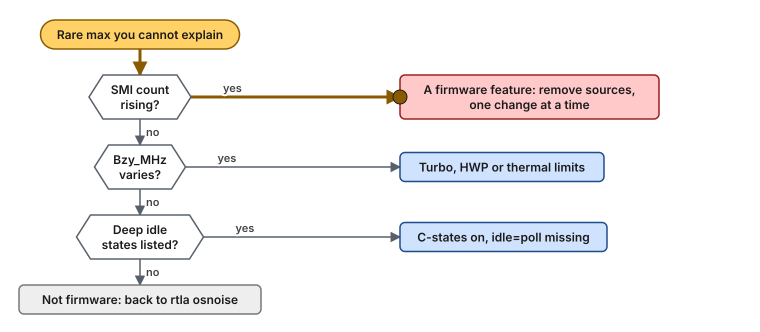

# Use case 7 — The freeze nobody logs

> Guides: [00 BIOS and firmware](../../guides/00-bios-firmware.md), [09 Measuring latency](../../guides/09-measuring-latency.md) · Scripts: [`00-bios-firmware`](../../scripts/00-bios-firmware), [`09-measure-latency`](../../scripts/09-measure-latency) · Concept: [power, frequency and firmware](../../concepts/power-and-frequency.md#6-smis-the-firmware-takes-every-cpu)

## At a glance

- **Situation:** the maximum latency shows a rare spike of hundreds of microseconds, while `rtla osnoise` is clean and the OS logs nothing.
- **Cause:** firmware. An SMI stops every CPU and runs code the operating system cannot see. On CPUs that sleep between messages (a thread that blocks, not one that spins), a deep C-state exit looks the same.
- **Fix:** count SMIs, remove their sources in the BIOS one change at a time, and keep the CPUs out of deep idle states.

**Time:** ~2 h, because each BIOS change needs a reboot · **You need:** out-of-band console access and bare metal. A VM cannot see this.

> [!NOTE]
> **Illustrative.** The cost is the one stated in [Guide 00](../../guides/00-bios-firmware.md): an SMI or a deep C-state exit costs tens to hundreds of µs. Which settings remove SMIs differs between vendors, so measure it on your hardware.

## 1. Situation

Everything the operating system controls has been tuned. The tail is short, and yet the maximum shows a rare spike that repeats every so often. Nothing in `/proc/interrupts` moves, and the kernel log is quiet.


*An SMI stops every CPU at once, and only the SMI counter records it.*

## 2. Diagnose

Look for firmware first, then frequency, then idle states, in that order ([Guide 00 §8](../../guides/00-bios-firmware.md#8-troubleshooting)):



*Check SMIs, then frequency changes, then deep idle states. When all three are clean, the noise is not coming from the firmware.*

```bash
# The SMI count over 10 s (run as root; a VM cannot see it)
sudo turbostat --quiet --interval 10 --num_iterations 1 --show CPU,Busy%,Bzy_MHz,SMI
# expect: Bzy_MHz steady across runs, and SMI 0 (or a small, constant count)
# the finding: an SMI count that keeps rising while the host is idle

grep -s . /sys/devices/system/cpu/cpu0/cpuidle/state*/name  # none with idle=poll (-s: the files are gone); no C6 when disabled in the BIOS
sudo rtla osnoise top -c 3 -d 60s                            # clean: the noise is not in the OS
```

`rtla osnoise` sees only a gap it cannot attribute, and `rtla hwnoise` measures the time stolen with interrupts disabled, as the older hwlat tracer does ([Guide 09 §4](../../guides/09-measuring-latency.md#4-the-tools-by-question)). Pair it with `turbostat`, which is the only tool that counts SMIs.

## 3. Change

Menu names differ between vendors, so [Guide 00 §4.6](../../guides/00-bios-firmware.md#46-system-management-interrupts) describes each source by what it does:

| Feature | Recommended |
|---|---|
| Firmware-first error handling | OS-first, or a high threshold, with the errors collected by the BMC |
| Processor power and utilization monitoring | Disabled |
| Legacy USB emulation | Disabled on servers without a local keyboard |
| Dynamic power capping | Disabled |

Change **one** setting, reboot, and count SMIs again. Keep only the changes that lower the count. For idle states, disable C1E and every C-state deeper than C1 in the BIOS, and do the same in the OS with `idle=poll` from [Guide 01](../../guides/01-grub-bootloader-tuning.md): the BIOS setting is the backstop if a kernel argument is ever lost after an update.

```bash
scripts/00-bios-firmware --dry-run
sudo scripts/00-bios-firmware --apply       # PCIe ASPM policy: runtime, re-applied at boot
```

> [!WARNING]
> With `idle=poll` every CPU runs at 100% all the time. Set the fan profile to maximum cooling, or the CPUs reach thermal limits and lower their frequency, which is exactly the variation you are removing ([Guide 00 §4.8](../../guides/00-bios-firmware.md#48-cooling)).

## 4. Result

Illustrative:

| | Before | After |
|---|---|---|
| SMI count over 10 s | rising, also while idle | 0, or a small constant count |
| Rare maximum | hundreds of µs, no cause in the OS | gone, or explained |
| What you can now say | "the OS is clean" | "the OS and the firmware are clean" |

## 5. Verify and roll back

### Verify

```bash
sudo scripts/00-bios-firmware --verify       # SMT off, NUMA per socket, EPB, ASPM, turbostat SMI over 1 s
sudo turbostat --quiet --interval 10 --num_iterations 1 --show SMI
# expect: 0, or a small constant count, and the rare spike gone from the histogram
```

Save the finished BIOS configuration as a profile through the vendor's BMC tools, and apply it to every host of the same model. A firmware update can reset it, so run `--verify` after each one.

### Roll back

- [ ] Restore the BIOS settings from the exported configuration (Guide 00 §3), or load the vendor defaults and re-apply your site baseline
- [ ] `sudo scripts/00-bios-firmware --rollback`, then set `BIOS_PCIE_ASPM_POLICY=""` in `lowlat.conf`
- [ ] Reboot, and check `numactl --hardware` against `lowlat.conf` if the NUMA layout changed

## 6. Key takeaways

- **The firmware sets the noise floor.** No kernel setting removes an SMI.
- **Count before you change.** `turbostat` before and after each BIOS change is the only proof.
- **Keep it after updates.** A firmware update can reset the BIOS, and `--verify` catches it.
