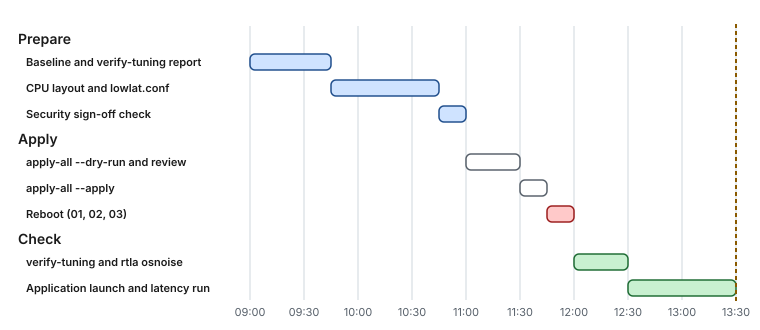

# Use case 8 — Capstone: stock RHEL to tuned in one afternoon

> Guides: [00](../../guides/00-bios-firmware.md) to [10](../../guides/10-time-sync.md) · Scripts: [`apply-all`](../../scripts/apply-all), [`verify-tuning`](../../scripts/verify-tuning) · Scenario: [Quick start, Scenario A](../../QUICK_START.md#scenario-a-dedicated-bare-metal-host-the-full-treatment)

## At a glance

- **Situation:** one dedicated physical server, one latency-critical application with pinnable threads, half a day.
- **Path:** measure first, design the CPU map, set the firmware, apply once, reboot once, verify, then measure again and compare honestly.
- **Result:** a much shorter tail. The median moves a little, and p99.9 and the maximum move the most.

**Time:** about half a day for the first host, minutes for the next ones with the same hardware · **You need:** out-of-band console, root, a security sign-off if you touch mitigations or the firewall.

> [!NOTE]
> **Illustrative.** The ladder below uses fictional numbers to show the shape, not a measurement of any host. Every layer's own figures are in the guides, and the use cases 1 to 7 each show one layer in detail.

## 1. The map of the tail

Before touching anything, know where the tail comes from. Each layer adds rare events, and each has a guide that removes them:


*Six layers, six kinds of rare event. The order of the afternoon follows the picture from the bottom up: firmware first, then the operating system, memory and network, then the application.*

## 2. The afternoon



*About two hours to measure and design, under an hour to apply with a single reboot, then about 90 minutes to verify and compare against the baseline. The times are indicative.*

| Step | What you do | Guide | Story |
|---|---|---|---|
| 1 | Capture a baseline: `sudo scripts/09-measure-latency --apply && sudo scripts/09-measure-latency --run`, and `scripts/verify-tuning --report before.txt` | [09](../../guides/09-measuring-latency.md) | |
| 2 | Design the CPU map and write `/etc/lowlat/lowlat.conf` | [02 §3](../../guides/02-cpu-core-isolation.md#3-designing-the-cpu-layout) | [Use case 2](02-critical-and-non-critical.md) |
| 3 | Set the firmware: maximum-performance profile, deep C-states off, SMI sources off, Hyper-Threading off, NUMA per socket | [00](../../guides/00-bios-firmware.md) | [Use case 7](07-the-freeze-nobody-logs.md) |
| 4 | Read the plan, then apply: `scripts/apply-all --plan`, `--dry-run \| less`, `sudo scripts/apply-all --apply`, `sudo systemctl reboot` | [01](../../guides/01-grub-bootloader-tuning.md) to [07](../../guides/07-os-hygiene.md), [10](../../guides/10-time-sync.md) | [Use case 1](01-the-quiet-core.md), [3](03-the-noisy-neighbor.md), [4](04-one-nic-one-queue-one-cpu.md), [5](05-page-faults-on-the-hot-path.md) |
| 5 | Check the host: `scripts/verify-tuning --report after.txt`, then a host bundle before the application starts | [09](../../guides/09-measuring-latency.md) | [Use case 6](06-two-sockets-one-mistake.md) |
| 6 | Launch the application with pinned roles and the large-page flags | [Java example](../hugepages-java-example.md) | [Use case 2](02-critical-and-non-critical.md) |
| 7 | Measure again under the same load, and compare | [09 §5](../../guides/09-measuring-latency.md#5-a-measurement-protocol) | below |

Two things make this safe. The scripts are dry-run first, so you read every command and file before anything changes, and every file they touch is backed up under `/var/lib/lowlat/`. Each guide has a rollback section, so you can undo one layer without undoing the rest.

## 3. Measure honestly

A comparison is only as good as the load that produced it. Two rules from [Guide 09](../../guides/09-measuring-latency.md):

- **Fix the load.** The same rate, message size and duration before and after, and change one thing at a time.
- **Use open-loop load, or correct the histogram.** A closed-loop benchmark records one slow sample for a stall, where the users would have felt a queue.


*One stall, two senders. The closed loop hides the queue behind the stall, and the open loop records every request that was due.*

Keep a results table per host model, one row per change ([Guide 09 §5](../../guides/09-measuring-latency.md#5-a-measurement-protocol)):

```text
| Run | Change                  | Kernel      | p50 | p99 | p99.9 | p99.99 | max  | osnoise max | SMIs/10s |
|-----|-------------------------|-------------|-----|-----|-------|--------|------|-------------|----------|
| 0   | baseline                | 5.14.0-...  |     |     |       |        |      |             |          |
| 1   | Guide 01 (+ reboot)     |             |     |     |       |        |      |             |          |
| 2   | Guide 02                |             |     |     |       |        |      |             |          |
```

## 4. What the comparison looks like


*Illustrative numbers, to show the shape. The median improves a little, because the code path is the same. Each higher percentile improves more, because it is a rarer kind of interference, and that is what the layers above remove.*

Read your own result the same way: the p50 tells you the code path, the p99 the frequent interference, and p99.9 to max the rare kinds ([Guide 09 §3.1](../../guides/09-measuring-latency.md#31-percentiles-not-averages)). A p99.9 that does not move points at the layer you have not reached yet, and [Guide 09 §7](../../guides/09-measuring-latency.md#7-reading-the-results) maps each pattern to its guide.

## 5. What it costs

Nothing here is free, and the README says so first ([Read this first](../../README.md#read-this-first)):

- **Power and heat.** `idle=poll` keeps every CPU at 100%, so the cooling profile matters.
- **Throughput and flexibility.** Isolated CPUs sit idle until something is pinned to them, and offloads and coalescing are off.
- **Security.** Turning CPU vulnerability mitigations off or removing the host firewall are opt-in, marked steps that need written approval and a single-tenant host.

## 6. Roll back

- [ ] One layer at a time: each guide's rollback section, most recent first
- [ ] Everything: `sudo systemctl disable lowlat-runtime.service`, then the rollback of each guide, then reboot. The original files are in `/var/lib/lowlat/factory-settings/`

## 7. Key takeaways

- **Measure first, and measure the same way every time.** A configuration that is verified correct is not a latency improvement you have measured.
- **Work down the stack.** Firmware sets the floor, and the application is the last layer, not the first.
- **The tail is the sum of rare events.** Each guide removes one kind, so the picture changes one layer at a time, and every change is reversible.
