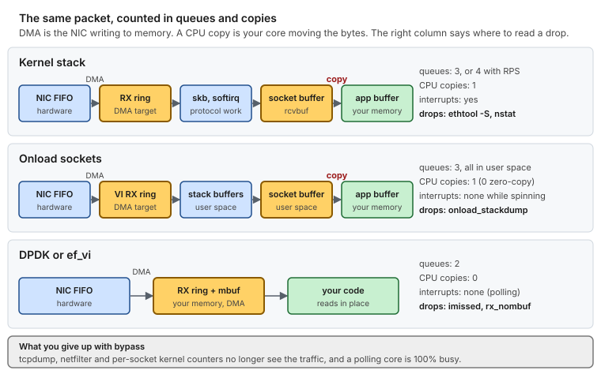

# Use case 10 — Line rate without the kernel

> Guides: [04 Network](../../guides/04-network-optimization.md), [08 Kernel bypass](../../guides/08-kernel-bypass.md) · Scripts: [`04-network`](../../scripts/04-network), [`08-kernel-bypass`](../../scripts/08-kernel-bypass) · Concept: [network buffers](../../concepts/network-buffers.md) · Terms: [Glossary](../../GLOSSARY.md)

## At a glance

- **Situation:** a feed handler ingests 64-byte messages at about 6 Mpps. The rings are already at the maximum, and packets are still lost, all the time and not in bursts.
- **Cause:** the arrival rate is above the drain rate **permanently**. One kernel core spends about 670 ns per packet (about 1.5 Mpps), so the time to overflow is finite whatever the ring size. No buffer can fix an overload.
- **Fix, in order:** spread the load over more queues and IRQ CPUs. If the tail target or the CPU count still does not fit, move to kernel bypass. Stop at the first step that is enough.

**Time:** ~1 h for queues, plus a maintenance window for bypass · **You need:** out-of-band console, a traffic replay at the real rate, and (for bypass) a supported NIC.

> [!NOTE]
> **Illustrative.** The 1.5 Mpps per kernel core is a rough order of magnitude for small packets, and it varies with the CPU, the driver and the work per packet. Measure yours before you decide. The CPU numbers are made up.

## 1. Situation



*The same packet on the kernel stack, on Onload sockets and on DPDK or ef_vi. Bypass removes queues and the interrupt, but the rate limit is the per-packet CPU cost, and only that decides whether it is needed.*

A burst is a queue problem: capacity divided by (arrival minus drain) says how long it lasts. An overload is different. At 6 Mpps against a 1.5 Mpps drain, an 8160-slot ring fills in 8160 / 4.5 = 1.8 ms, and after that 75% of the packets are lost, for as long as the traffic lasts.

## 2. Diagnose

The signature of an overload is that every counter grows **continuously**, and not once per burst:

```bash
snap() { ethtool -S ens1f0 | awk '/rx_packets:|rx_missed_errors:/ { s += $2 } END { print s }'; }   # counter names vary by driver
a=$(snap); sleep 10; b=$(snap); echo $(( (b - a) / 10 )) packets per second
# about 6,000,000                       <- the offered rate: packets received plus packets missed
# `sar -n DEV` would show only the packets that were received, about the drain rate, and hide the loss

top -H -b -n1 | grep -E 'ksoftirqd|ens1f0' | head -3
# ksoftirqd/1   99.9 %CPU                <- the IRQ CPU does nothing but protocol work

awk '{ print "cpu" NR-1, "time_squeeze", $3 }' /proc/net/softnet_stat | head -3
# read it twice, 10 s apart: column 3 grows on the IRQ CPU

ethtool -S ens1f0 | grep -E 'rx_missed_errors|rx_no_buffer_count'
# read it twice: it grows steadily, with the ring already at the maximum
```

Now the budget: `1 / 1.5 Mpps = 667 ns` per packet on one core. Six Mpps needs four cores of softirq at 100%, and five leave headroom. That number, and not any buffer size, decides what to do.

## 3. Change

**Step 1: more queues on more IRQ CPUs.** The kernel stack scales by adding queues, as long as [RSS](../../GLOSSARY.md#rss) spreads the flows. `irq_cpus` lists OS CPUs of the NIC's node, never isolated ones, and `04-network` creates one queue per listed CPU ([Guide 04 §5.1](../../guides/04-network-optimization.md#51-queues-channels-ethtool--l)):

```bash
NICS=(
	"ens1f0|critical|1,3,5,7,9|0"      # five IRQ CPUs, so five queues (illustrative numbers)
)
ISOLATED_CPUS=(11 13 15 17 19 21 23 25 27 29 31)   # 3, 5, 7 and 9 are no longer isolated
```

Unlike the reference host, this one keeps five OS CPUs on node 1, because the softirq work needs them. Take CPUs 3, 5, 7 and 9 out of `ISOLATED_CPUS` and add them to `OS_CPUS`, re-run `scripts/plan-layout --check`, and reboot once for [Guide 01](../../guides/01-grub-bootloader-tuning.md).

```bash
scripts/04-network --dry-run | less
sudo scripts/04-network --apply
ethtool -l ens1f0
# Combined: 5
```

> [!IMPORTANT]
> `04-network` and `06-kernel-sysctl` change runtime state only. `sudo scripts/apply-all --apply` is what installs and enables `lowlat-runtime.service`, which re-applies it at every boot. If you ran only this script, check `systemctl is-enabled lowlat-runtime.service` before you rely on the result ([Guide 04 §8](../../guides/04-network-optimization.md#8-persistence)).

This is the cheapest fix, and it keeps `tcpdump`, netfilter and every tool you know. It costs five housekeeping CPUs at full load. It also needs at least five flows, and the NIC must spread them: RSS hashes flows to queues, so two flows can share one, and many drivers hash UDP on the source and destination IP only, which puts every flow between the same two hosts on one queue.

Check the hash fields, and the load per queue, before you trust the queue count ([Concept: ethtool §9 and §10](../../concepts/ethtool.md#9--x---x-rss-indirection-table-and-hash-key)):

```bash
ethtool -n ens1f0 rx-flow-hash udp4
# expect: IP SA, IP DA, L4 bytes 0 & 1, L4 bytes 2 & 3   (ports included)
sudo ethtool -N ens1f0 rx-flow-hash udp4 sdfn        # add the ports if they are missing
ethtool -S ens1f0 | grep -E 'rx[-_]?queue|rx-[0-9]+|rx_[0-9]+' | head -12
# read it twice: every queue's packet counter must grow, not one
```

The `rx-flow-hash` change is runtime-only and is not managed by `04-network`, so put it in your own oneshot unit after `lowlat-runtime.service` ([Guide 04 §8](../../guides/04-network-optimization.md#8-persistence)).

> [!IMPORTANT]
> Busy polling ([Concept: network tuning §8](../../concepts/network-tuning.md#8-busy-polling)) does not help here. It removes the interrupt and the wake-up, and it does not remove the per-packet stack work that the budget above is made of.

**Step 2: kernel bypass, when step 1 does not fit.** Use it when the tail target is tens of microseconds, or when you cannot spare five CPUs for interrupts. The path this repository scripts is Onload on Solarflare or AMD NICs ([Guide 08 §5](../../guides/08-kernel-bypass.md#5-onload-on-solarflare--amd-nics)):

```bash
# lowlat.conf
KERNEL_BYPASS_STACK=onload
KERNEL_BYPASS_DRIVER=sfc
KERNEL_BYPASS_COMMAND=onload
```

```bash
scripts/08-kernel-bypass --dry-run
sudo scripts/08-kernel-bypass --apply               # modprobe.d + pinned reload
sudo scripts/04-network --runtime                   # after the reload: queue count and IRQs
```

Before you start the application, reserve the huge pages that the stack needs. `EF_USE_HUGE_PAGES=2` makes Onload fail at start-up when it cannot get them, and `EF_MAX_PACKETS` below alone needs 128 MiB per stack, on top of your application's own pages. Reserve them on the NIC's NUMA node, with headroom, as in [Guide 03 §3 and §4](../../guides/03-huge-pages-configuration.md#3-sizing-the-pool). Then start the application through `onload -p latency`, and size the stack for the rate. The buffer arithmetic is the same as before, per stack ([Concept: network buffers §7.2](../../concepts/network-buffers.md#72-solarflare-ef_vi-and-onload)):

```bash
# in the Onload profile file or the environment (Guide 08 §5.3)
EF_RXQ_SIZE=4096            # descriptors in the VI's RX ring (default 512)
EF_MAX_PACKETS=65536        # packet buffers per stack: 128 MiB at 2 KiB each (default 32768)
EF_USE_HUGE_PAGES=2         # fail at start-up if huge pages are missing
```

At 6 Mpps the budget is `1 / 6 Mpps = 167 ns` per packet for your own code on the polling thread. If your code needs longer, split the flows across several stacks with one thread each. Do not assume that one thread can drain 6 Mpps: measure it.

> [!NOTE]
> **Not tested by this repository:** the DPDK path ([Guide 08 §6](../../guides/08-kernel-bypass.md#6-dpdk-on-intel-nics)). It follows the same idea with a poll-mode driver and a mempool, and its sizing rule is in [Concept: network buffers §7.1](../../concepts/network-buffers.md#71-dpdk).

## 4. Verify

```bash
# kernel path, after step 1
ethtool -S ens1f0 | grep -E 'rx_missed_errors|rx_no_buffer_count'      # expect: no growth
awk '{ print "cpu" NR-1, $3 }' /proc/net/softnet_stat                  # expect: column 3 not growing
top -H -b -n1 | grep ksoftirqd | head -5                               # expect: every one well below 100%

# Onload path, after step 2
scripts/08-kernel-bypass --verify
onload_stackdump lots | grep -E 'oflow_drop|memory_pressure|pkt_bufs'
# expect: oflow_drop 0, memory_pressure 0, pkt_bufs not CRITICAL
```

Run the replay at 1.2 times the real rate. A queue or a stack that is at its limit at the real rate fails the first time the feed grows.

## 5. Result

Illustrative:

| | Kernel, one queue | Kernel, five queues | Onload |
|---|---|---|---|
| Drain rate | about 1.5 Mpps | about 7.5 Mpps | set by your thread: 167 ns per packet at 6 Mpps |
| Loss at 6 Mpps | about 75%, steady | none | none, if `oflow_drop` and `memory_pressure` stay 0 |
| CPUs at 100% | 1 (softirq) | 5 (softirq) | 1 per stack (your polling thread) |
| Interrupts | one per burst, per queue | one per burst, per queue | none while the thread spins |
| `tcpdump`, netfilter | yes | yes | not for accelerated traffic |
| Where to read drops | `ethtool -S`, `nstat`, `ss -m` | the same | `onload_stackdump` |

## 6. Roll back

- [ ] Queues: the checklist in [Guide 04 §11](../../guides/04-network-optimization.md#11-rollback), or `sudo ethtool -L ens1f0 combined 1` (this resets the link)
- [ ] Bypass: `sudo scripts/08-kernel-bypass --rollback`, then follow [Guide 08 §12](../../guides/08-kernel-bypass.md#12-rollback), and start the application without the `onload` prefix
- [ ] Whole host: `sudo systemctl disable lowlat-runtime.service` and reboot

## 7. Key takeaways

- **Buffers absorb bursts, and they cannot absorb an overload.** If every counter grows all the time, count the nanoseconds per packet, and stop resizing queues.
- **Try queues before bypass.** Five queues keep every tool you know, and bypass costs `tcpdump`, netfilter and a spinning core.
- **Bypass moves the limit and the counters.** The new limits are the packet-buffer budget and your own per-packet time, and the new counters are `oflow_drop`, `memory_pressure` and, for DPDK, `imissed` and `rx_nombuf`.
