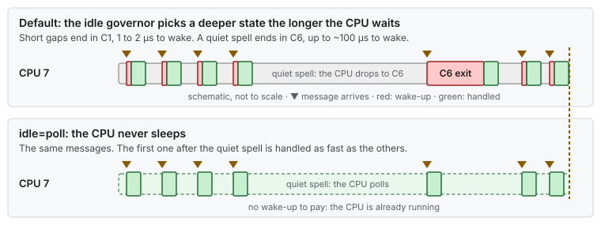
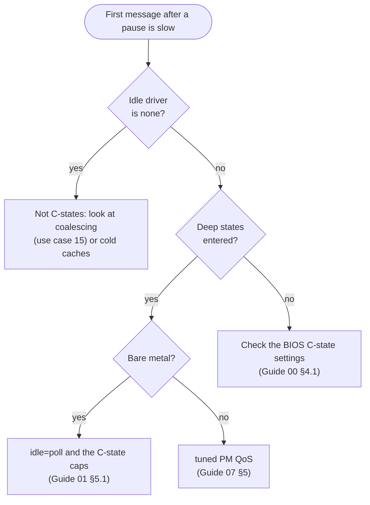

# Use case 11 — The first message after a quiet spell

> Guides: [00 BIOS and firmware](../../guides/00-bios-firmware.md), [01 Kernel command line](../../guides/01-grub-bootloader-tuning.md), [02 CPU isolation](../../guides/02-cpu-core-isolation.md), [07 OS hygiene](../../guides/07-os-hygiene.md) · Scripts: [`01-grub-bootloader`](../../scripts/01-grub-bootloader), [`07-os-hygiene`](../../scripts/07-os-hygiene) · Concepts: [Bootloader §4](../../concepts/bootloader.md#idlepoll-processormax_cstate-intel_idlemax_cstate), [power and frequency §2](../../concepts/power-and-frequency.md#2-idle-c-states)

## At a glance

- **Situation:** a blocking `event.loop` thread is fast under steady load, and slow on the first message after a quiet spell.
- **Cause:** when the thread blocks, its CPU goes idle. The longer the CPU stays idle, the deeper the [C-state](../../GLOSSARY.md#cstate) the idle governor picks, and the longer the CPU takes to wake up.
- **Fix:** keep the CPUs out of deep idle states: `idle=poll` and the C-state caps on the kernel command line, the tuned PM QoS limit, and deep C-states off in the BIOS as a backstop. On an isolated CPU, make the thread spin.

**Time:** ~30 min + one reboot · **You need:** root, bare metal, out-of-band console for the BIOS part.

> [!NOTE]
> **Illustrative.** The wake-up costs are the ones stated in [Guide 01 §5.1](../../guides/01-grub-bootloader-tuning.md#51-latency-subset-bare-metal-and-vms): ~1–2 µs from C1 and up to ~100 µs from C6. The exit latency of each state depends on the CPU model. Read yours from `cpuidle` (step 2 below).

## 1. Situation

The `event.loop` thread is pinned to isolated CPU 7. It waits for work in `epoll_wait`, so it blocks whenever its queue is empty. During busy periods, when a message arrives every few microseconds, it answers quickly. After a quiet spell of a second or more, the **first** message is tens of microseconds slower, and then the next ones are fast again.

The pattern shows up when you split the samples by the gap before each message: the longer the gap, the slower the message. Busy hours look clean, and the first message of the day, after a failover or after a lull pays the cost.



*The governor picks the idle state from how long it expects the CPU to wait. A quiet spell earns the deepest state, and the next message pays for the wake-up.*

## 2. Diagnose

Three questions: which states can the CPU enter, how deep are they, and what should have kept it out of them?



*Start from the slow first message: is an idle driver active, does the CPU enter deep states, and which control is missing on this host class.*

```bash
# 1. The idle driver and the states CPU 7 may enter (Guide 01 §7, Guide 00 §7)
cat /sys/devices/system/cpu/cpuidle/current_driver
# before: intel_idle        after: none (idle=poll replaces the idle loop)
grep -s . /sys/devices/system/cpu/cpu7/cpuidle/state*/name
# before: POLL, C1, C1E, C6  after: no output (-s: no error once the states are gone)

# 2. How deep each state is, and how often CPU 7 enters it (Guide 00 §7)
grep -s . /sys/devices/system/cpu/cpu7/cpuidle/state*/{latency,usage}
# latency: exit latency in µs, as the driver declares it (C6 is the large one)
# usage:   entries since boot; sample twice across a quiet spell and C6 grows

# 3. What should keep the CPU out of deep states (Guide 01 §7, Guide 07 §5)
tr ' ' '\n' </proc/cmdline | grep -E 'idle|cstate'
# before: no output          after: idle=poll, processor.max_cstate=0, intel_idle.max_cstate=0
tuned-adm active
# before: a profile without force_latency, such as throughput-performance
```

Only the blocking thread's CPU pays this cost directly, but the packet usually wakes more than one CPU. The NIC interrupt lands on a housekeeping CPU ([use case 4](04-one-nic-one-queue-one-cpu.md)), which may be asleep too, and that CPU then wakes CPU 7. Each sleeping CPU in the chain adds its own exit latency.

## 3. Change

Apply the controls from the outside in. Each one covers the case where another is lost.

| Layer | Setting | What it does |
|---|---|---|
| BIOS | C1E and every C-state deeper than C1 disabled ([Guide 00 §4.1](../../guides/00-bios-firmware.md#41-power-and-performance-profile)) | The backstop: nothing in the OS can re-enable them |
| Kernel command line | `idle=poll processor.max_cstate=0 intel_idle.max_cstate=0` ([Guide 01 §5.1](../../guides/01-grub-bootloader-tuning.md#51-latency-subset-bare-metal-and-vms)) | An idle CPU spins instead of halting. The caps keep it shallow if `idle=poll` is ever dropped |
| tuned | `force_latency` from `network-latency` ([Guide 07 §5](../../guides/07-os-hygiene.md#5-tuned-profile)) | PM QoS: the idle governor may not pick a state slower than the limit |
| Thread | busy-spin instead of block, on an isolated CPU only ([Guide 02 §6.4](../../guides/02-cpu-core-isolation.md#64-busy-spin-vs-back-off)) | The thread never lets its CPU go idle |

The BIOS layer alone still leaves C1: a CPU that waits pays 1 to 2 µs to wake, instead of up to ~100 µs. Only `idle=poll`, or a thread that spins, removes the wake-up entirely.

The command-line arguments are part of the latency subset that `01-grub-bootloader` always applies. The tuned profile comes from `lowlat.conf`:

```bash
TUNED_BASE_PROFILE=network-latency     # the low-latency profile includes it, with force_latency
```

```bash
scripts/01-grub-bootloader --dry-run | grep -E 'idle|cstate'   # the three arguments
sudo scripts/01-grub-bootloader --apply
sudo scripts/07-os-hygiene --apply                              # the low-latency tuned profile
sudo systemctl reboot
```

For the BIOS layer, follow [Guide 00 §4.2](../../guides/00-bios-firmware.md#42-who-controls-the-idle-states): do both on a dedicated host. The kernel argument can be lost after a kernel update, and the BIOS setting cannot.

> [!WARNING]
> With `idle=poll` every CPU runs at 100 % all the time. Power draw and heat go up, and hot CPUs lower their frequency. Set the fan profile to maximum cooling ([Guide 00 §4.8](../../guides/00-bios-firmware.md#48-cooling)), and agree on the power budget with whoever runs the data center.

Spinning is the thread-level fix, and it works only where the thread owns its CPU. On a shared CPU or in a VM, keep the back-off strategy and rely on the other layers ([Guide 02 §6.4](../../guides/02-cpu-core-isolation.md#64-busy-spin-vs-back-off)).

## 4. Result

Illustrative, from the wake-up costs above:

| | Before | After |
|---|---|---|
| Idle states CPU 7 can enter | POLL, C1, C1E, C6 | none: the idle loop polls |
| Wake-up after a short gap | ~1–2 µs (C1) | 0 |
| Wake-up after a quiet spell | up to ~100 µs (C6), plus a package C-state if the whole socket slept | 0 |
| Latency by gap before the message | grows with the gap | flat |
| Cost | lower power while idle | 100 % CPU and more heat on every CPU |

The scheduler wake-up of a blocked thread (2 to 50 µs, [Guide 02 §6.4](../../guides/02-cpu-core-isolation.md#64-busy-spin-vs-back-off)) is still there while the thread blocks. Only spinning removes it.

## 5. Verify and roll back

- [ ] `cat /sys/devices/system/cpu/cpuidle/current_driver` prints `none`
- [ ] `grep -s . /sys/devices/system/cpu/cpu7/cpuidle/state*/name` prints nothing (the states are gone, so without `-s` grep would report the missing files)
- [ ] `tuned-adm active` shows `low-latency`, and `tuned-adm verify` passes
- [ ] The latency of the first message after a quiet spell matches the busy-hour latency ([Guide 09](../../guides/09-measuring-latency.md))
- [ ] `scripts/verify-tuning` shows PASS for Guides 01 and 07
- [ ] Roll back the whole host with `sudo scripts/apply-all --rollback`. To undo only this story's guides: `sudo scripts/01-grub-bootloader --rollback` ([Guide 01 §9](../../guides/01-grub-bootloader-tuning.md#9-rollback)), then `sudo systemctl disable --now lowlat-runtime.service` and `sudo scripts/07-os-hygiene --rollback` ([Guide 07 §11](../../guides/07-os-hygiene.md#11-rollback)). The other guides still need their runtime settings re-applied at boot, so enable the unit again with `sudo systemctl enable lowlat-runtime.service`, after checking that the Guide 07 opt-in keys (`DISABLE_FIREWALLD`, `FLUSH_FIREWALL_RULES`, `REMOVE_NETFILTER_MODULES`) are `no`, since the unit re-applies them. Restore the exported BIOS profile ([Guide 00 §9](../../guides/00-bios-firmware.md#9-rollback)), then reboot

## 6. Key takeaways

- **Quiet is expensive for a blocking thread.** The longer the CPU waits, the deeper it sleeps, and the first message after the wait pays for the wake-up.
- **Split latency by the gap before each message.** A clean busy hour does not prove anything about the first message after a lull.
- **Close every layer.** BIOS, kernel command line and PM QoS each cover the case where another is lost, and a spinning thread never lets its CPU sleep.
