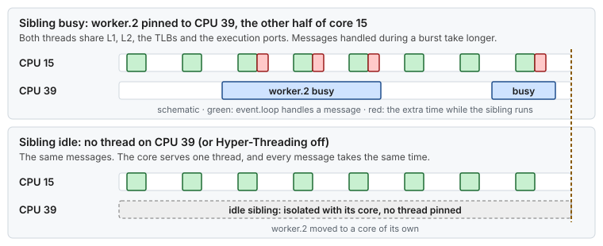

# Use case 12 — The sibling that shares your core

> Guides: [00 BIOS and firmware](../../guides/00-bios-firmware.md), [01 Kernel command line](../../guides/01-grub-bootloader-tuning.md), [02 CPU isolation](../../guides/02-cpu-core-isolation.md) · Scripts: [`plan-layout`](../../scripts/plan-layout), [`02-cpu-isolation`](../../scripts/02-cpu-isolation) · Concepts: [CPU isolation](../../concepts/cpu-isolation.md), [hardware topology](../../concepts/hardware-topology.md)

## At a glance

- **Situation:** the `event.loop` thread slows down only while `worker.2` is busy, although the two threads run on different isolated CPUs.
- **Cause:** the two CPUs are the two [Hyper-Threading](../../GLOSSARY.md#smt) siblings of one physical core. They share its caches, TLBs and execution ports.
- **Fix:** turn Hyper-Threading off in the BIOS, or give every critical thread a core of its own and leave the sibling idle.

**Time:** ~15 min to find, ~1 h + reboot to turn HT off · **You need:** root, the application's affinity file, out-of-band console for the BIOS.

> [!NOTE]
> **Illustrative.** How much a busy sibling slows your thread depends on what both threads do: two threads that stream memory hurt each other more than two that wait on the network. The figures below show the shape, not a measurement. Measure it for your workload, once with the sibling busy and once with it idle ([Guide 09](../../guides/09-measuring-latency.md)).

## 1. Situation

A second server model joins the fleet: 2 sockets × 12 cores with Hyper-Threading on, so 48 CPUs. It is the host of the [`server-2x12-ht-on`](../../scripts/fixtures/server-2x12-ht-on.lscpu) fixture. Siblings are numbered 24 apart: CPU 15 and CPU 39 are the two halves of core 15.

`plan-layout` isolated whole cores, as it should. The application's affinity file was then filled in by counting isolated CPUs, not cores:

```properties
# affinity.properties (as found)
net.rx.cpu.affinity=13
net.tx.cpu.affinity=14
event.loop.cpu.affinity=15
worker.0.cpu.affinity=16
worker.1.cpu.affinity=17
worker.2.cpu.affinity=39      # "a free isolated CPU", but the sibling of 15
```

`event.loop` is fast most of the day. Whenever `worker.2` starts a batch, the time `event.loop` spends on each message goes up, and it comes back down when the batch ends.



*Two logical CPUs, one core. While the sibling runs, both threads share the core, and the thread you care about gets only part of it.*

## 2. Diagnose

Three questions: is Hyper-Threading on, which CPUs share a core, and which threads run on them?


*First confirm Hyper-Threading, then find the sibling, then look for a thread on it.*

```bash
# 1. Is Hyper-Threading on? (Guide 00 §7)
cat /sys/devices/system/cpu/smt/active
# 1 = on (this host)   0 = off

# 2. Which CPUs share a physical core with CPU 15? (Guide 01 §3: same CORE = siblings)
lscpu -e=CPU,NODE,SOCKET,CORE | awk 'NR == 1 || $4 == 15'
# CPU NODE SOCKET CORE
#  15    1      1   15
#  39    1      1   15

# 3. Which thread runs on each CPU? (Guide 02 §6.3)
. scripts/02-cpu-isolation
show_affinity "$(pgrep -f my-app)"
# event.loop on CPU 15, worker.2 on CPU 39: two critical threads on one core
```

Checking the layout with `plan-layout --check` passes here, because the layout itself is right: both siblings are isolated together. The mistake is in the application's affinity file, which `plan-layout` does not read.

## 3. Change

Two ways out, in order of preference ([Guide 00 §4.4](../../guides/00-bios-firmware.md#44-hyper-threading), [Guide 02 §3](../../guides/02-cpu-core-isolation.md#3-designing-the-cpu-layout) rule 4):

| Option | What changes | Cost |
|---|---|---|
| **A. Hyper-Threading off in the BIOS** (preferred) | Each core shows as one CPU, so no thread can share a core by mistake | Half the logical CPUs, a new layout, a reboot |
| **B. Keep HT, one thread per core** | Pin each critical thread to one CPU of its own core, and leave the sibling idle | Half the isolated CPUs stay unused |

**Option A.** Disable "Logical Processor" (or "Hyper-Threading", "SMT Control") in the BIOS. The host then has 24 CPUs with new numbers, so plan the layout again from the new topology, update `lowlat.conf` and the affinity file, and apply Guide 01 before the reboot:

```bash
# after the BIOS change and a first reboot
cat /sys/devices/system/cpu/smt/active                 # 0
scripts/plan-layout --nic-node 1 --threads 6           # propose ISOLATED_CPUS, OS_CPUS, ...
sudoedit /etc/lowlat/lowlat.conf                       # paste the proposal
sudo scripts/01-grub-bootloader --apply
sudo systemctl reboot
```

**Option B.** Keep the layout, and change only the affinity file so that every critical thread has a core of its own:

```properties
worker.2.cpu.affinity=18      # core 18; its sibling, CPU 42, stays idle
```

Restart the application, and check again with `show_affinity`. The planning rule for this host is simple: use CPUs 13 to 23, one per core, and never 37 to 47.

> [!IMPORTANT]
> With `idle=poll`, an idle sibling is not fully idle: its idle loop keeps polling and uses some of the core ([Guide 01 §5.1](../../guides/01-grub-bootloader-tuning.md#51-latency-subset-bare-metal-and-vms)). Option B removes the big slowdown, but only option A gives the thread the whole core.

## 4. Result

Illustrative:

| | Before | After (A or B) |
|---|---|---|
| Critical threads per physical core | 2 on core 15 | 1 |
| `event.loop` time per message | steady, then longer during every `worker.2` batch | steady |
| Latency pattern | follows another thread's schedule | independent of it |
| Isolated CPUs you can use | 22 (by count) | 11 (option B) or all of them (option A, on a new layout) |

## 5. Verify and roll back

- [ ] Option A: `cat /sys/devices/system/cpu/smt/active` prints `0`, and `scripts/plan-layout --check /etc/lowlat/lowlat.conf --nic-node 1` passes
- [ ] Option B: `show_affinity` lists no two critical threads whose CPUs share a `CORE` in `lscpu -e`
- [ ] The time per message no longer changes with `worker.2`'s batches ([Guide 09](../../guides/09-measuring-latency.md))
- [ ] `scripts/verify-tuning` reports no FAIL for Guides 00 to 02. With option B, `WARN Hyper-Threading (SMT) off` from Guide 00 stays, and it is expected: the run passes with warnings
- [ ] Roll back option B: restore the old affinity file and restart the application
- [ ] Roll back option A: restore the exported BIOS profile ([Guide 00 §9](../../guides/00-bios-firmware.md#9-rollback)), restore the previous `lowlat.conf`, run `sudo scripts/01-grub-bootloader --apply`, then reboot

## 6. Key takeaways

- **Count cores, not CPUs.** With Hyper-Threading on, two CPU numbers can be one core, and `lscpu -e` is the only place that says so.
- **The layout can be right while the pinning is wrong.** `plan-layout` isolates whole cores, and the affinity file still decides which CPUs the threads use.
- **Hyper-Threading off is the clean answer.** An idle sibling helps, but with `idle=poll` it still polls, and it still shares the core.
