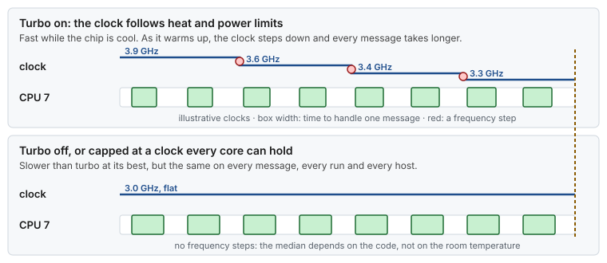

# Use case 13 — Turbo, the lottery

> Guides: [00 BIOS and firmware](../../guides/00-bios-firmware.md), [09 Measuring latency](../../guides/09-measuring-latency.md) · Scripts: [`00-bios-firmware`](../../scripts/00-bios-firmware), [`09-measure-latency`](../../scripts/09-measure-latency) · Concept: [power and frequency §4](../../concepts/power-and-frequency.md#4-turbo-a-clock-that-depends-on-the-weather)

## At a glance

- **Situation:** two identical hosts with the same configuration have different medians, and on each host the median creeps up during the first half hour after a reboot.
- **Cause:** turbo is on. The clock depends on how hot the chip is and how close it is to its power limit, so it changes with the rack position, the room and the time since the host started.
- **Fix:** decide turbo by measuring: compare the tail with turbo on and off under real load, after warm-up. Many latency hosts keep it off, or cap the clock at a level every core can hold. Set the fans to maximum cooling in either case.

**Time:** ~2 h, because each run needs a warm-up and each BIOS change needs a reboot · **You need:** root, bare metal, out-of-band console, `turbostat` (`kernel-tools`).

> [!NOTE]
> **Illustrative, and not proven in production.** The clocks below are invented to show the shape. Turbo behavior depends on the CPU model, the power limits the vendor sets and the cooling. [Guide 00 §4.3](../../guides/00-bios-firmware.md#43-turbo-a-measured-decision) gives the common reasoning, and only your own measurement decides.

## 1. Situation

The fleet has two hosts of the same model, with the same BIOS profile and the same `lowlat.conf`. Both run the latency probe under the same fixed load ([Guide 09 §5](../../guides/09-measuring-latency.md#5-a-measurement-protocol)). Host A reports a p50 of about 1.9 µs, and host B about 2.2 µs. Repeating the run does not settle it: a run started right after a reboot is faster than the same run half an hour later.

Nothing in the software differs. The hardware does: host B sits higher in the rack and breathes warmer air.



*Turbo trades a faster best case for a clock that depends on temperature and power. With `idle=poll` every core is busy all the time, so the chip runs at its all-core turbo, and heat decides how long it can hold it.*

## 2. Diagnose

Three questions: is turbo on, does the clock move while the host warms up, and do the two hosts run at different clocks?


*First read the turbo state, then watch the clock through a warm-up, then compare the hosts.*

```bash
# 1. Is turbo on, and does the OS keep the frequency fixed? (Guide 00 §7, Guide 07 §9)
scripts/00-bios-firmware --verify | grep turbo
# before: turbo: on (cpufreq boost=1)       after: turbo: off (cpufreq boost=0)
cat /sys/devices/system/cpu/cpu0/cpufreq/scaling_governor
# performance (so the OS is not the one changing the clock)

# 2. The clock during a warm-up, from a cold start under the real load (Guide 00 §4.8)
sudo turbostat --quiet --interval 60 --show CPU,Busy%,Bzy_MHz,CoreTmp,PkgTmp
# before: Bzy_MHz steps down (3900, 3600, 3400, 3300) while PkgTmp climbs
# after:  Bzy_MHz flat at the chosen clock

# 3. The two hosts side by side: capture a bundle on each (Guide 09 §6), with the application
#    stopped or MEASURE_CPUS set to unused CPUs, because --run puts rtla osnoise on the measured CPUs
sudo scripts/09-measure-latency --run
# compare turbostat.txt in the two bundles: host B runs a few hundred MHz lower
```

If the governor is not `performance`, or `scaling_driver` is `intel_pstate` with hardware P-states, the OS or the CPU is changing the clock too. Fix that first ([Guide 00 §4.1](../../guides/00-bios-firmware.md#41-power-and-performance-profile), [Guide 01 §5.3](../../guides/01-grub-bootloader-tuning.md#53-frequency-and-power)), then come back to turbo.

## 3. Change

Turbo is a measured decision ([Guide 00 §4.3](../../guides/00-bios-firmware.md#43-turbo-a-measured-decision)), so the change is an experiment with two arms:

1. **Cool first.** Set the fan profile to maximum cooling ([Guide 00 §4.8](../../guides/00-bios-firmware.md#48-cooling)) on both hosts, and repeat the warm-up check. Sometimes that alone makes the clock flat.
2. **Measure with turbo on.** Warm the host up for 30 minutes under the fixed load, then record the application histogram ([Guide 09 §5](../../guides/09-measuring-latency.md#5-a-measurement-protocol)). Take the bundle separately: `09-measure-latency --run` runs `rtla osnoise` on the measured CPUs, so capture it with the application stopped, or with `MEASURE_CPUS` set to CPUs the application does not use ([Guide 09 §6](../../guides/09-measuring-latency.md#6-using-the-script)). Otherwise its workload lands in the histogram you are comparing.
3. **Turn turbo off in the BIOS** ("Turbo Boost", "Core Performance Boost" or "Turbo Mode"), reboot, and repeat step 2 exactly.
4. **Compare** p50, p99.9 and the spread between runs and between hosts, and keep the arm that wins on the tail.

Some platforms can also cap the clock at a fixed level below the maximum turbo that every core can hold. It sits between the two arms: faster than turbo off, with no steps. Where the BIOS offers it, measure it as a third arm.

```bash
sudo scripts/00-bios-firmware --verify     # after each reboot: turbo state, EPB, idle states, SMIs
```

## 4. Result

Illustrative:

| | Turbo on | Turbo off |
|---|---|---|
| Clock during a run | 3.9 GHz when cold, 3.3 GHz when warm | 3.0 GHz, flat |
| p50, host A / host B | 1.9 µs / 2.2 µs, and moving | 2.3 µs / 2.3 µs |
| Median, first minutes vs after warm-up | faster first, then slower | the same |
| What a change in p50 now means | maybe the code, maybe the weather | the code |

Turbo off is slower at its best, and in this illustration it is slower on average too. What it buys is a clock that does not change, so two hosts and two runs can be compared, and a regression shows up as a regression. Whether that is worth the lower median is the owner's call, made with the numbers from step 4.

## 5. Verify and roll back

- [ ] `scripts/00-bios-firmware --verify` shows the turbo state you chose
- [ ] The warm-up check shows a flat `Bzy_MHz` after 30 minutes under load
- [ ] The `turbostat.txt` files of both hosts' bundles show the same clock
- [ ] The results table ([Guide 09 §5](../../guides/09-measuring-latency.md#5-a-measurement-protocol)) records both arms, with the host, the kernel and the BIOS version
- [ ] Roll back: re-enable turbo in the BIOS, or restore the exported BIOS profile ([Guide 00 §9](../../guides/00-bios-firmware.md#9-rollback)), then reboot

## 6. Key takeaways

- **Turbo makes the clock a variable.** Heat, the power limit and the rack position then show up in your latency.
- **Warm up before you measure.** A run started on a cold host measures a clock that will not last.
- **Decide with numbers, both ways.** Turbo on or off is a trade between a faster median and a steady one, and only a measurement on your hardware decides it.
