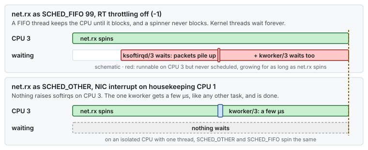

# Use case 14 — The spinner that stalled the kernel

> Guides: [02 CPU isolation](../../guides/02-cpu-core-isolation.md), [04 Network](../../guides/04-network-optimization.md) · Scripts: [`02-cpu-isolation`](../../scripts/02-cpu-isolation), [`04-network`](../../scripts/04-network) · Concepts: [CPU isolation](../../concepts/cpu-isolation.md), [interrupts and deferred work](../../concepts/interrupts-and-deferred-work.md#3-softirqs-and-ksoftirqd)

## At a glance

- **Situation:** the `net.rx` thread was started as `SCHED_FIFO` 99 "so that it always wins". First it stalls for 50 ms once a second. After RT throttling is turned off, packets start to pile up on its CPU under load.
- **Cause:** a [FIFO](../../GLOSSARY.md#fifo) thread keeps its CPU until it blocks, and a spinner never blocks. [RT throttling](../../GLOSSARY.md#rt-throttling) takes the CPU back by force, and without throttling, the kernel threads of that CPU never run.
- **Fix:** run the spinner as `SCHED_OTHER`. On an isolated CPU with one thread, it spins exactly the same. Keep device interrupts off the isolated CPU, so that no kernel work lands there.

**Time:** ~20 min · **You need:** root, the application's launch command.

> [!NOTE]
> **Illustrative.** The 50 ms comes from the kernel defaults in [Guide 02 §4.4](../../guides/02-cpu-core-isolation.md#44-real-time-throttling) (950 ms of every 1 s for real-time tasks). How fast packets pile up depends on the load and on the NIC. The figures show the shape.

## 1. Situation

The launcher starts the application like this:

```bash
chrt -f 99 /opt/lowlat/bin/my-app      # every thread SCHED_FIFO 99; the threads pin themselves from affinity.properties
```

**Act 1.** On a host where Guide 02 has not been applied yet, the latency histogram of `net.rx` has a clean body and a separate cluster near 50 ms, about once per second. That is RT throttling: after 950 ms of running, the FIFO thread is taken off the CPU for 50 ms ([Guide 02 §4.4](../../guides/02-cpu-core-isolation.md#44-real-time-throttling)).


*Act 1: the throttle takes the last 50 ms of every second away from the spinner.*

Guide 02 sets `kernel.sched_rt_runtime_us=-1`, and the 50 ms cluster is gone.

**Act 2.** Weeks later, after a NIC driver reload, the critical NIC's receive interrupt lands on CPU 3 again. Under bursts, packets now pile up and are lost, although `net.rx` is spinning and idle. A little later, an operator's command that waits for work on every CPU hangs.



*Act 2: without throttling, nothing takes the CPU from a FIFO spinner, not even the kernel threads that feed it.*

## 2. Diagnose

Three questions: which threads run in a real-time class, is the kernel throttling them, and what is waiting on their CPU?


*First find the real-time threads, then the throttle setting, then the kernel threads that wait behind them.*

```bash
# 1. Threads in a real-time class, with CPU and priority (Guide 02 §8, check 7)
ps -eLo psr,tid,cls,rtprio,stat,comm | awk 'NR == 1 || $3 == "FF" || $3 == "RR"'
# before: every thread of my-app as FF 99, and net.rx among them on CPU 3
# after:  kernel threads only (migration/N and similar)

# 2. Is the kernel throttling them? (Guide 02 §4.4, §9)
sysctl kernel.sched_rt_runtime_us
# act 1: 950000   act 2: -1
dmesg | grep 'RT throttling activated'
# act 1: the line appears once, when throttling first starts

# 3. What else is runnable on CPU 3? (Guide 02 §5)
ps -eLo psr,tid,cls,rtprio,stat,comm | awk '$1 == 3'
# act 2: ksoftirqd/3 and kworker/3:1 in state R (runnable), and they stay R

# 4. Why is ksoftirqd/3 busy? A device interrupt on the isolated CPU (Guide 02 §8, check 6)
watch -d -n1 "awk 'NR==1 || /LOC|RES|CAL|TLB|NMI/ || /<nic>/' /proc/interrupts"
# act 2: the NIC's receive row increases in the CPU 3 column
```

`chrt` applied to the whole process, so every thread of the application is FIFO 99, including threads that block and threads that should be on the OS CPUs.

## 3. Change

Take the real-time class away, and move the interrupt back to its housekeeping CPU:

```bash
# launcher: no chrt; the threads still pin themselves (Guide 02 §6.1, §6.2)
/opt/lowlat/bin/my-app                    # was: chrt -f 99 /opt/lowlat/bin/my-app
```

```bash
sudo scripts/04-network --apply           # critical NIC interrupts back on housekeeping CPU 1 (use case 4)
sudo scripts/02-cpu-isolation --verify    # RT throttling, workqueue mask, irqbalance
```

Why `SCHED_OTHER` is enough ([Guide 02 §6.5](../../guides/02-cpu-core-isolation.md#65-real-time-scheduling-class-usually-unnecessary)):

| | `SCHED_FIFO` spinner | `SCHED_OTHER` spinner |
|---|---|---|
| Alone on an isolated CPU | spins | spins the same |
| A kernel thread becomes runnable on its CPU | the kernel thread waits until the spinner blocks: never | the kernel thread runs for a few µs, then the spinner continues |
| RT throttling | needs `-1`, or a 50 ms stall every second | does not apply |
| Mistake on a housekeeping CPU | starves the CPU, and the host may appear hung | shares the CPU fairly |

Keep `kernel.sched_rt_runtime_us=-1` from Guide 02 anyway: it only matters for FIFO threads, and it prevents act 1 if someone adds one later.

> [!WARNING]
> If a thread really needs FIFO, because something else must sometimes run on its CPU and you want the thread to win, use a low priority (1–10, never 99), set it on that one thread with `chrt -f -p 1 <tid>`, and only on an isolated CPU that receives no device interrupts ([Guide 02 §6.5](../../guides/02-cpu-core-isolation.md#65-real-time-scheduling-class-usually-unnecessary)).

## 4. Result

Illustrative:

| | Act 1 (throttled FIFO) | Act 2 (unthrottled FIFO, IRQ on CPU 3) | After (`SCHED_OTHER`, IRQ on CPU 1) |
|---|---|---|---|
| Stall pattern | ~50 ms once per second | none from the scheduler | none |
| `ksoftirqd/3` | runs in the 50 ms gaps | runnable, never runs | nothing to do |
| Packets under bursts | delayed up to 50 ms | pile up and are lost | delivered |
| Commands that wait for every CPU | slow | hang | return |

## 5. Verify and roll back

- [ ] `ps -eLo psr,tid,cls,rtprio,stat,comm | awk '$3 == "FF" || $3 == "RR"'` lists no application thread
- [ ] `ps -eLo psr,tid,cls,rtprio,stat,comm | awk '$1 == 3'` shows `net.rx` in state R and no kernel thread in R: sleeping kernel threads show S, and idle kworkers show I
- [ ] The NIC receive row no longer increases in the CPU 3 column of `/proc/interrupts`
- [ ] `scripts/verify-tuning` shows PASS for Guides 02 and 04
- [ ] Roll back: restore the old launch command, and for the tuning follow [Guide 02 §10](../../guides/02-cpu-core-isolation.md#10-rollback) and [Guide 04 §12](../../guides/04-network-optimization.md#12-rollback)

## 6. Key takeaways

- **A spinner does not need a real-time class.** Alone on an isolated CPU, `SCHED_OTHER` spins the same, and it still lets the kernel do its few µs of work.
- **FIFO blocks every kernel thread on its CPU.** With throttling it costs 50 ms a second, and without it the kernel work never runs.
- **Keep interrupts off the isolated CPU.** Then nothing wakes `ksoftirqd` there, whatever the scheduling class.
