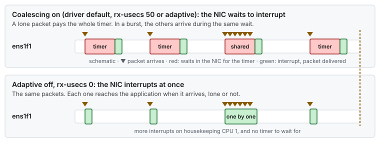

# Use case 15 — The coalescing timer

> Guides: [04 Network](../../guides/04-network-optimization.md) · Script: [`04-network`](../../scripts/04-network) · Concept: [ethtool §6](../../concepts/ethtool.md#6--c---c-interrupt-coalescing)

## At a glance

- **Situation:** a second feed on a newer NIC is always about 50 µs slower than the first one when traffic is light, and almost as fast when traffic is heavy.
- **Cause:** the NIC was never added to `lowlat.conf`, so it kept the driver's [coalescing](../../GLOSSARY.md#coalescing): the NIC waits up to `rx-usecs` after a packet before it raises the interrupt. A lone packet pays the whole wait, and the packets of a burst share it.
- **Fix:** list the NIC as `critical`, so that `04-network` turns [adaptive coalescing](../../GLOSSARY.md#adaptive-coalescing) off and sets `rx-usecs 0`, and moves its interrupts to the housekeeping CPU.

**Time:** ~20 min · **You need:** root, the NIC name.

> [!NOTE]
> **Illustrative.** The 50 µs is the `rx-usecs 50` row of the table in [Guide 04 §5.3](../../guides/04-network-optimization.md#53-coalescing-0-ethtool--c-rx-usecs-0-tx-usecs-0). Driver defaults differ: read yours with `ethtool -c`.

## 1. Situation

The host receives two feeds on two critical NICs of the same model. `ens1f0` was there when the host was tuned. `ens1f1` was cabled later for a second feed, which sends a few hundred messages per second with occasional bursts. Both feeds are read by pinned, spinning threads on isolated CPUs.

Measured from the wire, messages from `ens1f1` take about 50 µs longer to reach the application than messages from `ens1f0`, but only when traffic is light. During bursts the difference shrinks. The spinning thread shows no gap and `rtla osnoise` is clean: the delay happens before the packet reaches the host's CPUs.



*Coalescing charges its timer per interrupt, not per packet. Light traffic gets one interrupt per packet, so each packet pays the whole wait.*

## 2. Diagnose

Three questions: what does the NIC wait for, why was it never tuned, and where do its interrupts go?


*First read the coalescing settings, then find out why the script skipped the NIC, then check its interrupts.*

```bash
# 1. The coalescing settings of both NICs (Concept: ethtool §6)
ethtool -c ens1f0 | grep -E 'Adaptive|^rx-usecs|^tx-usecs'
# Adaptive RX: off  TX: off / rx-usecs: 0 / tx-usecs: 0       (tuned)
ethtool -c ens1f1 | grep -E 'Adaptive|^rx-usecs|^tx-usecs'
# Adaptive RX: on  TX: on / rx-usecs: 50 / tx-usecs: 50      (driver defaults, illustrative)

# 2. Is ens1f1 in the NICS list? (Guide 04 §3)
grep -A8 '^NICS=' /etc/lowlat/lowlat.conf
# only ens1f0 is listed as critical: 04-network never touched ens1f1

# 3. Compact state of each NIC, and where the interrupts land (Guide 04 §9)
. scripts/04-network && show_nic_state ens1f1
watch -d -n1 "grep -E 'CPU|ens1f1' /proc/interrupts"
# check that the ens1f1 rows increase only on housekeeping CPU 1, never on an isolated CPU
```

`scripts/04-network --verify` passes on this host, because every one of its checks, "no NIC IRQ effective on an isolated CPU" included, walks the `NICS` list. It says nothing about `ens1f1`. That is why step 3 looks at its interrupts by hand: if they land on an isolated CPU, the new NIC also has the problem of [use case 4](04-one-nic-one-queue-one-cpu.md).

## 3. Change

Add the NIC to `/etc/lowlat/lowlat.conf` with the critical role, its interrupts on housekeeping CPU 1:

```bash
NICS=(
	"ens1f0|critical|1|0"
	"ens1f1|critical|1|0"      # added: critical role, IRQs on CPU 1, default txqueuelen
	"eno1|timing|0|0"
	# ...
)
```

```bash
scripts/04-network --dry-run | grep ens1f1      # read the ethtool calls for the new NIC
sudo scripts/04-network --apply
```

What the critical profile changes on `ens1f1` ([Guide 04 §5](../../guides/04-network-optimization.md#5-per-nic-settings-tune_nic_low_latency)):

| Setting | Before | After | Why |
|---|---|---|---|
| Adaptive coalescing | on | off | Otherwise the driver rewrites `rx-usecs` within milliseconds ([§5.2](../../guides/04-network-optimization.md#52-adaptive-coalescing-off-ethtool--c-adaptive-rx-off-adaptive-tx-off)) |
| `rx-usecs`, `tx-usecs` | 50 | 0 | Interrupt at once, for every packet ([§5.3](../../guides/04-network-optimization.md#53-coalescing-0-ethtool--c-rx-usecs-0-tx-usecs-0)) |
| IRQ affinity | wherever the driver put it | CPU 1 | Never on an isolated CPU ([§6](../../guides/04-network-optimization.md#6-interrupt-affinity-set_nic_irq_affinity)) |
| Queues, pause frames, offloads, rings | defaults | the rest of the profile | [§5.1 to §5.7](../../guides/04-network-optimization.md#5-per-nic-settings-tune_nic_low_latency) |

`lowlat-runtime.service` re-applies the same settings at every boot, because `ethtool` settings do not survive a reboot or a driver reload ([Guide 04 §8](../../guides/04-network-optimization.md#8-persistence)).

> [!IMPORTANT]
> `rx-usecs 0` means one interrupt per packet. On a busy link that is a lot of work for CPU 1, which now serves two critical NICs. Watch its load (`mpstat -P 1 1`). If it cannot keep up, give the second NIC its own housekeeping CPU on the same node ([Guide 04 §5.3](../../guides/04-network-optimization.md#53-coalescing-0-ethtool--c-rx-usecs-0-tx-usecs-0)).

## 4. Result

Illustrative:

| | Before | After |
|---|---|---|
| Wait in the NIC, lone packet | up to 50 µs | ~0 |
| Wait in the NIC, packet inside a burst | shared: less than 50 µs, and less for later packets | ~0 |
| `ens1f1` vs `ens1f0` at light load | +~50 µs | the same |
| Interrupts on CPU 1 | one per coalescing window | one per packet |

## 5. Verify and roll back

- [ ] `ethtool -c ens1f1` shows `Adaptive RX: off  TX: off`, `rx-usecs: 0` and `tx-usecs: 0`
- [ ] `scripts/04-network --verify` lists `ens1f1` with PASS lines, and "no NIC IRQ effective on an isolated CPU" passes
- [ ] The two feeds have the same latency at light load ([Guide 04 §9](../../guides/04-network-optimization.md#9-verification) has the sockperf round trip)
- [ ] After a reboot, `ethtool -c ens1f1` still shows the same values
- [ ] Roll back: `sudo systemctl disable --now lowlat-runtime.service`, then `sudo scripts/04-network --rollback` restores every NIC to its saved baseline ([Guide 04 §12](../../guides/04-network-optimization.md#12-rollback)). To keep `ens1f0` tuned, remove the `ens1f1` line from `NICS`, run `--apply` again and re-enable `lowlat-runtime.service`

## 6. Key takeaways

- **Light traffic pays the most for coalescing.** One packet per interrupt means one full timer per packet, while a burst shares the wait.
- **A NIC the script does not know keeps the driver's defaults.** Every new critical NIC needs its line in `NICS`.
- **Look before the packet reaches the CPU.** A clean `osnoise` and a spinning thread with no gap point at the NIC.
