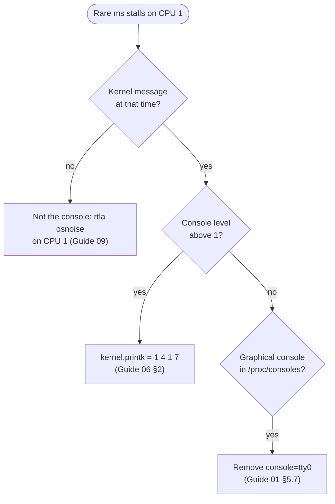

# Use case 16 — The log line that cost five milliseconds

> Guides: [01 Kernel command line](../../guides/01-grub-bootloader-tuning.md), [06 Kernel sysctls](../../guides/06-kernel-sysctl-tuning.md) · Scripts: [`01-grub-bootloader`](../../scripts/01-grub-bootloader), [`06-kernel-sysctl`](../../scripts/06-kernel-sysctl) · Concept: [logging and I/O](../../concepts/logging-and-io.md#33-the-kernel-console)

## At a glance

- **Situation:** a rare stall of several milliseconds on the critical feed. Each one lines up, to the second, with a kernel warning in `dmesg`.
- **Cause:** the kernel writes messages more urgent than the console log level to every console **synchronously**. One warning line, printed on housekeeping CPU 1 to a graphical and a serial console, holds that CPU for about 5 ms and delays the critical NIC's interrupts.
- **Fix:** `kernel.printk = 1 4 1 7`, so that only emergencies reach the console, and no graphical console on the kernel command line. The messages still reach `dmesg` and the journal.

**Time:** ~15 min + one reboot · **You need:** root, out-of-band console access.

> [!NOTE]
> **Illustrative.** The cost per line is arithmetic, not a measurement: a serial console at 115200 baud sends about 11,500 characters per second, so an 80-character line takes about 7 ms. A graphical console is faster per line and still synchronous. [Guide 06 §2](../../guides/06-kernel-sysctl-tuning.md#2-kernel-logging-and-debug) states the mechanism. Newer kernels can print from a separate console thread for some drivers; **not tested** on RHEL 10.

## 1. Situation

The critical feed's latency is clean for hours, then shows a stall of a few milliseconds, and then another one the next day. `rtla osnoise` on the isolated CPUs is clean, and the spinning `net.rx` thread shows no gap: it simply receives nothing for a few milliseconds, then a clump of packets.

The stalls line up with warnings in the kernel log. On this host, the NIC driver's receive path on CPU 1 occasionally fails to refill its receive ring under memory pressure, and prints a one-line warning of about 55 characters each time. At 115200 baud, that line alone takes about 5 ms on the serial console.

The host's kickstart left two settings behind from a debugging session: `kernel.printk` is `7 4 1 7`, so every message except debug output goes to the console, and the command line has `console=tty0 console=ttyS0,115200n8`.


*The cost is not the warning, it is where it is written. A console write is done by the CPU that prints, and that CPU serves nothing else until it is done.*

## 2. Diagnose

Three questions: does each stall match a kernel message, which messages go to the console, and which consoles are there?



*Match the stall to a kernel message, then check the console level, then the consoles that get each line.*

```bash
# 1. The kernel log around a stall, with wall-clock times
dmesg -T | tail -80
# at each stall time: one driver warning line about the critical NIC's receive ring

# 2. Which levels reach the console (Guide 06 §2): the first number is the console level
sysctl kernel.printk
# before: kernel.printk = 7 4 1 7      after: kernel.printk = 1 4 1 7

# 3. Which consoles print every line (Guide 06 §10, Guide 01 §5.7)
cat /proc/consoles
# before: tty0 and ttyS0                   after: ttyS0 only
tr ' ' '\n' </proc/cmdline | grep console
# before: console=tty0 console=ttyS0,115200n8
```

A message goes to the console when its level is more urgent than the first number of `kernel.printk`. At 7, warnings (level 4) and informational messages (level 6) are printed. At 1, only emergencies (level 0) are.

## 3. Change

Both settings come from the guides, with nothing to set in `lowlat.conf`:

| Setting | Guide | Applies |
|---|---|---|
| `kernel.printk = 1 4 1 7` | [06 §2](../../guides/06-kernel-sysctl-tuning.md#2-kernel-logging-and-debug), in `/etc/sysctl.d/` | at once, and at every boot |
| remove `console=tty0` | [01 §5.7](../../guides/01-grub-bootloader-tuning.md#57-miscellaneous) | at the next boot |

```bash
sudo scripts/06-kernel-sysctl --apply       # kernel.printk, and the rest of Guide 06
sudo scripts/01-grub-bootloader --apply     # bare metal: removes console=tty0, keeps the serial console
sudo systemctl reboot
```

The serial console stays on the command line: it is how the out-of-band console shows boot messages and emergencies. At console level 1 it receives almost nothing during normal operation.

Only bare metal gets the command-line part. On a VM, `01-grub-bootloader` applies the latency subset and leaves the consoles alone ([Guide 01 §9](../../guides/01-grub-bootloader-tuning.md#9-rollback)). There, `kernel.printk` does the work: at console level 1, a graphical console still listed in `/proc/consoles` receives only emergencies. Remove `console=tty0` by hand with `grubby` only if the VM's console must go too.

Also fix what prints the warning. A receive ring that cannot be refilled points at memory pressure: see the watermarks in [Guide 06 §8](../../guides/06-kernel-sysctl-tuning.md#8-virtual-memory).

> [!IMPORTANT]
> Lowering the console level hides nothing. Every message still reaches the kernel ring buffer (`dmesg`) and the journal (`journalctl -k`), where log collection picks it up.

## 4. Result

Illustrative:

| | Before | After |
|---|---|---|
| Messages written to the console | levels 0 to 6 | level 0 only |
| Consoles per message | tty0 and ttyS0 | ttyS0, for emergencies |
| Cost of one 55-character warning on CPU 1 | ~5 ms on the serial console alone, plus the graphical console | µs, to the ring buffer |
| Critical feed during a warning | a stall, then a clump of packets | no change |

## 5. Verify and roll back

- [ ] `sysctl kernel.printk` prints `1 4 1 7`
- [ ] Bare metal: `cat /proc/consoles` lists no `tty0` (a VM keeps its consoles, and the console level is the fix there)
- [ ] A test message at warning level reaches `dmesg` and not the console: `echo '<4>console test' | sudo tee /dev/kmsg`
- [ ] `scripts/verify-tuning` shows PASS for Guides 01 and 06
- [ ] Roll back: `sudo scripts/06-kernel-sysctl --rollback` ([Guide 06 §12](../../guides/06-kernel-sysctl-tuning.md#12-rollback)) and `sudo scripts/01-grub-bootloader --rollback`, which restores `console=tty0` ([Guide 01 §9](../../guides/01-grub-bootloader-tuning.md#9-rollback)), then reboot

> [!WARNING]
> **RHEL 10: check the serial console before that reboot.** The Guide 01 rollback currently restores `console=tty0` but can leave every boot entry without `console=ttyS0,115200n8`, which removes the serial console and its getty. This is a known script bug (`console-restore-drops-serial` in [`scripts/fixtures/vm/known-issues`](../../scripts/fixtures/vm/known-issues)). Run `sudo grubby --info=ALL | grep -E '^(kernel|args)='` and, if the serial console is missing, add it back with `sudo grubby --update-kernel=ALL --args=console=ttyS0,115200n8` before you reboot.

## 6. Key takeaways

- **printk is synchronous at the console.** The CPU that prints a message writes it to every console before it goes on.
- **Keep messages, drop the console.** Console level 1 sends everything to the log and nothing slow to a screen or a serial line.
- **A stall that matches `dmesg` is a clue twice.** Fix the console path, and then the cause of the message.
