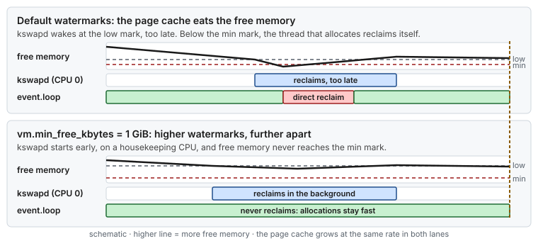

# Use case 17 — Memory pressure on a latency host

> Guides: [06 Kernel sysctls](../../guides/06-kernel-sysctl-tuning.md), [03 Huge pages](../../guides/03-huge-pages-configuration.md) · Script: [`06-kernel-sysctl`](../../scripts/06-kernel-sysctl) · Concepts: [Huge pages](../../concepts/huge-pages.md), [memory reclaim](../../concepts/memory-reclaim.md), [swap and OOM](../../concepts/swap-and-oom.md), [cgroups §3 PSI](../../concepts/cgroups.md#psi-pressure-stall-information)

## At a glance

- **Situation:** the host is clean for a day or two after a reboot. Then millisecond stalls appear in `event.loop`, a few per hour, each one when the application opens a new journal file.
- **Cause:** the page cache grows until free memory sits just above the kernel's watermarks. When a burst of allocations pushes it below the min watermark, the thread that allocates does [direct reclaim](../../GLOSSARY.md#direct-reclaim) itself, inline, for milliseconds.
- **Fix:** raise `vm.min_free_kbytes`, so that the watermarks sit higher and further apart and [kswapd](../../GLOSSARY.md#kswapd) reclaims early on a housekeeping CPU. Lower the dirty ratios so that writeback starts early too.

**Time:** ~30 min, no reboot · **You need:** root, a few days of uptime to see it.

> [!NOTE]
> **Illustrative.** The millisecond cost of direct reclaim is the order of magnitude given in [Concept: huge pages](../../concepts/huge-pages.md) and [Guide 06 §8](../../guides/06-kernel-sysctl-tuning.md#8-virtual-memory). The watermark sizes depend on the host's memory: read yours from `/proc/zoneinfo`.

## 1. Situation

The Java heap lives in pre-touched huge pages ([use case 5](05-page-faults-on-the-hot-path.md)), so the heap itself never allocates on the hot path. The application also writes a journal: every hour it maps a new 1 GiB file and `event.loop` appends to it. Each new page of that file is a page-cache page, allocated at the moment `event.loop` first writes it.

Right after a reboot, memory is mostly free and those allocations are cheap. Linux keeps file pages cached as long as there is room, so after a day or two the page cache has taken almost everything that is not huge pages, and free memory hovers just above the watermarks. From then on, the hourly burst of new journal pages sometimes pushes free memory below the min watermark, and the allocation has to reclaim memory before it can return.



*The watermarks decide who pays for reclaim. Between low and min, `kswapd` pays, on a housekeeping CPU. Below min, the thread that asked for memory pays, on its own CPU.*

## 2. Diagnose

Three questions: is free memory at the watermarks, did threads reclaim inline, and did anything wait for memory?


*First compare each zone's free pages with its watermarks, then count inline reclaim, then confirm that tasks waited.*

```bash
# 1. Where the memory is (Guide 03 §8 reads the same file for huge pages)
grep -E '^(MemTotal|MemFree|Cached|Dirty|HugePages_Total):' /proc/meminfo
# before, after two days: MemFree a few hundred MiB, Cached tens of GiB

# 2. Free pages against the watermarks, per Normal zone, in 4 KiB pages (Guide 06 §10)
awk '/^Node/ {zone = $0} zone ~ /Normal/ && /pages free/ {free = $3} zone ~ /Normal/ && /^ +min / {min = $2} zone ~ /Normal/ && /^ +low / {print zone ": free", free, "min", min, "low", $2}' /proc/zoneinfo
# before: in at least one zone, free sits just above min, with min and low a few tens of MiB apart
# the min mark is enforced per zone: MemFree, a total over every zone, can hide a zone at min

# 3. Inline reclaim: sample before and after a stall (Guide 06 §10)
grep -E '^(allocstall|pgscan_direct|pgscan_kswapd)' /proc/vmstat
# before: allocstall_normal and pgscan_direct rise across the stall; after: only pgscan_kswapd moves

# 4. Did anything wait for memory? (Concept: cgroups, PSI)
cat /proc/pressure/memory
# before: "some" avg10 above 0 around the stalls

# 5. The current settings (Guide 06 §8)
sysctl vm.min_free_kbytes vm.dirty_ratio vm.dirty_background_ratio
```

If `allocstall` does not move while the stalls happen, the stall is not reclaim. The next suspect for a writer is dirty throttling: when dirty pages reach `vm.dirty_ratio`, the writing thread is throttled synchronously ([Guide 06 §8](../../guides/06-kernel-sysctl-tuning.md#8-virtual-memory)). The same change below covers it.

## 3. Change

The Guide 06 profile sets all three values:

| Key | Guide 06 value | Effect here |
|---|---|---|
| `vm.min_free_kbytes` | `1048576` (1 GiB) | Raises the min watermark to 1 GiB, and low and high with it. `kswapd` starts much earlier, and a burst has a large cushion before it reaches min. |
| `vm.dirty_background_ratio` | `3` | Background writeback starts once 3 % of dirtyable memory is dirty. On a host with hundreds of GiB that is more than one 1 GiB rotation, so it does not flush every rotation: it stops dirty pages from piling up over many of them. Pages older than `vm.dirty_expire_centisecs` (30 s by default) are written back anyway. |
| `vm.dirty_ratio` | `10` | The level where a writer is throttled synchronously. With early background writeback, the journal rarely gets there. |

```bash
scripts/06-kernel-sysctl --dry-run | grep -E 'min_free|dirty'
sudo scripts/06-kernel-sysctl --apply          # takes effect at once, and at every boot
```

> [!WARNING]
> `vm.min_free_kbytes` is memory the kernel keeps free, so 1 GiB is 1 GiB less for everything else. It fits a host with hundreds of GiB. On a small host it can cause OOM kills: scale it down ([Guide 06 §11](../../guides/06-kernel-sysctl-tuning.md#11-troubleshooting)). Count the huge-page pool too: pages in the pool are never reclaimed, so the cushion has to come out of what is left ([Guide 03 §3](../../guides/03-huge-pages-configuration.md#3-sizing-the-pool)).

Two more changes remove the allocation from the hot path altogether. They are application design, **not tested** here: map and pre-fault the next journal file on a housekeeping thread before `event.loop` switches to it, and keep the journal on a local filesystem mounted `noatime` ([Guide 07 §4](../../guides/07-os-hygiene.md#4-noatime)).

## 4. Result

Illustrative:

| | Before | After |
|---|---|---|
| min watermark | tens of MiB | 1 GiB |
| Who reclaims when the journal rotates | `event.loop`, inline, for milliseconds | `kswapd`, in the background, on a housekeeping CPU |
| `allocstall_*` during a rotation | rises | flat |
| PSI memory `some` | above 0 around the stalls | 0 |
| Behavior after days of uptime | stalls appear | the same as after a reboot |

## 5. Verify and roll back

- [ ] `sysctl vm.min_free_kbytes vm.dirty_ratio vm.dirty_background_ratio` prints `1048576`, `10` and `3`
- [ ] The watermarks in `/proc/zoneinfo` rose, and after days of uptime the free pages of every Normal zone stay above that zone's min (step 2)
- [ ] `allocstall_*` stays flat across a journal rotation, and `/proc/pressure/memory` shows `some avg10=0.00`
- [ ] `scripts/verify-tuning` shows PASS for Guide 06
- [ ] Roll back: `sudo scripts/06-kernel-sysctl --rollback`, then reboot ([Guide 06 §12](../../guides/06-kernel-sysctl-tuning.md#12-rollback)). Removing the file does not reset the running values, and `sudo sysctl --system` does not reset keys no remaining file sets. To roll back without a reboot, set the values you recorded in step 5 by hand: `sudo sysctl -w vm.min_free_kbytes=<before> vm.dirty_ratio=<before> vm.dirty_background_ratio=<before>`

## 6. Key takeaways

- **Free memory always runs out on a busy host.** The page cache takes whatever is free, so what matters is who reclaims it, and when.
- **Below the min watermark, your thread pays.** Direct reclaim runs inline, on the CPU that asked for memory.
- **Test after days, not minutes.** A host fresh from a reboot has free memory to spare and hides this problem.
