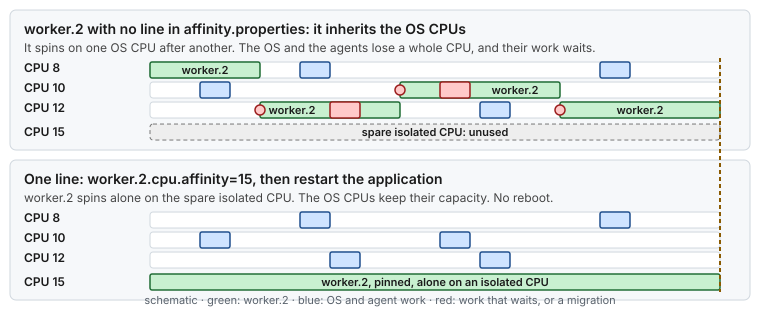
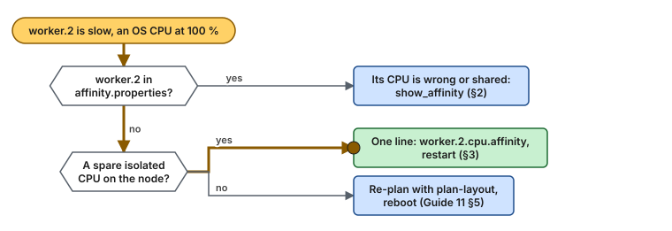

# Use case 18 — Adding a worker without re-planning

> Guides: [11 Day-2 operations](../../guides/11-day2-operations.md), [02 CPU isolation](../../guides/02-cpu-core-isolation.md) · Scripts: [`02-cpu-isolation`](../../scripts/02-cpu-isolation), [`plan-layout`](../../scripts/plan-layout)

## At a glance

- **Situation:** a release adds a third worker thread, `worker.2`. After the deploy, SSH is sluggish, the agents fall behind, and `worker.2` itself is slower than `worker.0` and `worker.1`.
- **Cause:** nobody added `worker.2` to the affinity file. The new thread inherits the process's CPU mask, which is the OS CPUs, and it busy-spins there, moving from one OS CPU to another.
- **Fix:** give it a spare isolated CPU with one line in `affinity.properties` and restart the application. No reboot, because the layout left spares. When the spares run out, re-plan with `plan-layout` and plan a reboot.

**Time:** ~20 min, no reboot · **You need:** the affinity file, a restart window for the application.

> [!NOTE]
> **Illustrative.** The host is the reference host of [`lowlat.conf.example`](../../scripts/lowlat.conf.example): 2 × 16 cores, Hyper-Threading off, isolated CPUs 3 to 31 (odd). The effects below follow from one spinning thread taking one OS CPU. They are not a measurement.

## 1. Situation

The reference layout ([Guide 02 §6.1](../../guides/02-cpu-core-isolation.md#61-describe-the-mapping-in-configuration-not-in-code)) pins six roles to CPUs 3 to 13 and keeps CPUs 15 to 31 as isolated spares, following the headroom rule ([Guide 02 §3](../../guides/02-cpu-core-isolation.md#3-designing-the-cpu-layout), rule 5). The new release adds `worker.2`, a busy-spinning thread like the other two workers, and the affinity file did not change.

Unpinned threads stay on the OS CPUs, as they should. For a logging or admin thread that is the right place. For a spinner it is not: it takes a whole OS CPU, and the scheduler moves it whenever another task wants that CPU.



*The spare isolated CPU sits unused while the new spinner takes CPUs from the operating system. One line in the affinity file moves it.*

## 2. Diagnose

Three questions: where does the new thread run, what does it cost the OS CPUs, and which isolated CPUs are free?



*Find where the thread runs, then whether a spare isolated CPU is left: one line of configuration, or a re-plan and a reboot.*

```bash
# 1. Allowed and last CPU of every thread (Guide 02 §6.3, Guide 11 §1)
. scripts/02-cpu-isolation
show_affinity "$(pgrep -f my-app)"
# worker.0 and worker.1: one isolated CPU each
# worker.2: allowed 0,1,2,4,...,30 (the OS CPUs), last CPU different at every run

# 2. The cost on the OS CPUs (Guide 02 §9)
mpstat -P ALL 1
# one OS CPU at ~100 % %usr, a different one every few seconds

# 3. The roles in the affinity file, and the isolated CPUs
grep 'cpu.affinity' affinity.properties          # no worker.2 line
cat /sys/devices/system/cpu/isolated              # 3,5,7,...,31
ps -eLo psr,pid,tid,comm --sort=psr | awk '$1 == 15'
# only sleeping per-CPU kernel threads: CPU 15 is a spare
```

With Hyper-Threading on, pick a spare **physical core**, not a spare CPU: `lscpu -b -e=CPU,NODE,SOCKET,CORE` shows which CPUs share a core ([Guide 11 §5](../../guides/11-day2-operations.md#5-adding-a-thread-without-re-planning), and [use case 12](12-the-sibling-that-shares-your-core.md) for what happens otherwise).

## 3. Change

Follow [Guide 11 §5](../../guides/11-day2-operations.md#5-adding-a-thread-without-re-planning): check the spare, add the role, restart.

```bash
# 1. Is CPU 15 quiet before anything runs on it? (Guide 09)
sudo rtla osnoise top -c 15 -d 30s
```

```properties
# 2. affinity.properties: one new line
worker.2.cpu.affinity=15
```

```bash
# 3. Restart the application, then check the placement
sudo systemctl restart my-app
show_affinity "$(pgrep -f my-app)"      # worker.2: allowed 15, last CPU 15
```

Nothing else changes: `isolcpus`, `nohz_full` and `rcu_nocbs` already cover CPU 15, and no script needs to run. Update the layout record ([Guide 02 §3](../../guides/02-cpu-core-isolation.md#3-designing-the-cpu-layout)) so that the next person knows CPU 15 is taken.

**When the spares are gone**, check first whether there is anything left to re-plan. On this host there is not. With a second node to run the OS, `plan-layout` already isolates every core of the critical node except the housekeeping core, so node 1 holds at most 15 critical threads. Asking for more fails:

```bash
scripts/plan-layout --nic-node 1 --threads 16
# NUMA node 1 has 15 core(s) besides the housekeeping core, and 18 are needed (16 threads + 2 spare)
```

The options are then outside the layout: take a thread off the isolated set (does it really need to spin?), run the last threads without spares (`--spares 0`, up to 15 threads here), or move to a host with more cores on the critical NIC's node.

On a host whose layout does leave free cores on the node (a single-node host, where only `--threads` plus `--spares` cores are isolated), re-plan and apply every guide whose CPU lists change, then reboot once. `isolcpus` changes only at boot, and Guide 02 writes systemd's `CPUAffinity` and the workqueue masks from the same lists:

```bash
scripts/plan-layout --nic-node 0 --threads <new total>   # propose a layout with room for the new threads
sudoedit /etc/lowlat/lowlat.conf                           # paste it
sudo scripts/01-grub-bootloader --apply                    # isolcpus, nohz_full, rcu_nocbs
sudo scripts/02-cpu-isolation --apply                      # CPUAffinity, workqueue mask
# also re-apply 04 and 05 if the IRQ CPUs or the slice CPUs changed
sudo systemctl reboot                                      # plan it: this is the price of no headroom
```

> [!TIP]
> Make the affinity file part of the release review. [Guide 11 §1](../../guides/11-day2-operations.md#1-why-tuning-drifts) lists an application release as a drift event, with `show_affinity` as the check. A new spinning thread without a line is the most common case.

## 4. Result

Illustrative:

| | Before | After |
|---|---|---|
| `worker.2` placement | any OS CPU, moving | CPU 15, alone |
| OS CPUs available to the OS and agents | one fewer, and a different one each time | all of them |
| `worker.2` latency | migrations and shared CPUs, like an unpinned thread ([use case 2](02-critical-and-non-critical.md)) | the same as `worker.0` and `worker.1` |
| Reboot | none needed | none needed |
| Spare isolated CPUs left | 9 (15 to 31) | 8 (17 to 31) |

## 5. Verify and roll back

- [ ] `show_affinity` shows `worker.2` allowed on CPU 15 only, and last on CPU 15
- [ ] `mpstat -P ALL 1` shows no OS CPU pinned at 100 % by the application
- [ ] `ps -eLo psr,pid,tid,comm --sort=psr | awk '$1 == 15'` shows `worker.2` and sleeping kernel threads only
- [ ] `scripts/verify-tuning` shows PASS for Guide 02 (the layout did not change)
- [ ] Roll back: remove the `worker.2` line and restart the application. The thread returns to the OS CPUs

## 6. Key takeaways

- **A new spinning thread needs a line in the affinity file.** Without it, it spins on the OS CPUs and takes one away from the operating system.
- **Spares make it a restart, not a reboot.** The headroom rule is what keeps this change small.
- **Check placement after every release.** `show_affinity` of the running process answers it in seconds.
