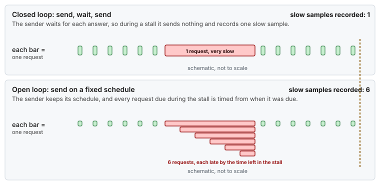
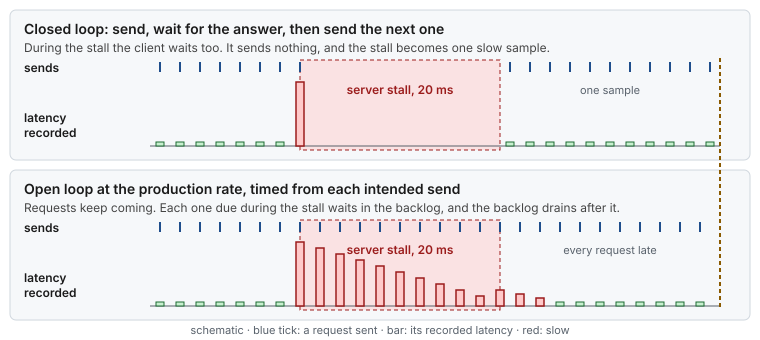
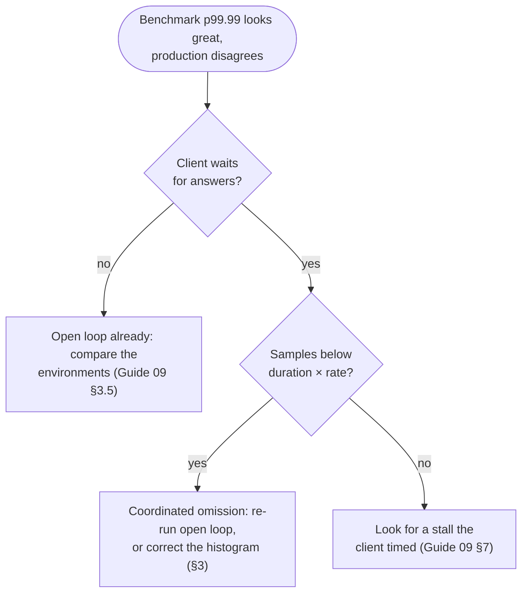

# Use case 19 — The benchmark that lied

> Guides: [09 Measuring latency](../../guides/09-measuring-latency.md) · Script: [`09-measure-latency`](../../scripts/09-measure-latency) · Concept: [tail latency](../../concepts/tail-latency.md#6-service-time-and-response-time) · Example: [Java latency probe](../hugepages-java-example.md)

## At a glance

- **Situation:** the load test of a release reports a clean p99.9 of a few microseconds. In production, the same release shows a p99.9 of about 12 ms.
- **Cause:** [coordinated omission](../../GLOSSARY.md#coordinated-omission). The load test is closed-loop: it waits for each answer before it sends the next request, so during a stall it sends nothing, and a 20 ms stall becomes one slow sample. Production traffic keeps arriving at its own rate, and every request that arrives during the stall is late.
- **Fix:** measure with open-loop load at the production rate, and time each request from its **intended** send time. Where the client cannot change, correct the histogram with the expected interval.

**Time:** ~1 h to change the load generator, then one run · **You need:** the load generator's source or options, [HdrHistogram](../../GLOSSARY.md#hdrhistogram) in the application.

> [!NOTE]
> **Illustrative.** The rate (100,000 requests per second), the stall (20 ms every 10 s) and the service time (2 µs) are invented to make the arithmetic easy. The mechanism is the one in [Guide 09 §3.3](../../guides/09-measuring-latency.md#33-coordinated-omission).

## 1. Situation

The release is load-tested before it ships. The load generator runs one connection that sends a request, waits for the answer, records the time, and sends the next one. After ten minutes it reports p50 = 2 µs, p99.9 = 4 µs and max = 20 ms. The team files the max as a one-off.

In production, requests come from upstream at about 100,000 per second, whatever the host is doing. The production histogram, timed from when each request was sent, shows p99.9 = 12 ms. Nothing in the release changed between the two runs. The host has a 20 ms stall every 10 s in both.



*The same stall, two senders. The closed loop stops sending while it waits, so it never sees the requests that would have queued.*

What the users see during the stall is a backlog. The first request waits for the whole stall, the next one a little less, and when the stall ends, the queue takes a moment to drain:



*One stall, one slow sample in the closed loop. One stall, a sawtooth of slow samples in the open loop, and those are the ones the users get.*

## 2. Diagnose

Three questions: does the client wait before it sends, how many samples does it lose, and what do the numbers become when it stops waiting?



*Check whether the client waits, count the samples it should have taken, and measure again without the gap.*

1. **Read the load generator.** If it sends the next request only after the answer of the previous one, it is closed-loop. A ping-pong benchmark, such as the [Java probe](../hugepages-java-example.md), is closed-loop on purpose: it measures the host's noise, not user traffic ([Guide 09 §3.3](../../guides/09-measuring-latency.md#33-coordinated-omission)).
2. **Count the samples.** An open-loop run of 10 minutes at 100,000 per second records 60 million samples, the same number every time. A closed-loop run records whatever the answers allowed, and loses the ones a stall would have delayed.
3. **Look at the max against the percentiles.** In a closed-loop histogram a stall shows up as a single sample: a large max with a clean p99.99. In an open-loop one, the same stall produces thousands of slow samples, and they move p99.9.

The arithmetic for one 10 s window, with the numbers above:

| | Closed loop | Open loop at 100,000/s |
|---|---|---|
| Requests sent in 10 s | ~4.99 million, back to back | 1 million, on schedule |
| Requests delayed by the 20 ms stall | 1 (the client stops) | ~2,500: 2,000 due during the stall, and ~500 more while the backlog drains |
| Their latency | 20 ms, once | from 20 ms down to ~0, falling |
| Share of slow samples | 0.00002 % | 0.25 % |
| p99.9 | ~4 µs | ~12 ms: the 1,000th slowest of the ~2,500 |

The drain is the part that is easy to forget. When the stall ends, the server works through the backlog at one request per 2 µs while new ones keep arriving every 10 µs, so it gains only 8 µs per request. The 2,000 waiting requests take about 5 ms to clear, and the ~500 that arrive meanwhile are late too. Request *n* of the backlog waits about 20 ms − *n* × 8 µs, so the 1,000th slowest waits about 12 ms.

## 3. Change

Change the measurement, not the host. Two ways, in order of preference ([Guide 09 §3.3](../../guides/09-measuring-latency.md#33-coordinated-omission)):

**A. Open-loop load, timed from the intended send time.** Send on a fixed schedule, whether or not answers have come back, and carry the intended send time in the request:

```java
// Open-loop sender: 100,000 requests per second, one every 10 µs.
final long intervalNs = 10_000L;
long intended = System.nanoTime();
while (running) {
    intended += intervalNs;
    while (System.nanoTime() < intended) {
        Thread.onSpinWait();
    }
    send(intended);                 // the request carries its intended send time
}

// On each answer: latency from the intended send time, not from the actual one.
histogram.recordValue(System.nanoTime() - answer.intendedSendTime());
```

If the sender itself falls behind, it still stamps the intended time, so its own delay shows up in the numbers instead of hiding.

**B. Pace the closed loop, then correct it.** When the client must keep waiting for each answer, at least pace it at the production rate: one request per 10 µs slot, and after an answer, wait for the next slot instead of sending at once. Then tell HdrHistogram the interval the requests should have had, so it back-fills the samples a long answer would have delayed:

```java
histogram.recordValueWithExpectedInterval(latencyNs, 10_000L);   // expected interval: 10 µs
```

Both halves matter. The back-to-back client of §1 records ~5 million fast samples per 10 s, and the correction adds only the ~2,000 that the stall delayed, so the slow share stays near 0.04 % and p99.9 stays clean. Paced at 100,000 per second, the fast samples drop to ~1 million and the corrected share approaches the open loop's. The correction assumes a steady rate and does not model the drain, so it is an estimate: option A is the measurement.

Then run the protocol again ([Guide 09 §5](../../guides/09-measuring-latency.md#5-a-measurement-protocol)): the same rate, the same duration, a host bundle first (`sudo scripts/09-measure-latency --run`), and the application histogram.

> [!IMPORTANT]
> Once the benchmark tells the truth, the 20 ms stall is still there, and it is now the finding. Find its cause with the patterns in [Guide 09 §7](../../guides/09-measuring-latency.md#7-reading-the-results): a stall once every few seconds points at [RT throttling](14-the-spinner-that-stalled-the-kernel.md), [direct reclaim](17-memory-pressure-on-a-latency-host.md), a [console write](16-the-log-line-that-cost-five-milliseconds.md) or a GC pause.

## 4. Result

Illustrative:

| | Closed-loop load test | Open-loop load test | Production |
|---|---|---|---|
| p50 | 2 µs | 2 µs | 2 µs |
| p99.9 | 4 µs | ~12 ms | ~12 ms |
| max | 20 ms | 20 ms | 20 ms |
| Slow samples per stall | 1 | ~2,500 | ~2,500 |
| Agrees with production | no | yes | — |

## 5. Verify and roll back

- [ ] Two open-loop runs of the same length record the same number of samples (duration × rate)
- [ ] The load test's p99.9 and p99.99 match production's within the run-to-run spread
- [ ] A known pause shows up as at least rate × pause slow samples, not as one: stopping the server for one second (`kill -STOP <pid>; sleep 1; kill -CONT <pid>`) adds about 100,000 slow samples at 100,000 per second, plus ~25,000 more while the backlog drains
- [ ] The results table ([Guide 09 §5](../../guides/09-measuring-latency.md#5-a-measurement-protocol)) says which load model each row used
- [ ] Roll back: nothing on the host changed. Keep the closed-loop probe for host noise, next to the open-loop test for user latency

## 6. Key takeaways

- **A client that waits cannot see a queue.** During a stall it stops sending, so it records one slow sample for thousands of slow requests.
- **Time from the intended send.** A request that should have left at 10:00:00.000010 is late from that moment, whatever the sender was doing.
- **Keep both tools, for different questions.** A closed-loop ping-pong measures the host's noise. Only open-loop load at the real rate measures what users get.
