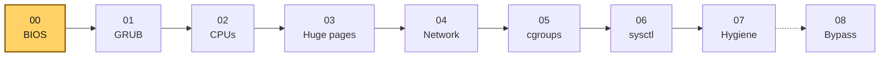
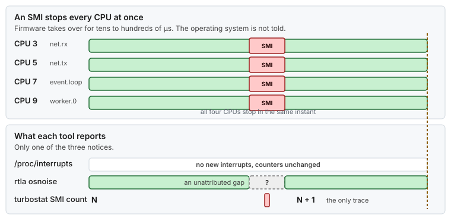
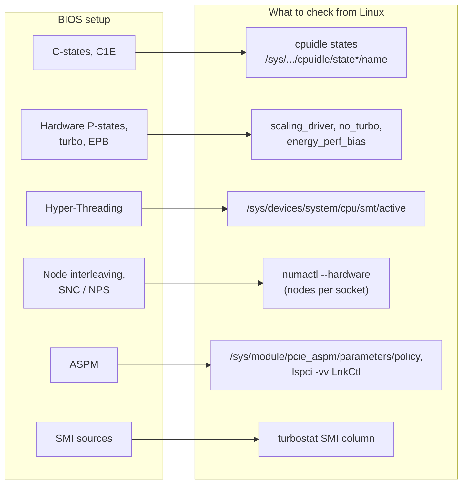
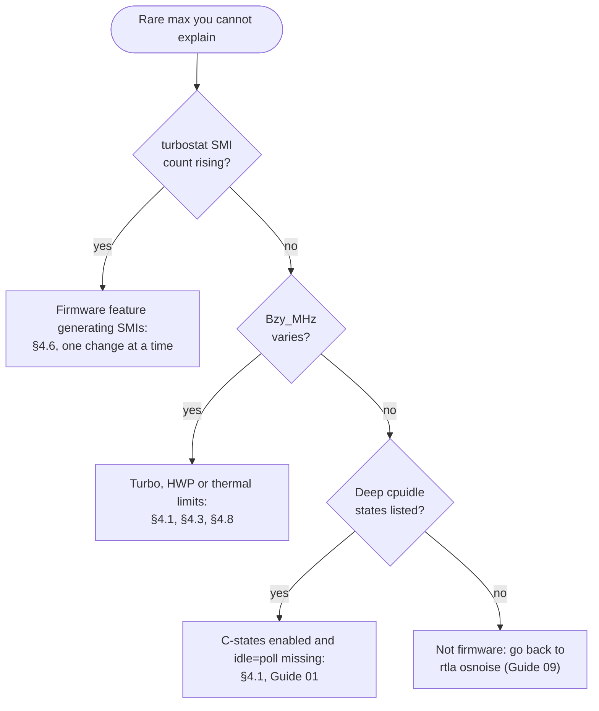

# Guide 00 — BIOS and Firmware

> **Script:** [`scripts/00-bios-firmware`](../scripts/00-bios-firmware) · **Concepts:** [cpu-isolation §4](../concepts/cpu-isolation.md#4-sources-of-noise-on-a-cpu-and-what-removes-each), [bootloader](../concepts/bootloader.md) · **Next:** [Guide 01 — Kernel command line](01-grub-bootloader-tuning.md) · **Measure with:** [Guide 09](09-measuring-latency.md) · **Terms:** [Glossary](../GLOSSARY.md)

| | |
|---|---|
| **Risk level** | **3 / 5**. A wrong BIOS setting rarely breaks the host, but it changes every CPU at once. Some settings (SNC/NPS, memory mode) change the NUMA layout that `lowlat.conf` describes. |
| **Reboot required** | Yes, for every BIOS change. The script's PCIe ASPM policy applies immediately. |
| **Applies to** | Bare metal only. In a VM the firmware belongs to the hypervisor owner (§10). |
| **Time** | 30–60 min per server model the first time (the setup menu plus one reboot). Then minutes per host with a saved profile. |

## At a glance

- **What:** set the firmware so the CPUs run at a steady frequency, never sleep deeply, never share a core, and are not interrupted by firmware (SMIs). Then check the result from Linux.
- **Why:** everything in Guides 01–08 runs on top of the firmware. A deep package C-state, a turbo transition or an SMI costs tens to hundreds of µs, and no kernel setting can remove it.
- **Cost:** more power and heat, fewer logical CPUs (Hyper-Threading off), and some corrected-error reporting moved to the BMC.

**Time:** ~1 h per server model + 1 reboot · **Do this if:** bare metal, before Guide 01 · **Skip if:** it's a VM. Ask the hypervisor owner for the equivalent (§10).



*Guide 00 comes before everything else. The firmware decides what the kernel can even ask for.*

---

## 1. Why the firmware matters

The firmware (UEFI/BIOS, plus the BMC that manages it) decides several things before Linux starts:

- how deep the CPUs may sleep, and whether the OS or the firmware chooses the idle state;
- whether the CPU picks its own frequency (hardware P-states, turbo) or the OS does;
- whether each core shows up as one or two logical CPUs (Hyper-Threading);
- how memory is presented: one NUMA node per socket, several per socket (SNC/NPS), or interleaved into one;
- which events the firmware handles itself, through **System Management Interrupts (SMIs)**.

SMIs are the worst kind of noise. An SMI stops **every** CPU and runs firmware code in System Management Mode, invisible to the OS. `rtla osnoise` sees only a gap it cannot attribute, and `/proc/interrupts` shows nothing. Only the SMI counter (`turbostat`) and the hwlat tracer reveal them.



*An SMI stops every CPU at once, and only the SMI counter records it. That is why this guide sets firmware options and Guide 09 measures the count.*

## 2. When to apply

| Situation | Apply? |
|---|---|
| New bare-metal host or server model for latency-critical work | **Yes**, before Guide 01 |
| After a BIOS or BMC firmware update | **Yes**: re-check, because updates can reset settings to defaults |
| Host shared by several applications | The power settings, yes. Hyper-Threading off is a capacity decision for the host owner. |
| VM | **No**. See §10. |

## 3. Before you start

- Make sure the **out-of-band console** (iLO/iDRAC/IPMI) works. Every change here needs a reboot through the setup menu.
- Record the current settings. Most vendors can export the BIOS configuration from the BMC, and that file is your rollback.
- Note the firmware versions (BIOS, BMC, NIC). `scripts/00-bios-firmware --verify` prints the BIOS version.
- Take a baseline ([Guide 09](09-measuring-latency.md)), including the SMI count: `sudo turbostat --quiet --interval 10 --num_iterations 1 --show SMI`.

## 4. The settings

Menu names differ between vendors and generations. The table describes each setting by what it does, with common names in the second column. Look for the same idea in your vendor's documentation.

### 4.1 Power and performance profile

| Setting | Common names | Recommended | Why |
|---|---|---|---|
| System profile | "System Profile", "Workload Profile", "Power Regulator", "Power Policy" | **Maximum performance** or a **latency-focused** profile | The vendor presets set most of the items below in one step. Start from one, then check each item. |
| C-states | "C-States", "Processor C6 Report", "Package C State", "C1E", "Enhanced Halt State" | **Disable C1E and every C-state deeper than C1**, or let the OS control them (§4.2) | Waking from C6 costs up to ~100 µs, and a package C-state adds more. C1E lowers the voltage even in C1. |
| Hardware P-states | "Hardware P-States", "HWP", "Speed Shift", "Collaborative Power Control", "Power Management: OS Control" | **OS-controlled** (native or legacy mode) | With HWP the CPU changes its own frequency, which shows up as jitter. The OS then pins the frequency (Guide 01 `intel_pstate=disable` + tuned `performance`). |
| Energy Performance Bias | "Energy Efficient Turbo", "Energy Performance BIAS", "EPB" | **Performance** (OS value `0`) | EPB tells the CPU how much to favor power over speed. |
| Uncore frequency | "Uncore Frequency Scaling", "Uncore Frequency", "Mesh/LLC frequency" | **Maximum** (fixed) | The uncore runs the L3 cache and the memory path. When it scales down, every L3 hit and memory access gets slower. |
| Turbo | "Turbo Boost", "Core Performance Boost", "Turbo Mode" | **Measure both** (§4.3) | Turbo raises the frequency, but it varies with temperature and with how many cores are busy. |

### 4.2 Who controls the idle states

There are two ways to keep the CPUs out of deep sleep:

- **In the BIOS**: disable the deep C-states. Nothing can re-enable them from the OS.
- **In the OS**: leave them enabled in the BIOS, and let `idle=poll` and the C-state caps (Guide 01), plus tuned's PM QoS (Guide 07), keep the CPUs from entering them.

Do both on dedicated hosts. The BIOS setting is the backstop if a kernel argument is ever lost after a kernel update.

### 4.3 Turbo: a measured decision

> [!NOTE]
> **Not proven in production.** The trade-off below is the common reasoning. Decide it on your hardware by measuring p99.9 both ways ([Guide 09](09-measuring-latency.md)).

| | Turbo on | Turbo off |
|---|---|---|
| p50 | lower (higher clock) | higher |
| Tail | frequency transitions and thermal limits add jitter | steady |
| With `idle=poll` | every core is busy, so all-core turbo is lower than single-core turbo, and heat limits it further | no effect |

Many latency-critical hosts run with turbo **off**, or with the frequency capped at a level every core can hold. Measure p99.9 both ways, under your real load, before choosing.

### 4.4 Hyper-Threading

| Setting | Common names | Recommended | Why |
|---|---|---|---|
| Logical processors | "Hyper-Threading", "Logical Processor", "SMT Control" | **Disabled** | Two threads on one core share L1/L2, the TLBs and the execution ports. A busy sibling slows your thread, and with `idle=poll` the sibling is always busy. |

If Hyper-Threading must stay on, isolate **both** siblings of each critical core and leave one of them idle ([Guide 02 §3](02-cpu-core-isolation.md#3-designing-the-cpu-layout)).

### 4.5 Memory and NUMA

| Setting | Common names | Recommended | Why |
|---|---|---|---|
| NUMA | "Node Interleaving", "NUMA", "Memory Interleaving" | **NUMA on** (node interleaving **off**) | With interleaving, every other cache line comes from the remote socket. The OS can no longer keep a thread and its memory together. |
| Sub-NUMA clustering | "SNC", "Sub-NUMA Clustering", "NPS" (AMD: NUMA nodes per socket), "Cluster on Die" | **Off** (one node per socket) unless you measured a gain | SNC halves the distance to local memory, but it doubles the number of nodes to plan for, and a thread on the wrong half pays more. |
| Memory speed | "Memory Frequency", "Memory Operating Mode" | **Maximum performance**, not "power saving" or "balanced" | Lower speed means higher latency on every miss. |
| Patrol scrub | "Memory Patrol Scrub" | Vendor default, or a slower scrub rate | Scrubbing prevents uncorrectable errors. Do not disable it on production hosts. |

> [!IMPORTANT]
> Changing NUMA interleaving or SNC/NPS changes the node numbers and the CPU-to-node map. Update `ISOLATED_CPUS`, `OS_CPUS`, `HUGEPAGES_PER_NODE` and `NICS` in `lowlat.conf` afterwards.

### 4.6 System Management Interrupts

SMIs come from firmware features, and which features generate them depends on the vendor. Typical sources:

| Feature | Common names | Recommended |
|---|---|---|
| Firmware-first error handling | "Memory Error Reporting: Firmware First", "eMCA", "Correctable Error Threshold" | OS-first, or a high threshold, with the errors collected by the BMC |
| Power and utilization monitoring | "Processor Power and Utilization Monitoring", "Power Monitoring" | **Disabled** |
| Legacy USB emulation | "Legacy USB Support", "USB Emulation" | **Disabled** on servers without a local keyboard |
| Dynamic power capping | "Power Capping", "Dynamic Power Capping" | **Disabled** |

> [!NOTE]
> **Not proven in production.** Which settings remove SMIs differs between vendors and firmware versions. Count SMIs with `turbostat` before and after each change, and keep only the changes that lower the count.

### 4.7 PCIe and devices

| Setting | Common names | Recommended | Why |
|---|---|---|---|
| PCIe power management | "ASPM", "Link Power Management", "PCIe Power Saving" | **Disabled** | A link in L0s or L1 takes microseconds to wake up, on every packet after a quiet period. The script also sets the kernel's ASPM policy to `performance` (§6). |
| Slot placement | the server's PCIe slot map | Critical NIC in a slot wired to the socket that runs the critical threads | No setting compensates for a card on the wrong socket ([network segmentation §2](../examples/network-segmentation-example.md#2-discover-the-hardware)) |
| VT-d / IOMMU | "Intel VT-d", "AMD IOMMU", "Virtualization Technology for Directed I/O" | **On** if you use DPDK/VFIO or SR-IOV ([Guide 08 §4](08-kernel-bypass.md#4-prerequisites)). Otherwise it's your choice, see [Guide 01 §5.6](01-grub-bootloader-tuning.md#56-iommu-and-cpu-vulnerability-mitigations-security-sensitive). | VFIO needs it |
| SR-IOV | "SR-IOV Global Enable" | On only if you pass VFs to VMs | |
| x2APIC | "x2APIC Mode" | **On** (the default on current servers) | Needed for more than 255 CPUs, and cheaper interrupt delivery |

### 4.8 Cooling

With `idle=poll`, every CPU runs at 100 % all the time. Set the fan profile to **maximum cooling**, or a performance fan curve. Otherwise the CPUs reach thermal limits and lower their frequency, which is exactly the variation this guide tries to remove.

Check it while the host warms up under its real load, from a cold start for 20 to 30 minutes:

```bash
sudo turbostat --quiet --interval 60 --show CPU,Busy%,Bzy_MHz,CoreTmp,PkgTmp
#    one line per CPU every minute; stop with Ctrl-C
#    healthy: Bzy_MHz flat while PkgTmp settles
#    limited: Bzy_MHz steps down while PkgTmp climbs, so the cooling or the power budget sets the clock
```

If the clock steps down, raise the fan profile first. If it still steps down with maximum cooling, the CPU is at a limit the fans do not remove: the package power limit, a current or thermal limit, or a firmware setting. These two columns cannot tell them apart. The BMC's power and thermal event log, and the vendor's documentation of its power limits, usually can. Whatever the limit, taking it out of the latency is the measured decision in §4.3: turbo off, or a clock every core can hold.

## 5. How the settings map to what Linux sees



*Each BIOS setting leaves a trace Linux can read. `00-bios-firmware --verify` checks those traces, so a reset BIOS shows up as a WARN instead of as unexplained jitter.*

## 6. Using the script

```bash
scripts/00-bios-firmware --dry-run
sudo scripts/00-bios-firmware --apply       # PCIe ASPM policy (runtime; re-applied at boot)
sudo scripts/00-bios-firmware --verify      # as root, so that turbostat can count SMIs
```

| Function | What it does | Persistent? |
|---|---|---|
| `set_pcie_aspm_policy` | Writes `BIOS_PCIE_ASPM_POLICY` (default `performance`) to `/sys/module/pcie_aspm/parameters/policy`, and records the previous policy for rollback | No: `lowlat-runtime.service` re-applies it (`--runtime`) |
| `verify_bios_firmware` | SMT off, NUMA exposed per socket, EPB = performance, ASPM policy, plus the facts below | read-only |
| `show_firmware_facts` | Platform and BIOS version, turbo state, cpuidle states, SMIs in one second | read-only |

Everything else in §4 is set in the setup menu or through the BMC. On a fleet, save the finished configuration as a profile through the vendor's BMC tools, and apply that profile to every host of the same model.

`apply-all --apply` runs this script first. `verify-tuning` includes its checks in the "00 BIOS and firmware" section.

## 7. Verification

```bash
scripts/00-bios-firmware --verify
cat /sys/devices/system/cpu/smt/active                          # 0 = Hyper-Threading off
numactl --hardware | head -3                                    # at least one node per socket
cat /sys/devices/system/cpu/cpu0/power/energy_perf_bias         # 0 = performance
grep -s . /sys/devices/system/cpu/cpu0/cpuidle/state*/name      # none with idle=poll (-s: the files are gone); no C6 when disabled in BIOS
grep -s . /sys/devices/system/cpu/cpu0/cpuidle/state*/{latency,usage}   # exit latency in µs and entries since boot, per state
cat /sys/module/pcie_aspm/parameters/policy                     # [performance]
sudo lspci -vv -s <nic-pci-address> | grep -E 'LnkCtl:.*ASPM'   # ASPM Disabled on the NIC's link
sudo turbostat --quiet --interval 10 --num_iterations 1 --show CPU,Busy%,Bzy_MHz,SMI
#    Bzy_MHz steady across runs; SMI 0 (or a small, constant count) over 10 s
```

A host whose SMI count keeps increasing while idle has an SMI source left. Go back to §4.6.

## 8. Troubleshooting



*Look for SMIs first, then frequency changes, then deep idle states. When all three are clean, the noise is not coming from the firmware.*

| Symptom | Cause | Fix |
|---|---|---|
| Settings back to defaults after a firmware update | The update reset the BIOS configuration | Re-apply the saved profile, then run `--verify` |
| `smt/active` is 1 | Hyper-Threading still on | §4.4 |
| Only one NUMA node on a two-socket host | Node interleaving on | §4.5, then update `lowlat.conf` |
| Twice as many NUMA nodes as sockets | SNC/NPS on | §4.5: turn it off, or plan the layout per sub-node |
| `energy_perf_bias` is not 0 | BIOS EPB, or tuned not active | §4.1, and [Guide 07 §5](07-os-hygiene.md#5-tuned-profile) |
| `scaling_driver` is `intel_pstate` with HWP | BIOS hardware P-states in native mode, or `intel_pstate=disable` missing | §4.1, [Guide 01 §5.3](01-grub-bootloader-tuning.md#53-frequency-and-power) |
| ASPM policy write fails | Firmware keeps ASPM control (no `_OSC` grant) | Disable ASPM in the BIOS (§4.7), or boot with `pcie_aspm=off` |
| CPUs throttle under load | Cooling profile or power capping | §4.8, and power capping in §4.6 |

## 9. Rollback

- [ ] Restore the kernel ASPM policy: `sudo scripts/00-bios-firmware --rollback`, then set `BIOS_PCIE_ASPM_POLICY=""` in `lowlat.conf`
- [ ] Restore the BIOS settings from the exported configuration (§3), or load the vendor defaults and re-apply your site baseline
- [ ] Reboot, and check `numactl --hardware` against `lowlat.conf` if the NUMA layout changed

## 10. Bare metal vs VM

| | Bare metal | VM |
|---|---|---|
| BIOS settings in §4 | ✅ | ❌ The guest's firmware is virtual. Ask the hypervisor owner to apply §4 to the **host**. |
| Hyper-Threading | ✅ off | Ask for vCPUs on dedicated physical cores, without a sibling shared with another guest |
| SMI count | ✅ | ❌ Not visible from a guest |
| ASPM policy | ✅ | ❌ Usually not exposed. The script skips it on `virtual_machine`. |

## 11. Key takeaways

- The firmware sets the noise floor. Configure it first, and check it again after every firmware update.
- Keep the CPUs awake and at a steady frequency: no deep C-states, OS-controlled P-states, uncore at maximum, turbo decided by measurement.
- Hyper-Threading off, and NUMA exposed as one node per socket.
- SMIs are invisible to the OS. Count them with `turbostat`, and remove their sources one at a time.
- Save the finished configuration as a profile and apply it to every host of the same model.

## 12. References

- Intel — *Optimizing Computer Applications for Latency* and the processor datasheets (C-states, P-states, EPB, uncore)
- AMD — *Performance tuning guidelines* for EPYC processors (NPS, C-states, determinism slider)
- Red Hat — *Optimizing RHEL for Real Time for low latency operation*: "BIOS parameters" and "Managing SMIs"
- `man 8 turbostat`; hwlat tracer: <https://docs.kernel.org/trace/hwlat_detector.html>
- PCIe ASPM: <https://docs.kernel.org/admin-guide/kernel-parameters.html> (`pcie_aspm`)
- Your server vendor's BIOS reference and low-latency tuning guide
