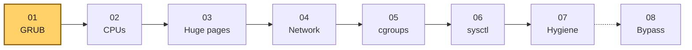
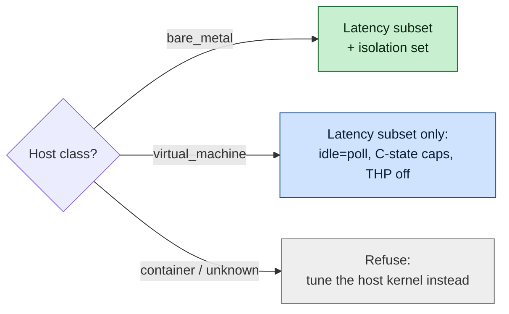
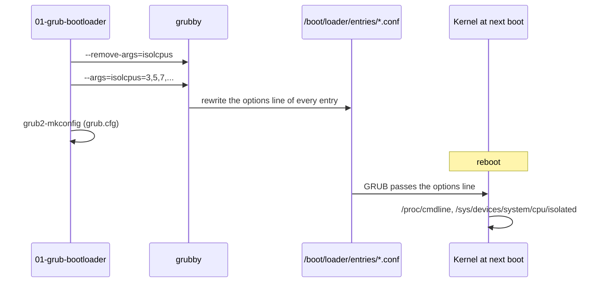
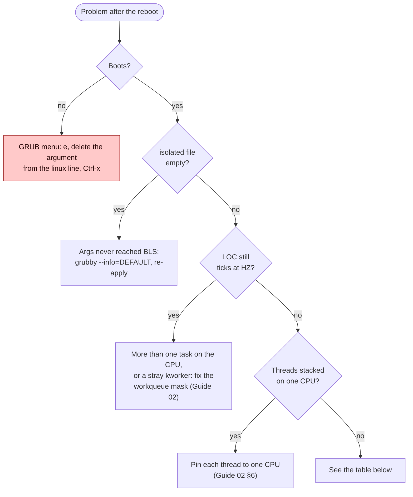

# Guide 01 — Kernel Command Line (GRUB) Tuning

> **Script:** [`scripts/01-grub-bootloader`](../scripts/01-grub-bootloader) · **Concept:** [concepts/bootloader.md](../concepts/bootloader.md) · **Next:** [Guide 02 — CPU core isolation](02-cpu-core-isolation.md)

| | |
|---|---|
| **Risk level** | **4 / 5**. A wrong value can make the host fail to boot, lose network names, or run without CPU vulnerability protections. |
| **Reboot required** | Yes. Nothing in this guide takes effect until the next boot. |
| **Applies to** | Bare metal: full set. Virtual machines: the latency subset only. |
| **Time** | 30 min to prepare, 1 reboot, 15 min to verify. |

## At a glance

- **What:** kernel boot arguments that decide which CPUs the scheduler uses, whether they tick, where RCU work runs, how deep idle CPUs sleep, and which page sizes exist.
- **Why:** several of them (`isolcpus`, `nohz_full`, `rcu_nocbs`) can only be set at boot, and they remove the rare 20–200 µs interruptions that dominate p99.9.
- **Cost:** a reboot, 100 % CPU and higher power from `idle=poll`, and, only if you opt in, weaker CPU vulnerability protection.

**Time:** ~45 min + 1 reboot · **Do this if:** you run a latency-critical application on RHEL 8/9 (full set on bare metal, subset in a VM) · **Skip if:** it's a container, or nobody has profiled the application yet.



*Guide 01 is the first step. Every later guide assumes these boot arguments are in place.*

---

## 1. Why the kernel command line matters

Most of what makes a Linux host "noisy" for a latency-critical thread is decided **before user space starts**:

- which CPUs the scheduler may use,
- whether each CPU gets a periodic timer interrupt (the *tick*),
- where RCU callbacks run,
- how deep the CPU may sleep when it has nothing to do, and how long it takes to wake up,
- which page sizes the kernel will manage.

These decisions are made while the kernel boots, from parameters that the bootloader passes on the kernel command line. Some of them (`isolcpus`, `nohz_full`, `rcu_nocbs`) **cannot be changed at runtime at all**. That is why this is the first guide: every other guide assumes these settings are already in place.

The goal is **not** a lower *average* latency. The goal is to remove the causes of the rare, large outliers: a 20–200 µs timer interrupt, a C-state exit, an RCU callback batch, or a soft-lockup watchdog that lands on the core running your hot path. These are the events that dominate p99.9 and p99.99.

## 2. When to apply and when not to

| Situation | Apply? |
|---|---|
| Dedicated bare-metal host, single latency-critical application that pins its threads | **Yes, full set** |
| Bare-metal host shared by several unrelated applications | Latency subset only. Isolation needs someone to own the isolated cores. |
| Virtual machine (KVM, VMware, Hyper-V, cloud) | **Latency subset only.** vCPUs are threads on the hypervisor, so isolating them inside the guest does not isolate them from the host scheduler. |
| Containers | **No.** The kernel belongs to the host. Tune the host instead. |
| Application has not been profiled, or does not pin its threads | **No isolation.** Isolated CPUs that nobody pins to are wasted, and an unpinned thread will *never* be scheduled there. |
| Multi-tenant host or exposed to untrusted code | **Do not disable CPU mitigations** (§5.6). |

The script enforces this split automatically, using host-class detection (`systemd-detect-virt` → DMI → the CPU `hypervisor` flag):



*Bare metal gets both parameter sets, a VM gets only the latency subset, and a container is refused because the kernel belongs to the host.*

| Capability | `bare_metal` | `virtual_machine` | `container` / `unknown` |
|---|---|---|---|
| Latency subset (`idle`, C-states, THP) | apply | apply | refuse |
| Isolation set (everything else) | apply | skip | refuse |

## 3. Before you start: discover the hardware

You need the CPU topology and the NUMA location of your latency-critical NICs **before** you choose CPU lists.

```bash
# CPU -> NUMA node -> socket -> physical core. Two CPUs with the same CORE are hyper-thread siblings.
lscpu -e=CPU,NODE,SOCKET,CORE,ONLINE

# NUMA nodes, their CPUs and memory
numactl --hardware

# Which NUMA node each NIC is attached to (-1 = no NUMA info, typical in VMs)
for i in /sys/class/net/*/device/numa_node; do echo "$(basename "$(dirname "$(dirname "$i")")"): $(cat "$i")"; done

# Current command line and the arguments stored for every installed kernel
cat /proc/cmdline
grubby --info=ALL | grep -E '^(kernel|args)='
```

Rules for choosing the layout (see [Guide 02 §3](02-cpu-core-isolation.md#3-designing-the-cpu-layout) for the full reasoning):

1. Put the latency-critical threads on the **same NUMA node as the latency-critical NIC**.
2. Keep **at least one CPU on that node** for housekeeping: its NIC interrupts, `rcuo` threads, and the kernel's per-node work.
3. If Hyper-Threading is on, isolate **both siblings** of a physical core and leave one idle. Otherwise the neighbor thread shares your L1/L2 and execution ports. Better still, disable HT in the BIOS.
4. CPU 0 is never isolated. Some interrupts and timers cannot move away from it.

The reference host used throughout this documentation (see [`scripts/lowlat.conf.example`](../scripts/lowlat.conf.example)):

```
2 sockets x 16 cores, HT off, 32 CPUs; even CPUs = node 0, odd CPUs = node 1
Critical NICs on node 1

node 0: 0 2 4 ... 30          -> operating system, agents, non-critical NIC IRQs
node 1: 1                     -> node-1 housekeeping (critical NIC IRQs)
        3 5 7 ... 31          -> ISOLATED, latency-critical threads
```

## 4. How the arguments are applied (RHEL 8 / 9)

RHEL 8 and 9 use **BootLoaderSpec (BLS)** entries in `/boot/loader/entries/*.conf`. The supported tool to edit kernel arguments is `grubby`:

```bash
grubby --update-kernel=ALL --remove-args="isolcpus"            # remove any previous value
grubby --update-kernel=ALL --args="isolcpus=3,5,7,9"           # add the new one
```

Always **remove before adding**. `grubby --args` does not *replace* an existing `name=value`; it adds another one, and then the kernel sees both.



*The script removes and re-adds each argument through `grubby`, which rewrites every BLS entry. Nothing changes until the reboot, when GRUB hands the new line to the kernel.*

`--update-kernel=ALL` updates every installed kernel, and new kernels installed by `dnf` inherit the arguments of the default entry. After editing, the script also regenerates `grub.cfg` (`/boot/grub2/grub.cfg`, or the EFI path on RHEL 8 UEFI hosts), the same way the reference implementation does.

> [!IMPORTANT]
> Editing `GRUB_CMDLINE_LINUX` in `/etc/default/grub` alone is **not enough** on BLS systems. It only affects kernels installed afterwards, or a `grub2-mkconfig` run with `GRUB_ENABLE_BLSCFG=false`. Use `grubby`.

## 5. The parameters, one by one

### 5.1 Latency subset (bare metal **and** VMs)

| Parameter | What the kernel does | Why |
|---|---|---|
| `idle=poll` | Replaces the idle loop with a busy loop. An idle CPU never executes `HLT`/`MWAIT`, so it never enters any C-state. | Waking from C1 costs ~1–2 µs, and from C6 up to ~100 µs. With polling, the wake-up cost is gone. |
| `processor.max_cstate=0` | Caps the ACPI idle driver at its shallowest state. | Belt and braces. If `idle=poll` is ever dropped, the CPU still cannot sleep deeply. |
| `intel_idle.max_cstate=0` | Disables the `intel_idle` driver entirely, so the kernel falls back to `acpi_idle` (capped above). | `intel_idle` ignores BIOS C-state limits and uses deep states directly. |
| `transparent_hugepage=never` | Turns off THP. The kernel will never promote 4 KiB pages to 2 MiB pages, and `khugepaged` has nothing to scan. | THP allocation can trigger **synchronous memory compaction** inside a page fault (ms-scale stalls), and `khugepaged` runs on arbitrary CPUs. Huge pages are still used, but only **explicitly** (see [Guide 03](03-huge-pages-configuration.md)). |

**Costs of `idle=poll`:** every CPU runs at 100 % all the time. Power draw and heat go up, and on some parts the extra heat lowers the turbo headroom. With Hyper-Threading, a polling sibling competes with the busy thread for execution resources, which is another reason to disable HT on these hosts. In a VM, `idle=poll` burns host CPU even when the guest is idle, so agree it with whoever runs the hypervisor.

### 5.2 CPU isolation (bare metal only)

| Parameter | Value (reference host) | What the kernel does |
|---|---|---|
| `isolcpus` | `3,5,…,31` | Removes the CPUs from the scheduler's load-balancing domains. Nothing runs there unless its affinity **explicitly** includes those CPUs. |
| `nohz_full` | `3,5,…,31` | *Adaptive ticks*: when exactly one runnable task is on the CPU, the periodic tick (250–1000 Hz) stops. The remaining time-keeping duty moves to housekeeping CPUs. |
| `rcu_nocbs` | `3,5,…,31` | RCU callbacks for these CPUs are not run in softirq context on the CPU itself. They run in `rcuo*` kernel threads, which the scheduler keeps on housekeeping CPUs. |
| `rcu_nocb_poll` | *(flag)* | The `rcuo*` threads poll for new callbacks, so the isolated CPU does not have to send a wake-up to them. |
| `nohz` | `off` | Disables *idle* dynticks (`CONFIG_NO_HZ_IDLE`). See the note below. |
| `skew_tick` | `1` | Offsets each CPU's tick timer so that the ticks do not all fire at the same instant. This reduces contention on the jiffies/timekeeping locks on large machines. |

> [!WARNING]
> **`rcu_nocbs` must list the isolated CPUs.** It names the CPUs whose callbacks are **moved away**. A common mistake, found in real tuning scripts, is to set `rcu_nocbs` to the *housekeeping* CPUs ("the CPUs that do RCU work"). That does the opposite of what you want: the isolated CPUs keep running their callbacks in softirq, and the housekeeping CPUs get an extra layer of kthreads. On recent kernels `nohz_full` implies `rcu_nocbs` for the same CPUs, but setting it explicitly documents intent and covers older kernels.

> [!NOTE]
> **`rcu_nocb_poll` is a flag.** Writing `rcu_nocb_poll=10` is accepted, but the `10` is ignored. There is no poll-interval parameter.

> [!NOTE]
> **`nohz=off` together with `nohz_full`: verify on your kernel.** `nohz=off` only disables tickless *idle*. With `idle=poll` your CPUs are never idle anyway, so most of the time the parameter has no effect. It is kept for parity with proven production configurations. After the reboot, verify that the isolated CPUs really stopped ticking (§7). If the `LOC` counter keeps increasing at `HZ` on an isolated CPU that runs a single pinned busy thread, remove `nohz=off` and test again.

**What isolation does *not* do.** `isolcpus` does not move per-CPU kernel threads (`ksoftirqd/N`, `kworker/N:*`, `migration/N`, `cpuhp/N`), and it does not route interrupts. Those are handled by [Guide 02](02-cpu-core-isolation.md) (workqueues, irqbalance), [Guide 04](04-network-optimization.md) (NIC IRQ affinity) and [Guide 05](05-cgroup-isolation.md) (user-space daemons).

### 5.3 Frequency and power

| Parameter | What it does | Why |
|---|---|---|
| `intel_pstate=disable` | Falls back from the `intel_pstate` driver (which, with HWP, lets the CPU pick its own frequency) to `acpi-cpufreq`, where the OS governor decides. | With `acpi-cpufreq` plus the `performance` governor (set by the tuned profile in [Guide 07](07-os-hygiene.md)), the frequency stays fixed and predictable. HWP-driven frequency changes show up as jitter. |

`intel_pstate=performance` is **not** a valid value. The valid choices are `disable`, `passive`, `active`, `no_hwp`, `hwp_only`, `force`, and a few others. On AMD hosts this parameter has no effect; use `amd_pstate=passive` or keep `acpi-cpufreq`, and set the governor through tuned.

> [!NOTE]
> **Not proven in production.** The reference hosts are Intel Xeon. The AMD advice above follows the kernel documentation and has not been measured on a production AMD EPYC host.

### 5.4 Silence the watchdogs and error pollers

| Parameter | What it removes | Trade-off |
|---|---|---|
| `nosoftlockup` | The soft-lockup detector: a per-CPU hrtimer plus a `watchdog/N` thread that checks every CPU is still scheduling. | A 100 % busy-spinning pinned thread never "schedules". Besides the timer noise, the detector would report false lockups. |
| `nmi_watchdog=0` | The hard-lockup detector: a periodic perf-counter NMI on every CPU. NMIs cannot be masked, so they interrupt even the most critical code. | You lose automatic detection of hard lockups. The host still panics on real hardware faults. |
| `mce=ignore_ce` | Corrected machine-check error handling: the CMCI interrupt and the periodic MCE polling timer. | You lose OS-level visibility of *corrected* memory/cache errors. **Mitigation:** monitor them out-of-band through the BMC/IPMI System Event Log. Uncorrected errors are still handled. |

### 5.5 Huge page size

| Parameter | Value |
|---|---|
| `default_hugepagesz` | `2M` (or `1G`) |
| `hugepagesz` | `2M` (or `1G`) |

These only set the **page size**. The **count** is deliberately *not* set on the command line (`hugepages=N`), because a boot-time count is split evenly across NUMA nodes and you cannot say "24 GiB on node 1, 4 GiB on node 0". [Guide 03](03-huge-pages-configuration.md) reserves the pages **per node** from an early-boot systemd unit. That unit has `ConditionKernelCommandLine=hugepagesz=2M`, so it only runs on hosts where this guide has been applied.

1 GiB pages are the exception. They must be reserved at boot (`hugepagesz=1G hugepages=N`), because contiguous 1 GiB blocks almost never exist once the system is running. See [Guide 03 §7](03-huge-pages-configuration.md#7-1-gib-pages).

### 5.6 IOMMU and CPU vulnerability mitigations (security-sensitive)

> [!CAUTION]
> This section **removes security controls**. Both groups are **opt-in** in `lowlat.conf` (`GRUB_DISABLE_IOMMU`, `GRUB_DISABLE_MITIGATIONS`) and stay off unless your security team signs off in writing.

With `KERNEL_BYPASS_STACK=dpdk` and the `vfio-pci` driver, the script does the opposite: it sets `intel_iommu=on iommu=pt` whatever `GRUB_DISABLE_IOMMU` says. VFIO cannot work without DMA translation. `iommu=pt` keeps the devices that stay with kernel drivers on identity (passthrough) mappings, so only the ports handed to DPDK go through the IOMMU ([Guide 08 §4](08-kernel-bypass.md#4-prerequisites)).

| Parameter | What it does | Latency gain | Security cost |
|---|---|---|---|
| `intel_iommu=off`, `iommu=off` | Turns DMA address translation off. Devices then DMA straight to physical addresses instead of going through the IOMMU and its IOTLB. | Removes IOTLB misses on the DMA path. | Devices can DMA anywhere in memory. **Required ON** for SR-IOV/VFIO/DPDK-with-IOMMU and for Thunderbolt/untrusted devices. |
| `pti=off` | Turns Kernel Page-Table Isolation (the Meltdown mitigation) off. Kernel and user space share one page table again, so entering and leaving the kernel no longer switches CR3. | Removes a CR3 switch and TLB flush on **every syscall and interrupt**. This is the largest single gain in this table. | User space can read kernel memory on vulnerable Intel CPUs. |
| `nospectre_v1` | Stops the kernel from inserting Spectre v1 barriers (`lfence`, array index masking) after bounds checks. | Small. | Bounds-check bypass attacks. |
| `nospectre_v2` | Stops the kernel from using retpolines / IBRS, and from issuing IBPB on context switch, to protect indirect branches. | Noticeable on context-switch-heavy paths. | Branch-target injection across processes and into the kernel. |
| `mds=off` | Stops the kernel from clearing CPU buffers (`VERW`) on every return to user space (Microarchitectural Data Sampling mitigation). | Noticeable on syscall-heavy paths. | ZombieLoad/RIDL-class leaks. |
| `tsx_async_abort=off` | Stops the TSX Async Abort mitigation (the same `VERW` buffer clearing, plus TSX handling). | Pairs with `mds=off`. | TAA-class leaks. |

`mitigations=off` is the umbrella switch for all of the above and any future ones. The explicit list is used here so that a kernel update never silently disables a *new* mitigation you have not reviewed.

**Only disable mitigations when all of these are true:**

- the host is single-tenant: one application, one team, no shell access for anyone else;
- it runs no untrusted code: no browsers, no user-submitted scripts, no third-party plugins;
- it sits in a controlled network segment (colocation cage, private VLAN);
- your security team has signed off, and it is written down.

Check what the running kernel thinks with `grep . /sys/devices/system/cpu/vulnerabilities/*`.

### 5.7 Miscellaneous

| Parameter | Why |
|---|---|
| remove `console=tty0` | `printk` to a VGA/framebuffer console is **synchronous** and slow. A burst of kernel messages can stall the CPU that emits them for milliseconds. With a serial or no graphical console, and `kernel.printk` lowered ([Guide 06](06-kernel-sysctl-tuning.md)), this path disappears. |
| `biosdevname=0` *(optional, dangerous)* | Controls the Dell-style `em1`/`p1p1` interface naming. **Changing it renames your interfaces on the next boot** (for example `em1` → `eno1`, `p1p1` → `ens1f0`). Every `ifcfg`/NetworkManager profile, firewall rule, and IRQ script that uses a name will break. Leave `GRUB_BIOSDEVNAME` empty unless you are building a new host and have chosen a naming scheme on purpose. |

## 6. Using the script

```bash
sudo mkdir -p /etc/lowlat
sudo cp scripts/lowlat.conf.example /etc/lowlat/lowlat.conf
sudo vi /etc/lowlat/lowlat.conf          # ISOLATED_CPUS, HUGEPAGE_SIZE, GRUB_* switches

# 1. See exactly what will change
scripts/01-grub-bootloader --dry-run

# 2. Apply and reboot
sudo scripts/01-grub-bootloader --apply
sudo systemctl reboot

# 3. Verify the running kernel
scripts/01-grub-bootloader --verify
```

<details>
<summary><b>Dry-run output</b> (abridged, bare metal)</summary>

```text
01. Kernel command line: latency subset (host_class=bare_metal)
    01.01 Polling idle loop instead of halting (idle=poll)
           [dry-run] grubby --update-kernel=ALL --remove-args=idle
           [dry-run] grubby --update-kernel=ALL --args=idle=poll
    ...
02. Kernel command line: CPU isolation set
    02.01 Removing CPUs 3,5,7,9,11,13,15,17,19,21,23,25,27,29,31 from the scheduler (isolcpus)
    ...
03. Regenerating GRUB configuration
           [dry-run] grub2-mkconfig -o /boot/grub2/grub.cfg
```

</details>

Functions you can reuse by sourcing the script (`. scripts/01-grub-bootloader`): `apply_grub_kernel_parameters`, `apply_latency_grub_subset`, `apply_isolation_grub_set`, `verify_grub_kernel_parameters`, `rollback_grub_kernel_parameters`, `grub_set_arg`.

## 7. Verification

```bash
# 1. Everything is on the running command line
cat /proc/cmdline | tr ' ' '\n' | grep -E 'isolcpus|nohz|rcu_nocb|idle|cstate|transparent|pstate|hugepagesz'

# 2. The kernel accepted the lists (empty output = not applied / typo)
cat /sys/devices/system/cpu/isolated        # expect 3,5,7,...,31
cat /sys/devices/system/cpu/nohz_full       # expect 3,5,7,...,31

# 3. THP off, huge page size set
cat /sys/kernel/mm/transparent_hugepage/enabled   # expect: always madvise [never]
grep Hugepagesize /proc/meminfo                    # expect: 2048 kB

# 4. Frequency driver / idle driver
cat /sys/devices/system/cpu/cpu0/cpufreq/scaling_driver   # expect acpi-cpufreq
cat /sys/devices/system/cpu/cpuidle/current_driver        # expect none (idle=poll)

# 5. RCU callback threads exist and live on housekeeping CPUs
ps -eLo psr,comm | awk '$2 ~ /^rcuo/' | sort -n | uniq -c

# 6. The tick really stopped on an isolated CPU that runs one busy pinned task.
#    Start a spinner on CPU 5, then sample the LOC (local timer) counter twice.
taskset -c 5 bash -c 'while :; do :; done' & SPIN=$!
awk '/LOC:/{print $7}' /proc/interrupts; sleep 10; awk '/LOC:/{print $7}' /proc/interrupts
kill $SPIN
#    column 7 = CPU5 (column 2 is CPU0). Expect a delta of ~10 (1 Hz residual), NOT ~2500 (250 Hz).
```

`scripts/verify-tuning` runs checks 1–5 for every guide and prints a PASS/WARN/FAIL report.

## 8. Troubleshooting



*Check in order: whether the host boots, whether the kernel accepted the CPU list, whether the tick stopped, and whether each thread has its own CPU.*

| Symptom | Likely cause | Fix |
|---|---|---|
| `/sys/devices/system/cpu/isolated` is empty after reboot | Arguments went into `/etc/default/grub` only, or the wrong `grub.cfg` was regenerated | `grubby --info=DEFAULT` must show the args. Re-apply with `grubby`. On UEFI RHEL 8, regenerate `/boot/efi/EFI/redhat/grub.cfg`. |
| Application threads are all on CPU 3 | Threads were started with an affinity mask covering several isolated CPUs. Isolated CPUs have **no load balancing**, so the kernel never moves them. | Pin **each** thread to **one** CPU ([Guide 02](02-cpu-core-isolation.md#6-pinning-the-application)). |
| LOC counter still ticks at HZ on isolated CPU | More than one runnable task on that CPU, or an unbound timer/kworker landed there | `ps -eLo psr,comm | awk '$1==5'`, then fix the workqueue mask ([Guide 02](02-cpu-core-isolation.md)). Try removing `nohz=off` (§5.2). |
| Interfaces renamed after reboot | `biosdevname` changed | Remove the argument, or update the network profiles to the new names. |
| Host is hot / fans at max / power alarms | `idle=poll` | Expected. Check datacenter power budgets. For hosts that are not latency-critical, drop `idle=poll` and keep the C-state caps. |
| `dmesg` shows "Unknown kernel command line parameters" | Typo, or a parameter this kernel does not support | Fix it. Unknown `name=value` parameters are passed to init as environment variables, which is harmless but means the setting is not active. |
| Host does not boot | Bad argument (for example a CPU list naming a non-existent CPU) | At the GRUB menu press `e`, delete the argument from the `linux` line, and press `Ctrl-x`. Then fix it with `grubby` once the host is up. |

## 9. Rollback

> [!WARNING]
> Before applying anything to a production host, make sure the out-of-band console (iLO/iDRAC/IPMI SOL) works. It is the only way to edit the GRUB line if the host does not come back.

- [ ] Remove every argument this guide manages: `sudo scripts/01-grub-bootloader --rollback`
- [ ] Or remove a single one: `sudo grubby --update-kernel=ALL --remove-args="nohz_full"`
- [ ] Check the stored line: `sudo grubby --info=DEFAULT`
- [ ] Reboot: `sudo systemctl reboot`
- [ ] Confirm: `cat /proc/cmdline` no longer shows the arguments, and `cat /sys/devices/system/cpu/isolated` is empty

## 10. Bare metal vs VM summary

| | Bare metal | VM |
|---|---|---|
| `idle=poll`, C-state caps, `transparent_hugepage=never` | ✅ | ✅ (tell the hypervisor team) |
| `isolcpus`, `nohz_full`, `rcu_nocbs`, `rcu_nocb_poll`, `skew_tick`, `nohz=off` | ✅ | ❌ The hypervisor still schedules the vCPU. Ask for **dedicated pCPUs + vCPU pinning** on the host instead. |
| `intel_pstate=disable` | ✅ | ❌ The guest does not control frequency. |
| `nosoftlockup`, `nmi_watchdog=0`, `mce=ignore_ce` | ✅ | ❌ Watchdogs are useful for detecting host steal. |
| `hugepagesz` | ✅ | ❌ in this configuration. Possible only if the hypervisor backs guest memory with huge pages. |
| IOMMU / mitigations | Opt-in | ❌ Never in a shared hypervisor. |

## 11. Key takeaways

- Boot arguments decide the noise floor. `isolcpus`, `nohz_full` and `rcu_nocbs` can't be changed without a reboot.
- `rcu_nocbs` lists the **isolated** CPUs, the ones whose callbacks move away, not the housekeeping CPUs.
- Always use `grubby`, and always remove an argument before adding it again.
- VMs get only the latency subset. Real isolation in a VM comes from dedicated physical CPUs on the hypervisor.
- Mitigations and IOMMU stay on unless security signs off. Verify the tick really stopped, don't assume it.

## 12. References

- Kernel parameters: <https://docs.kernel.org/admin-guide/kernel-parameters.html>
- NO_HZ (adaptive ticks): <https://docs.kernel.org/timers/no_hz.html>
- RCU offloading: <https://docs.kernel.org/RCU/Design/Requirements/Requirements.html>
- Red Hat — *Optimizing RHEL 9 for Real Time for low latency operation* and *Monitoring and managing system status and performance*
- CPU vulnerabilities: <https://docs.kernel.org/admin-guide/hw-vuln/index.html>
- Deep dive: [concepts/bootloader.md](../concepts/bootloader.md), [concepts/cpu-isolation.md](../concepts/cpu-isolation.md)
