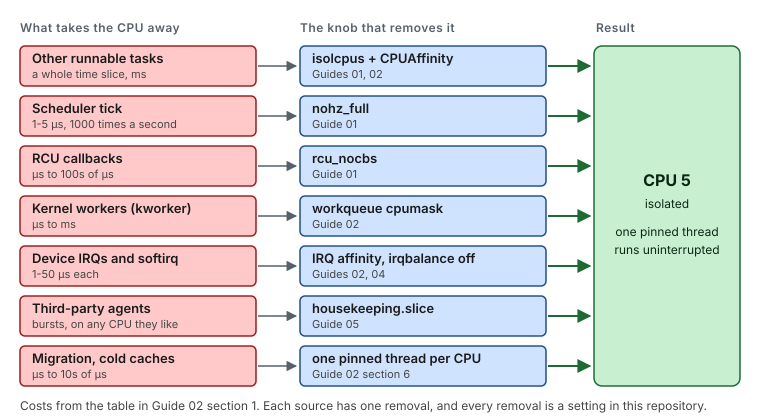
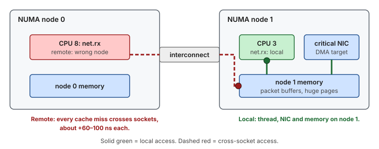
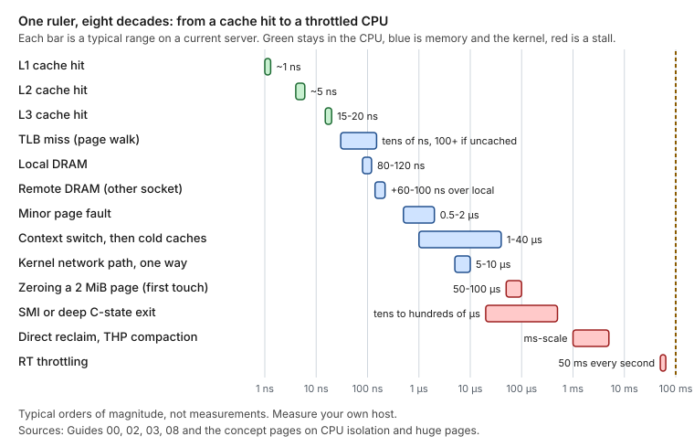
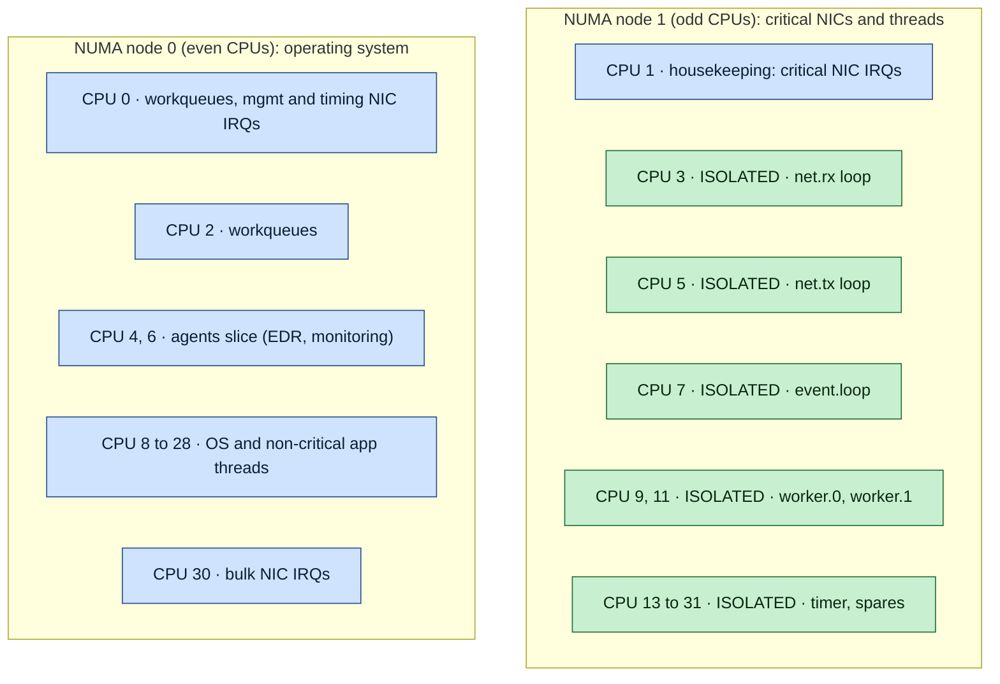
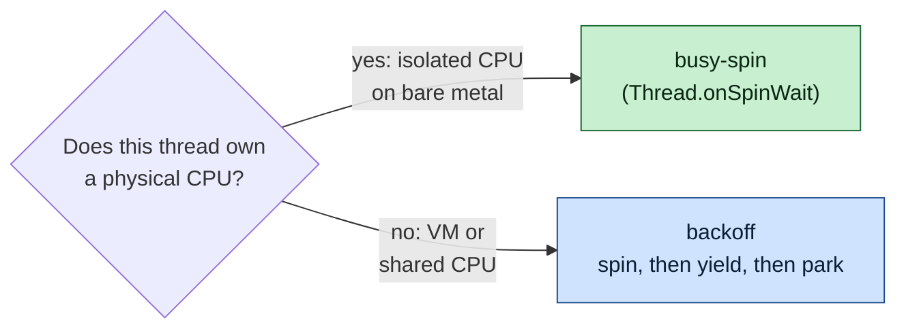
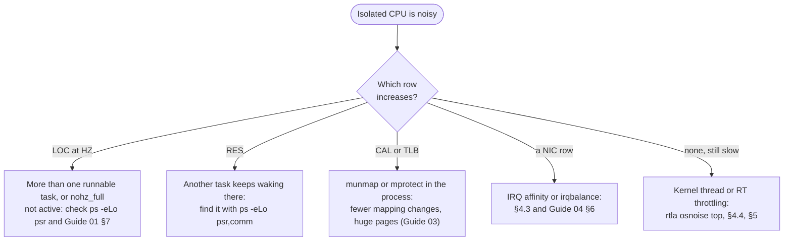

# Guide 02 — CPU Core Isolation

> **Script:** [`scripts/02-cpu-isolation`](../scripts/02-cpu-isolation) · **Concept:** [concepts/cpu-isolation.md](../concepts/cpu-isolation.md) · **Previous:** [Guide 01](01-grub-bootloader-tuning.md) · **Next:** [Guide 03 — Huge pages](03-huge-pages-configuration.md)

| | |
|---|---|
| **Risk level** | **4 / 5**. A wrong layout can starve the OS (the host becomes sluggish and SSH hangs) or leave application threads stacked on one CPU. |
| **Reboot required** | Yes for systemd `CPUAffinity` (it takes effect when PID 1 starts). Workqueue, irqbalance and RT throttling apply immediately. |
| **Applies to** | Bare metal only. VMs: application-side pinning (§6) is still useful, but OS-side isolation is skipped. |
| **Depends on** | [Guide 01](01-grub-bootloader-tuning.md) (`isolcpus`, `nohz_full`, `rcu_nocbs`) |

## At a glance

- **What:** move the operating system, kernel workqueues and interrupts off the isolated CPUs, then put exactly one critical application thread on each one.
- **Why:** every task, tick, `kworker` or interrupt that borrows the CPU delays a spinning thread by microseconds to milliseconds. RT throttling alone costs **50 ms every second**.
- **Cost:** fewer CPUs for everything else, and CPUs that sit idle unless a pinned thread uses them.

**Time:** ~1 h including the layout design + 1 reboot (shared with Guide 01) · **Do this if:** bare metal, one critical application, a handful of threads you can pin · **Skip if:** thread-per-request servers or large dynamic pools, or a VM (only §6 applies).


*Guide 02 builds on the boot arguments from Guide 01 and comes before huge pages.*

---

## 1. The problem: everything else that wants your CPU

A latency-critical thread that spins on a CPU is delayed by every event that takes that CPU away from it, even for a few microseconds:

| Source of interference | Typical cost | Handled by |
|---|---|---|
| Another runnable task (daemon, cron job, shell) | 1 time slice = ms | `isolcpus` + systemd `CPUAffinity` (this guide) |
| Scheduler tick | 1–5 µs, 250–1000×/s | `nohz_full` ([Guide 01](01-grub-bootloader-tuning.md)) |
| RCU callbacks in softirq | µs to 100s of µs | `rcu_nocbs` ([Guide 01](01-grub-bootloader-tuning.md)) |
| Kernel workqueue items (`kworker`) | µs to ms | workqueue cpumask (this guide) |
| Device interrupts + softirq (NIC, disk) | 1–50 µs per IRQ | IRQ affinity ([Guide 04](04-network-optimization.md)), irqbalance off (this guide) |
| Migration to another CPU | cold L1/L2, µs to 10s of µs | one thread per CPU, pinned (this guide) |
| RT throttling | **50 ms every second** for SCHED_FIFO spinners | `sched_rt_runtime_us=-1` (this guide) |
| TLB shootdown IPIs from threads of the same process | 1–5 µs | fewer `munmap`/`mprotect` calls, huge pages ([Guide 03](03-huge-pages-configuration.md)) |



*Seven things take a CPU away from a thread, and each has exactly one removal. Guides 01, 02, 04 and 05 apply them.*

The kernel parameters from Guide 01 make the isolated CPUs *eligible* to be quiet. This guide moves the rest of the system away from them, and then puts **exactly one** application thread on each one.

## 2. When to apply

Apply when **all** of these hold:

- bare metal (the script skips everything here on `virtual_machine`);
- a single latency-critical application owns the host;
- the application can pin its threads individually, or you can pin them externally by thread ID;
- you know which threads are critical. Typically these are the network receive/send loops, the main event-processing loop, and a few worker loops. They are rarely more than 5–15 threads.

Do **not** apply when the application has hundreds of equally important threads (a thread-per-request server). Isolation helps a few busy-spinning threads; it hurts a large, dynamic thread pool, because nothing balances load across isolated CPUs.

## 3. Designing the CPU layout

Write the layout down before touching the host. You will need it in `lowlat.conf`, in the application's affinity configuration, and when debugging.

```bash
lscpu -e=CPU,NODE,SOCKET,CORE          # topology
numactl --hardware                      # memory per node
cat /sys/class/net/<nic>/device/numa_node
```

**Rules**

1. **NUMA locality first.** Critical threads, their memory ([Guide 03](03-huge-pages-configuration.md)) and the critical NIC must sit on the same node. A packet DMA'd into node 1 memory and processed by a thread on node 0 crosses the socket interconnect on every cache miss (~+60–100 ns each).
2. **Keep one housekeeping CPU on the critical node.** The critical NIC's IRQs, softirq processing, and the node's kernel threads need somewhere local to run. In the reference layout this is CPU 1.
3. **CPU 0 is never isolated.** Some timers, early-boot IRQs, and platform interrupts are stuck to it.
4. **Hyper-Threading.** If HT is on, a sibling shares L1/L2, the TLBs, and the execution ports. Either disable HT in the BIOS (preferred), or isolate both siblings and use only one. `lscpu -e` shows siblings as two CPUs with the same `CORE`.
5. **Leave headroom.** Plan one or two spare isolated CPUs for a new thread or a debug tool, instead of re-planning the layout under pressure.



*Rule 1 in one picture: the thread, the NIC and the memory belong on the same node, or every cache miss pays the trip across sockets.*



*Where the remote-DRAM penalty sits among the other latencies on the host: small next to a page fault, but paid on every cache miss.*

**Reference layout** (2 × 16 cores, HT off, even CPUs = node 0, odd = node 1, critical NICs on node 1):



*Node 0 runs the operating system, agents and non-critical interrupts. Node 1 keeps one housekeeping CPU for the critical NIC's interrupts, and every other CPU there is isolated and runs exactly one pinned thread role.*


*The same layout as a floor plan: the critical NICs, their interrupts, the pinned threads and their memory all sit on node 1, and node 0 carries everything else.*

<details>
<summary><b>The same layout as text</b> (for copying into a runbook)</summary>

```text
            node 0 (even)                          node 1 (odd)
  ┌─────────────────────────────────┐   ┌──────────────────────────────────────┐
  │ 0  workqueues, mgmt/timing IRQs │   │ 1  housekeeping: critical NIC IRQs   │
  │ 2  workqueues                   │   │ 3  ISOLATED  network RX loop         │
  │ 4  agents (EDR/monitoring)      │   │ 5  ISOLATED  network TX loop         │
  │ 6  agents slice                 │   │ 7  ISOLATED  event loop              │
  │ 8..28  OS + non-critical app    │   │ 9  ISOLATED  worker 0                │
  │ 30 bulk NIC IRQs                │   │ 11 ISOLATED  worker 1                │
  │                                 │   │ 13..31 ISOLATED  timer, spares       │
  └─────────────────────────────────┘   └──────────────────────────────────────┘
  OS_CPUS = 0 1 2 4 6 ... 30            ISOLATED_CPUS = 3 5 7 ... 31
```

</details>

`OS_CPUS` must be the exact complement of `ISOLATED_CPUS`. The verify step checks this.

**Let the script propose it.** [`scripts/plan-layout`](../scripts/plan-layout) applies the rules above to your topology. It isolates the critical NIC's node except one housekeeping core, keeps CPU 0 and Hyper-Threading siblings together, and refuses when the node cannot hold your threads plus spares:

```bash
lscpu -e=CPU,NODE,SOCKET,CORE > topology.txt
scripts/plan-layout --lscpu topology.txt --nic-node 1 --threads 6
# prints ISOLATED_CPUS, OS_CPUS, WORKQUEUE_CPUS, HOUSEKEEPING_PIN_CPUS, HOUSEKEEPING_SLICE_CPUS
# and the isolcpus, nohz_full and rcu_nocbs arguments. On the reference host it prints the layout above.

scripts/plan-layout --nic ens1f0 --threads 6              # reads the node from sysfs, runs lscpu itself
scripts/plan-layout --nic-node 1 --check /etc/lowlat/lowlat.conf   # PASS, WARN or FAIL for a layout you wrote by hand
```

The [layout explorer](https://vitor-tadashi.github.io/mechanical-sympathy/explorer.html) does the same in a browser, draws the map, and accepts a pasted `lscpu` output.

> [!NOTE]
> **Not proven in production.** The proposal is a starting point that applies the rules of this section mechanically. Review it against your application's thread roles before you write it into `lowlat.conf`.

## 4. Moving the operating system away

### 4.1 systemd `CPUAffinity` (persistent)

`/etc/systemd/system.conf`:

```ini
CPUAffinity=0 1 2 4 6 8 10 12 14 16 18 20 22 24 26 28 30
DefaultLimitRTPRIO=99
DefaultLimitNICE=40
```

- **`CPUAffinity`**: PID 1 calls `sched_setaffinity()` on itself early in boot. Every process it forks (services, getty, sshd, and therefore every login shell and everything you start from it) inherits that mask. This is what keeps `rsyslogd`, `chronyd`, `sshd`, `crond`, and your own `bash` off the isolated CPUs.
- **`DefaultLimitRTPRIO` / `DefaultLimitNICE`**: `RLIMIT_RTPRIO` and `RLIMIT_NICE` for every service. They let an unprivileged service raise its own threads to `SCHED_FIFO` or a negative nice value without running as root. `NICE=40` is the rlimit encoding of nice `-20`. Login sessions get the same limits from `limits.d` ([Guide 07](07-os-hygiene.md)).

This is **affinity, not a cpuset**. A process started with the OS mask may still call `sched_setaffinity()` and move a thread onto an isolated CPU. That is exactly how the application pins its critical threads (§6), and it is why this mechanism is preferred over cgroup `AllowedCPUs=` on `system.slice` (see the warning in [Guide 05](05-cgroup-isolation.md#44-the-cpuset-trap)).

A **reboot** is needed. `systemctl daemon-reexec` makes PID 1 re-read the file, but units that are already running keep their old mask.

### 4.2 Unbound kernel workqueues (runtime)

```bash
echo 00000005 > /sys/devices/virtual/workqueue/cpumask          # CPUs 0 and 2
echo 00000005 > /sys/bus/workqueue/devices/writeback/cpumask
```

Unbound workqueues (filesystem writeback, many driver deferred tasks, crypto) run their `kworker/u*` threads on any CPU in this mask. **Per-CPU (bound) workqueues cannot be moved**. They run on the CPU that queued the work, which is why the isolated CPUs must not trigger kernel work: no disk I/O, no page-cache writeback, and no `mprotect`-heavy code on the critical threads.

The mask format is hexadecimal, as comma-separated 32-bit words for hosts with more than 32 CPUs (`00000002,00000001` = CPUs 0 and 33). `cpu_mask_from_list` in `lib/common` builds it for any CPU count. Do not hard-code a 64-bit `printf '%016x'`: it silently breaks on hosts with more than 64 CPUs.

This setting is **not persistent**. `lowlat-runtime.service` re-applies it at every boot (`02-cpu-isolation --runtime`).

### 4.3 irqbalance (persistent)

`irqbalance` rewrites `/proc/irq/*/smp_affinity` every 10 seconds according to its own heuristics. It will undo any manual IRQ placement ([Guide 04](04-network-optimization.md)), and it may put a NIC queue interrupt on an isolated CPU.

```bash
systemctl disable --now irqbalance
```

On hosts where you want to keep irqbalance for non-critical devices, ban the isolated CPUs instead, in `/etc/sysconfig/irqbalance`:

```bash
IRQBALANCE_BANNED_CPULIST=3,5,7,9,11,13,15,17,19,21,23,25,27,29,31   # irqbalance >= 1.8 (RHEL 9)
```

### 4.4 Real-time throttling

```bash
sysctl -w kernel.sched_rt_runtime_us=-1       # persisted in /etc/sysctl.d/91-lowlat-rt.conf
```

By default, `SCHED_FIFO`/`SCHED_RR` tasks may consume at most 950 ms of every 1 s (`sched_rt_runtime_us=950000` out of `sched_rt_period_us=1000000`). Then the kernel **forcibly deschedules them for 50 ms** so that normal tasks get a turn. A busy-spinning FIFO thread therefore stalls for 50 ms once per second, which can easily be the biggest outlier in your histogram.



*With the default limit, the thread loses the last 50 ms of every second. A message that arrives then waits up to 50 ms. With `-1` there is no gap.*

> [!WARNING]
> `-1` removes the cap. **Risk:** a runaway FIFO thread on a *housekeeping* CPU now starves everything on it, kernel threads included, and the host may appear hung. Only run FIFO spinners on isolated CPUs.

## 5. Kernel threads that stay on isolated CPUs

After isolation, `ps -eLo psr,comm | awk '$1==5'` still shows a few kernel threads on CPU 5. That is expected:

| Thread | Why it is there | Does it wake up? |
|---|---|---|
| `migration/5` | Stop-machine class, per CPU | Only for explicit migrations and CPU hotplug |
| `cpuhp/5` | CPU hotplug state machine | Only on hotplug |
| `ksoftirqd/5` | Deferred softirq processing | Only if softirqs are raised on CPU 5, i.e. if an IRQ lands there. **Keep IRQs away.** |
| `kworker/5:*` | Bound workqueues | Only if something on CPU 5 queues work (e.g. `vmstat` updates, see `vm.stat_interval` in [Guide 06](06-kernel-sysctl-tuning.md)) |
| `idle_inject/5` | Thermal/power capping | Should never run with `idle=poll` |

What matters is not that they exist, but that they **stay asleep**. Measure it with the tools in §7.

## 6. Pinning the application

Isolated CPUs have **no load balancing**. A thread whose affinity mask spans several isolated CPUs is put on the first one and never moved. So the rule is:

> [!IMPORTANT]
> **One critical thread → one isolated CPU. Every other thread → the OS CPUs.**


*A thread that may move will move, and each hop costs a cold start. Pinning turns five cold starts into one.*

### 6.1 Describe the mapping in configuration, not in code

Map *thread roles* to CPUs in a properties file that the application reads at start-up. When the layout changes, only the file changes:

```properties
# affinity.properties - thread role -> CPU (all on NUMA node 1)
affinity.enable=true
net.rx.cpu.affinity=3
net.tx.cpu.affinity=5
event.loop.cpu.affinity=7
worker.0.cpu.affinity=9
worker.1.cpu.affinity=11
timer.cpu.affinity=13
# not listed (logging, metrics, admin): unpinned, they stay on the OS CPUs
```

Keep a feature switch (`affinity.enable` above). The same build then runs pinned on bare metal and unpinned on a VM or a laptop, and the launcher can decide which JVM flags to add (see [Guide 03 §5](03-huge-pages-configuration.md#5-java-applications)).

### 6.2 Pin inside the application (preferred)

The thread pins **itself** as the first thing in its `run()` method, before it touches its working set. That way its first-touch memory is also allocated on the right NUMA node.

**Java** (JDK 22+, Foreign Function & Memory API, no library). The thread builds a one-bit CPU mask and calls `sched_setaffinity(0, …)` on itself before running its loop:

<details>
<summary><b>Full class: <code>PinnedRunnable</code></b> (about 30 lines)</summary>

```java
import java.lang.foreign.*;
import java.lang.invoke.MethodHandle;

public final class PinnedRunnable implements Runnable {
    // int sched_setaffinity(pid_t pid, size_t cpusetsize, const cpu_set_t *mask)
    private static final MethodHandle SCHED_SETAFFINITY = Linker.nativeLinker().downcallHandle(
            Linker.nativeLinker().defaultLookup().find("sched_setaffinity").orElseThrow(),
            FunctionDescriptor.of(ValueLayout.JAVA_INT, ValueLayout.JAVA_INT, ValueLayout.JAVA_LONG, ValueLayout.ADDRESS));
    private static final long CPU_SET_BYTES = 128;          // glibc cpu_set_t: 1024 bits

    private final int cpu;
    private final Runnable body;

    public PinnedRunnable(int cpu, Runnable body) { this.cpu = cpu; this.body = body; }

    @Override
    public void run() {
        if (cpu >= 0) {
            try (Arena arena = Arena.ofConfined()) {
                MemorySegment mask = arena.allocate(CPU_SET_BYTES, Long.BYTES);  // zeroed
                mask.setAtIndex(ValueLayout.JAVA_LONG, cpu / 64, 1L << (cpu % 64));
                if ((int) SCHED_SETAFFINITY.invokeExact(0, CPU_SET_BYTES, mask) != 0) {  // pid 0 = this thread
                    throw new IllegalStateException("sched_setaffinity(" + cpu + ") failed");
                }
            } catch (Throwable t) {
                throw new IllegalStateException(t);
            }
        }
        body.run();                             // busy-spin loop, never blocks
    }
}
```

</details>

Start the JVM with `--enable-native-access=ALL-UNNAMED` (or the module name), otherwise the JDK warns about the restricted call, and future releases deny it. The example's [`ThreadAffinity`](../examples/java-latency-probe/src/main/java/com/example/lowlat/ThreadAffinity.java) adds `errno` capture, `sched_getcpu()`, and reading the mask back for the start-up log.

Validate the mapping at start-up: two roles on one CPU, or a CPU that is not in `/sys/devices/system/cpu/isolated`, is a configuration error, so refuse to start. A complete runnable project is in [examples/hugepages-java-example.md](../examples/hugepages-java-example.md).

**C / C++**:

```cpp
#include <pthread.h>
#include <sched.h>

static int pin_current_thread(int cpu) {
    cpu_set_t set;
    CPU_ZERO(&set);
    CPU_SET(cpu, &set);
    return pthread_setaffinity_np(pthread_self(), sizeof(set), &set);   // 0 on success
}
```

### 6.3 Pin from the outside

When you cannot change the code:

```bash
# Whole process (all current threads) onto the OS CPUs of node 1 - non-critical threads
taskset -a -cp 1 <pid>

# One thread (TID from `ps -L -p <pid>` or /proc/<pid>/task) onto one isolated CPU
taskset -cp 9 <tid>

# Start a process bound to node 1 memory, with CPUs chosen per thread later
numactl --membind=1 --cpunodebind=1 ./my-app
```

`scripts/02-cpu-isolation` exports two helpers when sourced:

```bash
. scripts/02-cpu-isolation
pin_process "$(pgrep -f my-agent)" 4          # taskset -a (all threads)
show_affinity "$(pgrep -f my-app)"            # TID, allowed CPUs, last CPU, thread name
```

Thread names matter here. Name your threads (`Thread.setName`, `pthread_setname_np`), so that `show_affinity` and `top -H` tell you *which* role is on which CPU.

### 6.4 Busy-spin vs back-off

A pinned critical thread normally **busy-spins**: it polls its queue or socket in a tight loop and never blocks. Blocking means a futex sleep followed by a wake-up, and the wake-up costs 2–50 µs through the scheduler.



*A blocked thread has to be woken through the kernel. A spinning thread on its own CPU sees the write after a single cache-line transfer.*



*Spin only when the CPU belongs to the thread. On a shared or virtual CPU, spinning steals time from other work and raises steal time, so back off.*

| Environment | Idle strategy | Why |
|---|---|---|
| Bare metal, isolated CPU | `spin` / `busy-spin` (optionally with `Thread.onSpinWait()` → `PAUSE`) | The CPU belongs to this thread. Burning it is free. |
| VM, shared or oversubscribed CPUs | `backoff` (spin → yield → park) | Spinning a vCPU steals time from other vCPUs on the same host core and increases **steal time**, which makes the latency worse. |

Keep both as configuration profiles and select one by host class, as the launcher in the Java example does.

### 6.5 Real-time scheduling class: usually unnecessary

On an isolated CPU with exactly one runnable thread, `SCHED_OTHER` and `SCHED_FIFO` behave the same, because there is nothing to preempt. FIFO helps only if something else occasionally becomes runnable on that CPU. In that case FIFO makes the other task wait, and if that task is `ksoftirqd`, your network stalls. If you do use it: `chrt -f -p 1 <tid>`, a low priority (1–10), never 99, and the RT throttling change from §4.4.

## 7. Using the script

```bash
scripts/02-cpu-isolation --dry-run
sudo scripts/02-cpu-isolation --apply
sudo systemctl reboot                         # for systemd CPUAffinity
scripts/02-cpu-isolation --verify
```

| Function | Persistent? | Notes |
|---|---|---|
| `configure_systemd_cpu_affinity` | yes (`system.conf`) | reboot |
| `set_workqueue_affinity` | no | re-applied at boot by `lowlat-runtime.service` (`--runtime`) |
| `disable_irqbalance` | yes (`systemctl disable`) | |
| `set_rt_throttling` | yes (`sysctl.d`) | |
| `pin_process`, `show_affinity` | no | helpers for operators and launch scripts |

## 8. Verification

```bash
# 1. PID 1 and a random service carry the OS mask
grep Cpus_allowed_list /proc/1/status /proc/$(pgrep -o sshd)/status

# 2. Nothing but your pinned threads (and sleeping per-CPU kthreads) on isolated CPUs
ps -eLo psr,pid,tid,comm --sort=psr | awk '$1 ~ /^(3|5|7|9|11)$/'

# 3. Workqueue mask
cat /sys/devices/virtual/workqueue/cpumask

# 4. Context switches of one critical thread over 10 s: expect ~0 involuntary
perf stat -e context-switches,cpu-migrations -t <tid> -- sleep 10
grep ctxt /proc/<pid>/task/<tid>/status        # voluntary_/nonvoluntary_ctxt_switches (sample twice)

# 5. OS noise on an isolated CPU (RHEL 9: dnf install rtla)
rtla osnoise top -c 9 -d 30s                   # max single noise in us, per source (IRQ, softirq, thread)

# 6. Interrupts that still land on isolated CPUs (should not increase)
watch -d -n1 "awk 'NR==1 || /LOC|RES|CAL|TLB|NMI/' /proc/interrupts"
```

How to read `/proc/interrupts` on isolated CPUs:

| Row | Meaning | Healthy on an isolated CPU |
|---|---|---|
| `LOC` | Local timer (tick) | ~1/s (residual tick) |
| `RES` | Rescheduling IPIs | ~0 |
| `CAL` | Function-call IPIs | ~0; increases with `munmap`/`mprotect` in the process |
| `TLB` | TLB shootdowns | ~0; see [Guide 03](03-huge-pages-configuration.md) |
| NIC rows | Device interrupts | **0**. If not, see [Guide 04](04-network-optimization.md). |

`scripts/verify-tuning` runs checks 1–3 automatically.

## 9. Troubleshooting

When an isolated CPU is noisy, the row of `/proc/interrupts` that keeps increasing tells you who is interrupting it:



*Match the increasing interrupt row to its cause: tick, rescheduling IPI, TLB shootdown, device interrupt, or, when none increases, a kernel thread or RT throttling.*


| Symptom | Cause | Fix |
|---|---|---|
| All critical threads on the first isolated CPU | Pinned to a *range* of isolated CPUs | One CPU per thread |
| `sshd`/`rsyslogd` still on isolated CPUs after apply | No reboot yet | Reboot. `systemctl daemon-reexec` does not move running units. |
| `taskset: failed to set pid's affinity: Invalid argument` | Target CPU outside the process's **cpuset** (cgroup), or offline | Check `cat /proc/<pid>/cpuset` and the slice `AllowedCPUs` ([Guide 05](05-cgroup-isolation.md#44-the-cpuset-trap)) |
| Periodic ~50 ms stall once per second | RT throttling with a FIFO spinner | §4.4 |
| `kworker/9:1` wakes up regularly on an isolated CPU | Per-CPU vmstat update, or the thread does syscalls that queue work | `vm.stat_interval=60` ([Guide 06](06-kernel-sysctl-tuning.md)); remove syscalls from the hot loop |
| Host sluggish, SSH slow | Too few OS CPUs for the agents plus the OS | Give back CPUs; check `mpstat -P ALL 1` on the OS CPUs |
| JIT/GC threads steal CPU from critical threads | JVM service threads inherited an isolated mask | Launch the JVM with the OS mask; only critical threads pin to isolated CPUs |

## 10. Rollback

- [ ] Remove the systemd defaults: `sudo sed -i '/^CPUAffinity=/d;/^DefaultLimitRTPRIO=/d;/^DefaultLimitNICE=/d' /etc/systemd/system.conf`
- [ ] Restore RT throttling: `sudo rm -f /etc/sysctl.d/91-lowlat-rt.conf && sudo sysctl -w kernel.sched_rt_runtime_us=950000`
- [ ] Re-enable irqbalance: `sudo systemctl enable --now irqbalance`
- [ ] Reboot: `sudo systemctl reboot`. This also restores the default workqueue cpumask (all CPUs).
- [ ] Confirm: `grep Cpus_allowed_list /proc/1/status` lists every CPU

Every file the script touched is also saved under `/var/lib/lowlat/factory-settings/` (first-ever copy) and `/var/lib/lowlat/backup/<timestamp>/`.

## 11. Bare metal vs VM

| | Bare metal | VM |
|---|---|---|
| systemd `CPUAffinity`, workqueue mask, irqbalance off, RT throttling | ✅ | ❌ (skipped by the script) |
| Application pins one thread per vCPU | ✅ | ⚠️ Only if the hypervisor pins vCPUs to dedicated pCPUs. Otherwise pinning inside the guest does not help. |
| Busy-spin idle strategy | ✅ | ❌ Use back-off |

## 12. Key takeaways

- One critical thread per isolated CPU. Everything else, including JVM service threads, stays on the OS CPUs.
- Isolated CPUs have no load balancing. A mask that spans several of them stacks threads on the first one.
- systemd `CPUAffinity` is inherited affinity, not a cpuset, so the application can still pin onto isolated CPUs.
- Turn RT throttling off only for FIFO spinners on isolated CPUs, or you risk a 50 ms stall every second.
- Verify with `/proc/interrupts` and `rtla osnoise`: kernel threads may exist on an isolated CPU, but they must stay asleep.

## 13. References

- `man 7 sched`, `man 1 taskset`, `man 8 numactl`, `man 5 systemd-system.conf`
- Workqueues: <https://docs.kernel.org/core-api/workqueue.html>
- RT throttling: <https://docs.kernel.org/scheduler/sched-rt-group.html>
- `rtla osnoise`: <https://docs.kernel.org/tools/rtla/rtla-osnoise.html>
- `man 2 sched_setaffinity`, `man 3 sched_getcpu`
- JEP 454, Foreign Function & Memory API: <https://openjdk.org/jeps/454>
- Deep dive: [concepts/cpu-isolation.md](../concepts/cpu-isolation.md)
