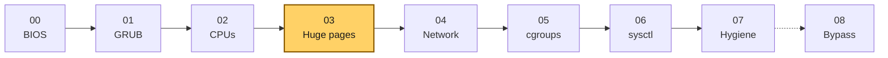
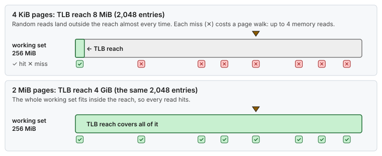
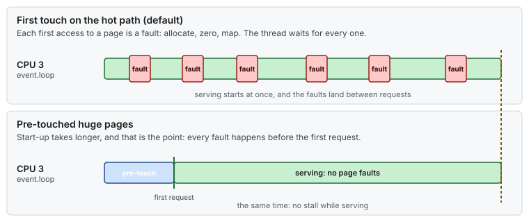
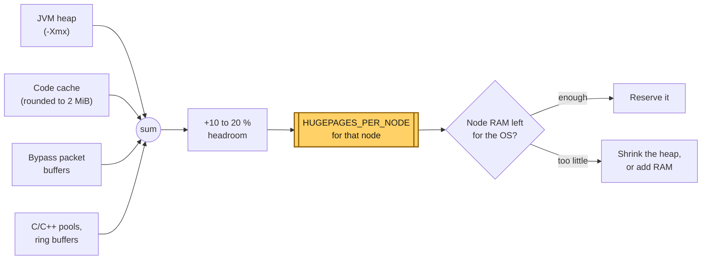
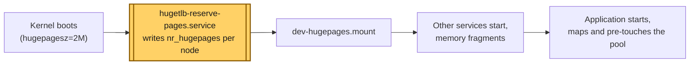
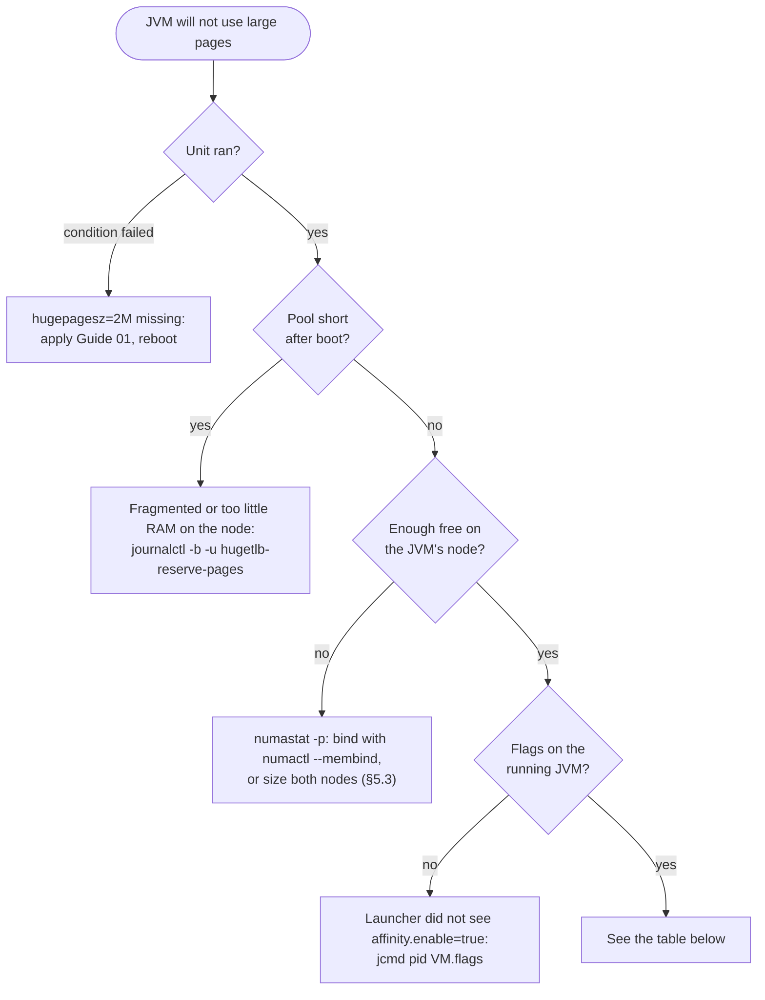

# Guide 03 — Huge Pages

> **Script:** [`scripts/03-huge-pages`](../scripts/03-huge-pages) · **Concept:** [concepts/huge-pages.md](../concepts/huge-pages.md) · **Example:** [examples/hugepages-java-example.md](../examples/hugepages-java-example.md) · **Previous:** [Guide 02](02-cpu-core-isolation.md) · **Next:** [Guide 04 — Network](04-network-optimization.md) · **Terms:** [Glossary](../GLOSSARY.md)

| | |
|---|---|
| **Risk level** | **3 / 5**. Reserved pages are removed from general use: over-reserving causes OOM kills, and under-reserving makes the application silently fall back to 4 KiB pages or fail to start. |
| **Reboot required** | Recommended. The boot-time reservation is the reliable one; a runtime reservation may come up short. |
| **Applies to** | Bare metal. VMs keep 4 KiB pages unless the hypervisor backs guest memory with huge pages. |
| **Depends on** | [Guide 01](01-grub-bootloader-tuning.md) (`transparent_hugepage=never`, `default_hugepagesz`, `hugepagesz`) and [Guide 02](02-cpu-core-isolation.md) (NUMA layout) |

## At a glance

- **What:** reserve a pool of explicit 2 MiB pages per NUMA node early in boot, and have the application (JVM heap, buffers) map its hot memory from it.
- **Why:** TLB reach grows from 8 MiB to 4 GiB, page faults leave the hot path, and the kernel can never compact, swap or migrate those pages behind your back.
- **Cost:** reserved memory is gone for everything else, and a pool that's too small makes the application fall back or fail at start-up.

**Time:** ~30 min + a reboot (shared with Guides 01 and 02) · **Do this if:** bare metal with a latency-critical process that has a large, hot working set · **Skip if:** it's a VM whose hypervisor does not back guest RAM with huge pages.



*Guide 03 needs the page size from Guide 01 and the NUMA layout from Guide 02.*

---

## 1. Why huge pages

Every memory access goes through a virtual → physical translation, and the CPU caches translations in the **TLB**. A modern core has about 64 L1 DTLB entries and 1,500–2,000 L2 STLB entries. With 4 KiB pages, 2,048 entries cover **8 MiB**. A 16 GiB heap, a 1 GiB in-memory index, or a 256 MiB ring buffer is far beyond that, so the hot path takes TLB misses. Each miss is a **page walk** of up to four dependent memory reads (five with 5-level paging), which costs tens of ns if the page tables are cached and 100+ ns if they are not.

| Page size | Reach of 2,048 TLB entries | Page-table levels walked |
|---|---|---|
| 4 KiB | 8 MiB | 4 |
| 2 MiB | 4 GiB | 3 |
| 1 GiB | 2 TiB | 2 |



*With 4 KiB pages, a 256 MiB working set is mostly outside TLB reach and most reads take a page walk. With 2 MiB pages, all of it fits.*

Huge pages also:

- **remove page faults from the hot path**: the pages are allocated and zeroed up front, and pre-touched at start-up;
- **cannot be swapped or migrated**: no NUMA balancing moves them behind your back, and no swap-in stalls;
- **reduce TLB-shootdown IPIs**, because there are fewer mappings to invalidate.



*The same event loop with and without pre-touch: the faults do not disappear, they move to start-up, before the first request.*

The full mechanics are in [concepts/huge-pages.md](../concepts/huge-pages.md).

## 2. Transparent vs explicit huge pages: why THP is off

Linux has two mechanisms:

| | Transparent Huge Pages (THP) | Explicit huge pages (hugetlbfs) |
|---|---|---|
| Who decides | The kernel, at page-fault time or later via `khugepaged` | The application (`MAP_HUGETLB`, hugetlbfs files, JVM `-XX:+UseLargePages`) |
| Where the memory comes from | General page allocator. Needs a contiguous 2 MiB block *now*, and may **compact memory synchronously** to get one. | A **pool reserved in advance** |
| Latency behavior | Unpredictable: compaction stalls (ms), `khugepaged` running on any CPU, splits on `munmap`/`mprotect` | Deterministic: no allocation work on the hot path |
| Guarantee | Best effort. You may or may not get 2 MiB pages. | Hard. If the pool is empty the mapping fails, so problems show up at start-up. |

This documentation turns THP **off** at boot (`transparent_hugepage=never`, [Guide 01](01-grub-bootloader-tuning.md#51-latency-subset-bare-metal-and-vms)) and uses **explicit** pages only.

> [!WARNING]
> **Correction of a common mistake.** `-XX:+UseTransparentHugePages` only makes the JVM `madvise()` its heap for THP. With `transparent_hugepage=never` the kernel ignores that advice, so the flag does nothing. With THP enabled you get the compaction stalls described above. The JVM flag for explicit pages is `-XX:+UseLargePages` (§5).

## 3. Sizing the pool

Add up **everything that will map huge pages**, per NUMA node:



*Sum every huge-page consumer on the node, add 10–20 % headroom, and make sure the node still has enough ordinary memory for everything else that runs there.*

| Consumer | How much |
|---|---|
| JVM heap (`-Xmx`, with `-Xms` = `-Xmx`) | the full heap |
| JVM code cache (`-XX:ReservedCodeCacheSize`, 240 MiB by default) | its size, rounded up to 2 MiB |
| Kernel-bypass network stack packet buffers | per the vendor's documentation (e.g. `EF_MAX_PACKETS` × 2 KiB) |
| C/C++ pools, ring buffers, hash tables mapped with `MAP_HUGETLB` | their sizes |
| Headroom | +10–20 % |

Then check that the node has that much free RAM **plus** what the OS needs (`numactl --hardware`).

Reference host: a 16 GiB heap plus about 2 GiB of code cache and bypass buffers on node 1 gives 18 GiB. 20 % headroom makes about 22 GiB, and the reference rounds that up to **24 GiB = 12,288 × 2 MiB on node 1**. Tooling and helper JVMs on node 0 get **4 GiB = 2,048 pages**, and there is a surplus of **2,048** overcommit pages (§4.3).

Pages in the pool are **not available** to anything else, not even the page cache. Reserving 24 GiB on a 32 GiB node leaves 8 GiB for everything else that runs there.

## 4. Reserving the pages

### 4.1 Why per node, at early boot

There are three ways to fill the pool:

| Method | Split across nodes | Reliability |
|---|---|---|
| `hugepages=N` on the kernel command line | **evenly** across all nodes | Very high (reserved before anything else runs) |
| `vm.nr_hugepages=N` (sysctl) | **evenly** (round-robin) | Depends on fragmentation at the time it runs |
| `/sys/devices/system/node/nodeX/hugepages/hugepages-2048kB/nr_hugepages` | **per node, exactly as you ask** | High if done early in boot |



*The reservation runs in `sysinit.target`, before other services have fragmented memory, so the contiguous 2 MiB blocks are still there to take.*

We want *most* of the pages on the critical node, so the per-node sysfs interface is the one to use. Running it **as early as possible in boot**, before any service has fragmented memory, makes it nearly as reliable as the command line. This is also the approach Red Hat documents for per-node reservation.

### 4.2 The reservation unit

`install_hugepage_reservation` generates two files from `HUGEPAGES_PER_NODE` in `lowlat.conf`.

`/usr/lib/systemd/hugetlb-reserve-pages` writes the wanted count for each node, reads back what the kernel really reserved, and warns on a shortfall:

<details>
<summary><b>Generated script</b> (reference host: 2,048 pages on node 0, 12,288 on node 1)</summary>

```bash
#!/bin/bash
nodes_path=/sys/devices/system/node
reserve_pages() {
	local wanted="$1" node="$2" file got
	file="${nodes_path}/${node}/hugepages/hugepages-2048kB/nr_hugepages"
	echo "${wanted}" >"${file}"
	got="$(cat "${file}")"
	echo "${node}: requested ${wanted} x 2M, reserved ${got}"
	[[ "${got}" -ge "${wanted}" ]] || echo "WARN: ${node} short by $((wanted - got)) pages" >&2
}
reserve_pages 2048 node0
reserve_pages 12288 node1
```

</details>

`/etc/systemd/system/hugetlb-reserve-pages.service`:

```ini
[Unit]
Description=Reserve 2M huge pages per NUMA node
# do not wait for basic.target: run as early as possible
DefaultDependencies=no
# pool is ready before hugetlbfs is mounted and apps start
Before=dev-hugepages.mount
ConditionPathExists=/sys/devices/system/node
# only on hosts where Guide 01 was applied
ConditionKernelCommandLine=hugepagesz=2M

[Service]
Type=oneshot
RemainAfterExit=yes
ExecStart=/usr/lib/systemd/hugetlb-reserve-pages

[Install]
WantedBy=sysinit.target
```

Writing to `nr_hugepages` is a *request*. The kernel reserves as many pages as it can find and reports the real number back. The script reads the value back and logs any shortfall. Check it in `journalctl -u hugetlb-reserve-pages`.

### 4.3 Sysctls

`/etc/sysctl.d/92-lowlat-hugepages.conf`:

| Key | Value | Meaning |
|---|---|---|
| `vm.nr_overcommit_hugepages` | `2048` | **Surplus** pages: when the reserved pool is empty, the kernel may try to allocate up to this many more on demand, at fault time. That allocation can fail under fragmentation, so treat it as a safety margin for tooling, not as capacity for the critical process. |
| `kernel.shmmni` | `24576` | Maximum number of System V shared-memory segments. Some IPC/messaging libraries create many. |
| `vm.hugetlb_shm_group` | GID of `APP_GROUP` | Members of this group may create `SHM_HUGETLB` segments without `CAP_IPC_LOCK`. Not needed for `mmap(MAP_HUGETLB)` or the JVM. |

### 4.4 Using the script

```bash
scripts/03-huge-pages --dry-run
sudo scripts/03-huge-pages --apply           # installs the unit and tries a runtime reservation
sudo systemctl reboot                        # the boot-time reservation is the one that counts
scripts/03-huge-pages --verify
```

## 5. Java applications

### 5.1 The flags, and why each one is needed

On a **bare-metal host whose application threads are pinned** ([Guide 02](02-cpu-core-isolation.md#6-pinning-the-application)):

```text
-Xms16G -Xmx16G                 # heap fully sized up front: no resize, no later commits
-XX:+UseZGC                     # sub-millisecond pauses; any collector works with large pages
-XX:-ZUncommit                  # never return heap memory to the OS (and the huge page pool)
-XX:+UseLargePages              # back heap and code cache with EXPLICIT huge pages
-XX:+UseNUMA                    # NUMA-aware heap: threads allocate from their local node
-XX:+AlwaysPreTouch             # touch every heap page at start-up: no page faults later
```

| Flag | What it does | Why it belongs here |
|---|---|---|
| `-XX:+UseLargePages` | The heap (and code cache) is mapped from the explicit huge page pool (`MAP_HUGETLB` / hugetlbfs). ZGC uses a `memfd` with `MFD_HUGETLB`, so no hugetlbfs mount is needed. | TLB reach for a 16 GiB heap goes from 8 MiB to 4 GiB. |
| `-XX:+UseNUMA` | Heap memory is placed so that each thread allocates on its own node. | Combined with pinning, a critical thread on node 1 gets node-1 memory. |
| `-XX:+AlwaysPreTouch` | The JVM writes to every page of the committed heap during start-up. | Moves all page faults (and zeroing) out of the serving path. If the pool is too small, this fails **at start-up**, not hours later under load when the heap grows. |
| `-Xms` = `-Xmx` | The whole heap is committed at start. | Nothing to commit later. With ZGC, uncommit never goes below `-Xms`, so `-ZUncommit` is a second safeguard. |

Start-up takes longer because of the pre-touch (several seconds for 16 GiB). That is the point: you pay the cost before the first request arrives, not while serving it.

### 5.2 Add the large-page flags only when the host is ready for them

Do not put the large-page flags in a static options file that also runs on VMs, laptops, and CI. Make the **launcher** add them only when the host has isolated, pinned CPUs and a reserved pool:

```bash
# launcher excerpt - see examples/hugepages-java-example.md for the full script
host_class="$(systemd-detect-virt -q && echo virtual_machine || echo bare_metal)"

if [[ "${host_class}" == bare_metal ]]; then
    JVM_OPTIONS_FILE=conf/jvm.options                 # -Xms16G -Xmx16G -XX:+UseZGC -XX:-ZUncommit ...
else
    JVM_OPTIONS_FILE=conf/jvm-low-resource.options    # -Xmx8G -XX:SoftMaxHeapSize=4G -XX:+UseZGC -XX:-ZUncommit ...
fi

PARAMS="-XX:VMOptionsFile=${JVM_OPTIONS_FILE}"

# Thread pinning enabled in the application config => this is a tuned host:
# pinned threads + NUMA-local huge pages + pre-touched heap go together.
if grep -q '^affinity.enable=true' conf/application.properties; then
    PARAMS+=" -XX:+UseNUMA -XX:+UseLargePages -XX:+AlwaysPreTouch"
fi

exec java ${PARAMS} -cp "lib/*" com.example.Main
```

Why the flags are tied to affinity:

- **Without pinning**, `-XX:+UseNUMA` has little to work with, because threads move between nodes.
- **Without a reserved pool** (VMs, dev hosts), `-XX:+UseLargePages` either logs *"Failed to reserve large pages memory"* and falls back to 4 KiB pages (G1/Parallel) or fails heap commit (ZGC), depending on the collector and JDK version. Neither should happen on a production host by accident.
- The low-resource profile for VMs omits `-Xms` and uses `-XX:SoftMaxHeapSize`, so the JVM stays small on a shared hypervisor.

### 5.3 Make sure the pages come from the right node

With `-XX:+UseNUMA` the JVM spreads the heap over the nodes that the **process** may allocate from. If the process may use both nodes, part of the heap is taken from node 0's pool. Two options:

1. **Bind the process to the critical node** (simplest, the most deterministic):
   ```bash
   exec numactl --membind=1 java ${PARAMS} ...
   ```
   Now the entire heap must fit in node 1's pool. Size `HUGEPAGES_PER_NODE` accordingly.
2. **Leave it unbound** and reserve enough on both nodes for their share of the heap.

Check with `numastat -p <pid>` (the `Huge` row per node) or `grep huge /proc/<pid>/numa_maps`.

### 5.4 Other huge-page consumers in a Java stack

- **Memory-mapped files and shared-memory queues** (files in `/dev/shm`, off-heap ring buffers shared between processes) are not covered by `-XX:+UseLargePages`. On tmpfs they use 4 KiB pages. **Pre-allocate** them (write every page, or `fallocate`, before use) instead of creating sparse files, so that page faults happen when the file is created, not when the first message is written. Map them from hugetlbfs when they are large and randomly accessed (§6).
- **Kernel-bypass network stacks** allocate their packet buffers from the huge page pool. Most have a "use huge pages" setting with three modes: off / use if available / **require (fail if unavailable)**. Choose *require* in production, so a missing pool is an immediate start-up error and not a silent latency regression.

A complete, runnable project, with the launcher, both options files and a latency probe, is in [examples/hugepages-java-example.md](../examples/hugepages-java-example.md). [Concept: JVM pauses](../concepts/jvm-pauses.md) covers what these flags do not: safepoints, GC pauses and stalls, JIT warm-up and deoptimization.

## 6. C and C++ applications

The pattern: `mmap` with `MAP_HUGETLB`, `mbind` to the critical node **before** the first touch, then pre-fault with `memset`.

<details>
<summary><b>Full function: <code>alloc_huge_on_node</code></b> (about 30 lines)</summary>

```cpp
#include <sys/mman.h>
#include <numaif.h>      // mbind, link with -lnuma
#include <cerrno>
#include <cstdio>
#include <cstring>

// Map `bytes` of 2 MiB pages on NUMA node `node` and pre-fault them.
void* alloc_huge_on_node(size_t bytes, int node) {
    const size_t huge = 2UL << 20;
    bytes = (bytes + huge - 1) & ~(huge - 1);                       // round up to a page multiple

    void* p = mmap(nullptr, bytes, PROT_READ | PROT_WRITE,
                   MAP_PRIVATE | MAP_ANONYMOUS | MAP_HUGETLB | (21 << MAP_HUGE_SHIFT),  // 2^21 = 2 MiB
                   -1, 0);
    if (p == MAP_FAILED) {                                          // pool empty or too small
        std::fprintf(stderr, "mmap(MAP_HUGETLB) failed: %s\n", std::strerror(errno));
        return nullptr;
    }

    unsigned long mask = 1UL << node;                               // bind BEFORE the first touch
    if (mbind(p, bytes, MPOL_BIND, &mask, sizeof(mask) * 8, MPOL_MF_STRICT) != 0) {
        std::fprintf(stderr, "mbind failed: %s\n", std::strerror(errno));
    }

    std::memset(p, 0, bytes);                                       // pre-fault now, not on the hot path
    return p;
}
```

</details>

Notes:

- Use `(30 << MAP_HUGE_SHIFT)` for 1 GiB pages, which need `hugepagesz=1G hugepages=N` at boot.
- `MAP_POPULATE` pre-faults in the kernel instead of the `memset`, but it happens before `mbind`. Use it only when the process is already bound with `numactl --membind`.
- hugetlb pages are never swapped, so `mlock()` is not needed for them. It *is* still worth calling `mlockall(MCL_CURRENT | MCL_FUTURE)` for the rest of the process.
- File-backed alternative for sharing between processes: mount hugetlbfs (systemd already mounts one at `/dev/hugepages`), then `open("/dev/hugepages/book", O_CREAT|O_RDWR)`, `ftruncate`, and `mmap(MAP_SHARED)`.

## 7. 1 GiB pages

1 GiB pages give the best TLB reach but have to be reserved **on the kernel command line**, because 1 GiB of physically contiguous, aligned memory is almost never free once the system is running:

```bash
grubby --update-kernel=ALL --args="default_hugepagesz=1G hugepagesz=1G hugepages=24"
```

Boot-time `hugepages=N` is split evenly across nodes. To skew it, over-reserve and then *free* pages on the non-critical node from the reservation script (freeing always works). Set `HUGEPAGE_SIZE=1G` in `lowlat.conf`, and the script writes to `hugepages-1048576kB` instead. The JVM uses 1 GiB pages with `-XX:+UseLargePages -XX:LargePageSizeInBytes=1g`.

> [!NOTE]
> **Validate on your hardware.** The scripts use 2 MiB pages. The 1 GiB procedure follows the kernel documentation and this repository does not measure it.

## 8. Verification

```bash
# 1. THP off, page size set
cat /sys/kernel/mm/transparent_hugepage/enabled        # always madvise [never]
grep Hugepagesize /proc/meminfo                         # 2048 kB

# 2. Pool per node
for n in /sys/devices/system/node/node*/hugepages/hugepages-2048kB; do
  echo "$n total=$(cat $n/nr_hugepages) free=$(cat $n/free_hugepages)"; done
journalctl -b -u hugetlb-reserve-pages                  # requested vs reserved

# 3. After the application starts, the pool on its node dropped by (heap + code cache)
grep -E 'HugePages_(Total|Free|Rsvd|Surp)' /proc/meminfo
numastat -p <pid>                                        # "Huge" row, per node

# 4. The JVM says it is using explicit large pages
java -Xlog:gc+init -XX:+UseZGC -XX:+UseLargePages -Xms1g -Xmx1g -version 2>&1 | grep -i 'large page'
#   ... Large Page Support: Enabled (Explicit)
java -Xlog:pagesize ... -version                         # page size used for heap / code cache

# 5. The mappings of a running process are backed by 2 MiB pages
grep -B11 'KernelPageSize: *2048 kB' /proc/<pid>/smaps | grep -E '^[0-9a-f]+-' | head
```

`scripts/03-huge-pages --verify` covers 1–2. `scripts/verify-tuning` covers all guides.

## 9. Troubleshooting



*Walk from the boot unit to the node pool to the JVM flags. Most failures are a pool on the wrong node or a launcher that did not add the flags.*

| Symptom | Cause | Fix |
|---|---|---|
| `nr_hugepages` lower than requested after boot | Not enough free contiguous memory on that node, or the unit did not run | `journalctl -b -u hugetlb-reserve-pages`; check `ConditionKernelCommandLine` matches the command line; reduce the count or add RAM |
| Unit shows `condition failed` | `hugepagesz=2M` is not on the command line | Apply [Guide 01](01-grub-bootloader-tuning.md) and reboot |
| JVM log: *Failed to reserve large pages memory* / *UseLargePages disabled* | Pool too small **on the node the JVM allocates from**, or the pool is used by another process | `numastat -p`; §5.3; increase that node's count |
| ZGC fails to start with an out-of-memory / commit error | Same, ZGC does not fall back | Same |
| OOM killer active although `free` shows memory | The pool is "used" from the page cache's point of view | Reduce the reservation; pooled pages are never reclaimable |
| `HugePages_Free` unchanged after start | Flags missing (the launcher did not see `affinity.enable=true`), or THP flag used instead | Check the command line of the running JVM: `jcmd <pid> VM.flags` |
| Latency still shows TLB misses | Hot data is not in the huge-page region (off-heap 4 KiB mappings, `/dev/shm` files) | `perf stat -e dTLB-load-misses,dtlb_load_misses.walk_active -p <pid>`; move the buffer to `MAP_HUGETLB` |

## 10. Rollback

- [ ] Remove the large-page flags from the launcher, or set `affinity.enable=false`. Otherwise the JVM will look for a pool that no longer exists.
- [ ] Disable the unit, remove the files and release free pages: `sudo scripts/03-huge-pages --rollback`
- [ ] Reboot: `sudo systemctl reboot`
- [ ] Confirm: `grep HugePages_Total /proc/meminfo` shows `0`

## 11. Bare metal vs VM

| | Bare metal | VM |
|---|---|---|
| THP off | ✅ | ✅ |
| Per-node reserved pool | ✅ | ❌ (script skips). Possible only if the hypervisor backs guest RAM with huge pages *and* exposes the guest NUMA topology correctly. |
| JVM `-XX:+UseLargePages -XX:+UseNUMA -XX:+AlwaysPreTouch` | ✅ via launcher | ❌ Use the low-resource options file |
| Kernel-bypass "require huge pages" | ✅ | ❌ |

## 12. Key takeaways

- Use explicit huge pages (hugetlbfs) and keep THP off. `-XX:+UseTransparentHugePages` is not the flag you want.
- Size the pool per node: everything that maps huge pages, plus 10–20 %, and leave the node enough ordinary memory.
- Reserve per node from an early-boot unit. A boot-time `hugepages=N` count is split evenly across nodes.
- Add `-XX:+UseLargePages -XX:+UseNUMA -XX:+AlwaysPreTouch` only on a tuned host with pinned threads, from the launcher.
- Fail loudly: pre-touch at start-up, and set bypass stacks to "require huge pages".

## 13. References

- Kernel: <https://docs.kernel.org/admin-guide/mm/hugetlbpage.html>, <https://docs.kernel.org/admin-guide/mm/transhuge.html>
- Red Hat — *Configuring huge pages* (RHEL 8/9 performance tuning guide), including the per-node early-boot reservation method
- JDK: `java -XX:+UnlockDiagnosticVMOptions -XX:+PrintFlagsFinal -version | grep -i largepage`; JEP 333 / ZGC large page notes
- Deep dive: [concepts/huge-pages.md](../concepts/huge-pages.md)
